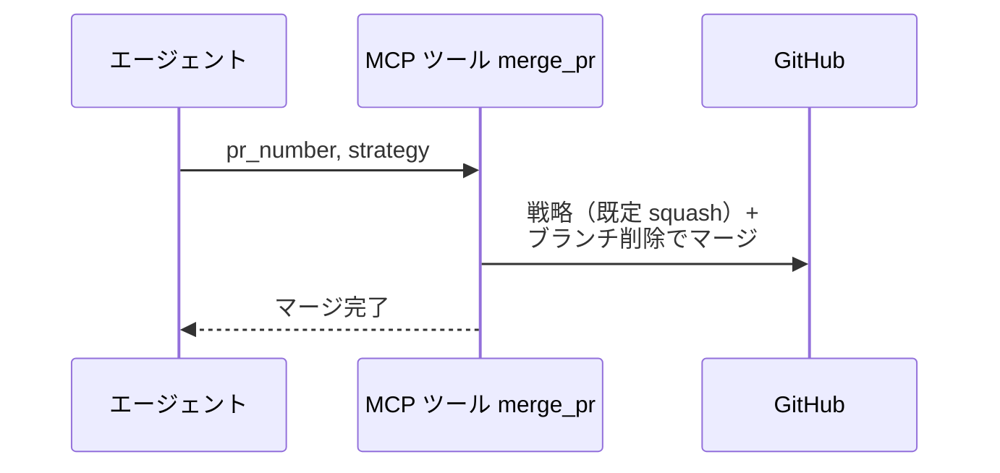
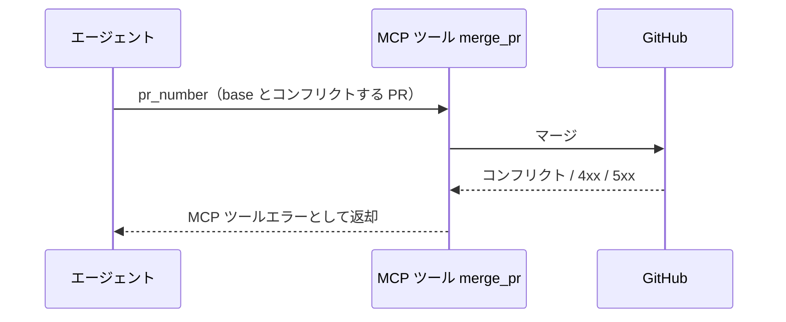

# PRマージ

MCP ツール: `merge_pr`

PR をマージする（デフォルト squash + ブランチ削除）。
conductor の昇格マージ（subsystem → story → epic → master）はこのツールを使う（手順は `規約/マージ手順.md`）。

- 対応テストファイル: `tests/integration/mcp/test_merge_pr.py`

## インターフェース

### リクエスト

| パラメータ | 型 | 必須 | デフォルト | 説明 | 制限 | 補足 |
| --- | --- | --- | --- | --- | --- | --- |
| `pr_number` | int | ✅ | - | 対象 PR 番号 | - | - |
| `strategy` | `"squash"` \| `"merge"` \| `"rebase"` | - | なし（`squash` で実行） | マージ戦略 | - | 全ブランチ squash 短命運用が既定 |

リクエスト例:

```json
{
  "pr_number": 52
}
```

### レスポンス

| フィールド | 型 | 説明 | 制限 | 補足 |
| --- | --- | --- | --- | --- |
| なし | - | 空オブジェクト | - | 副作用のみ |

レスポンス例:

```json
{}
```

## 制約

| 項目 | 制約 | 補足 |
| --- | --- | --- |
| タイムアウト | 制限なし | - |

## フロー一覧

| 分類 | フロー名 | 概要 | 補足 |
| --- | --- | --- | --- |
| 正常 | 正常系 | マージ戦略解決 → マージ + head ブランチ削除 | - |
| 異常 | 異常系（API エラー） | コンフリクト / 認証切れ / ネットワーク断 | コンフリクト時は相談コメント + `議論中` の応答ループへ |

## 正常系

### セットアップ

| セットアップ | 説明 | 補足 |
| --- | --- | --- |
| Mock | GitHub API を差し替え（正常応答を返す） | - |
| 対象 PR | base とコンフリクトせずマージ可能 | - |

### フロー



### 期待値

- PR が merged 状態になっている
- リモートの head ブランチが削除されている

## 異常系（API エラー）

### セットアップ

| セットアップ | 説明 | 補足 |
| --- | --- | --- |
| Mock | GitHub API を差し替え（4xx / 5xx を返す） | - |
| 対象 PR | base とコンフリクトする変更を積んだ PR を用意 | マージ失敗を決定的に誘発 |

### フロー



### 期待値

- MCP ツールエラーが返る（HTTP ステータスと本文を含む）
- PR は open のまま変化していない

