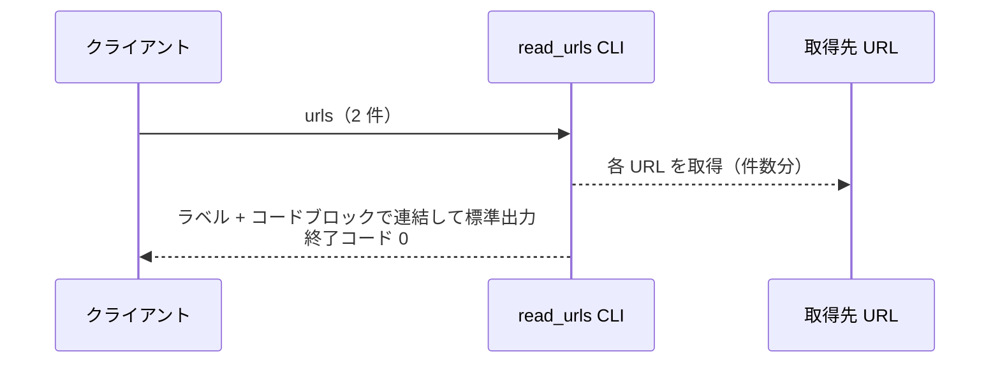
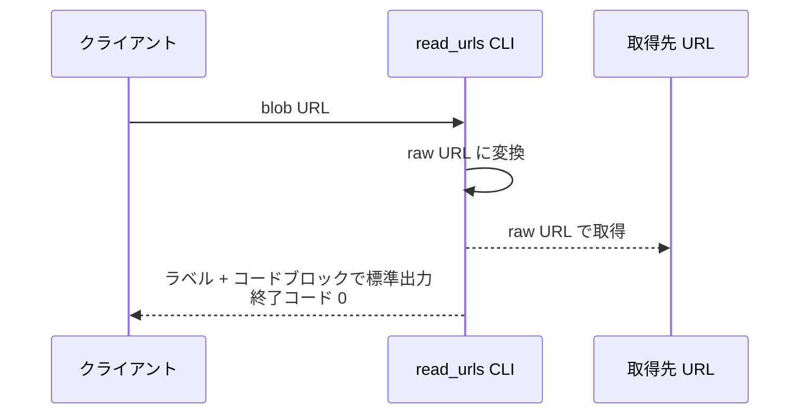
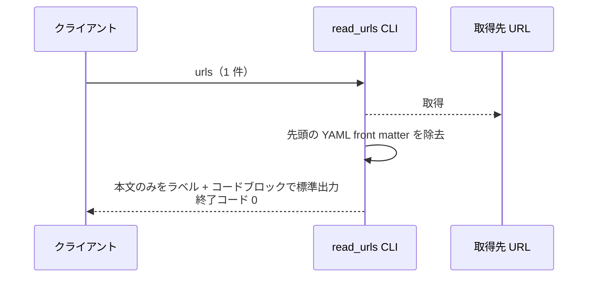
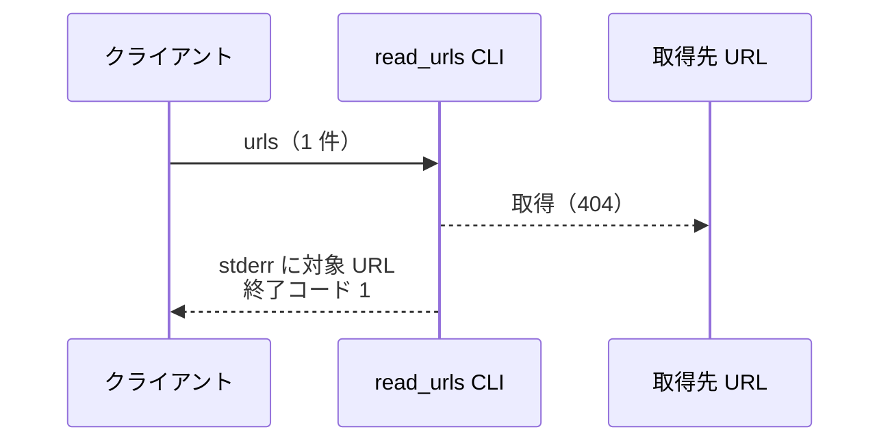

# URLドキュメント注入

CLI: `python plugins/ai-monitor/inject/read_urls.py <url>...`

SKILL.md の動的コンテキスト注入・フェーズ内の実行時取得から呼ばれ、指定 URL の本文を md コードブロックで包んで標準出力に展開する。

- 対応テストファイル: `tests/integration/inject/test_read_urls.py`

## インターフェース

### リクエスト

| パラメータ | 型 | 必須 | デフォルト | 説明 | 制限 | 補足 |
| --- | --- | --- | --- | --- | --- | --- |
| `urls` | str（1 個以上の可変長） | ✅ | - | 取得対象 URL | 公開 URL であること | コマンドライン引数。GitHub blob URL は raw URL に変換して取得する |

リクエスト例:

```bash
python plugins/ai-monitor/inject/read_urls.py "${WIKI_BASE}/規約/コメント.md" "${WIKI_BASE}/規約/マージ手順.md"
```

### レスポンス

| フィールド | 型 | 説明 | 制限 | 補足 |
| --- | --- | --- | --- | --- |
| 標準出力 | str | 各 URL の本文を `**{取得元 URL}:**` のラベル行 + 5 連バッククォートの md コードブロックで包んだ本文で連結した文字列 | - | 並びは引数順。本文先頭の YAML front matter は除去する。5 連は本文内の ``` / ```` フェンスと衝突しないため |

レスポンス例:

``````text
**https://raw.githubusercontent.com/o/r/master/docs/wiki/規約/コメント.md:**
`````md
# 規約: コメント
...
`````

**https://raw.githubusercontent.com/o/r/master/docs/wiki/規約/マージ手順.md:**
`````md
# 規約: マージ手順
...
`````
``````

### 終了コード

| 終了コード | 発生条件 | 補足 |
| --- | --- | --- |
| `0` | 正常 | - |
| `1` | 引数不足 / 取得失敗 | 取得失敗は stderr に対象 URL を出す |

## 制約

| 項目 | 制約 | 補足 |
| --- | --- | --- |
| 実行環境 | 制限なし（環境変数・認証は使わない） | 対象は公開 URL のみ |
| フォールバック | なし（取得失敗はエラー終了） | 注入欠落に気づけるようにする |

## フロー一覧

| 分類 | フロー名 | 概要 | 補足 |
| --- | --- | --- | --- |
| 正常 | 正常系 | 複数 URL の取得 → md コードブロックで連結出力 | - |
| 正常 | 正常系（blob URL） | GitHub blob URL を raw URL に変換して取得 | - |
| 正常 | 正常系（front matter あり） | 本文先頭の YAML front matter を除去して出力 | - |
| 異常 | 異常系（取得失敗） | 存在しない URL でエラー終了 | - |

## 正常系

### セットアップ

| セットアップ | 説明 | 補足 |
| --- | --- | --- |
| Mock | HTTP（ページ 2 本の応答を返す） | - |

### フロー



### 期待値

- 標準出力に `**{取得元 URL}:**` のラベル行 + 5 連バッククォートで包んだ本文が引数順で並ぶ
- 終了コードが `0`

## 正常系（blob URL）

### セットアップ

| セットアップ | 説明 | 補足 |
| --- | --- | --- |
| Mock | HTTP（raw URL でページ 1 本の応答を返す） | - |
| 引数 | `github.com/{owner}/{repo}/blob/...` 形式の URL | 変換分岐を決定的に誘発 |

### フロー



### 期待値

- raw URL（`raw.githubusercontent.com`）でリクエストされる
- 標準出力のラベル行が raw URL になっている
- 終了コードが `0`

## 正常系（front matter あり）

### セットアップ

| セットアップ | 説明 | 補足 |
| --- | --- | --- |
| Mock | HTTP（先頭に YAML front matter が付いたページ 1 本の応答を返す） | - |

### フロー



### 期待値

- 標準出力の本文に YAML front matter が含まれない
- 終了コードが `0`

## 異常系（取得失敗）

### セットアップ

| セットアップ | 説明 | 補足 |
| --- | --- | --- |
| Mock | HTTP（404 エラーを返す） | 異常を決定的に誘発 |

### フロー



### 期待値

- stderr に取得失敗した URL が出る
- 終了コードが `1`
