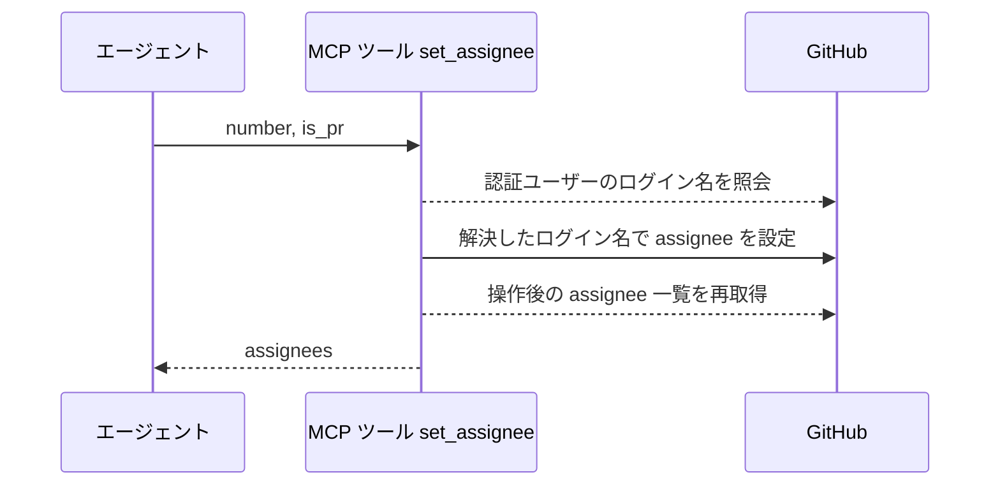
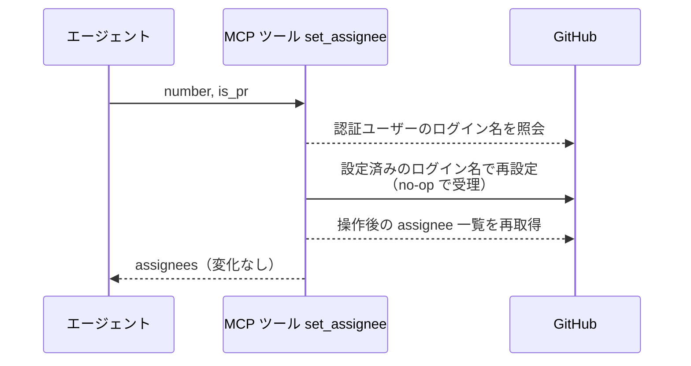
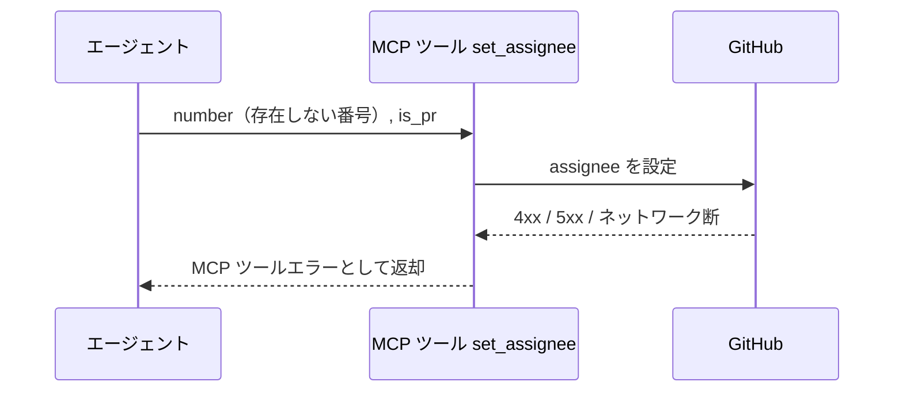

# assignee設定

MCP ツール: `set_assignee`

Issue / PR に現在の認証ユーザーを assignee として設定する（ワークフローの「ボールをユーザーに渡す」操作）。
待機開始（`議論中` 付与とセット）の `assignee=ユーザー` 設定はこのツールを使う。

- 対応テストファイル: `tests/integration/mcp/test_set_assignee.py`

## インターフェース

### リクエスト

| パラメータ | 型 | 必須 | デフォルト | 説明 | 制限 | 補足 |
| --- | --- | --- | --- | --- | --- | --- |
| `number` | int | ✅ | - | 対象の Issue / PR 番号 | - | - |
| `is_pr` | bool | ✅ | - | PR なら `True` | - | - |

リクエスト例:

```json
{
  "number": 35,
  "is_pr": false
}
```

### レスポンス

| フィールド | 型 | 説明 | 制限 | 補足 |
| --- | --- | --- | --- | --- |
| `assignees` | list[str] | 操作後の assignee ログイン名一覧 | - | 呼び出し側が結果を検証できる |

レスポンス例:

```json
{
  "assignees": ["shuhei1101"]
}
```

## 制約

| 項目 | 制約 | 補足 |
| --- | --- | --- |
| タイムアウト | 制限なし | - |
| 対象ユーザー | 現在の認証ユーザー（`github_token` の持ち主）のみ | - |

## フロー一覧

| 分類 | フロー名 | 概要 | 補足 |
| --- | --- | --- | --- |
| 正常 | 正常系 | 認証ユーザーの解決 → assignee 設定 → 現況再取得 | - |
| 正常 | 正常系（設定済み時） | 設定済みの再設定は no-op で現況を返す | 冪等 |
| 異常 | 異常系（API エラー） | 認証切れ / 対象不存在 / ネットワーク断 | - |

## 正常系

### セットアップ

| セットアップ | 説明 | 補足 |
| --- | --- | --- |
| Mock | GitHub API を差し替え（正常応答を返す） | - |
| 対象 Issue / PR | assignee 未設定 | - |

### フロー



### 期待値

- 現在の認証ユーザーが assignee に設定されている
- 戻り値 `assignees` が設定後の一覧と一致している

## 正常系（設定済み時）

### セットアップ

| セットアップ | 説明 | 補足 |
| --- | --- | --- |
| Mock | GitHub API を差し替え（正常応答を返す） | - |
| 対象 Issue / PR | 認証ユーザーが assignee に設定済み | no-op を決定的に誘発 |

### フロー



### 期待値

- MCP ツールエラーにならず正常終了する（冪等）
- 戻り値 `assignees` に認証ユーザーが重複なしで 1 件だけ入っている

## 異常系（API エラー）

### セットアップ

| セットアップ | 説明 | 補足 |
| --- | --- | --- |
| Mock | GitHub API を差し替え（4xx / 5xx を返す） | - |
| 入力 | 存在しない番号を指定して呼び出す | API エラーを決定的に誘発 |

### フロー



### 期待値

- MCP ツールエラーが返る（HTTP ステータスと本文を含む）
- 対象の assignee は変化していない
