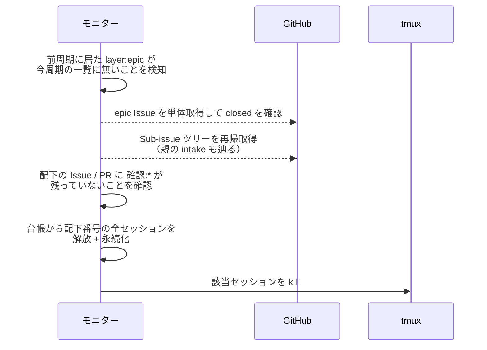
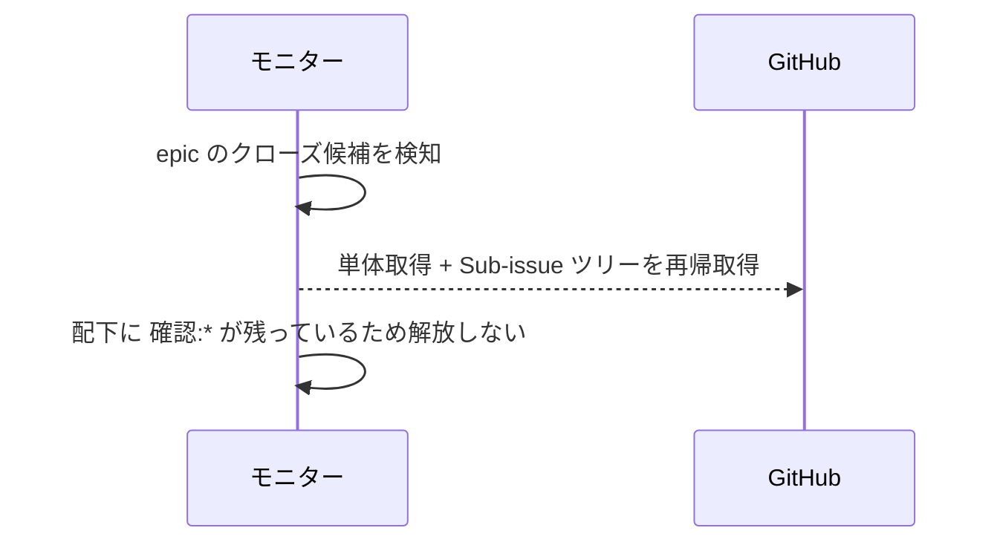
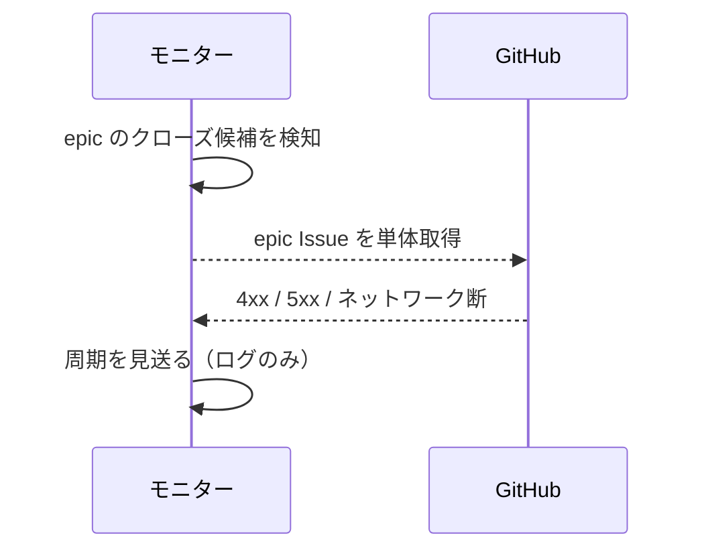

# epic一括解放

トリガー: polling 周期（前周期の open 対象一覧との差分で `layer:epic` の消失を検知）

epic Issue のクローズ（epic → master マージによる自動 close）を検知し、epic 配下の全エージェントセッション（intake 含む）を一括解放する。
epic 完了までは待機中のセッションも常駐させる方針のため、ワークフロー系セッションの解放はこの経路だけで行う。
クローズは前周期の open 一覧との差分で候補化して単体取得で確認し、配下は検知時に Sub-issue ツリーを再帰取得して把握する（親の intake も辿る。周期ごとの先回り取得はしない）。

- 対応テストファイル: `tests/integration/monitor/test_epic一括解放.py`

## 制約

| 項目 | 制約 | 補足 |
| --- | --- | --- |
| 前周期一覧 | メモリ保持のみ（永続化しない） | モニター再起動直後の周期は差分を検知できず、その間にクローズされた epic は解放されないまま残る |

## フロー一覧

| 分類 | フロー名 | 概要 | 補足 |
| --- | --- | --- | --- |
| 正常 | 正常系 | epic close 検知 → 配下の全セッションを kill + 台帳から解放 | - |
| 正常 | 正常系（確認ラベル残存） | 配下に `確認:*` が残っていれば解放しない | - |
| 異常 | 異常系（GitHub API エラー） | 単体取得 / ツリー取得の失敗で周期を見送る | - |

## 正常系

### セットアップ

| セットアップ | 説明 | 補足 |
| --- | --- | --- |
| Mock | GitHub API / tmux を差し替え | - |
| 前周期 | `layer:epic` の Issue #35 を含む open 一覧を前周期として保持 | - |
| 今周期 | #35 が open 一覧から消え、単体取得は closed を返す | - |
| 配下 | Sub-issue ツリー（story #40 / subsystem #50・いずれも `確認:*` なし）と親 intake #30 | - |
| 台帳 | #30 / #35 / #40 / #50 を主番号とするセッションが登録済み | - |

### フロー

### 期待値

- epic 配下（intake 含む）の全セッションが台帳から除去され永続化されている
- 該当する tmux セッションが kill されている

## 正常系（確認ラベル残存）

### セットアップ

| セットアップ | 説明 | 補足 |
| --- | --- | --- |
| Mock | GitHub API / tmux を差し替え | - |
| 今周期 | epic #35 は closed だが、配下 subsystem #50 に `確認:subsystem-conductor` が残っている | 解放見送りを誘発 |

### フロー

### 期待値

- 台帳・tmux セッションが変化していない（次周期で再判定される）

## 異常系（GitHub API エラー）

### セットアップ

| セットアップ | 説明 | 補足 |
| --- | --- | --- |
| Mock | GitHub API を差し替え（単体取得で 4xx / 5xx を返す） | 異常を決定的に誘発 |

### フロー

### 期待値

- モニタープロセスが落ちない
- 台帳・tmux セッションが変化せず、次周期で再試行される
