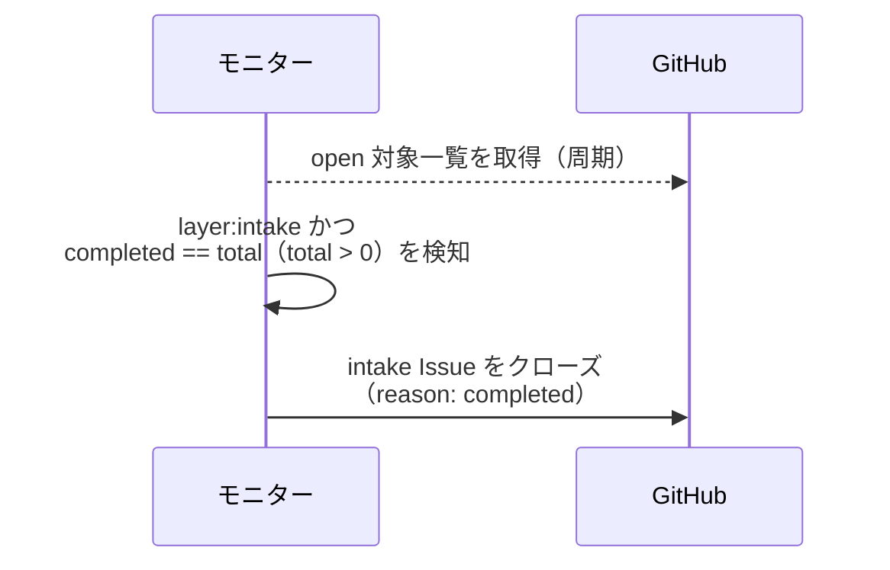
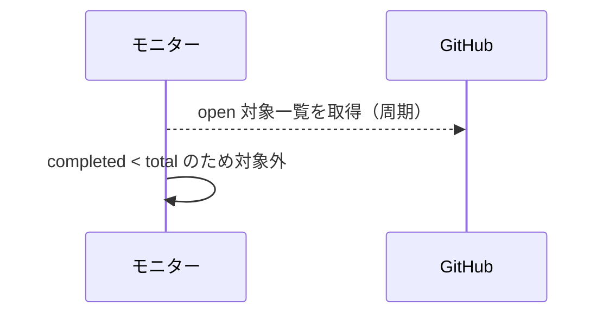
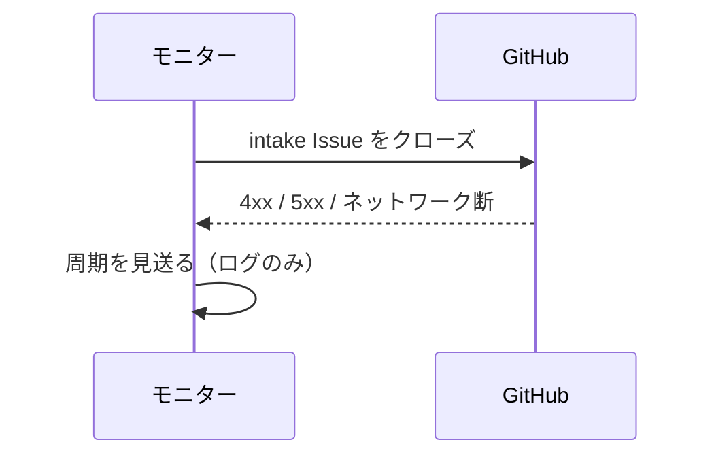

# intake自動クローズ

トリガー: polling 周期（open 対象一覧の取得結果で判定）

intake Issue の全 Sub-issue クローズを検知し、intake Issue を自動クローズする。
判定は一覧応答に同梱される `sub_issues_summary` のみで行う（本文パース・追加 API なし）。

- 対応テストファイル: `tests/integration/monitor/test_intake自動クローズ.py`

## 制約

| 項目 | 制約 | 補足 |
| --- | --- | --- |
| 対象 | `layer:intake` ラベル付きの open Issue | Sub-issue なし（`total == 0`）は対象外 |

## フロー一覧

| 分類 | フロー名 | 概要 | 補足 |
| --- | --- | --- | --- |
| 正常 | 正常系 | 全 Sub-issue closed を検知して intake をクローズ | - |
| 正常 | 正常系（未完了の子あり） | `completed < total` は何もしない | - |
| 異常 | 異常系（GitHub API エラー） | クローズ失敗で周期を見送る | - |

## 正常系

### セットアップ

| セットアップ | 説明 | 補足 |
| --- | --- | --- |
| Mock | GitHub API を差し替え | - |
| 対象 | `layer:intake` の open Issue（`sub_issues_summary` が `total=2, completed=2`）を open 一覧に含める | - |

### フロー

### 期待値

- intake Issue がクローズされている（`reason: completed`）

## 正常系（未完了の子あり）

### セットアップ

| セットアップ | 説明 | 補足 |
| --- | --- | --- |
| Mock | GitHub API を差し替え | - |
| 対象 | `layer:intake` の open Issue（`sub_issues_summary` が `total=2, completed=1`）を open 一覧に含める | 見送りを誘発 |

### フロー

### 期待値

- クローズ操作が発生していない

## 異常系（GitHub API エラー）

### セットアップ

| セットアップ | 説明 | 補足 |
| --- | --- | --- |
| Mock | GitHub API を差し替え（クローズで 4xx / 5xx を返す） | 異常を決定的に誘発 |
| 対象 | 全 Sub-issue closed の intake Issue を open 一覧に含める | - |

### フロー

### 期待値

- モニタープロセスが落ちない
- intake Issue は open のまま残り、次周期で再試行される
