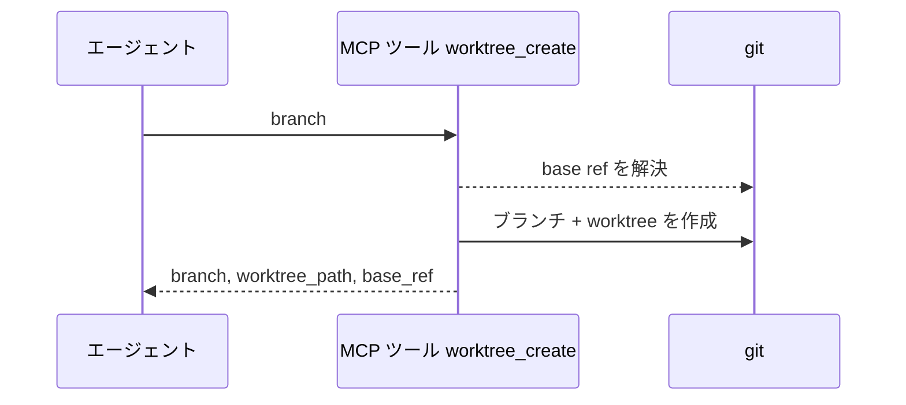
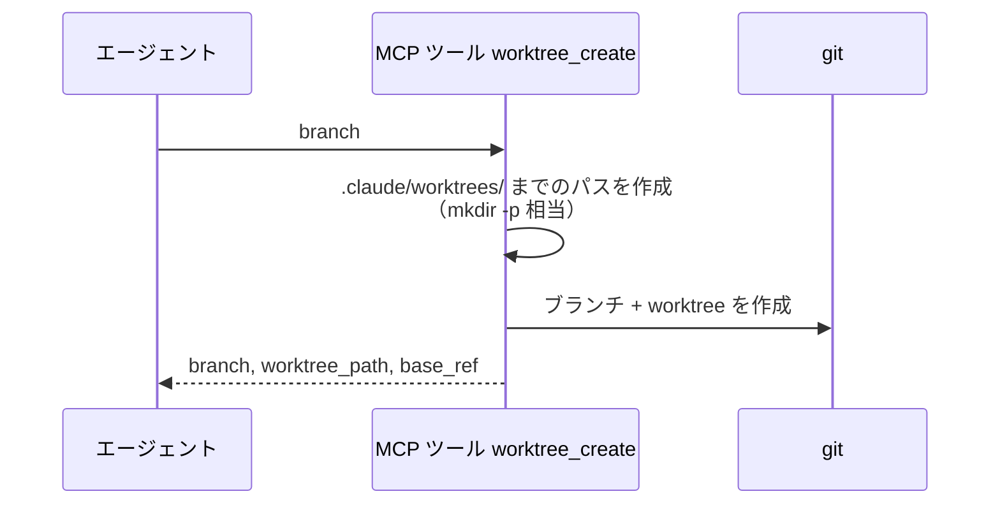
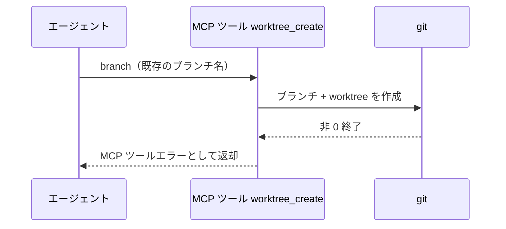

# worktree作成

MCP ツール: `worktree_create`

フルブランチ名を受け取り、ブランチと worktree（`.claude/worktrees/` 配下）を作成する。
conductor の完了処理でのブランチ + worktree 作成はこのツールを使う（命名は `規約/ブランチ戦略.md`）。

- 対応テストファイル: `tests/integration/mcp/test_worktree_create.py`

## インターフェース

### リクエスト

| パラメータ | 型 | 必須 | デフォルト | 説明 | 制限 | 補足 |
| --- | --- | --- | --- | --- | --- | --- |
| `branch` | str | ✅ | - | 作成するフルブランチ名 | `{type}/{名前}/{分類}/{変更内容}` 体系（`規約/ブランチ戦略.md`） | - |

リクエスト例:

```json
{
  "branch": "feat/backend/profile/edit/edit-api"
}
```

### レスポンス

| フィールド | 型 | 説明 | 制限 | 補足 |
| --- | --- | --- | --- | --- |
| `branch` | str | 作成したブランチ名 | - | - |
| `worktree_path` | str | worktree の絶対パス | - | 以降の作業 CWD |
| `base_ref` | str | 分岐元の base ref | - | `origin/<current>` or `HEAD` |

レスポンス例:

```json
{
  "branch": "feat/backend/profile/edit/edit-api",
  "worktree_path": "/path/to/repo/.claude/worktrees/feat-backend-profile-edit-edit-api",
  "base_ref": "origin/feat/story/profile/edit"
}
```

## 制約

| 項目 | 制約 | 補足 |
| --- | --- | --- |
| タイムアウト | 制限なし | - |

## フロー一覧

| 分類 | フロー名 | 概要 | 補足 |
| --- | --- | --- | --- |
| 正常 | 正常系 | ブランチ作成 + worktree 追加 | - |
| 正常 | 正常系（worktree フォルダ未作成時） | `.claude/worktrees/` までのパスを作成してから worktree 追加 | mkdir -p 相当 |
| 異常 | 異常系（git 実行失敗） | 既存ブランチ名 / 不正なブランチ名 | - |

## 正常系

### セットアップ

| セットアップ | 説明 | 補足 |
| --- | --- | --- |
| Mock | なし（テスト用に一時作成した git リポジトリで実行） | - |
| ブランチ名 | 未使用のフルブランチ名を指定 | 命名は `規約/ブランチ戦略.md` |

### フロー



### 期待値

- 指定名のブランチと `.claude/worktrees/` 配下の worktree が作成されている
- 戻り値の `branch` / `worktree_path` / `base_ref` が実体と一致している

## 正常系（worktree フォルダ未作成時）

### セットアップ

| セットアップ | 説明 | 補足 |
| --- | --- | --- |
| Mock | なし（テスト用に一時作成した git リポジトリで実行） | - |
| 対象リポジトリ | `.claude/worktrees/` フォルダが存在しない | リポジトリでの初回実行を再現 |

### フロー



### 期待値

- `.claude/worktrees/` フォルダが作成され、その配下に worktree が作成されている
- エラーにならず、戻り値は正常系と同じ形で返る

## 異常系（git 実行失敗）

### セットアップ

| セットアップ | 説明 | 補足 |
| --- | --- | --- |
| Mock | なし（テスト用に一時作成した git リポジトリで実行） | - |
| 入力 | 既存のブランチ名を指定して呼び出す | git の非 0 終了を決定的に誘発 |

### フロー



### 期待値

- MCP ツールエラーが返る（git の stderr を含む）
- ブランチ・worktree は追加されていない
