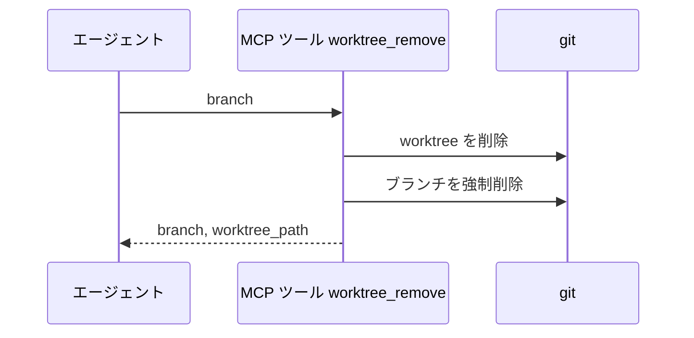
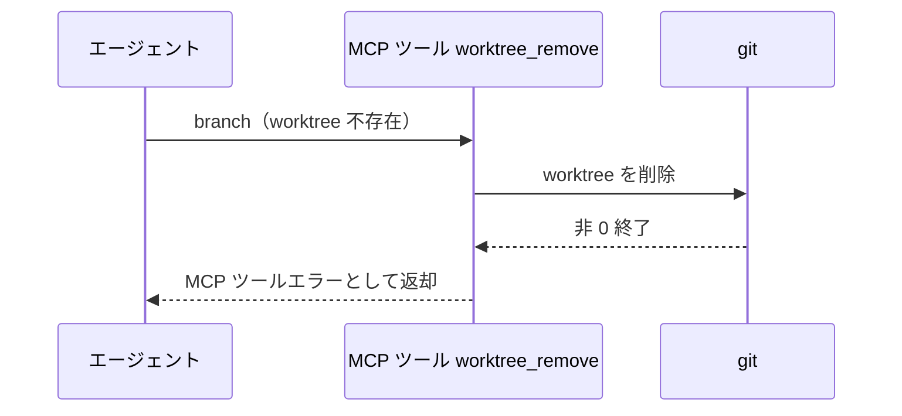

# worktree削除

MCP ツール: `worktree_remove`

worktree とローカルブランチを両方削除する（ブランチは強制削除 = `git branch -D` 相当。squash マージ運用では base の履歴に元 commit が残らず通常削除は拒否されるため、恒久記録は closed / merged PR の diff が担う）。
マージ後・PoC close 後・リセットの後片付けはこのツールを使う。

- 対応テストファイル: `tests/integration/mcp/test_worktree_remove.py`

## インターフェース

### リクエスト

| パラメータ | 型 | 必須 | デフォルト | 説明 | 制限 | 補足 |
| --- | --- | --- | --- | --- | --- | --- |
| `branch` | str | ✅ | - | 削除対象のブランチ名 | - | 対応する worktree も削除される |

リクエスト例:

```json
{
  "branch": "feat/backend/profile/edit/edit-api"
}
```

### レスポンス

| フィールド | 型 | 説明 | 制限 | 補足 |
| --- | --- | --- | --- | --- |
| `branch` | str | 削除対象のブランチ名 | - | - |
| `worktree_path` | str | 削除した worktree の絶対パス | - | - |

レスポンス例:

```json
{
  "branch": "feat/backend/profile/edit/edit-api",
  "worktree_path": "/path/to/repo/.claude/worktrees/feat-backend-profile-edit-edit-api"
}
```

## 制約

| 項目 | 制約 | 補足 |
| --- | --- | --- |
| タイムアウト | 制限なし | - |

## フロー一覧

| 分類 | フロー名 | 概要 | 補足 |
| --- | --- | --- | --- |
| 正常 | 正常系 | worktree 削除 → ブランチ強制削除 | - |
| 異常 | 異常系（git 実行失敗） | worktree 不存在 | - |

## 正常系

### セットアップ

| セットアップ | 説明 | 補足 |
| --- | --- | --- |
| Mock | なし（テスト用に一時作成した git リポジトリで実行） | - |
| 対象 | squash マージ済みのブランチと worktree が存在 | base の履歴に元 commit は残っていない |

### フロー



### 期待値

- worktree とローカルブランチが両方削除されている

## 異常系（git 実行失敗）

### セットアップ

| セットアップ | 説明 | 補足 |
| --- | --- | --- |
| Mock | なし（テスト用に一時作成した git リポジトリで実行） | - |
| 入力 | worktree が存在しないブランチ名を指定して呼び出す | git の非 0 終了を決定的に誘発 |

### フロー



### 期待値

- MCP ツールエラーが返る（git の stderr を含む）
