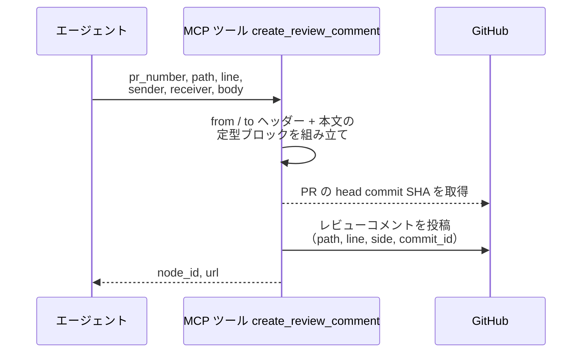
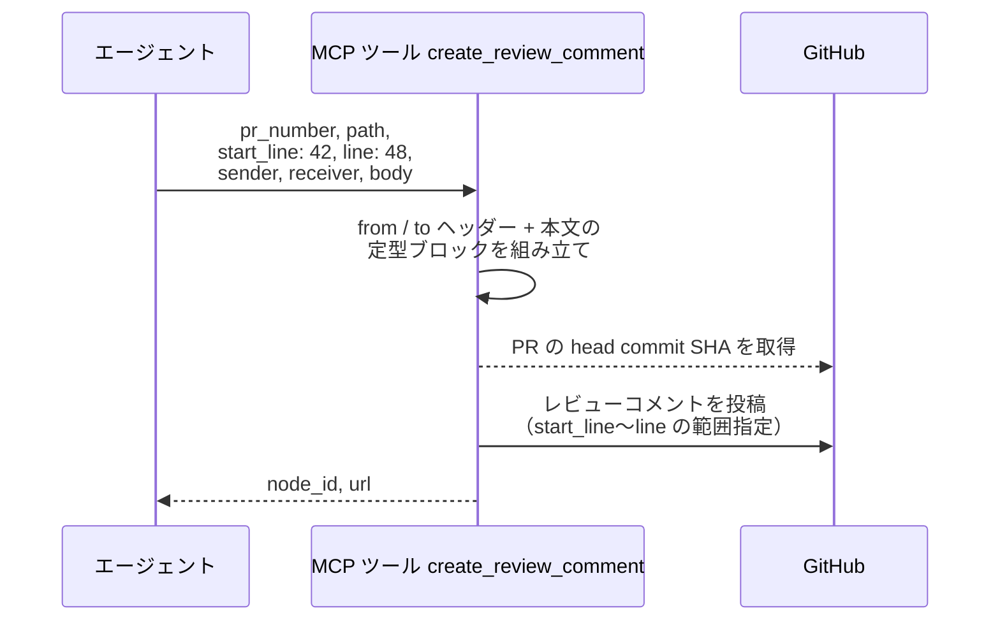
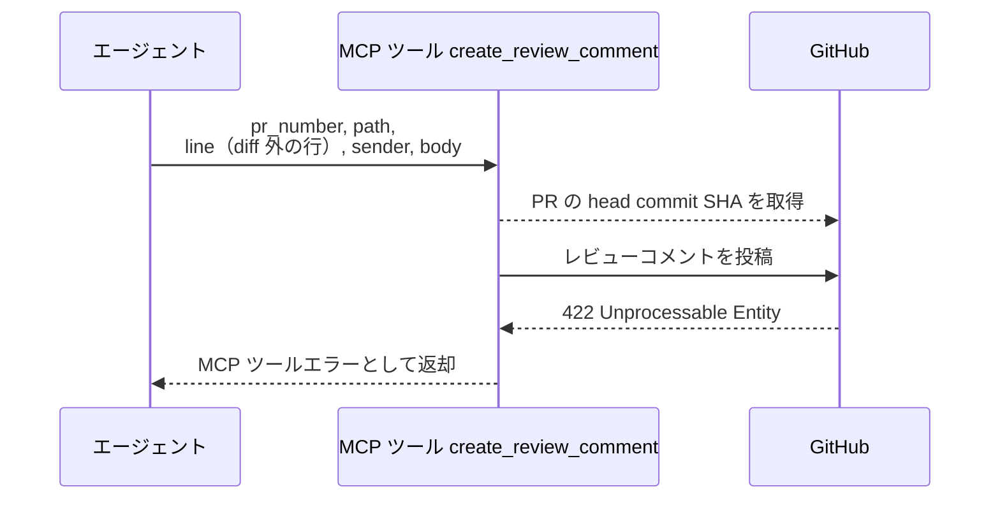

# インラインコメント投稿

MCP ツール: `create_review_comment`

PR の diff 上の特定ファイル・特定行に紐づくレビューコメント（インライン指摘）を定型フォーマット（`> from: @{送信者}` + `> to: @{宛先}` + 本文)で投稿する。会話欄のコメント（コメント投稿）とは別系統のスレッドになり、解決はレビュースレッド一括Resolve で行う。

- 対応テストファイル: `tests/integration/mcp/test_create_review_comment.py`

## インターフェース

### リクエスト

| パラメータ | 型 | 必須 | デフォルト | 説明 | 制限 | 補足 |
| --- | --- | --- | --- | --- | --- | --- |
| `pr_number` | int | ✅ | - | 対象の PR 番号 | - | - |
| `path` | str | ✅ | - | 対象ファイルパス（リポジトリルート相対） | - | - |
| `line` | int | ✅ | - | 対象行番号（範囲指定時は終端行） | PR の diff に含まれる行のみ | - |
| `side` | `"RIGHT"` \| `"LEFT"` | - | `"RIGHT"` | diff のどちら側の行か | - | 追加・文脈行は RIGHT / 削除行は LEFT |
| `start_line` | int | - | なし（単一行コメント） | 範囲コメントの開始行 | `line` より小さい行 | 範囲は `start_line`〜`line`・side は `side` を両端に適用 |
| `sender` | str | ✅ | - | 送信者のエージェント名（`> from: @sender` 行になる） | - | `@` は不要（自動付与） |
| `receiver` | str | - | なし（to 行なし = 現担当宛） | 宛先名（`> to: @receiver` 行になる） | - | - |
| `body` | str | ✅ | - | 指摘本文 | - | Markdown 可 |

リクエスト例:

```json
{
  "pr_number": 52,
  "path": "src/ai_monitor/features/agents/service.py",
  "line": 42,
  "sender": "architect",
  "receiver": "implementer",
  "body": "戻り値が `User | null` です。null チェックを追加してください。"
}
```

### レスポンス

| フィールド | 型 | 説明 | 制限 | 補足 |
| --- | --- | --- | --- | --- |
| `node_id` | str | 投稿コメントの GraphQL node_id | - | `PRRC_` 始まり |
| `url` | str | コメントの html URL | - | - |

レスポンス例:

```json
{
  "node_id": "PRRC_kwDOAbc123xyz",
  "url": "https://github.com/{owner}/{repo}/pull/52#discussion_r987654321"
}
```

## 制約

| 項目 | 制約 | 補足 |
| --- | --- | --- |
| タイムアウト | 制限なし | - |
| 対象行 | PR の diff に含まれる行のみ指定可 | 違反時は 異常系（diff 外の行・422） |

## フロー一覧

| 分類 | フロー名 | 概要 | 補足 |
| --- | --- | --- | --- |
| 正常 | 正常系 | 定型ブロック組み立て → head SHA 取得 → レビューコメント投稿 | - |
| 正常 | 正常系（複数行の範囲指定） | `start_line`〜`line` の範囲に紐づくコメント投稿 | - |
| 異常 | 異常系（diff 外の行・422） | diff に含まれない行を指定 | - |

## 正常系

### セットアップ

| セットアップ | 説明 | 補足 |
| --- | --- | --- |
| Mock | GitHub API を差し替え（PR 取得と投稿の正常応答を返す） | - |
| 対象 PR | sandbox に diff を持つ open の PR が存在 | 番号を入力に使う |

### フロー



### 期待値

- 対象ファイル・対象行に紐づくレビューコメントが 1 件追加され、本文が定型ブロック（`> from: @sender` + `> to: @receiver` + 本文）になっている
- 戻り値の `node_id` / `url` が追加されたレビューコメントを指している

## 正常系（複数行の範囲指定）

### セットアップ

| セットアップ | 説明 | 補足 |
| --- | --- | --- |
| Mock | GitHub API を差し替え（PR 取得と投稿の正常応答を返す） | - |
| 入力 | `start_line: 42`・`line: 48` を指定して呼び出す | 範囲コメントを決定的に誘発 |

### フロー



### 期待値

- 42〜48 行の範囲に紐づくレビューコメントが 1 件追加されている
- 戻り値の `node_id` / `url` が追加されたレビューコメントを指している

## 異常系（diff 外の行・422）

### セットアップ

| セットアップ | 説明 | 補足 |
| --- | --- | --- |
| Mock | GitHub API を差し替え（投稿に 422 を返す） | - |
| 対象行 | PR の diff に含まれない行番号を指定して呼び出す | 422 を決定的に誘発 |

### フロー



### 期待値

- MCP ツールエラーが返る（422 の内容を含む）
- レビューコメントは追加されていない
