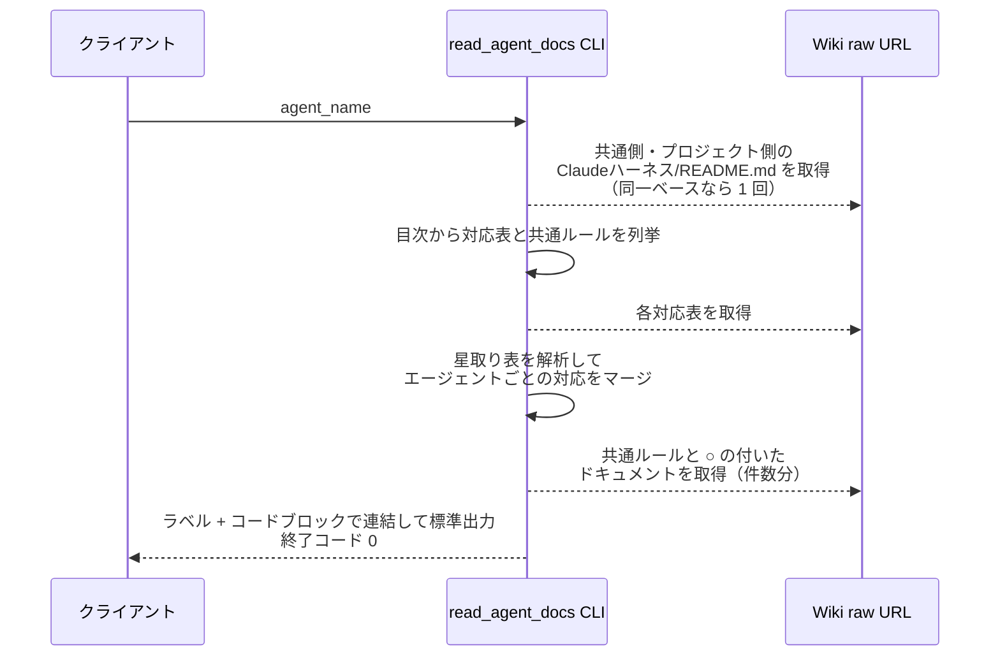
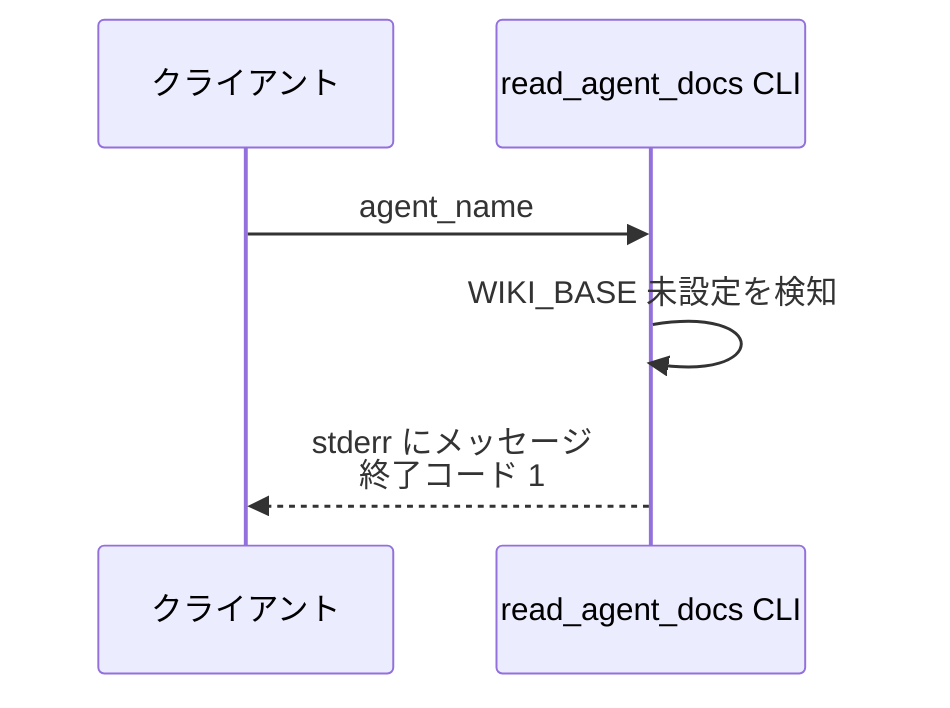
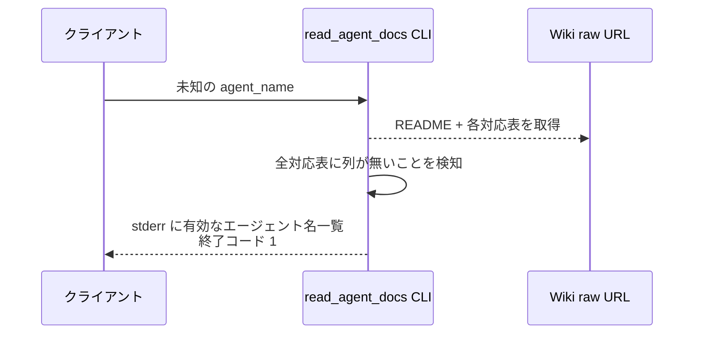

# エージェントドキュメント注入

CLI: `python plugins/ai-monitor/inject/read_agent_docs.py <エージェント名>`

SKILL.md の `## 参考資料` から動的コンテキスト注入で呼ばれ、共通ルール一式と、対応表で当該エージェントに ○ の付いた参照ドキュメント一式を標準出力に展開する。

- 対応テストファイル: `tests/integration/inject/test_read_agent_docs.py`

## インターフェース

### リクエスト

| パラメータ | 型 | 必須 | デフォルト | 説明 | 制限 | 補足 |
| --- | --- | --- | --- | --- | --- | --- |
| `agent_name` | str | ✅ | - | 対象エージェント名 | 対応表の列に存在すること | コマンドライン引数 |

リクエスト例:

```bash
python plugins/ai-monitor/inject/read_agent_docs.py intake-issue-triager
```

### レスポンス

| フィールド | 型 | 説明 | 制限 | 補足 |
| --- | --- | --- | --- | --- |
| 標準出力 | str | 共通ルールの各ページ → ○ の付いた各ドキュメントの順に、`**{表示名}:**` のラベル行 + 5 連バッククォートの md コードブロックで包んだ本文で連結した文字列 | - | 並びは README 目次・対応表の登場順。5 連は本文内の ``` / ```` フェンスと衝突しないため |

レスポンス例:

``````text
**規約/コメント.md:**
`````md
# 規約: コメント
...
`````

**プロジェクト管理/エージェント組織図.md:**
`````md
# エージェント組織図
...
`````
``````

### 終了コード

| 終了コード | 発生条件 | 補足 |
| --- | --- | --- |
| `0` | 正常 | - |
| `1` | 引数不足 / `WIKI_BASE`・`AI_MONITOR_WIKI_BASE` 未設定 / 未知のエージェント名 / 取得失敗 | 未知のエージェント名は stderr に有効名一覧を出す |

## 制約

| 項目 | 制約 | 補足 |
| --- | --- | --- |
| 実行環境 | 環境変数 `WIKI_BASE`（プロジェクト Wiki の raw URL ベース）と `AI_MONITOR_WIKI_BASE`（ai-monitor Wiki の raw URL ベース）が設定済みであること | `WIKI_BASE` は SessionStart フックが settings.yaml から、`AI_MONITOR_WIKI_BASE` は `constants.env` から展開する |
| 対象ページの列挙 | 各ベースの `Claudeハーネス/README.md` の目次から列挙する。`AI_MONITOR_WIKI_BASE` 側は `共通対応表/` 配下を星取り表・`共通ルール/` 配下を全エージェント共通の注入対象として、`WIKI_BASE` 側は `対応表/` 配下を星取り表として読む | raw URL ではフォルダ一覧を取得できないため README の目次が SoT。両ベースが同一なら README の取得は 1 回 |
| フォールバック | なし（取得失敗はエラー終了） | 注入欠落に気づけるようにする |

## フロー一覧

| 分類 | フロー名 | 概要 | 補足 |
| --- | --- | --- | --- |
| 正常 | 正常系 | 対応表の列挙 → 解析 → ○ ドキュメントの取得・連結出力 | - |
| 異常 | 異常系（WIKI_BASE 未設定） | 環境変数なしでエラー終了 | - |
| 異常 | 異常系（未知のエージェント名） | 対応表に列が無い名前でエラー終了 | - |

## 正常系

### セットアップ

| セットアップ | 説明 | 補足 |
| --- | --- | --- |
| Mock | HTTP（`Claudeハーネス/README.md`・共通ルール 1 本・対応表 2 本・○ ドキュメント 2 本の応答を返す） | - |
| 環境変数 | `WIKI_BASE` を設定 | - |

### フロー



### 期待値

- 標準出力に `**{表示名}:**` のラベル行 + 5 連バッククォートで包んだ本文が、共通ルール → ○ ドキュメントの順（それぞれ README 目次・対応表の登場順）で並ぶ
- 終了コードが `0`

## 異常系（WIKI_BASE 未設定）

### セットアップ

| セットアップ | 説明 | 補足 |
| --- | --- | --- |
| Mock | HTTP（呼ばれないことを検証） | - |
| 環境変数 | `WIKI_BASE` を未設定にする | 異常を決定的に誘発 |

### フロー



### 期待値

- stderr に `WIKI_BASE` 未設定のメッセージが出る
- 終了コードが `1`
- HTTP リクエストが発生していない

## 異常系（未知のエージェント名）

### セットアップ

| セットアップ | 説明 | 補足 |
| --- | --- | --- |
| Mock | HTTP（README・対応表 2 本の応答を返す） | - |
| 環境変数 | `WIKI_BASE` を設定 | - |
| 引数 | 対応表のどの列にも無いエージェント名 | 異常を決定的に誘発 |

### フロー



### 期待値

- stderr に有効なエージェント名の一覧が出る
- 終了コードが `1`
- 共通ルール・ドキュメント本体の取得リクエストが発生していない
