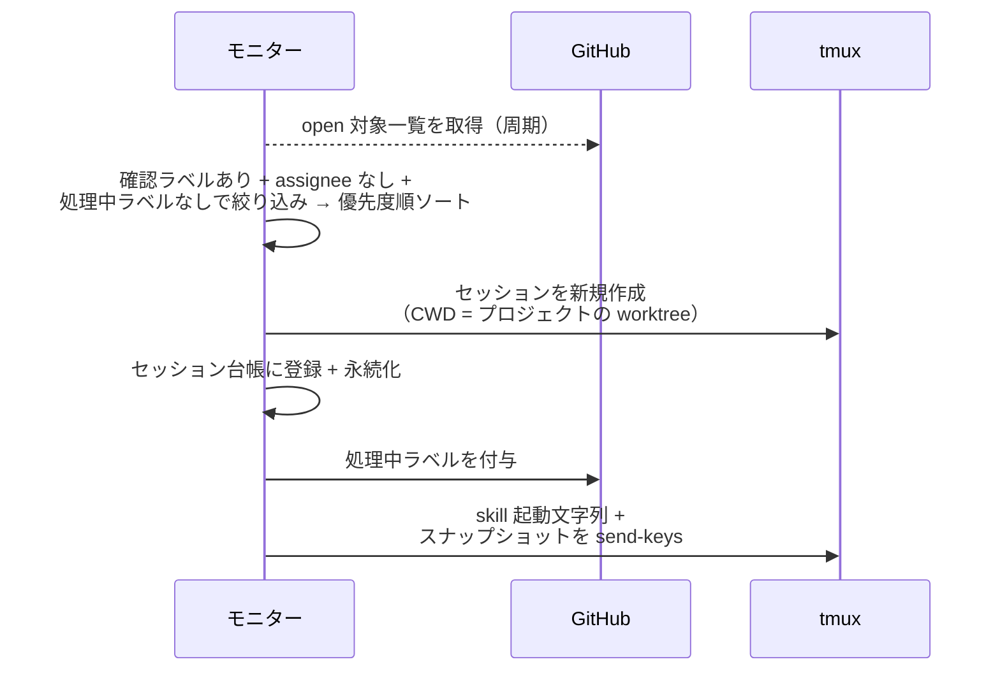
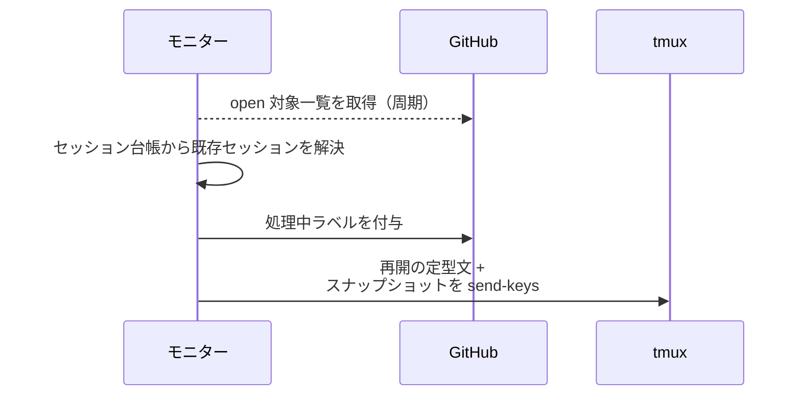
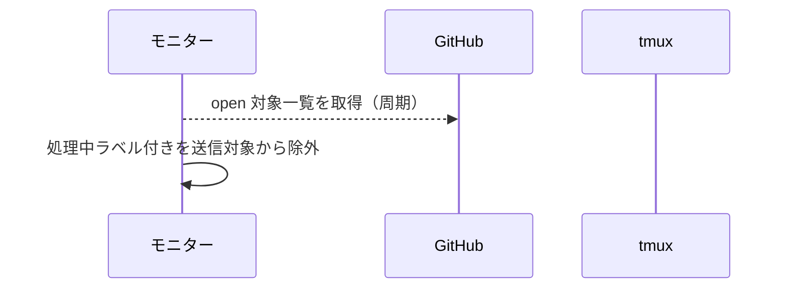
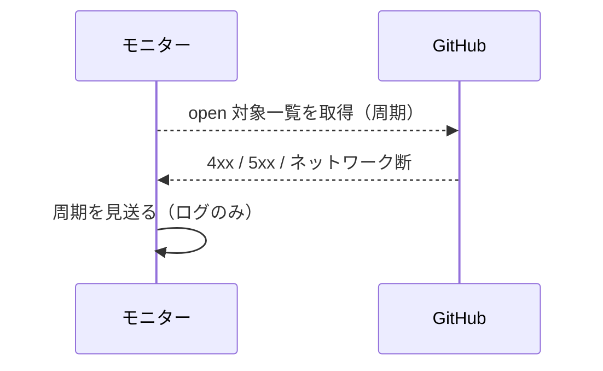

# エージェント起動検知

トリガー: polling 周期（`poll_interval_sec` ごと・プロジェクト × エージェントの対ごと）

「確認ラベルあり + assignee なし + 処理中ラベルなし」の Issue / PR を検知し、tmux セッションの作成 or 再開送信でエージェントを起動する。
1 周期の open 対象一覧は全エージェントで共有し、送信のたびにコンテキストスナップショット（対象と紐づく open PR の状態ツリー）を添付する。
複数対象は優先度ラベル順（`優先度:急ぎ` → なし → `優先度:いつでも`・同順位は番号昇順）に処理し、送信済みの対象は `処理中:*` で除外する（ラベルは作業完了報告の受信で外れる）。

- 対応テストファイル: `tests/integration/monitor/test_エージェント起動検知.py`

## 制約

| 項目 | 制約 | 補足 |
| --- | --- | --- |
| ポーリング周期 | 設定 `poll_interval_sec`（既定 15 秒） | open 対象一覧の取得は 1 周期 1 回 |

## フロー一覧

| 分類 | フロー名 | 概要 | 補足 |
| --- | --- | --- | --- |
| 正常 | 正常系 | 新規対象の検知 → セッション作成 + skill 起動 | - |
| 正常 | 正常系（既存セッション） | 台帳にあるセッションへ再開の定型文を送信 | - |
| 正常 | 正常系（処理中ラベルあり） | 送信対象外として何もしない | - |
| 異常 | 異常系（GitHub API エラー） | 対象一覧の取得失敗で周期を見送る | - |

## 正常系

### セットアップ

| セットアップ | 説明 | 補足 |
| --- | --- | --- |
| Mock | GitHub API / tmux を差し替え | - |
| 対象 | 確認ラベルあり + assignee なし + 処理中ラベルなしの Issue を open 一覧に含める | - |
| 台帳 | 該当セッションが未登録 | 新規作成を誘発 |

### フロー

### 期待値

- tmux にセッション `ai-monitor-{project}-{番号}-{エージェント}` が作成されている
- セッション台帳に登録され永続化されている
- 対象に `処理中:{エージェント}` が付与されている
- 送信文が skill 起動文字列 + コンテキストスナップショットになっている

## 正常系（既存セッション）

### セットアップ

| セットアップ | 説明 | 補足 |
| --- | --- | --- |
| Mock | GitHub API / tmux を差し替え | - |
| 対象 | 確認ラベルあり + assignee なしの Issue を open 一覧に含める | - |
| 台帳 | 同一（プロジェクト × エージェント × 番号）のセッションが登録済み | 再開送信を誘発 |

### フロー

### 期待値

- セッションの新規作成が発生していない
- 既存セッションへ再開の定型文 + スナップショットが送信されている
- 対象に `処理中:{エージェント}` が付与されている

## 正常系（処理中ラベルあり）

### セットアップ

| セットアップ | 説明 | 補足 |
| --- | --- | --- |
| Mock | GitHub API / tmux を差し替え | - |
| 対象 | 確認ラベル + 処理中ラベルの両方が付いた Issue を open 一覧に含める | 除外を誘発 |

### フロー

### 期待値

- tmux への送信・セッション作成・ラベル操作が発生していない

## 異常系（GitHub API エラー）

### セットアップ

| セットアップ | 説明 | 補足 |
| --- | --- | --- |
| Mock | GitHub API を差し替え（一覧取得で 4xx / 5xx を返す） | 異常を決定的に誘発 |

### フロー

### 期待値

- モニタープロセスが落ちない（例外がポーリングループへ伝播しない）
- 当該周期の送信・ラベル操作が発生せず、次周期で再試行される
