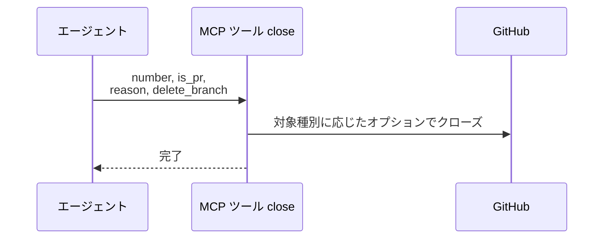
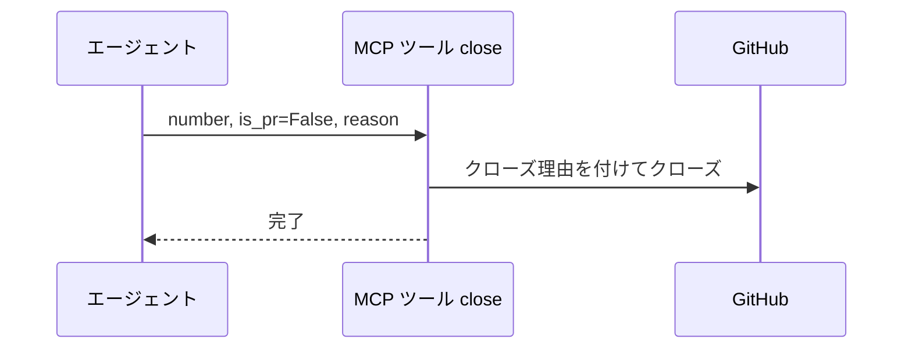
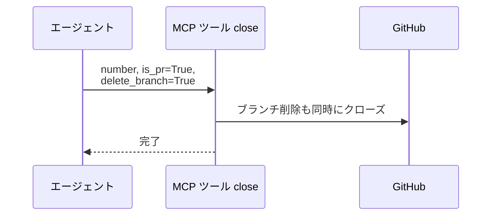
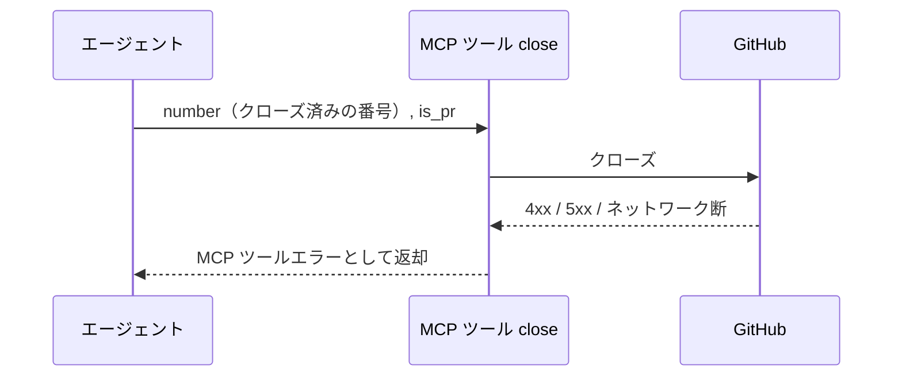

# クローズ

MCP ツール: `close`

Issue / PR をクローズする。
Issue は `reason`（completed / not_planned / duplicate）を指定でき、PR は `delete_branch` でブランチ削除を同時に行える。
PoC PR の close（マージなし）・リセットの巻き戻しクローズはこのツールを使う。

- 対応テストファイル: `tests/integration/mcp/test_close.py`

## インターフェース

### リクエスト

| パラメータ | 型 | 必須 | デフォルト | 説明 | 制限 | 補足 |
| --- | --- | --- | --- | --- | --- | --- |
| `number` | int | ✅ | - | 対象の Issue / PR 番号 | - | - |
| `is_pr` | bool | ✅ | - | PR なら `True` | - | - |
| `reason` | `"completed"` \| `"not_planned"` \| `"duplicate"` | - | なし（理由なしクローズ） | Issue のクローズ理由 | - | Issue のみ有効（PR では無視） |
| `delete_branch` | bool | - | `False` | クローズと同時にブランチも削除するか | - | PR のみ有効（Issue では無視） |

リクエスト例:

```json
{
  "number": 60,
  "is_pr": true,
  "delete_branch": true
}
```

### レスポンス

| フィールド | 型 | 説明 | 制限 | 補足 |
| --- | --- | --- | --- | --- |
| なし | - | 空オブジェクト | - | 副作用のみ |

レスポンス例:

```json
{}
```

## 制約

| 項目 | 制約 | 補足 |
| --- | --- | --- |
| タイムアウト | 制限なし | - |

## フロー一覧

| 分類 | フロー名 | 概要 | 補足 |
| --- | --- | --- | --- |
| 正常 | 正常系 | state=closed + state_reason で更新 | - |
| 正常 | 正常系（Issue の reason 指定時） | `--reason` を付与 | メインフローのフラグ組み立てで分岐 |
| 正常 | 正常系（PR の delete_branch 指定時） | `--delete-branch` を付与 | メインフローのフラグ組み立てで分岐 |
| 異常 | 異常系（API エラー） | 認証切れ / クローズ済み / ネットワーク断 | - |

## 正常系

### セットアップ

| セットアップ | 説明 | 補足 |
| --- | --- | --- |
| Mock | GitHub API を差し替え（正常応答を返す） | - |
| 対象 Issue / PR | open の対象が存在 | - |

### フロー



### 期待値

- 対象が closed になっている

## 正常系（Issue の reason 指定時）

### セットアップ

| セットアップ | 説明 | 補足 |
| --- | --- | --- |
| Mock | GitHub API を差し替え（正常応答を返す） | - |
| 入力 | `is_pr=False`・`reason="not_planned"` を指定して呼び出す | reason 分岐を誘発 |

### フロー



### 期待値

- Issue が closed になり、クローズ理由が `not_planned` として記録されている

## 正常系（PR の delete_branch 指定時）

### セットアップ

| セットアップ | 説明 | 補足 |
| --- | --- | --- |
| Mock | GitHub API を差し替え（正常応答を返す） | - |
| 入力 | `is_pr=True`・`delete_branch=True` を指定して呼び出す | ブランチ削除分岐を誘発 |
| 対象 PR | head ブランチがリモートに存在 | - |

### フロー



### 期待値

- PR が closed になっている
- リモートの head ブランチが削除されている

## 異常系（API エラー）

### セットアップ

| セットアップ | 説明 | 補足 |
| --- | --- | --- |
| Mock | GitHub API を差し替え（4xx / 5xx を返す） | - |
| 入力 | クローズ済みの番号を指定して呼び出す | API エラーを決定的に誘発 |

### フロー



### 期待値

- MCP ツールエラーが返る（HTTP ステータスと本文を含む）
