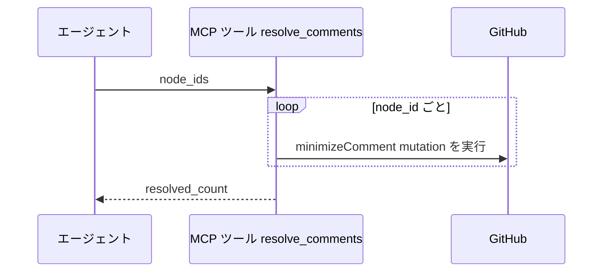
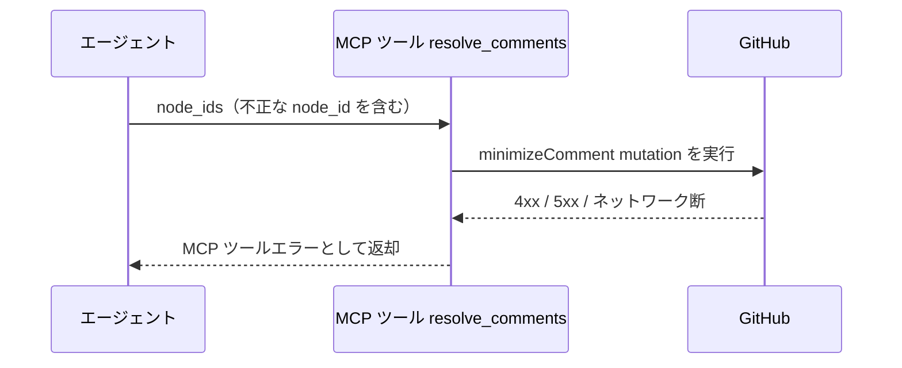

# コメント一括Resolve

MCP ツール: `resolve_comments`

1 件以上のコメントを一括で Resolve（`minimizeComment` mutation、`classifier=RESOLVED`）する。
完了処理時の「自分宛コメントの一括 Resolve」はこのツールを使う。

- 対応テストファイル: `tests/integration/mcp/test_resolve_comments.py`

## インターフェース

### リクエスト

| パラメータ | 型 | 必須 | デフォルト | 説明 | 制限 | 補足 |
| --- | --- | --- | --- | --- | --- | --- |
| `node_ids` | list[str] | ✅ | - | Resolve 対象コメントの node_id 配列 | 1 件以上 | `list_addressed_comments` で取得 |

リクエスト例:

```json
{
  "node_ids": ["IC_kwDOAbc123xyz", "IC_kwDOAbc456uvw"]
}
```

### レスポンス

| フィールド | 型 | 説明 | 制限 | 補足 |
| --- | --- | --- | --- | --- |
| `resolved_count` | int | Resolve した件数 | - | `node_ids` の件数と一致 |

レスポンス例:

```json
{
  "resolved_count": 2
}
```

## 制約

| 項目 | 制約 | 補足 |
| --- | --- | --- |
| タイムアウト | 制限なし | - |

## フロー一覧

| 分類 | フロー名 | 概要 | 補足 |
| --- | --- | --- | --- |
| 正常 | 正常系 | node_id ごとに minimizeComment mutation を実行 | - |
| 異常 | 異常系（API エラー） | 認証切れ / node_id 不正 / ネットワーク断 | 途中失敗時はそこまでの件数が Resolve 済み |

## 正常系

### セットアップ

| セットアップ | 説明 | 補足 |
| --- | --- | --- |
| Mock | GitHub API を差し替え（正常応答を返す） | - |
| 対象コメント | 未 Resolve のコメントが 2 件存在 | `node_id` を入力に使う |

### フロー



### 期待値

- 2 件とも Resolved（minimized）状態になっている
- 戻り値 `resolved_count` が `2`

## 異常系（API エラー）

### セットアップ

| セットアップ | 説明 | 補足 |
| --- | --- | --- |
| Mock | GitHub API を差し替え（4xx / 5xx を返す） | - |
| 入力 | 不正な `node_id` を含めて呼び出す | API エラーを決定的に誘発 |

### フロー



### 期待値

- MCP ツールエラーが返る（HTTP ステータスと本文を含む）
- ループ途中で失敗した場合、それまでの分は Resolved のまま残る（再実行は冪等なので全件やり直してよい）

