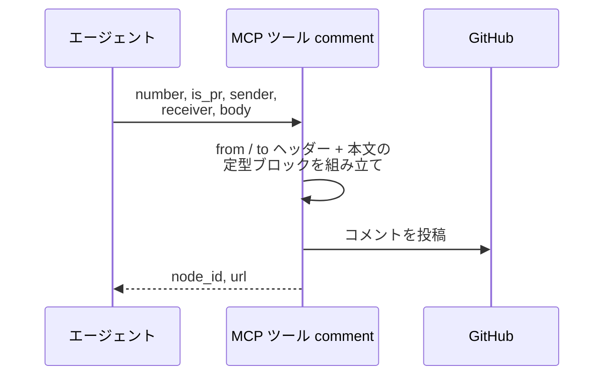
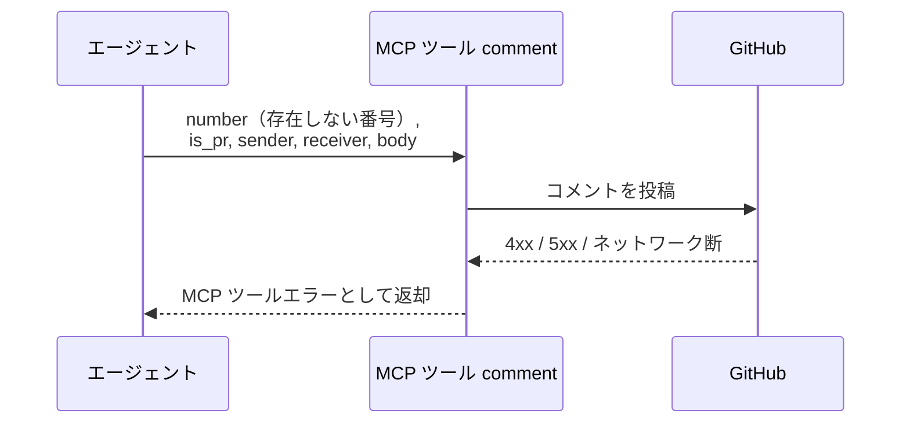

# コメント投稿

MCP ツール: `comment`

Issue / PR に定型フォーマット（`> from: @{送信者}` + `> to: @{宛先}` + 本文）でコメントを投稿する。
エージェントの全コメント投稿はこのツールを通り、書式が強制される。

- 対応テストファイル: `tests/integration/mcp/test_comment.py`

## インターフェース

### リクエスト

| パラメータ | 型 | 必須 | デフォルト | 説明 | 制限 | 補足 |
| --- | --- | --- | --- | --- | --- | --- |
| `number` | int | ✅ | - | 対象の Issue / PR 番号 | - | - |
| `is_pr` | bool | ✅ | - | PR なら `True` | - | 投稿 API は Issue / PR 共通 |
| `sender` | str | ✅ | - | 送信者のエージェント名（`> from: @sender` 行になる） | - | `@` は不要（自動付与） |
| `receiver` | str | - | なし（to 行なし = 現担当宛） | 宛先名（`> to: @receiver` 行になる） | - | `list_addressed_comments` の宛先判定に使われる |
| `body` | str | ✅ | - | 本文 | - | Markdown 可 |

リクエスト例:

```json
{
  "number": 40,
  "is_pr": true,
  "sender": "architect",
  "receiver": "implementer",
  "body": "戻り値が `User | null` です。L42 に null チェックを追加してください。"
}
```

### レスポンス

| フィールド | 型 | 説明 | 制限 | 補足 |
| --- | --- | --- | --- | --- |
| `node_id` | str | 投稿コメントの GraphQL node_id | - | Resolve / 返信の対象指定に使う |
| `url` | str | コメントの html URL | - | - |

レスポンス例:

```json
{
  "node_id": "IC_kwDOAbc123xyz",
  "url": "https://github.com/{owner}/{repo}/pull/40#issuecomment-123456"
}
```

## 制約

| 項目 | 制約 | 補足 |
| --- | --- | --- |
| タイムアウト | 制限なし | - |

## フロー一覧

| 分類 | フロー名 | 概要 | 補足 |
| --- | --- | --- | --- |
| 正常 | 正常系 | 定型ブロック組み立て → REST 投稿 | - |
| 異常 | 異常系（API エラー） | 認証切れ / 対象不存在 / ネットワーク断 | - |

## 正常系

### セットアップ

| セットアップ | 説明 | 補足 |
| --- | --- | --- |
| Mock | GitHub API を差し替え（正常応答を返す） | - |
| 対象 Issue / PR | sandbox に open の対象が存在 | 番号を入力に使う |

### フロー



### 期待値

- 対象にコメントが 1 件追加され、本文が定型ブロック（`> from: @sender` + `> to: @receiver` + 本文）になっている
- 戻り値の `node_id` / `url` が追加されたコメントを指している

## 異常系（API エラー）

### セットアップ

| セットアップ | 説明 | 補足 |
| --- | --- | --- |
| Mock | GitHub API を差し替え（4xx / 5xx を返す） | - |
| 対象番号 | 存在しない番号を指定して呼び出す | API エラーを決定的に誘発 |

### フロー



### 期待値

- MCP ツールエラーが返る（HTTP ステータスと本文を含む）
- コメントは追加されていない
