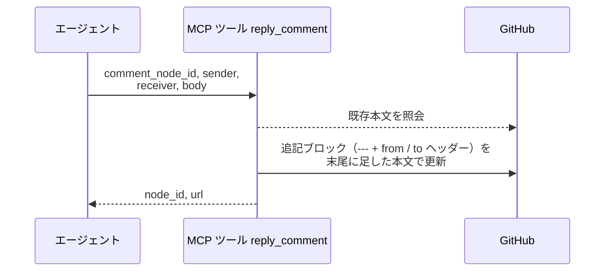
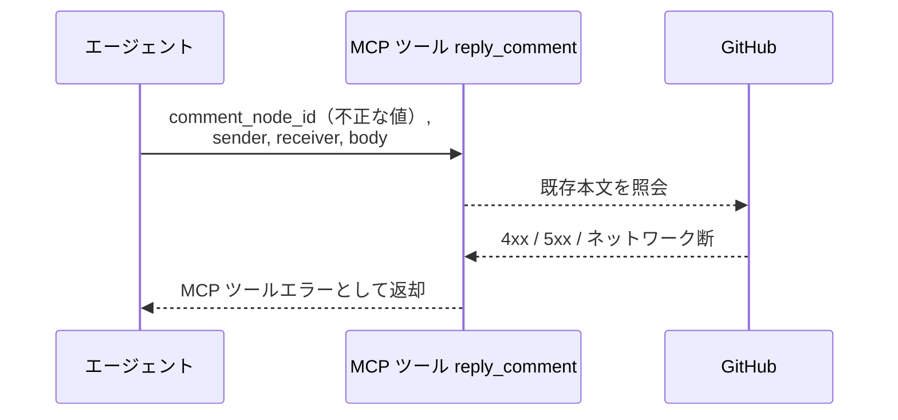

# コメント返信

MCP ツール: `reply_comment`

既存コメントに `---` 区切りで定型ブロックを追記する。
「1 つのコメント内で議論を続ける（返信は同一コメントに追記）」というコメント規約の実体で、対応依頼・修正完了・再開指示などのスレッド往復はすべてこのツールを通る。

- 対応テストファイル: `tests/integration/mcp/test_reply_comment.py`

## インターフェース

### リクエスト

| パラメータ | 型 | 必須 | デフォルト | 説明 | 制限 | 補足 |
| --- | --- | --- | --- | --- | --- | --- |
| `comment_node_id` | str | ✅ | - | 追記対象コメントの GraphQL node_id | - | `get_issue_or_pr` / `list_addressed_comments` で取得 |
| `sender` | str | ✅ | - | 送信者のエージェント名 | - | `@` は不要 |
| `receiver` | str | - | なし（to 行なし = 現担当宛） | 宛先名 | - | `@` は不要 |
| `body` | str | ✅ | - | 追記ブロックの本文 | - | Markdown 可 |

リクエスト例:

```json
{
  "comment_node_id": "IC_kwDOAbc123xyz",
  "sender": "architect",
  "receiver": "tester",
  "body": "異常系ケースの欠落を指摘しました。修正後に同スレッドへ返信してください。"
}
```

### レスポンス

| フィールド | 型 | 説明 | 制限 | 補足 |
| --- | --- | --- | --- | --- |
| `node_id` | str | 追記先コメントの GraphQL node_id | - | 追記なので元コメントと同じ id |
| `url` | str | コメントの html URL | - | - |

レスポンス例:

```json
{
  "node_id": "IC_kwDOAbc123xyz",
  "url": "https://github.com/{owner}/{repo}/pull/52#issuecomment-123456"
}
```

## 制約

| 項目 | 制約 | 補足 |
| --- | --- | --- |
| タイムアウト | 制限なし | - |

## フロー一覧

| 分類 | フロー名 | 概要 | 補足 |
| --- | --- | --- | --- |
| 正常 | 正常系 | 既存本文取得 → 定型ブロック追記 → 本文更新 mutation | - |
| 異常 | 異常系（API エラー） | 認証切れ / node_id 不正 / ネットワーク断 | - |

## 正常系

### セットアップ

| セットアップ | 説明 | 補足 |
| --- | --- | --- |
| Mock | GitHub API を差し替え（正常応答を返す） | - |
| 追記対象コメント | 定型ブロックのコメントが投稿済み | `node_id` を入力に使う |

### フロー



### 期待値

- 元コメントの末尾に `---` 区切り + from / to ヘッダー付きの追記ブロックが足されている
- 既存本文は変化していない

## 異常系（API エラー）

### セットアップ

| セットアップ | 説明 | 補足 |
| --- | --- | --- |
| Mock | GitHub API を差し替え（4xx / 5xx を返す） | - |
| 入力 | 不正な `comment_node_id` を指定して呼び出す | API エラーを決定的に誘発 |

### フロー



### 期待値

- MCP ツールエラーが返る（HTTP ステータスと本文を含む）
- コメントは変化していない
