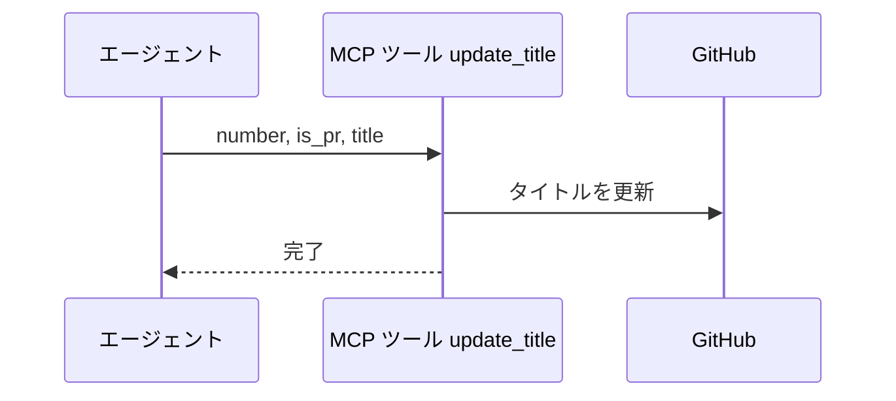
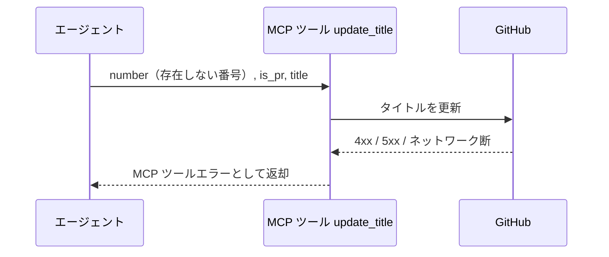

# タイトル更新

MCP ツール: `update_title`

Issue / PR のタイトルを更新する。
conductor の本文整形フェーズでのタイトル確定はこのツールを使う。

- 対応テストファイル: `tests/integration/mcp/test_update_title.py`

## インターフェース

### リクエスト

| パラメータ | 型 | 必須 | デフォルト | 説明 | 制限 | 補足 |
| --- | --- | --- | --- | --- | --- | --- |
| `number` | int | ✅ | - | 対象の Issue / PR 番号 | - | - |
| `is_pr` | bool | ✅ | - | PR なら `True` | - | - |
| `title` | str | ✅ | - | 新しいタイトル | - | - |

リクエスト例:

```json
{
  "number": 35,
  "is_pr": false,
  "title": "プロフィール編集機能"
}
```

### レスポンス

| フィールド | 型 | 説明 | 制限 | 補足 |
| --- | --- | --- | --- | --- |
| なし | - | 空オブジェクト | - | 副作用のみ |

レスポンス例:

```json
{}
```

## 制約

| 項目 | 制約 | 補足 |
| --- | --- | --- |
| タイムアウト | 制限なし | - |

## フロー一覧

| 分類 | フロー名 | 概要 | 補足 |
| --- | --- | --- | --- |
| 正常 | 正常系 | title を更新 | - |
| 異常 | 異常系（API エラー） | 認証切れ / 対象不存在 / ネットワーク断 | - |

## 正常系

### セットアップ

| セットアップ | 説明 | 補足 |
| --- | --- | --- |
| Mock | GitHub API を差し替え（正常応答を返す） | - |
| 対象 Issue / PR | sandbox に open の対象が存在 | - |

### フロー



### 期待値

- 対象のタイトルが送信した内容に更新されている

## 異常系（API エラー）

### セットアップ

| セットアップ | 説明 | 補足 |
| --- | --- | --- |
| Mock | GitHub API を差し替え（4xx / 5xx を返す） | - |
| 対象番号 | 存在しない番号を指定して呼び出す | API エラーを決定的に誘発 |

### フロー



### 期待値

- MCP ツールエラーが返る（HTTP ステータスと本文を含む）
- タイトルは変化していない
