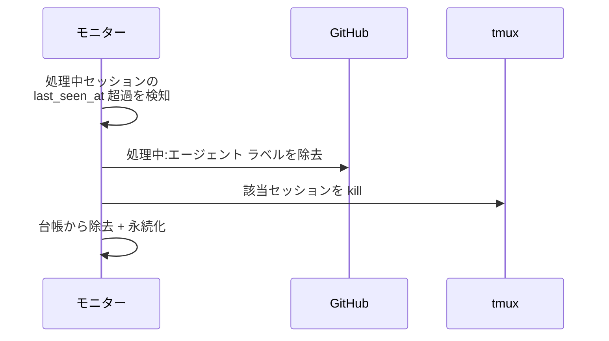
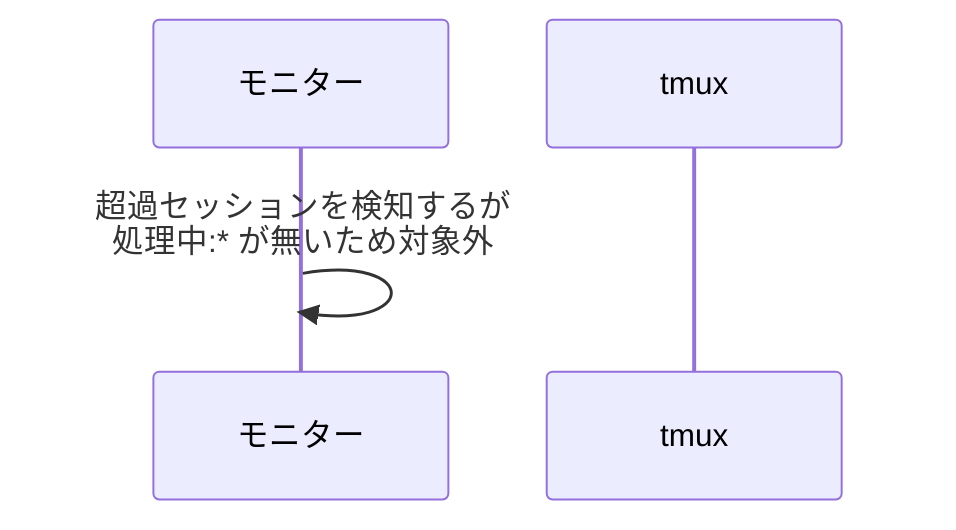
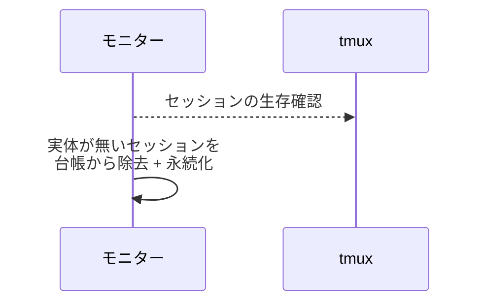
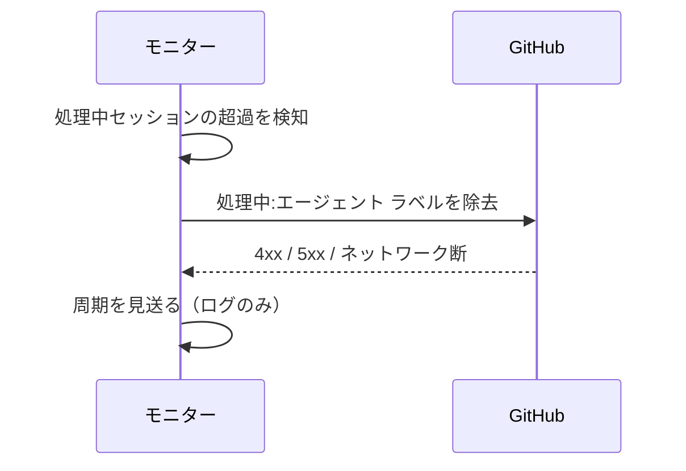

# タイムアウト検知

トリガー: heartbeat 周期（`heartbeat_interval_sec` ごと）

処理中のまま応答が無いセッションを kill して回収する（ハング・無限ループの最終防衛）。
待機中（作業完了報告済みで `処理中:*` が外れている）セッションはタイムアウト対象外。
kill 後の再作成は行わず、`処理中:*` を外すことで次の polling がエージェント起動検知として再作成する（コールドスタート復元）。
あわせて tmux に実体が無いセッションの台帳を修復する（実行中セッションの SoT は tmux）。

- 対応テストファイル: `tests/integration/monitor/test_タイムアウト検知.py`

## 制約

| 項目 | 制約 | 補足 |
| --- | --- | --- |
| 周期 | 設定 `heartbeat_interval_sec`（既定 60 秒） | - |
| タイムアウト閾値 | `last_seen_at` から `session_timeout_min`（既定 30 分） | 生存時刻は作業完了報告の受信で更新される |

## フロー一覧

| 分類 | フロー名 | 概要 | 補足 |
| --- | --- | --- | --- |
| 正常 | 正常系 | タイムアウトしたセッションを kill + 台帳から除去 + `処理中:*` 除去 | - |
| 正常 | 正常系（待機中は対象外） | `処理中:*` が外れたセッションは超過しても kill しない | - |
| 正常 | 正常系（実体消失の修復） | tmux に実体が無いセッションを台帳から除去 | - |
| 異常 | 異常系（GitHub API エラー） | `処理中:*` 除去の失敗で周期を見送る | - |

## 正常系

### セットアップ

| セットアップ | 説明 | 補足 |
| --- | --- | --- |
| Mock | GitHub API / tmux を差し替え | - |
| 台帳 | `last_seen_at` が `session_timeout_min` を超過したセッションが登録済み | - |
| 対象 | セッションの主番号の対象に `処理中:{エージェント}` が付与済み | タイムアウト対象を誘発 |

### フロー

### 期待値

- 該当セッションが kill され台帳から除去されている
- 対象の `処理中:{エージェント}` が外れている（確認ラベルは残るため、次の polling で再起動される）

## 正常系（待機中は対象外）

### セットアップ

| セットアップ | 説明 | 補足 |
| --- | --- | --- |
| Mock | GitHub API / tmux を差し替え | - |
| 台帳 | `last_seen_at` が超過したセッションが登録済み | - |
| 対象 | 対象に `処理中:*` が付いていない | 待機中（作業完了報告済み）を再現 |

### フロー

### 期待値

- kill・台帳変更・ラベル操作が発生していない（待機中は常駐を続ける）

## 正常系（実体消失の修復）

### セットアップ

| セットアップ | 説明 | 補足 |
| --- | --- | --- |
| Mock | GitHub API / tmux を差し替え（生存確認が偽を返す） | - |
| 台帳 | セッションが登録済みだが tmux に実体が無い | 手動 kill・マシン再起動を再現 |

### フロー

### 期待値

- 該当セッションが台帳から除去されている（tmux 側の SoT に台帳を寄せる）

## 異常系（GitHub API エラー）

### セットアップ

| セットアップ | 説明 | 補足 |
| --- | --- | --- |
| Mock | GitHub API を差し替え（ラベル除去で 4xx / 5xx を返す） | 異常を決定的に誘発 |
| 台帳 | タイムアウト超過の処理中セッションが登録済み | - |

### フロー

### 期待値

- モニタープロセスが落ちない
- セッションは kill されず台帳も不変のまま、次周期で再試行される
