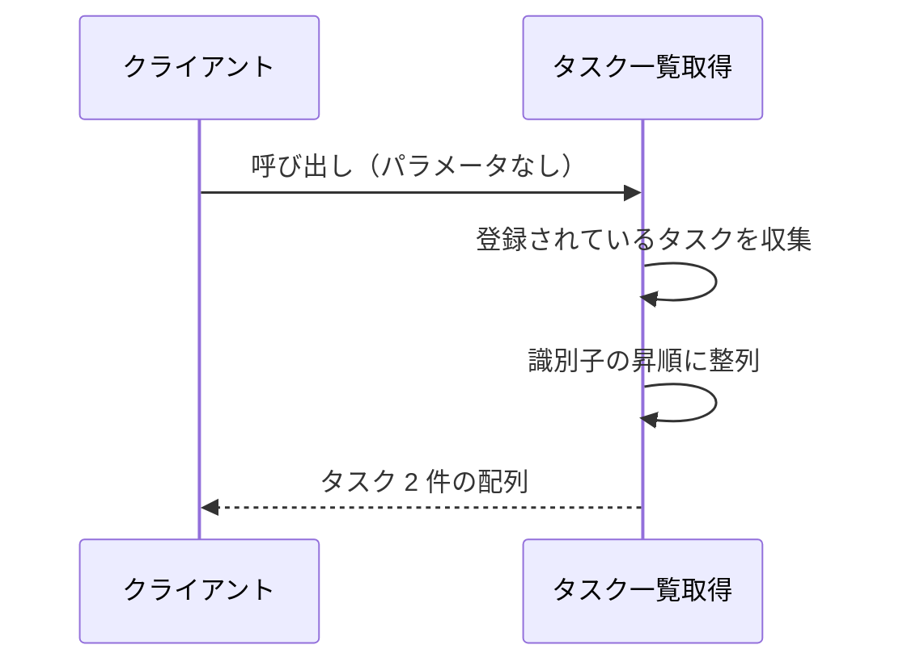
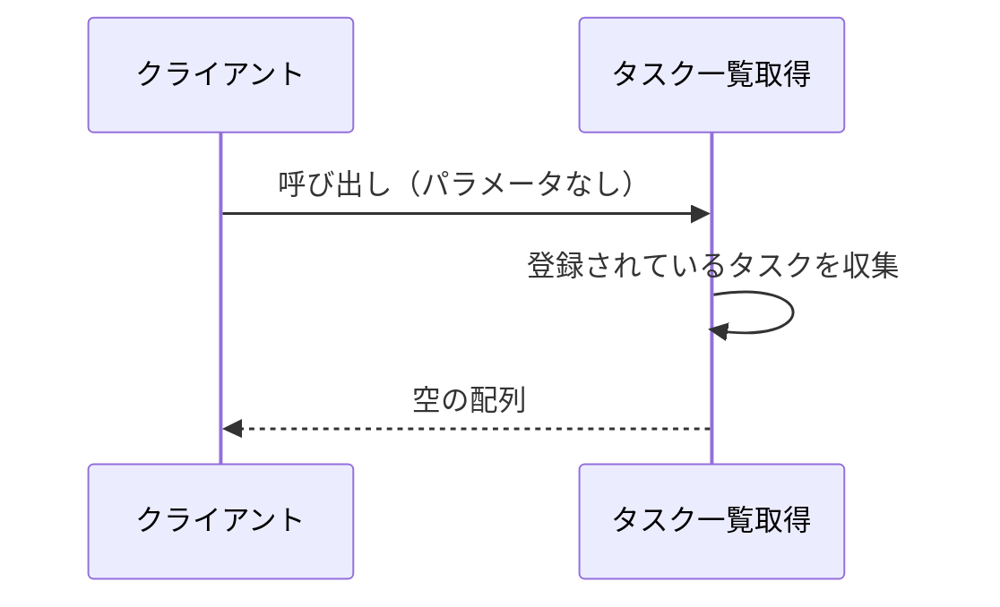

# タスク一覧取得

呼び出し形式: Python サービス関数（同期呼び出し）

登録されているタスクを、絞り込みなしで全件返す操作。
各要素には、フロントエンドが遷移先を決めるための一意な識別子が含まれる。

- 対応テストファイル: `tests/integration/tasks/test_list_tasks.py`

## インターフェース

### リクエスト

パラメータなし。
絞り込み条件・ページング指定は受け取らない。

### レスポンス

| フィールド | 型 | 説明 | 制限 | 補足 |
| --- | --- | --- | --- | --- |
| （戻り値） | `list[Task]` | 登録されているタスクの配列 | - | 識別子の昇順。登録が 0 件のときは空の配列 |
| `[].id` | `str` | タスクの識別子 | 1〜100 文字 | 一覧内で一意。遷移先の決定に使う |
| `[].title` | `str` | タスクのタイトル | 1〜100 文字 | - |
| `[].content` | `str` | タスクの本文 | 1000 文字以内 | 本文が未設定のタスクは空文字 |

レスポンス例:

```python
[
    Task(id="t1", title="買い物リストの作成", content=""),
    Task(id="t2", title="週次レポートの提出", content="今週の進捗をまとめる"),
]
```

補足:

- 制限列は保管されている値が満たす想定範囲。
  本操作は参照のみで、値の検証は行わない。

## 制約

| 項目 | 制約 | 補足 |
| --- | --- | --- |
| 絞り込み | 制限なし（登録されている全件を返す） | 所有者・状態による除外は行わない |
| 並び順 | 識別子の昇順で固定 | 呼び出しごとに順序が変わらないことをテストで固定する |
| 件数上限 | 制限なし | ページング・最大件数は設けない |
| 認可 | 制限なし | 認証・タスク所有者の概念を導入しない |
| タイムアウト | 制限なし | 保管先の参照のみで待ち合わせが発生しない |
| 応答時間 | p95 500ms 以内 | - |
| 副作用 | なし（保管されているタスクを変更しない） | - |

## フロー一覧

| 分類 | フロー名 | 概要 | 補足 |
| --- | --- | --- | --- |
| 正常 | 正常系 | 登録済みタスクを識別子の昇順で全件返す | - |
| 正常 | 正常系（登録が 0 件） | 空の配列を返す | - |

異常系は存在しない（入力を受け取らず、参照のみのため失敗要因がない）。

## 正常系

### セットアップ

| セットアップ | 説明 | 補足 |
| --- | --- | --- |
| Mock | なし（タスクの保管先はテストデータで直接構築する） | 外部 DB / 外部 API に依存しない |
| タスク | 識別子 `t2` のタスクを登録 | `title: 週次レポートの提出` |
| タスク | 識別子 `t1` のタスクを登録 | `title: 買い物リストの作成`。登録順と昇順が食い違う並びを仕込む |

### フロー



### 期待値

- `t1`, `t2` の順でタスクが 2 件返る
- 各要素に識別子・タイトル・本文が含まれている
- 保管されているタスクの内容が呼び出しの前後で変化していない

## 正常系（登録が 0 件）

### セットアップ

| セットアップ | 説明 | 補足 |
| --- | --- | --- |
| Mock | なし（タスクの保管先はテストデータで直接構築する） | 外部 DB / 外部 API に依存しない |
| タスク | 1 件も登録しない | 空の保管先を決定的に作る |

### フロー



### 期待値

- 空の配列が返る
- 例外は送出されない

## 異常系

なし
