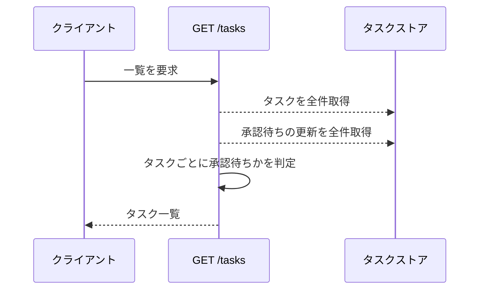
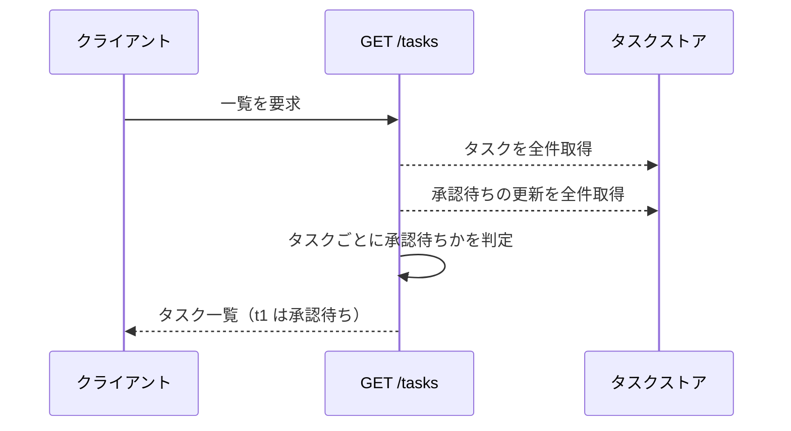

# タスク一覧取得

エンドポイント: GET /tasks

登録済みのタスクを一覧で返す。
承認待ちの更新を受け付けているタスクには、承認待ちであることを識別できる情報を添える。

## インターフェース

### リクエスト

なし

### レスポンス

| フィールド | 型 | 説明 | 制限 | 補足 |
| --- | --- | --- | --- | --- |
| `tasks` | list | 登録済みのタスク一覧 | - | 登録順 |
| `tasks[].id` | str | タスク ID | - | - |
| `tasks[].title` | str | 承認済みのタイトル | - | 承認待ちの更新内容は反映しない |
| `tasks[].content` | str | 承認済みの本文 | - | 承認待ちの更新内容は反映しない |
| `tasks[].is_pending_approval` | bool | 承認待ちの更新を保持しているか | - | 承認待ちストアに同じ ID があれば真 |

補足:

- タイトルと本文は承認が完了した確定値だけを返す（承認待ちの更新内容そのものは返さない）
- 承認待ちのタスクも一覧から除外しない

## 制約

| 項目 | 制約 | 補足 |
| --- | --- | --- |
| タイムアウト | 制限なし | インメモリストアの参照のみ |
| 認可 | なし | sandbox 用の最小実装 |
| 件数上限 | 制限なし | sandbox 用の最小実装 |

## フロー一覧

| 分類 | フロー名 | 概要 | 補足 |
| --- | --- | --- | --- |
| 正常 | 正常系 | 承認待ちのないタスクを一覧で返す | - |
| 正常 | 正常系（承認待ちのタスクを含む） | 承認待ちのタスクに識別情報を付けて返す | - |

## 正常系

### セットアップ

| セットアップ | 説明 | 補足 |
| --- | --- | --- |
| Mock | なし（インメモリのストアを実物のまま使う） | - |
| タスク | `t1` のタスクを登録済み | 承認待ちの更新はない |

### フロー

### 期待値

- `t1` を含むタスク一覧が返る
- `t1` の `is_pending_approval` が偽になっている
- `t1` のタイトルと本文が登録時の値になっている

## 正常系（承認待ちのタスクを含む）

### セットアップ

| セットアップ | 説明 | 補足 |
| --- | --- | --- |
| Mock | なし（インメモリのストアを実物のまま使う） | - |
| タスク | `t1` のタスクを登録済み | - |
| 承認待ち | `t1` への更新を受付済み | 承認待ちの分岐を決定的に誘発 |

### フロー

### 期待値

- `t1` の `is_pending_approval` が真になっている
- `t1` のタイトルと本文は受付前の確定値のままになっている

## 異常系

なし
