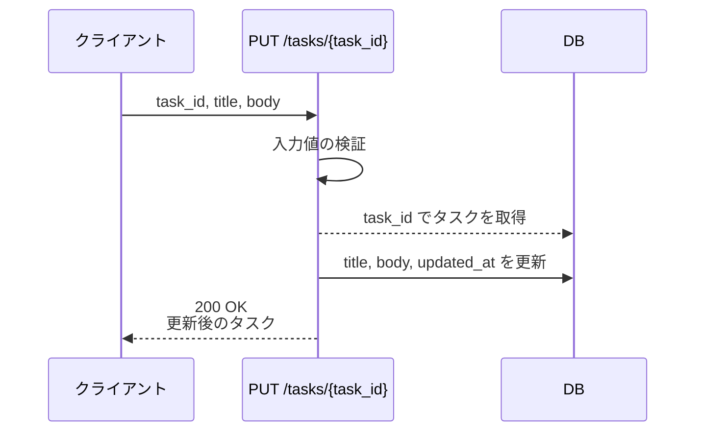
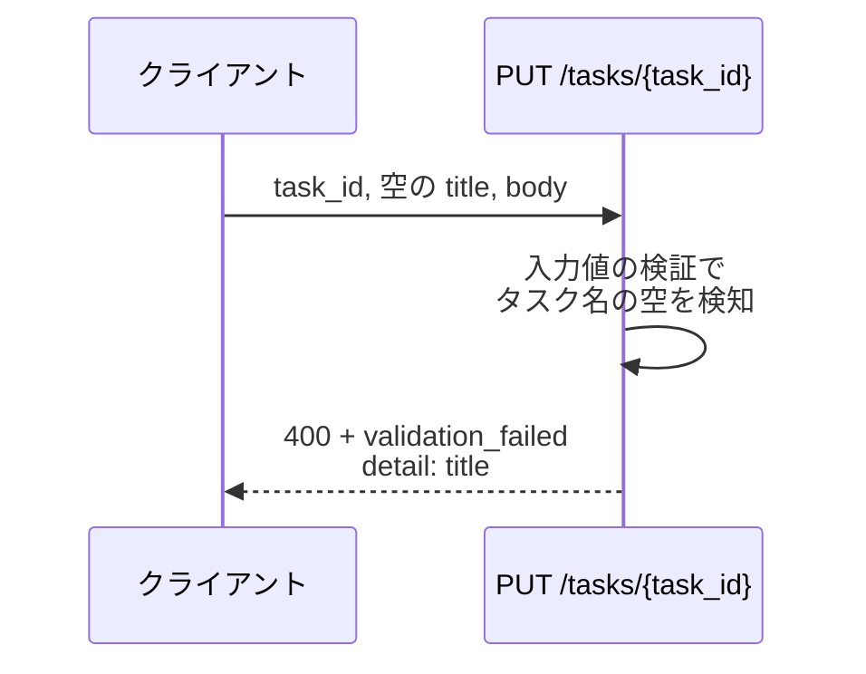
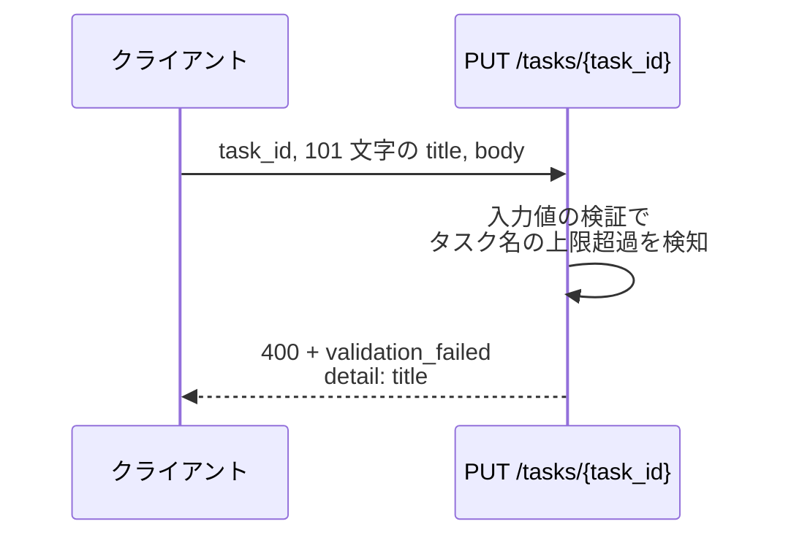
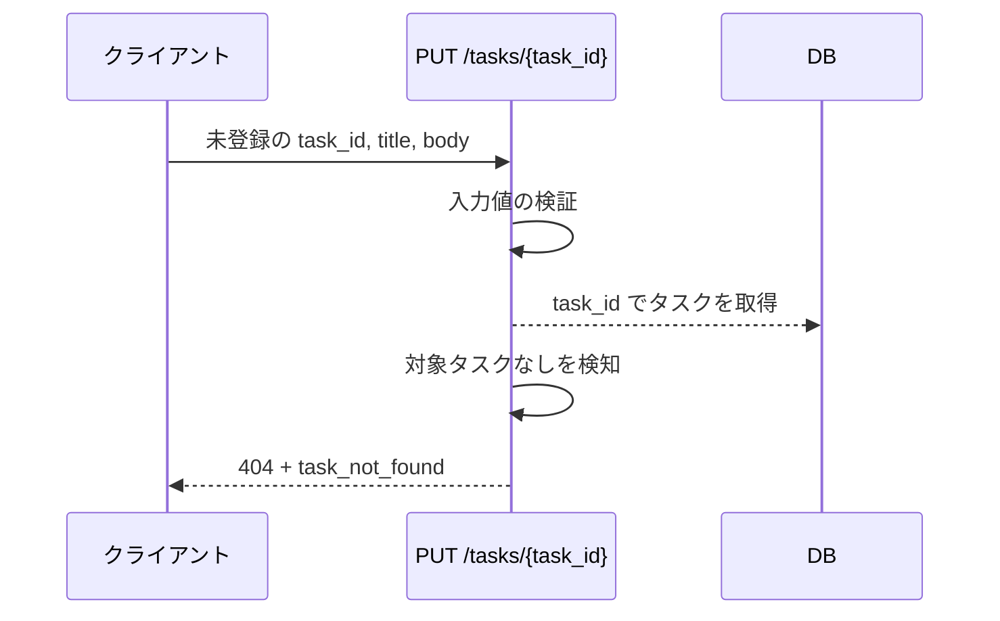

# タスク更新

エンドポイント: PUT /tasks/{task_id}

編集画面から送られたタスク名・本文を検証したうえで、対象タスクを更新して更新後の内容を返す。

- 対応テストファイル: 未定（テスト作成時に tester が記入）

## インターフェース

### リクエスト

| パラメータ | 型 | 必須 | デフォルト | 説明 | 制限 | 補足 |
| --- | --- | --- | --- | --- | --- | --- |
| `task_id` | str | ✅ | - | 更新対象のタスク ID | - | パスパラメータ |
| `title` | str | ✅ | - | タスク名 | 1 文字以上 100 文字以内 | 空文字・空白のみは不可 |
| `body` | str | ✅ | - | タスク本文 | 制限なし | 空文字は可 |

リクエスト例:

```json
{
  "title": "決算資料の作成",
  "body": "四半期分の売上を集計してレビューを依頼する"
}
```

### レスポンス

| フィールド | 型 | 説明 | 制限 | 補足 |
| --- | --- | --- | --- | --- |
| `task` | object | 更新後のタスク | - | - |
| `task.id` | str | タスク ID | - | リクエストの `task_id` と一致 |
| `task.title` | str | 更新後のタスク名 | - | - |
| `task.body` | str | 更新後の本文 | - | - |
| `task.updated_at` | str | 更新日時（ISO 8601・UTC） | - | 画面表示時に JST へ変換する |

レスポンス例:

```json
{
  "task": {
    "id": "3f2b1c88-...",
    "title": "決算資料の作成",
    "body": "四半期分の売上を集計してレビューを依頼する",
    "updated_at": "2026-07-27T04:18:02+00:00"
  }
}
```

**補足:**

- 異常時のボディは全ステータス共通で `error`（表示用メッセージ）/ `code`（機械可読コード）/ `detail`（フィールド単位のエラー配列）の 3 フィールドを返す。
  `detail` は検証エラー時のみ含める

```json
{
  "error": "入力値が不正です",
  "code": "validation_failed",
  "detail": [
    { "field": "title", "message": "タスク名を入力してください" }
  ]
}
```

### ステータスコード

| ステータスコード | 発生条件 | 補足 |
| --- | --- | --- |
| `200` | 更新成功 | - |
| `400` | リクエストのバリデーション失敗 | `detail` にフィールド単位のエラーを載せる |
| `404` | 対象タスクが存在しない | - |
| `500` | DB 書き込み失敗 | - |

## 制約

| 項目 | 制約 | 補足 |
| --- | --- | --- |
| タイムアウト | 1 秒以内に応答する | 非機能要件。超過時は `500` |
| 認可 | 制限なし | 認証・権限の要件は SA になし |
| レート制限 | 制限なし | - |
| 更新対象フィールド | `title` / `body` の 2 つのみ | 状態・期限など他のカラムは本操作では変更しない |

## フロー一覧

| 分類 | フロー名 | 概要 | 補足 |
| --- | --- | --- | --- |
| 正常 | 正常系 | 検証を通過して対象タスクを更新し、更新後の内容を返す | - |
| 異常 | 異常系（タスク名が空・400） | 空文字を検証で弾いて 400 を返す | シナリオの異常シナリオに対応 |
| 異常 | 異常系（タスク名が 100 文字超・400） | 上限超過を検証で弾いて 400 を返す | - |
| 異常 | 異常系（対象タスクが存在しない・404） | 取得できず 404 を返す | - |

## 正常系

### セットアップ

| セットアップ | 説明 | 補足 |
| --- | --- | --- |
| Mock | `DB` を DB stub に差し替え | - |
| タスク | 更新対象のタスクを 1 件登録済み | `task_id` で取得できる |

### フロー



### 期待値

- `200 OK` + 更新後のタスクが返る
- tasks テーブルの対象行の `title` / `body` / `updated_at` が更新されている

## 異常系（タスク名が空・400）

### セットアップ

| セットアップ | 説明 | 補足 |
| --- | --- | --- |
| Mock | `DB` を DB stub に差し替え | - |
| タスク | 更新対象のタスクを 1 件登録済み | - |
| 入力 | `title` を空文字にして送信 | 検証失敗を決定的に誘発 |

### フロー



### 期待値

- `400` + `validation_failed` が返り、`detail` に `title` のエラーが 1 件含まれる
- tasks テーブルの対象行は更新されていない

## 異常系（タスク名が 100 文字超・400）

### セットアップ

| セットアップ | 説明 | 補足 |
| --- | --- | --- |
| Mock | `DB` を DB stub に差し替え | - |
| タスク | 更新対象のタスクを 1 件登録済み | - |
| 入力 | `title` を 101 文字にして送信 | 検証失敗を決定的に誘発 |

### フロー



### 期待値

- `400` + `validation_failed` が返り、`detail` に `title` のエラーが 1 件含まれる
- tasks テーブルの対象行は更新されていない

## 異常系（対象タスクが存在しない・404）

### セットアップ

| セットアップ | 説明 | 補足 |
| --- | --- | --- |
| Mock | `DB` を DB stub に差し替え | - |
| 入力 | 登録されていない `task_id` を指定して送信 | 取得失敗を決定的に誘発 |

### フロー



### 期待値

- `404` + `task_not_found` が返る
- tasks テーブルはどの行も更新されていない
