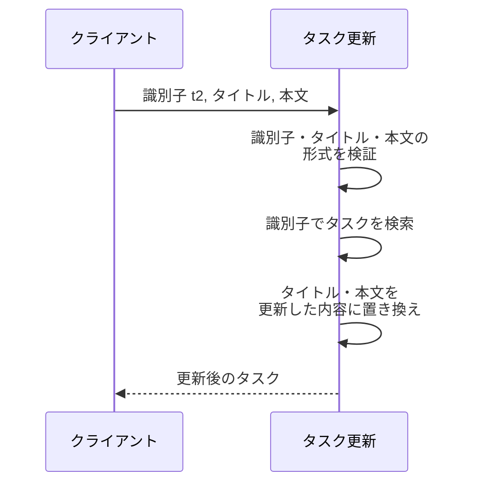
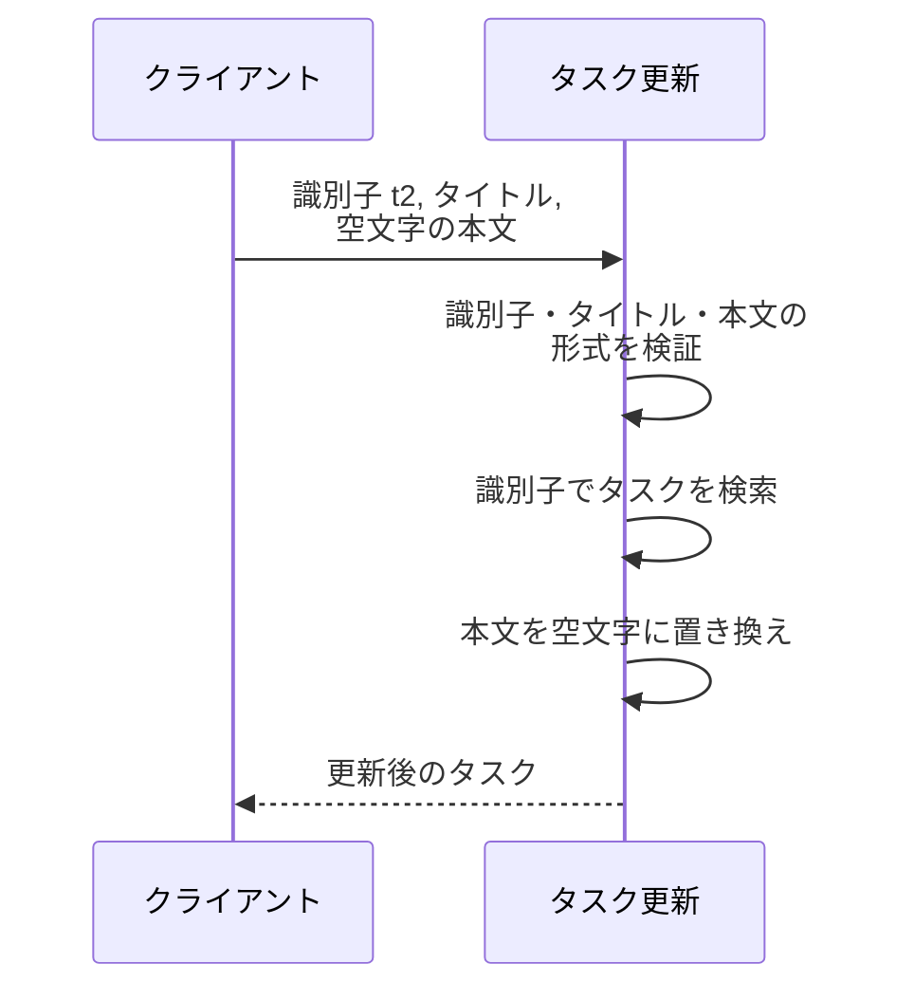
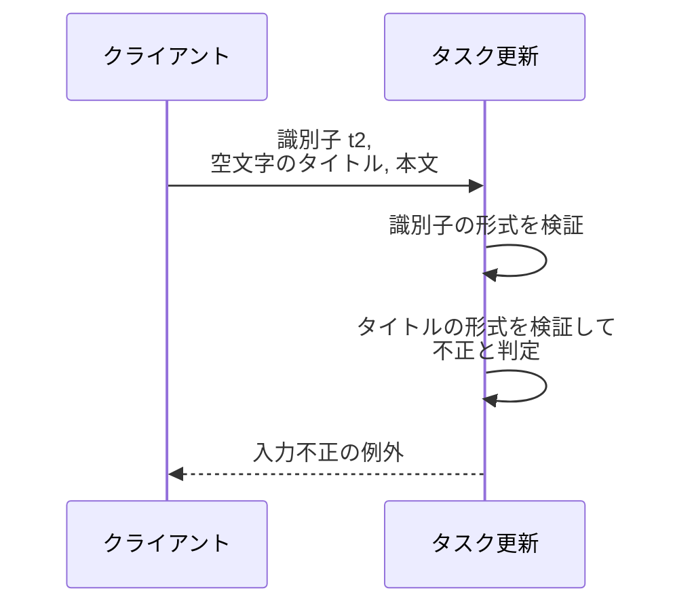
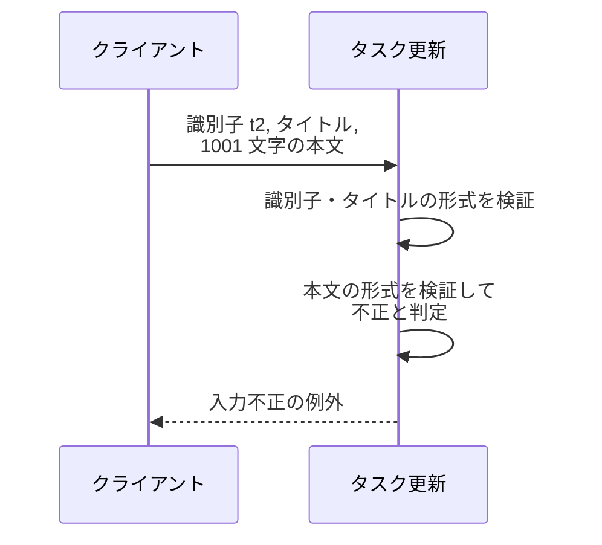
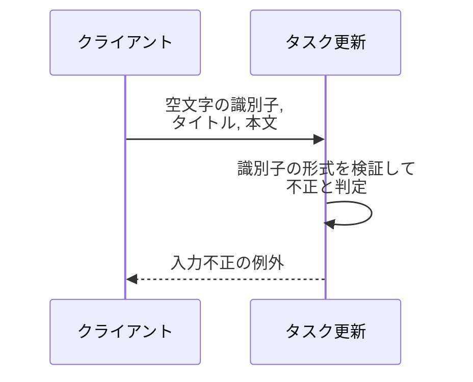
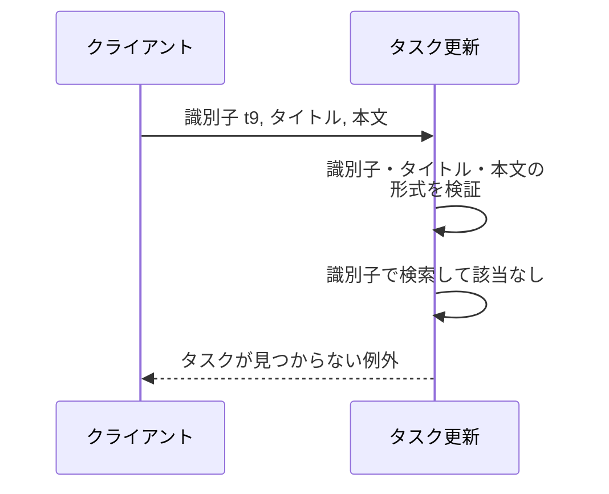

# タスク更新

呼び出し形式: Python サービス関数（同期呼び出し）

識別子を指定して、対応するタスクのタイトル・本文を更新する操作。
編集画面で変更した内容の保存先になる。

- 対応テストファイル: -

## インターフェース

### リクエスト

| パラメータ | 型 | 必須 | デフォルト | 説明 | 制限 | 補足 |
| --- | --- | --- | --- | --- | --- | --- |
| `task_id` | `str` | ✅ | - | 更新対象のタスクの識別子 | 1〜100 文字 | 編集画面が開いているタスクの識別子をそのまま渡す |
| `title` | `str` | ✅ | - | 更新後のタイトル | 1〜100 文字 | 空文字は不可 |
| `content` | `str` | ✅ | - | 更新後の本文 | 1000 文字以内 | 空文字を許容する |

リクエスト例:

```python
task_id = "t2"
title = "週次レポートの提出（改訂）"
content = "今週の進捗と来週の予定をまとめる"
```

### レスポンス

| フィールド | 型 | 説明 | 制限 | 補足 |
| --- | --- | --- | --- | --- |
| （戻り値） | `Task` | 更新後のタスク | - | - |
| `id` | `str` | タスクの識別子 | 1〜100 文字 | 指定した識別子と一致する |
| `title` | `str` | 更新後のタイトル | 1〜100 文字 | 指定した値と一致する |
| `content` | `str` | 更新後の本文 | 1000 文字以内 | 指定した値と一致する |

レスポンス例:

```python
Task(id="t2", title="週次レポートの提出（改訂）", content="今週の進捗と来週の予定をまとめる")
```

補足:

- 更新するのはタイトル・本文の 2 項目のみで、識別子は変更しない。
- 更新後の値は保管先に反映され、後続の[タスク詳細取得](./タスク詳細取得.py.md)・一覧取得の結果に現れる。
- 同じ入力で繰り返し呼び出しても保管される内容は変わらない。
- 検証エラー・未検出のいずれの場合も戻り値を返さず、専用の例外を送出する。

## 制約

| 項目 | 制約 | 補足 |
| --- | --- | --- |
| 識別子の形式 | 1 文字以上 100 文字以内の文字列 | 境界（1 文字 / 100 文字は有効、0 文字 / 101 文字は無効）を単体テストで固定する |
| タイトルの形式 | 1 文字以上 100 文字以内の文字列 | 境界（1 文字 / 100 文字は有効、0 文字 / 101 文字は無効）を単体テストで固定する |
| 本文の形式 | 1000 文字以内の文字列（下限なし） | 境界（0 文字 / 1000 文字は有効、1001 文字は無効）を単体テストで固定する |
| 検証の順序 | 識別子 → タイトル → 本文 の順に検証し、不正を検出した時点で以降の処理を行わない | 入力不正と未検出が同時に成立する入力では入力不正を返す |
| 形式が不正な入力の扱い | 入力不正を表す例外で返す | 内部エラー（未捕捉の例外）にはしない |
| 対象が存在しない場合の扱い | タスクが見つからないことを表す専用の例外で返す | 入力不正の例外とは別の型にし、呼び出し側が区別できるようにする |
| エラーメッセージ | 判定条件と一致した内容にする | メッセージだけが正しく判定条件が欠落する事象の再発を防ぐ |
| 認可 | 制限なし | 認証・タスク所有者の概念を導入しない |
| 同時更新の制御 | 制限なし | 楽観的ロック・競合検出は行わない |
| タイムアウト | 制限なし | 保管先の更新のみで待ち合わせが発生しない |
| 応答時間 | p95 500ms 以内 | - |
| 副作用 | 成功時のみ保管先の対象タスクを更新後の値に置き換える | 失敗時は保管されているタスクを変更しない |

## フロー一覧

| 分類 | フロー名 | 概要 | 補足 |
| --- | --- | --- | --- |
| 正常 | 正常系 | タイトル・本文を更新して更新後のタスクを返す | - |
| 正常 | 正常系（本文を空にする） | 本文を空文字で更新する | UC 要件「本文は空にすることも許容する」に対応 |
| 異常 | 異常系（タイトルが空） | 入力不正を表す例外を送出 | フロントエンドの必須チェックをすり抜けた場合の最終防衛線 |
| 異常 | 異常系（本文が上限超過） | 入力不正を表す例外を送出 | 1001 文字を渡した場合 |
| 異常 | 異常系（識別子の形式が不正） | 入力不正を表す例外を送出 | 空文字 / 101 文字以上を渡した場合 |
| 異常 | 異常系（未登録の識別子） | タスクが見つからないことを表す例外を送出 | 編集画面を開いた後に対象が削除された場合に相当 |

タイトル・本文・識別子の境界値（下限未満 / 下限ちょうど / 上限ちょうど / 上限超過）の網羅は単体テストで固定する。
本セクションでは検証対象のパラメータごとに違反時の振る舞いを 1 フローずつ置く。

## 正常系

### セットアップ

| セットアップ | 説明 | 補足 |
| --- | --- | --- |
| Mock | なし（タスクの保管先はテストデータで直接構築する） | 外部 DB / 外部 API に依存しない |
| タスク | 識別子 `t1` のタスクを登録 | `title: 買い物リストの作成` |
| タスク | 識別子 `t2` のタスクを登録 | `title: 週次レポートの提出` / `content: 今週の進捗をまとめる` |
| 入力 | 識別子 `t2` / タイトル `週次レポートの提出（改訂）` / 本文 `今週の進捗と来週の予定をまとめる` を指定 | 編集画面でタイトルと本文の両方を書き換えた状態を再現 |

### フロー



### 期待値

- 更新後のタイトル・本文を持つ識別子 `t2` のタスクが返る
- 保管されている識別子 `t2` のタスクのタイトル・本文が指定した値になっている
- 識別子 `t2` のタスクの識別子が更新前と同じ値のまま変わっていない
- 更新対象でない識別子 `t1` のタスクの内容が変化していない

## 正常系（本文を空にする）

### セットアップ

| セットアップ | 説明 | 補足 |
| --- | --- | --- |
| Mock | なし（タスクの保管先はテストデータで直接構築する） | 外部 DB / 外部 API に依存しない |
| タスク | 識別子 `t2` のタスクを登録 | `title: 週次レポートの提出` / `content: 今週の進捗をまとめる` |
| 入力 | 識別子 `t2` / タイトルは登録時と同じ値 / 本文に空文字を指定 | 本文をすべて削除して保存した状態を再現 |

### フロー



### 期待値

- 本文が空文字のタスクが返る
- 保管されている識別子 `t2` のタスクの本文が空文字になっている
- 識別子 `t2` のタスクのタイトルが更新前と同じ値のまま変わっていない

## 異常系（タイトルが空）

### セットアップ

| セットアップ | 説明 | 補足 |
| --- | --- | --- |
| Mock | なし（タスクの保管先はテストデータで直接構築する） | 外部 DB / 外部 API に依存しない |
| タスク | 識別子 `t2` のタスクを登録 | `title: 週次レポートの提出` / `content: 今週の進捗をまとめる` |
| 入力 | 識別子 `t2` / 空文字のタイトル / 変更後の本文を指定 | タイトル検証の下限違反を決定的に誘発する |

### フロー



### 期待値

- 入力不正を表す例外が送出される
- 未捕捉の内部エラーにはならない
- 例外メッセージの内容が判定条件（1 文字以上 100 文字以内）と一致している
- 保管されている識別子 `t2` のタスクのタイトル・本文が更新前の値のまま変化していない

## 異常系（本文が上限超過）

### セットアップ

| セットアップ | 説明 | 補足 |
| --- | --- | --- |
| Mock | なし（タスクの保管先はテストデータで直接構築する） | 外部 DB / 外部 API に依存しない |
| タスク | 識別子 `t2` のタスクを登録 | `title: 週次レポートの提出` / `content: 今週の進捗をまとめる` |
| 入力 | 識別子 `t2` / 有効なタイトル / 1001 文字の本文を指定 | 本文検証の上限違反を決定的に誘発する |

### フロー



### 期待値

- 入力不正を表す例外が送出される
- 未捕捉の内部エラーにはならない
- 例外メッセージの内容が判定条件（1000 文字以内）と一致している
- 保管されている識別子 `t2` のタスクのタイトル・本文が更新前の値のまま変化していない

## 異常系（識別子の形式が不正）

### セットアップ

| セットアップ | 説明 | 補足 |
| --- | --- | --- |
| Mock | なし（タスクの保管先はテストデータで直接構築する） | 外部 DB / 外部 API に依存しない |
| タスク | 識別子 `t2` のタスクを登録 | `title: 週次レポートの提出` / `content: 今週の進捗をまとめる` |
| 入力 | 空文字の識別子 / 有効なタイトル / 変更後の本文を指定 | 識別子検証の下限違反を決定的に誘発する |

### フロー



### 期待値

- 入力不正を表す例外が送出される
- 未捕捉の内部エラーにはならない
- 例外メッセージの内容が判定条件（1 文字以上 100 文字以内）と一致している
- 保管されている識別子 `t2` のタスクのタイトル・本文が更新前の値のまま変化していない

## 異常系（未登録の識別子）

### セットアップ

| セットアップ | 説明 | 補足 |
| --- | --- | --- |
| Mock | なし（タスクの保管先はテストデータで直接構築する） | 外部 DB / 外部 API に依存しない |
| タスク | 識別子 `t1` のタスクを登録 | `title: 買い物リストの作成` |
| 入力 | 登録されていない識別子 `t9` / 有効なタイトル / 変更後の本文を指定 | 編集画面を開いた後に対象が削除された状態を再現 |

### フロー



### 期待値

- タスクが見つからないことを表す例外が送出される
- 送出された例外が入力不正の例外と型で区別できる
- 保管されている識別子 `t1` のタスクの内容が変化していない
- 保管先に識別子 `t9` のタスクが新しく作られていない
