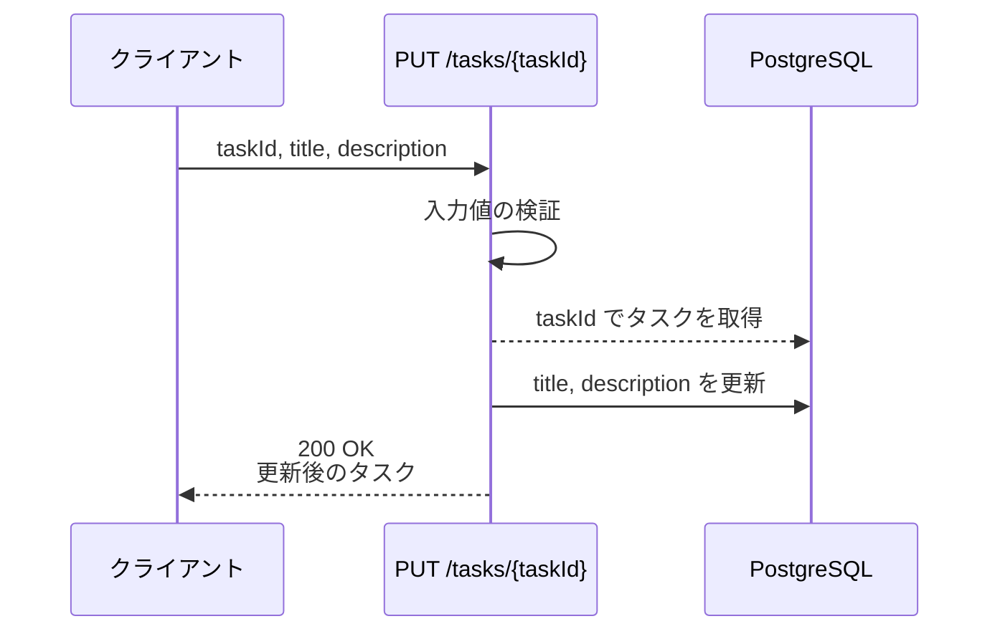
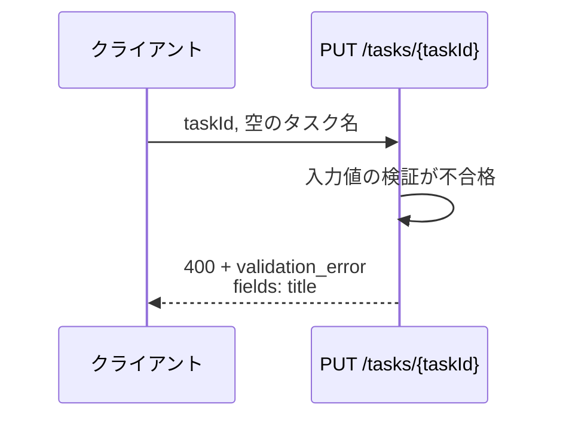
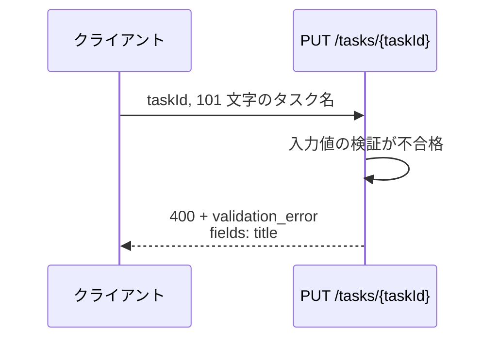
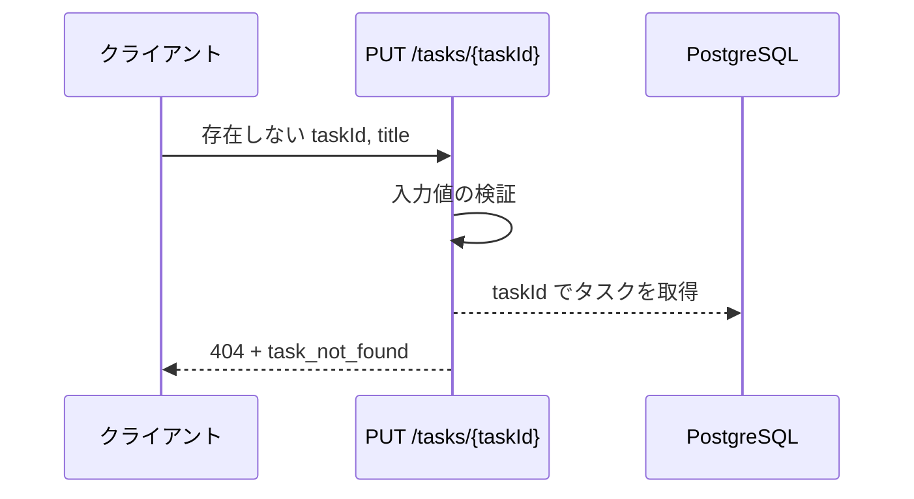
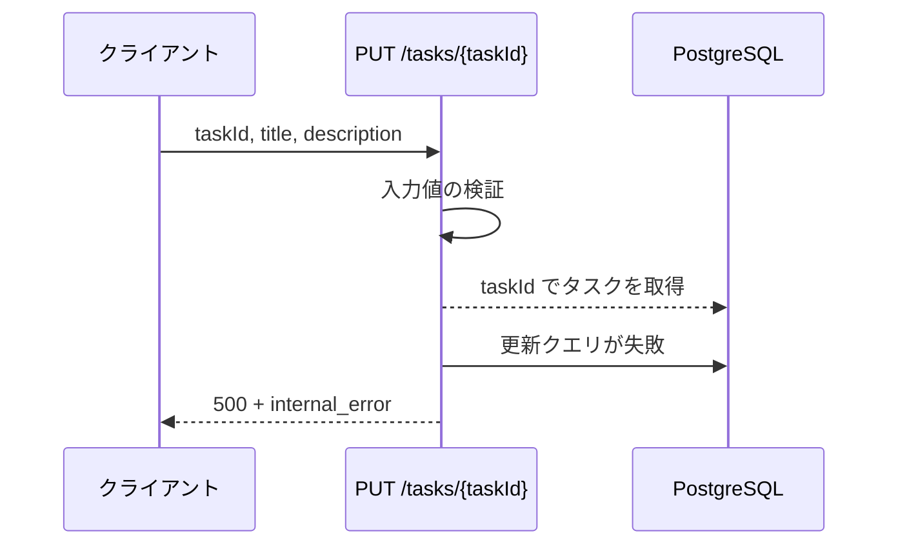

# タスク更新

エンドポイント: PUT /tasks/{taskId}

タスクのタイトルと本文を更新する。
更新前に入力値を検証し、失敗時はフィールド単位のエラー内容を返す。

- 対応テストファイル: -

## インターフェース

### リクエスト

| パラメータ | 型 | 必須 | デフォルト | 説明 | 制限 | 補足 |
| --- | --- | --- | --- | --- | --- | --- |
| `taskId` | string | ✅ | - | 更新対象のタスク ID | - | パスパラメータ・UUID |
| `title` | string | ✅ | - | タスク名 | 1 文字以上 100 文字以内 | 前後の空白を除去してから検証 |
| `description` | string | - | `""`（本文なしで更新） | タスク本文 | 2000 文字以内 | - |

リクエスト例:

```json
{
  "title": "決算資料の作成",
  "description": "四半期分の売上を集計してレビューに回す"
}
```

### レスポンス

成功時:

| フィールド | 型 | 説明 | 制限 | 補足 |
| --- | --- | --- | --- | --- |
| `task` | object | 更新後のタスク | - | - |
| `task.id` | string | タスク ID | - | UUID |
| `task.title` | string | 更新後のタスク名 | - | - |
| `task.description` | string | 更新後の本文 | - | 本文なしの場合は空文字 |
| `task.updatedAt` | string | 更新日時 | - | ISO 8601・UTC |

レスポンス例:

```json
{
  "task": {
    "id": "3f2b1c88-9a1c-4e02-b24d-7f5612ab34cd",
    "title": "決算資料の作成",
    "description": "四半期分の売上を集計してレビューに回す",
    "updatedAt": "2026-07-27T04:12:33+00:00"
  }
}
```

検証失敗時:

| フィールド | 型 | 説明 | 制限 | 補足 |
| --- | --- | --- | --- | --- |
| `error` | object | エラー内容 | - | - |
| `error.code` | `"validation_error"` | エラー種別 | - | - |
| `error.fields` | object[] | フィールド単位のエラー | - | 検証に失敗したフィールドのみ並ぶ |
| `error.fields[].field` | string | 対象フィールド名 | - | リクエストのパラメータ名と一致 |
| `error.fields[].message` | string | 表示用メッセージ | - | フロントがインライン表示にそのまま使う |

レスポンス例:

```json
{
  "error": {
    "code": "validation_error",
    "fields": [
      { "field": "title", "message": "タスク名を入力してください" }
    ]
  }
}
```

### ステータスコード

| ステータスコード | 発生条件 | 補足 |
| --- | --- | --- |
| `200` | 更新成功 | - |
| `400` | リクエストのバリデーション失敗 | `error.fields` に失敗フィールドを列挙 |
| `404` | 対象タスクが存在しない | - |
| `500` | DB 更新失敗 | - |

## 制約

| 項目 | 制約 | 補足 |
| --- | --- | --- |
| タイムアウト | 1 秒以内に応答する | 非機能要件。超過は DB 更新失敗として扱う |
| 認可 | 制限なし | 本 subsystem では認証を扱わない |
| レート制限 | 制限なし | - |
| 更新対象フィールド | `title` と `description` のみ | 状態・期限等の他フィールドは本操作では変更しない |

## フロー一覧

| 分類 | フロー名 | 概要 | 補足 |
| --- | --- | --- | --- |
| 正常 | 正常系 | 検証を通過して tasks を更新し、更新後のタスクを返す | - |
| 異常 | 異常系（タスク名が空・400） | 空のタスク名で検証失敗 → フィールド単位のエラーを返す | 単一 UC シナリオの異常シナリオに対応 |
| 異常 | 異常系（タスク名が上限超過・400） | 101 文字のタスク名で検証失敗 | - |
| 異常 | 異常系（対象タスクが存在しない・404） | taskId に該当するタスクが無い | - |
| 異常 | 異常系（DB 更新失敗・500） | 更新クエリが失敗 | - |

## 正常系

### セットアップ

| セットアップ | 説明 | 補足 |
| --- | --- | --- |
| Mock | `PostgreSQL` を DB stub に差し替え | - |
| タスク | 更新対象のタスクを 1 件登録済み | `taskId` で取得できる状態 |

### フロー



### 期待値

- `200 OK` + 更新後のタスクが返る
- tasks テーブルの該当行の `title` と `description` が送信値になっている
- `updatedAt` が更新前より後の時刻になっている

## 異常系（タスク名が空・400）

### セットアップ

| セットアップ | 説明 | 補足 |
| --- | --- | --- |
| Mock | `PostgreSQL` を DB stub に差し替え | - |
| タスク | 更新対象のタスクを 1 件登録済み | - |
| 入力 | `title` を空文字にして送信 | 検証失敗を決定的に誘発 |

### フロー



### 期待値

- `400` + `validation_error` が返る
- `error.fields` に `field: "title"` の 1 件が含まれる
- tasks テーブルの該当行は更新されていない

## 異常系（タスク名が上限超過・400）

### セットアップ

| セットアップ | 説明 | 補足 |
| --- | --- | --- |
| Mock | `PostgreSQL` を DB stub に差し替え | - |
| タスク | 更新対象のタスクを 1 件登録済み | - |
| 入力 | 101 文字の `title` で送信 | 上限超過を決定的に誘発 |

### フロー



### 期待値

- `400` + `validation_error` が返る
- `error.fields` に `field: "title"` の 1 件が含まれる
- tasks テーブルの該当行は更新されていない

## 異常系（対象タスクが存在しない・404）

### セットアップ

| セットアップ | 説明 | 補足 |
| --- | --- | --- |
| Mock | `PostgreSQL` を DB stub に差し替え | - |
| タスク | 登録済みタスクなし | 取得失敗を決定的に誘発 |

### フロー



### 期待値

- `404` + `task_not_found` が返る
- tasks テーブルに更新は発生していない

## 異常系（DB 更新失敗・500）

### セットアップ

| セットアップ | 説明 | 補足 |
| --- | --- | --- |
| Mock | `PostgreSQL` の更新クエリが失敗する DB stub に差し替え | 書き込み失敗を決定的に誘発 |
| タスク | 更新対象のタスクを 1 件登録済み | - |

### フロー



### 期待値

- `500` + `internal_error` が返る
- tasks テーブルの該当行は更新前の内容のまま
