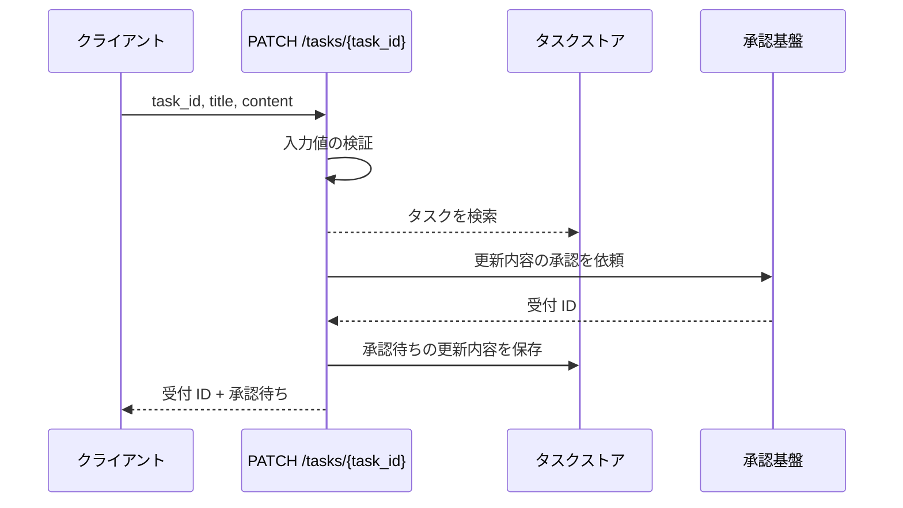
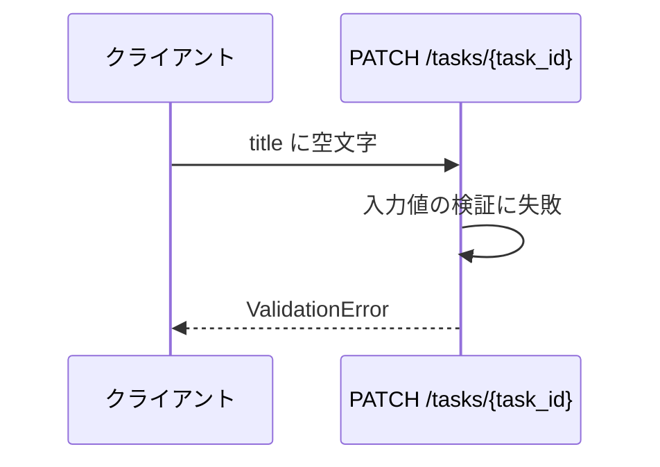
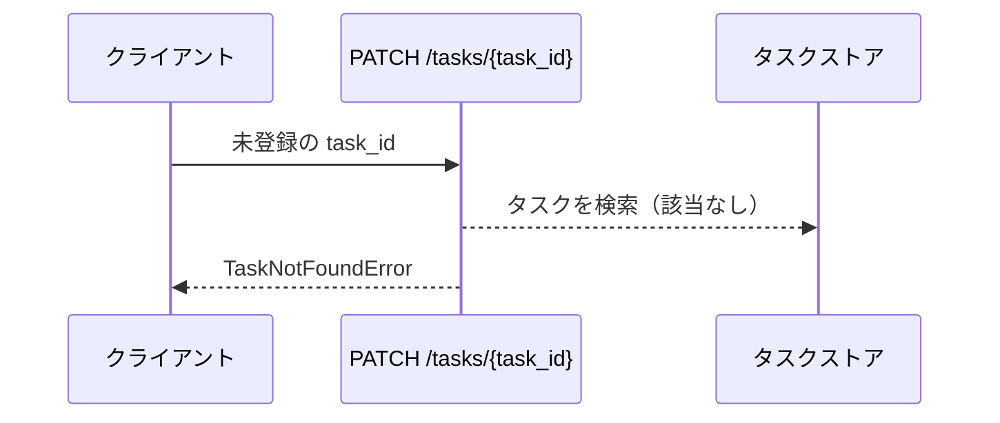
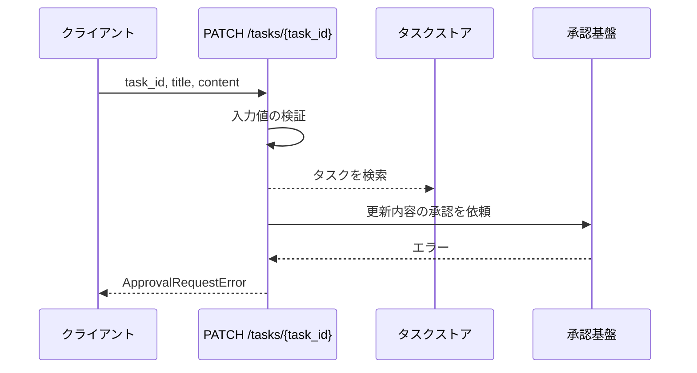

# タスク更新

エンドポイント: PATCH /tasks/{task_id}

登録済みタスクのタイトルと本文の更新を、外部承認基盤へ受け付ける。
更新の確定は承認基盤の承認完了時であり、本操作は受付が成立したことまでを返す。
受付済みで承認が完了していない更新内容は承認待ちとして保持し、元のタスクは書き換えない。

## インターフェース

### リクエスト

| パラメータ | 型 | 必須 | デフォルト | 説明 | 制限 | 補足 |
| --- | --- | --- | --- | --- | --- | --- |
| `task_id` | str | ✅ | - | 更新対象のタスク ID | - | パスパラメータ |
| `title` | str | ✅ | - | タスク名 | 1 文字以上 100 文字以内 | - |
| `content` | str | - | `""` | 本文 | 1000 文字以内 | - |

### レスポンス

| フィールド | 型 | 説明 | 制限 | 補足 |
| --- | --- | --- | --- | --- |
| `task_id` | str | 受付対象のタスク ID | - | - |
| `acceptance_id` | str | 承認基盤が採番した受付 ID | - | 承認の追跡に使う |
| `status` | `"pending_approval"` | 受付後の状態 | - | 受付が成立した時点では常に承認待ち |

補足:

- 更新後のタスクは返さない（更新の確定は承認完了時のため）
- 同一タスクへ続けて受け付けた場合、承認待ちの内容は最後の受付内容で上書きする

## 制約

| 項目 | 制約 | 補足 |
| --- | --- | --- |
| タイムアウト | 承認基盤への受付は 5 秒 | 超過時は 異常系（承認基盤への受付失敗） |
| 認可 | なし | sandbox 用の最小実装 |
| 承認完了の待ち合わせ | 行わない | 承認完了後の反映確認は本ユースケースのスコープ外 |

## フロー一覧

| 分類 | フロー名 | 概要 | 補足 |
| --- | --- | --- | --- |
| 正常 | 正常系 | 更新内容を承認基盤へ受け付け、受付結果を返す | - |
| 異常 | 異常系（タイトルが空） | タイトルの検証失敗 | - |
| 異常 | 異常系（タスク不明） | 未登録の ID を指定 | - |
| 異常 | 異常系（承認基盤への受付失敗） | 承認基盤がエラーを返す | - |

## 正常系

### セットアップ

| セットアップ | 説明 | 補足 |
| --- | --- | --- |
| Mock | 承認基盤を stub に差し替え（受付 ID を返す） | 承認完了の通知は送らない |
| タスク | `t1` のタスクを登録済み | - |

### フロー

### 期待値

- 受付 ID と承認待ちの状態を持つ受付結果が返る
- 承認基盤に更新後のタイトルと本文が渡っている
- 該当タスクが承認待ちとして保持されている
- ストアの該当タスクのタイトルと本文は受付前のままになっている

## 異常系（タイトルが空）

### セットアップ

| セットアップ | 説明 | 補足 |
| --- | --- | --- |
| Mock | 承認基盤を stub に差し替え（呼ばれないことを確認する） | - |
| 入力 | `title` に空文字を指定 | 検証失敗を決定的に誘発 |

### フロー

### 期待値

- `ValidationError` が送出される
- 承認基盤が呼ばれていない
- ストアが変更されておらず、承認待ちも登録されていない

## 異常系（タスク不明）

### セットアップ

| セットアップ | 説明 | 補足 |
| --- | --- | --- |
| Mock | 承認基盤を stub に差し替え（呼ばれないことを確認する） | - |
| 入力 | 未登録の `task_id` を指定 | 検索失敗を決定的に誘発 |

### フロー

### 期待値

- `TaskNotFoundError` が送出される
- 承認基盤が呼ばれていない
- ストアが変更されておらず、承認待ちも登録されていない

## 異常系（承認基盤への受付失敗）

### セットアップ

| セットアップ | 説明 | 補足 |
| --- | --- | --- |
| Mock | 承認基盤を stub に差し替え、受付要求に対してエラーを返す | 受付失敗を決定的に誘発 |
| タスク | `t1` のタスクを登録済み | - |

### フロー

### 期待値

- `ApprovalRequestError` が送出される
- ストアが変更されておらず、承認待ちも登録されていない
