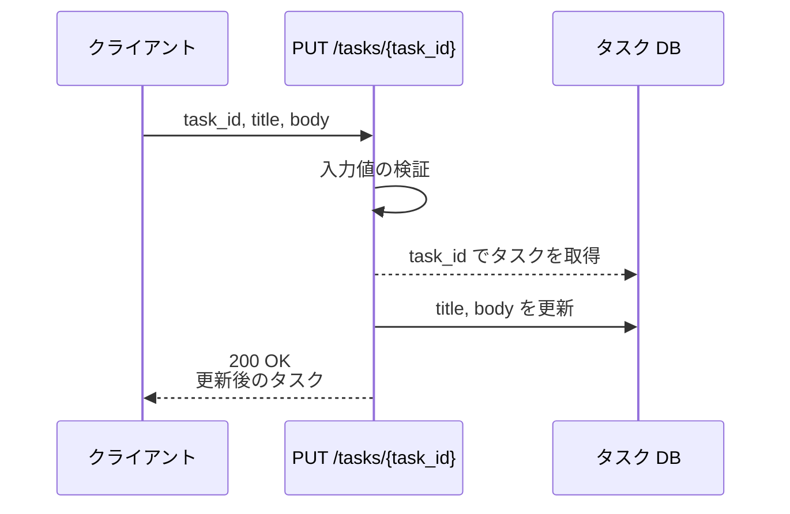
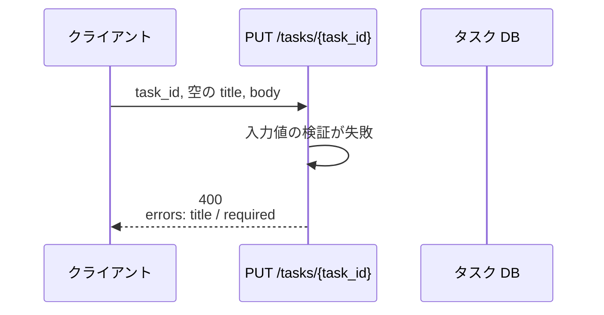
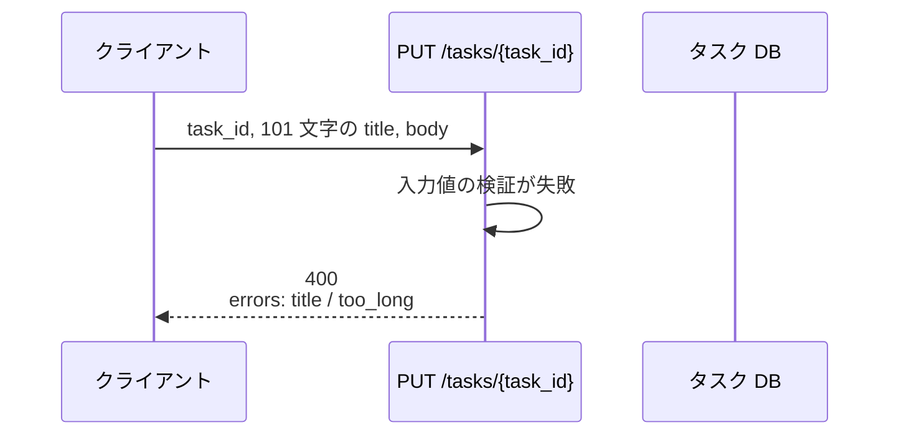
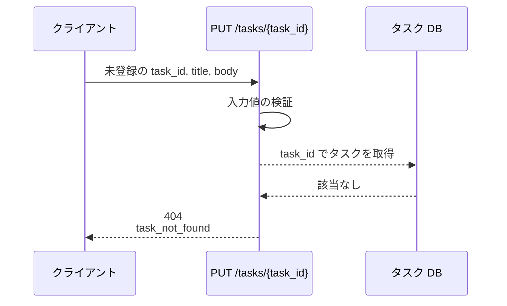
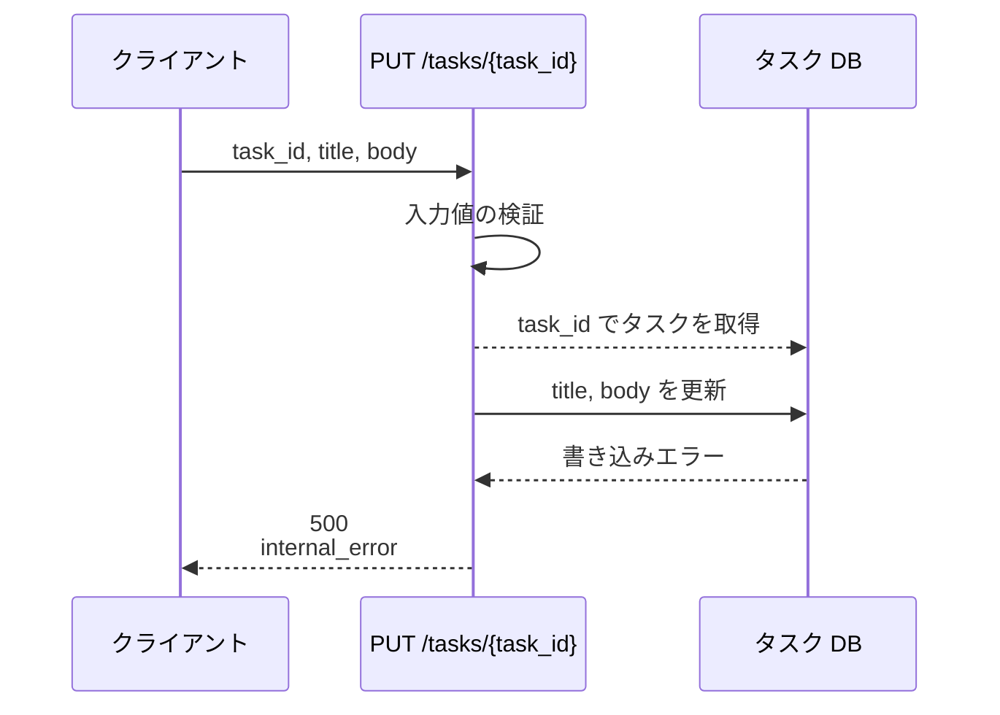

# タスク更新

エンドポイント: PUT /tasks/{task_id}

タスクのタイトル・本文を検証したうえで更新し、更新後のタスクを返す。
検証に失敗した場合はフィールド単位のエラーを返し、タスクは更新しない。

- 対応テストファイル: 未記入（tester のテスト作成後に記入）

## インターフェース

### リクエスト

| パラメータ | 型 | 必須 | デフォルト | 説明 | 制限 | 補足 |
| --- | --- | --- | --- | --- | --- | --- |
| `task_id` | `str` | ✅ | - | 更新対象のタスク ID | - | パスパラメータ |
| `title` | `str` | ✅ | - | タスク名 | 1〜100 文字 | 空文字・空白のみは不可 |
| `body` | `str` | ✅ | - | タスク本文 | 10000 文字以内 | 空文字は許容（本文なしを表す） |

リクエスト例:

```json
{
  "title": "決算資料の作成",
  "body": "四半期分の売上をまとめる"
}
```

### レスポンス

| フィールド | 型 | 説明 | 制限 | 補足 |
| --- | --- | --- | --- | --- |
| `task` | `object` | 更新後のタスク | - | - |
| `task.id` | `str` | タスク ID | - | リクエストの `task_id` と一致 |
| `task.title` | `str` | 更新後のタスク名 | - | - |
| `task.body` | `str` | 更新後のタスク本文 | - | - |
| `task.updated_at` | `str` | 更新日時（ISO 8601・UTC） | - | 表示用の JST 変換はフロントエンドの担当 |

レスポンス例:

```json
{
  "task": {
    "id": "3f2b1c88-9d4a-4e77-b0c1-5a2e8f1d6b30",
    "title": "決算資料の作成",
    "body": "四半期分の売上をまとめる",
    "updated_at": "2026-07-26T05:18:02+00:00"
  }
}
```

検証エラー時（`400`）のボディ:

| フィールド | 型 | 説明 | 制限 | 補足 |
| --- | --- | --- | --- | --- |
| `message` | `str` | エラー全体の要約 | - | - |
| `errors` | `object[]` | フィールド単位のエラー | - | 検証に失敗したフィールドの数だけ並ぶ |
| `errors[].field` | `str` | 対象フィールド名 | - | リクエストのパラメータ名と一致 |
| `errors[].code` | `"required"` \| `"too_long"` | エラー種別 | - | フロントエンドの表示分岐に使う |
| `errors[].message` | `str` | 表示用メッセージ | - | 日本語 |

検証エラー時のボディ例:

```json
{
  "message": "入力値が不正です",
  "errors": [
    { "field": "title", "code": "required", "message": "タスク名を入力してください" }
  ]
}
```

### ステータスコード

| ステータスコード | 発生条件 | 補足 |
| --- | --- | --- |
| `200` | 更新成功 | - |
| `400` | リクエストのバリデーション失敗 | - |
| `404` | 対象タスクが存在しない | - |
| `500` | DB 更新失敗 | - |

## 制約

| 項目 | 制約 | 補足 |
| --- | --- | --- |
| タイムアウト | 1 秒以内に応答する | 非機能要件。超過時は `500` |
| 認可 | 制限なし | 本 subsystem に認証の要件がないため |
| レート制限 | 制限なし | - |
| 同時更新の排他 | 制限なし（後勝ち） | 楽観ロック用のカラムを持たないため |

## フロー一覧

| 分類 | フロー名 | 概要 | 補足 |
| --- | --- | --- | --- |
| 正常 | 正常系 | 入力値を検証してタイトル・本文を更新 | - |
| 異常 | 異常系（タスク名が空・400） | 検証失敗 → フィールド単位のエラーを返却 | 単一 UC シナリオの異常シナリオに対応 |
| 異常 | 異常系（タスク名が 100 文字超過・400） | 検証失敗 → フィールド単位のエラーを返却 | - |
| 異常 | 異常系（対象タスクが存在しない・404） | 取得できず更新せずに終了 | - |
| 異常 | 異常系（DB 更新失敗・500） | 更新の書き込みが失敗 | 監視対象 |

## 正常系

### セットアップ

| セットアップ | 説明 | 補足 |
| --- | --- | --- |
| Mock | `タスク DB` を DB stub に差し替え | - |
| タスク | 更新対象のタスクを 1 件登録済み | タイトル・本文とも更新前の値が入っている |

### フロー



### 期待値

- `200 OK` + 更新後の `task` が返る
- tasks テーブルの対象行の `title` / `body` がリクエスト値になっている
- 対象行の `updated_at` が更新前より新しくなっている

## 異常系（タスク名が空・400）

### セットアップ

| セットアップ | 説明 | 補足 |
| --- | --- | --- |
| Mock | `タスク DB` を DB stub に差し替え | - |
| タスク | 更新対象のタスクを 1 件登録済み | - |
| 入力 | `title` を空文字にして送信 | 検証失敗を決定的に誘発 |

### フロー



### 期待値

- `400` + `errors` に `field: title` / `code: required` の 1 件が返る
- tasks テーブルの対象行は更新前のままになっている

## 異常系（タスク名が 100 文字超過・400）

### セットアップ

| セットアップ | 説明 | 補足 |
| --- | --- | --- |
| Mock | `タスク DB` を DB stub に差し替え | - |
| タスク | 更新対象のタスクを 1 件登録済み | - |
| 入力 | 101 文字の `title` で送信 | 検証失敗を決定的に誘発 |

### フロー



### 期待値

- `400` + `errors` に `field: title` / `code: too_long` の 1 件が返る
- tasks テーブルの対象行は更新前のままになっている

## 異常系（対象タスクが存在しない・404）

### セットアップ

| セットアップ | 説明 | 補足 |
| --- | --- | --- |
| Mock | `タスク DB` を DB stub に差し替え | - |
| 入力 | 未登録の `task_id` で送信 | 取得失敗を決定的に誘発 |

### フロー



### 期待値

- `404` + `task_not_found` が返る
- tasks テーブルにレコードは作成されていない

## 異常系（DB 更新失敗・500）

### セットアップ

| セットアップ | 説明 | 補足 |
| --- | --- | --- |
| Mock | `タスク DB` を DB stub に差し替え、更新でエラーを返す | 書き込み失敗を決定的に誘発 |
| タスク | 更新対象のタスクを 1 件登録済み | - |

### フロー



### 期待値

- `500` + `internal_error` が返る
- tasks テーブルの対象行は更新前のままになっている
