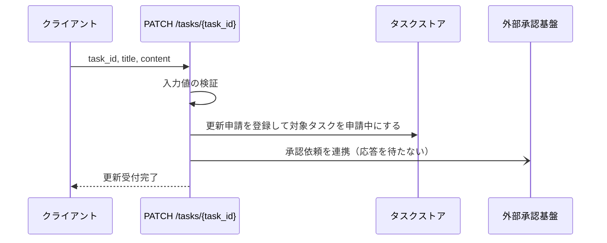
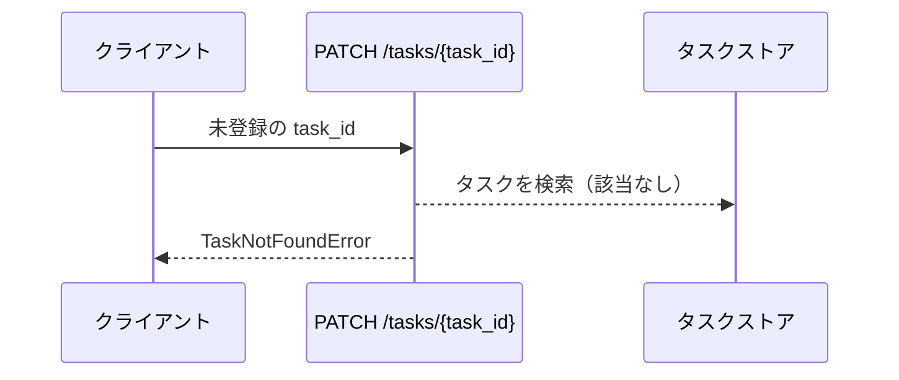
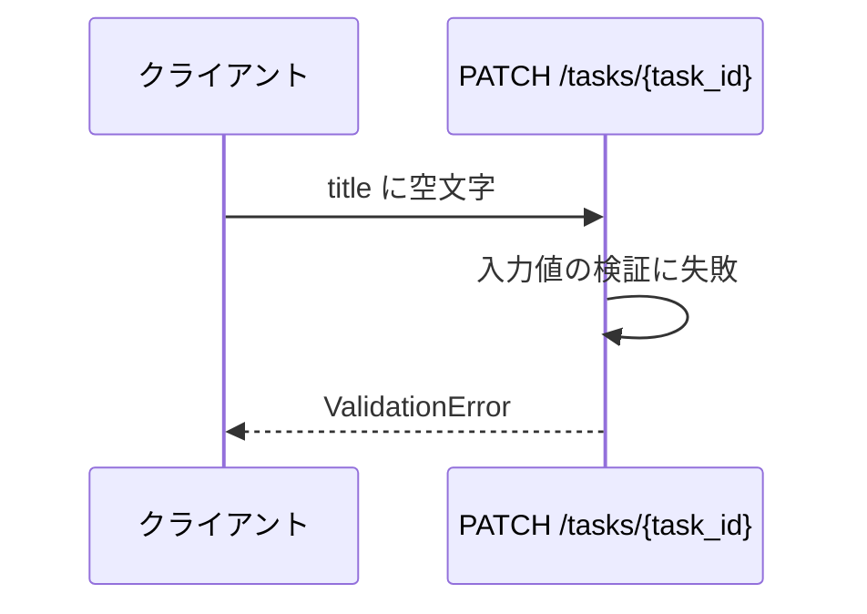

# タスク更新

エンドポイント: PATCH /tasks/{task_id}

登録済みタスクのタイトルと本文の更新を申請として受け付ける。
更新の確定は外部承認基盤との非同期連携で行うため、本エンドポイントは受付完了までを同期で返す。

## インターフェース

### リクエスト

| パラメータ | 型 | 必須 | デフォルト | 説明 | 制限 | 補足 |
| --- | --- | --- | --- | --- | --- | --- |
| `task_id` | str | ✅ | - | 更新対象のタスク ID | - | パスパラメータ |
| `title` | str | ✅ | - | タスク名 | 1 文字以上 100 文字以内 | - |
| `content` | str | - | `""` | 本文 | 1000 文字以内 | - |

### レスポンス

| フィールド | 型 | 説明 | 制限 | 補足 |
| --- | --- | --- | --- | --- |
| `id` | str | タスク ID | - | - |
| `status` | str | 受付後のタスク状態 | `pending_approval` 固定 | 一覧が対象タスクを申請中として識別するための状態 |

承認前の編集内容（`title` / `content`）は確定値ではないため応答に含めない。

## 制約

| 項目 | 制約 | 補足 |
| --- | --- | --- |
| タイムアウト | 制限なし | - |
| 認可 | なし | sandbox 用の最小実装 |
| 承認基盤の応答待ち | 行わない | 承認基盤の応答は数秒〜数分の非同期のため、受付処理内で待ち合わせない |
| 承認結果の反映 | 対象外 | 承認完了後の一覧への反映は epic のスコープ外 |

## フロー一覧

| 分類 | フロー名 | 概要 | 補足 |
| --- | --- | --- | --- |
| 正常 | 正常系 | 更新申請を受け付けて対象タスクを申請中にする | - |
| 異常 | 異常系（タスク不明） | 未登録の ID を指定 | - |
| 異常 | 異常系（タイトルが空） | タイトルの検証失敗 | - |

## 正常系

### セットアップ

| セットアップ | 説明 | 補足 |
| --- | --- | --- |
| Mock | 外部承認基盤への連携（呼び出しを記録するだけの関数を注入） | 実接続すると応答が非同期で決定的にならないため |
| タスク | `t1` のタスクを登録済み | - |

### フロー

### 期待値

- タスク ID と `pending_approval` の状態が返る
- ストアの該当タスクが申請中になっている
- ストアの該当タスクのタイトルと本文は更新前のままである
- 申請した内容が承認依頼として外部承認基盤へ連携されている

## 異常系（タスク不明）

### セットアップ

| セットアップ | 説明 | 補足 |
| --- | --- | --- |
| Mock | 外部承認基盤への連携（呼び出しを記録するだけの関数を注入） | 実接続すると応答が非同期で決定的にならないため |
| 入力 | 未登録の `task_id` を指定 | 検索失敗を決定的に誘発 |

### フロー

### 期待値

- `TaskNotFoundError` が送出される
- ストアが変更されていない
- 承認依頼が外部承認基盤へ連携されていない

## 異常系（タイトルが空）

### セットアップ

| セットアップ | 説明 | 補足 |
| --- | --- | --- |
| Mock | 外部承認基盤への連携（呼び出しを記録するだけの関数を注入） | 実接続すると応答が非同期で決定的にならないため |
| 入力 | `title` に空文字を指定 | 検証失敗を決定的に誘発 |

### フロー

### 期待値

- `ValidationError` が送出される
- ストアが変更されていない
- 承認依頼が外部承認基盤へ連携されていない
