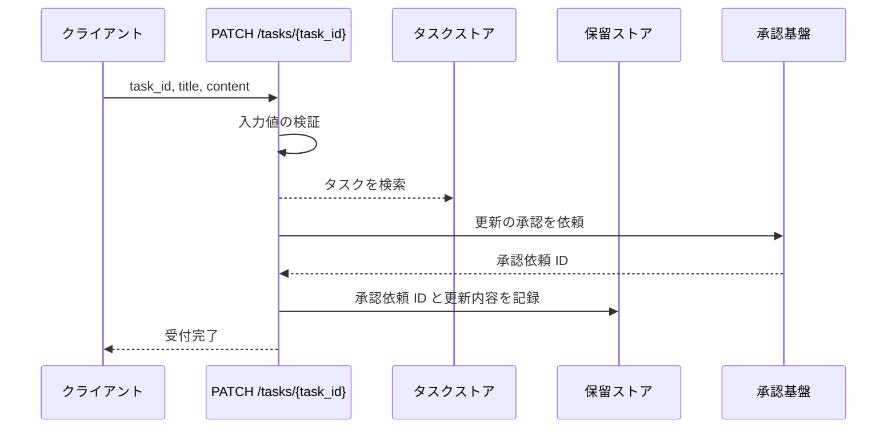
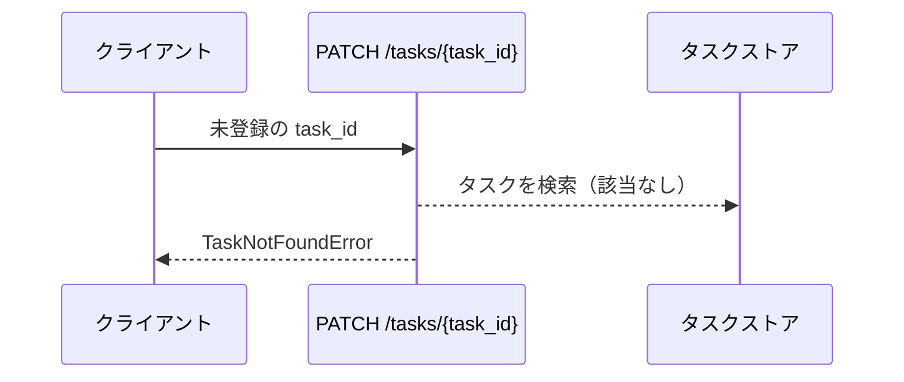
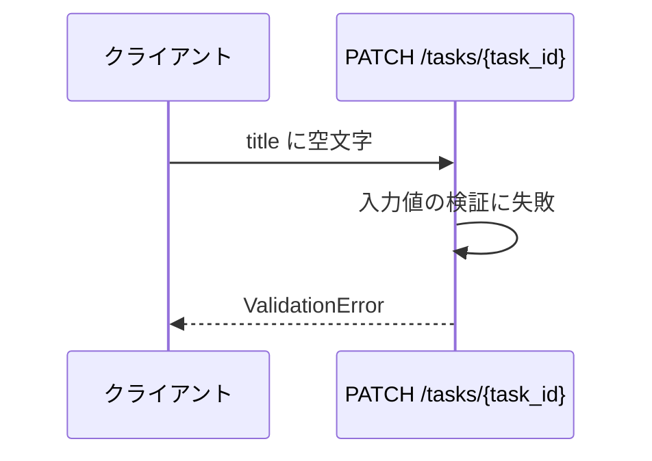
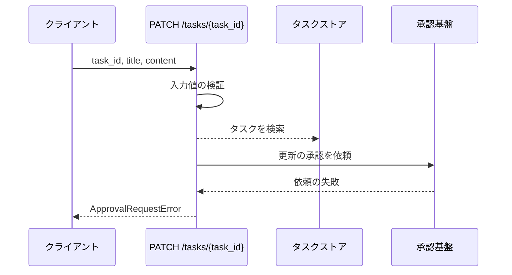

# タスク更新

エンドポイント: PATCH /tasks/{task_id}

登録済みタスクのタイトルと本文の更新を受け付ける。
更新の確定は外部の承認基盤への非同期の連携を経由するため、本操作ではタスクストアを更新せず、承認を依頼して受付完了を返した時点で完了する。
依頼した更新内容は承認依頼 ID に紐づけて保留ストアへ記録し、確定を受けてタスクストアへ反映する操作は別の操作として定義する。

## インターフェース

### リクエスト

| パラメータ | 型 | 必須 | デフォルト | 説明 | 制限 | 補足 |
| --- | --- | --- | --- | --- | --- | --- |
| `task_id` | str | ✅ | - | 更新対象のタスク ID | - | パスパラメータ |
| `title` | str | ✅ | - | タスク名 | 1 文字以上 100 文字以内 | - |
| `content` | str | - | `""` | 本文 | 1000 文字以内 | - |

### レスポンス

| フィールド | 型 | 説明 | 制限 | 補足 |
| --- | --- | --- | --- | --- |
| `task_id` | str | 受け付けた更新対象のタスク ID | - | - |
| `request_id` | str | 承認基盤が採番した承認依頼 ID | - | 確定の反映時に保留中の更新内容と突き合わせる |

## 制約

| 項目 | 制約 | 補足 |
| --- | --- | --- |
| タイムアウト | 制限なし | 承認基盤へ依頼するのみで確定は待たない |
| 認可 | なし | sandbox 用の最小実装 |
| 承認の確定 | 本操作では待たない | 受付完了の直後はタスクストアが編集前の内容のまま |

## フロー一覧

| 分類 | フロー名 | 概要 | 補足 |
| --- | --- | --- | --- |
| 正常 | 正常系 | 更新の承認を承認基盤へ依頼して受付完了を返す | - |
| 異常 | 異常系（タスク不明） | 未登録の ID を指定 | - |
| 異常 | 異常系（タイトルが空） | タイトルの検証失敗 | - |
| 異常 | 異常系（承認依頼の失敗） | 承認基盤が依頼を受け付けない | - |

## 正常系

### セットアップ

| セットアップ | 説明 | 補足 |
| --- | --- | --- |
| Mock | 承認基盤を stub に差し替えて承認依頼 ID を返す | インメモリのストアは実物のまま使う |
| タスク | `t1` のタスクを登録済み | - |

### フロー

### 期待値

- 受付完了として `task_id` と `request_id` が返る
- タスクストアの該当タスクは編集前のタイトルと本文のままである
- 保留ストアに `request_id` をキーとして更新後のタイトルと本文が記録されている

## 異常系（タスク不明）

### セットアップ

| セットアップ | 説明 | 補足 |
| --- | --- | --- |
| Mock | 承認基盤を stub に差し替え | インメモリのストアは実物のまま使う |
| 入力 | 未登録の `task_id` を指定 | 検索失敗を決定的に誘発 |

### フロー

### 期待値

- `TaskNotFoundError` が送出される
- ストアが変更されていない
- 承認基盤へ依頼していない

## 異常系（タイトルが空）

### セットアップ

| セットアップ | 説明 | 補足 |
| --- | --- | --- |
| Mock | 承認基盤を stub に差し替え | インメモリのストアは実物のまま使う |
| 入力 | `title` に空文字を指定 | 検証失敗を決定的に誘発 |

### フロー

### 期待値

- `ValidationError` が送出される
- ストアが変更されていない
- 承認基盤へ依頼していない

## 異常系（承認依頼の失敗）

### セットアップ

| セットアップ | 説明 | 補足 |
| --- | --- | --- |
| Mock | 承認基盤を stub に差し替えて依頼の失敗を返す | インメモリのストアは実物のまま使う |
| タスク | `t1` のタスクを登録済み | - |

### フロー

### 期待値

- `ApprovalRequestError` が送出される
- タスクストアが変更されていない
- 保留ストアに記録されていない
