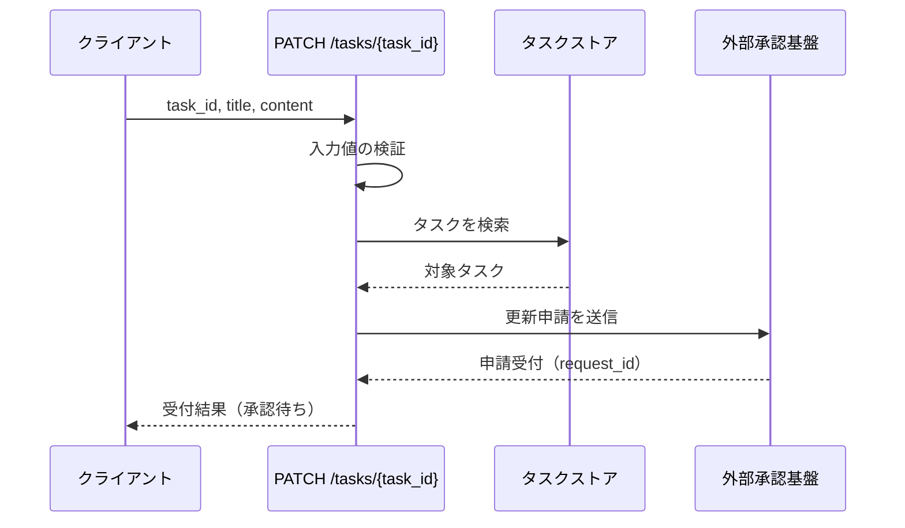
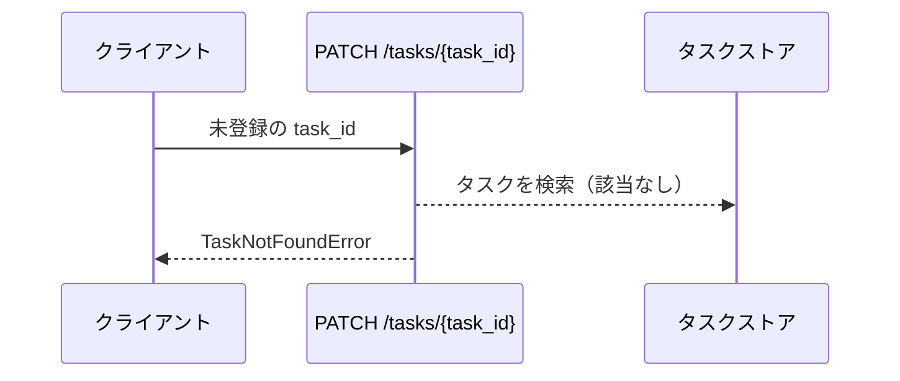
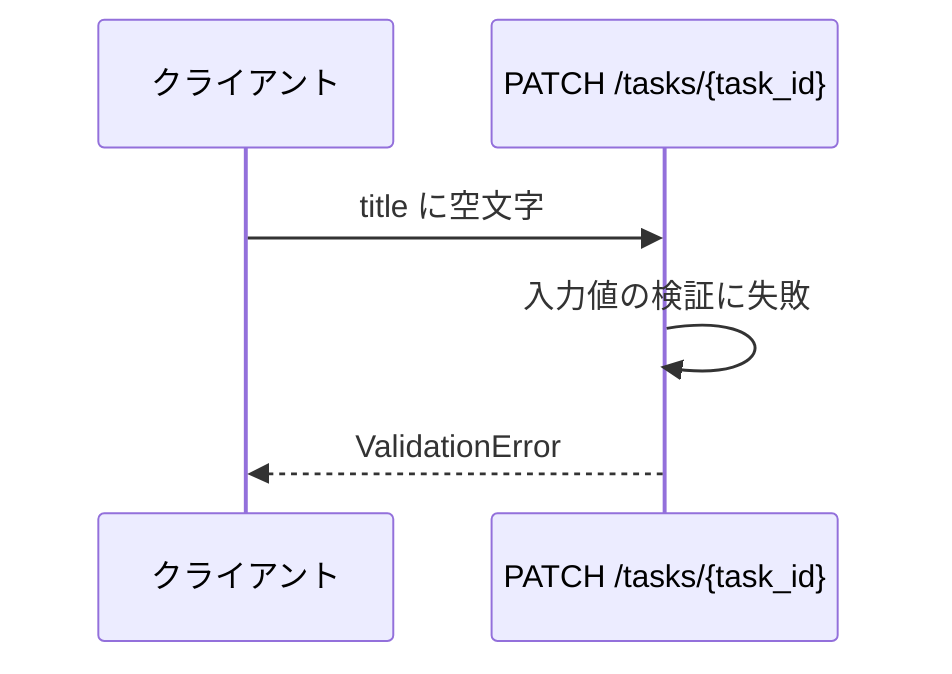
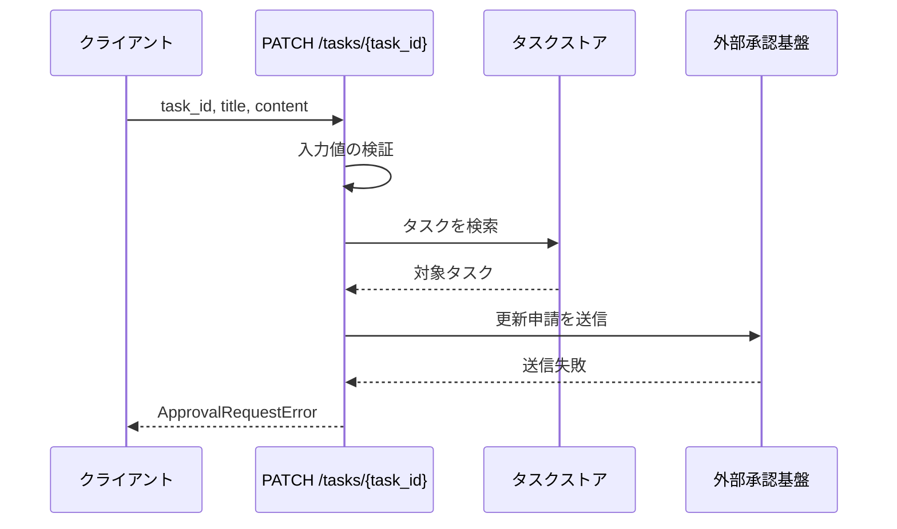

# タスク更新

エンドポイント: PATCH /tasks/{task_id}

登録済みタスクの更新を外部承認基盤へ申請し、受付結果を返す。
更新の確定は承認基盤の非同期応答に依存するため、本エンドポイントは申請の受付までを応答範囲とする。

## インターフェース

### リクエスト

| パラメータ | 型 | 必須 | デフォルト | 説明 | 制限 | 補足 |
| --- | --- | --- | --- | --- | --- | --- |
| `task_id` | str | ✅ | - | 更新対象のタスク ID | - | パスパラメータ |
| `title` | str | ✅ | - | タスク名 | 1 文字以上 100 文字以内 | - |
| `content` | str | - | `""` | 本文 | 1000 文字以内 | - |

### レスポンス

| フィールド | 型 | 説明 | 制限 | 補足 |
| --- | --- | --- | --- | --- |
| `id` | str | タスク ID | - | - |
| `title` | str | 申請中のタスク名 | - | 承認確定までストアの値には反映されない |
| `content` | str | 申請中の本文 | - | 承認確定までストアの値には反映されない |
| `status` | str | 承認状態 | `pending_approval` 固定 | 一覧の承認待ち表示に使う |
| `request_id` | str | 承認基盤が採番した申請 ID | - | 承認結果との突合に使う |

## 制約

| 項目 | 制約 | 補足 |
| --- | --- | --- |
| タイムアウト | 制限なし | - |
| 認可 | なし | sandbox 用の最小実装 |
| 承認応答 | 待たない | 申請の受付までを同期の応答範囲とする |
| 承認確定後の反映 | 対象外 | 本 UC のスコープ外 |

## フロー一覧

| 分類 | フロー名 | 概要 | 補足 |
| --- | --- | --- | --- |
| 正常 | 正常系 | 更新申請を送信して受付結果（承認待ち）を返す | - |
| 異常 | 異常系（タスク不明） | 未登録の ID を指定 | - |
| 異常 | 異常系（タイトルが空） | タイトルの検証失敗 | - |
| 異常 | 異常系（申請送信失敗） | 承認基盤が申請を受け付けない | - |

## 正常系

### セットアップ

| セットアップ | 説明 | 補足 |
| --- | --- | --- |
| Mock | 外部承認基盤への申請送信（受付成功と `request_id` を返す） | タスクストアはインメモリの実物を使う |
| タスク | `t1` のタスクを登録済み | - |

### フロー

### 期待値

- `status` が `pending_approval` の受付結果が返る
- 申請したタイトルと本文が受付結果に含まれる
- 承認基盤へ申請が 1 回送信されている
- ストアの該当タスクは更新されていない

## 異常系（タスク不明）

### セットアップ

| セットアップ | 説明 | 補足 |
| --- | --- | --- |
| Mock | 外部承認基盤への申請送信（呼ばれないことを検証） | タスクストアはインメモリの実物を使う |
| 入力 | 未登録の `task_id` を指定 | 検索失敗を決定的に誘発 |

### フロー

### 期待値

- `TaskNotFoundError` が送出される
- 承認基盤へ申請が送信されていない
- ストアが変更されていない

## 異常系（タイトルが空）

### セットアップ

| セットアップ | 説明 | 補足 |
| --- | --- | --- |
| Mock | 外部承認基盤への申請送信（呼ばれないことを検証） | タスクストアはインメモリの実物を使う |
| 入力 | `title` に空文字を指定 | 検証失敗を決定的に誘発 |

### フロー

### 期待値

- `ValidationError` が送出される
- 承認基盤へ申請が送信されていない
- ストアが変更されていない

## 異常系（申請送信失敗）

### セットアップ

| セットアップ | 説明 | 補足 |
| --- | --- | --- |
| Mock | 外部承認基盤への申請送信（送信失敗を返す） | タスクストアはインメモリの実物を使う |
| タスク | `t1` のタスクを登録済み | - |
| 入力 | 登録済みの `task_id` と妥当なタイトルを指定 | 送信失敗を決定的に誘発 |

### フロー

### 期待値

- `ApprovalRequestError` が送出される
- ストアが変更されていない
