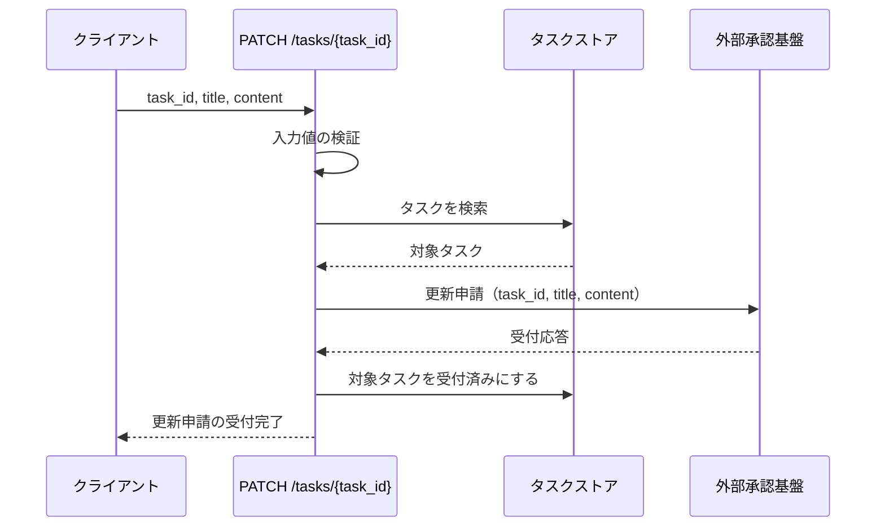
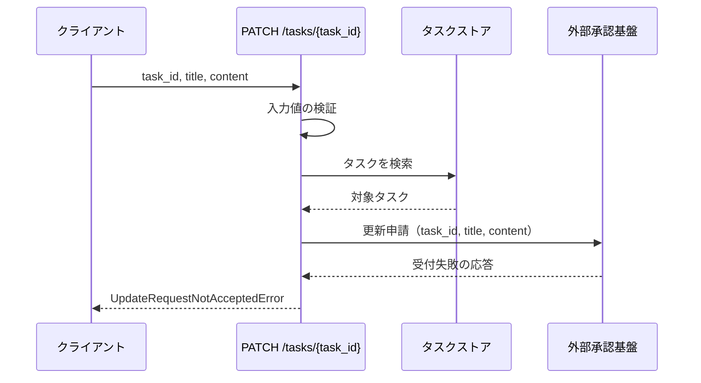
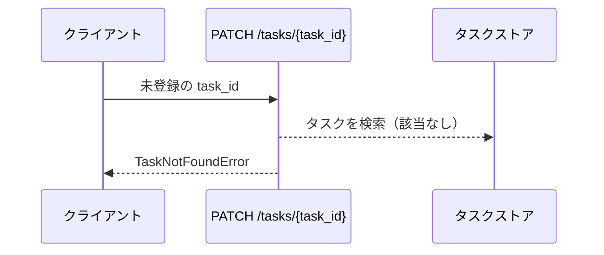
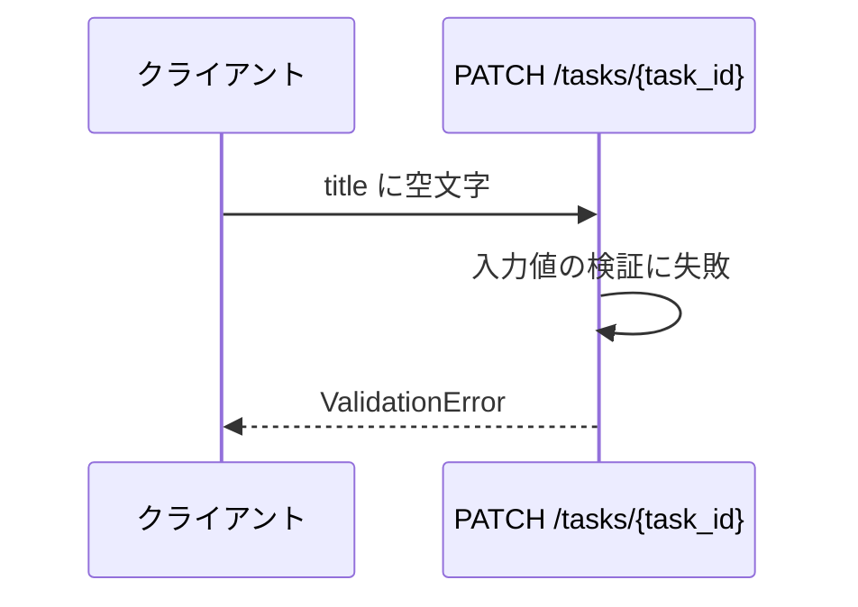

# タスク更新

エンドポイント: PATCH /tasks/{task_id}

登録済みタスクのタイトルと本文の更新を、外部承認基盤へ申請する。
更新の確定は承認基盤から非同期で返るため、本エンドポイントの範囲は承認基盤の受付応答を受け取るところまでとする。
承認結果の反映と承認待ち状態の照会は扱わない。

## インターフェース

### リクエスト

| パラメータ | 型 | 必須 | デフォルト | 説明 | 制限 | 補足 |
| --- | --- | --- | --- | --- | --- | --- |
| `task_id` | str | ✅ | - | 更新対象のタスク ID | - | パスパラメータ |
| `title` | str | ✅ | - | タスク名 | 1 文字以上 100 文字以内 | - |
| `content` | str | - | `""` | 本文 | 1000 文字以内 | - |

### レスポンス

| フィールド | 型 | 説明 | 制限 | 補足 |
| --- | --- | --- | --- | --- |
| `id` | str | タスク ID | - | - |
| `update_status` | str | 更新申請の状態 | `accepted` | 受付完了を表す。受付前のタスクは `none` |

更新後のタイトルと本文は返さない。
承認が完了するまで更新は確定せず、この時点で確定値を返すと承認前の内容を確定済みとして扱うことになるため。

## 制約

| 項目 | 制約 | 補足 |
| --- | --- | --- |
| タイムアウト | 承認基盤への更新申請は 5 秒で打ち切る | 超過時は受付失敗として扱う。値は設定ファイルへ外出しする |
| 認可 | なし | sandbox 用の最小実装 |
| 受付失敗の粒度 | 応答なしと受付拒否を区別しない | 呼び出し元から見た結末が同じため |

## フロー一覧

| 分類 | フロー名 | 概要 | 補足 |
| --- | --- | --- | --- |
| 正常 | 正常系 | 承認基盤へ更新申請を送り、受付応答をもって受付完了を返す | - |
| 異常 | 異常系（更新申請が受け付けられない） | 承認基盤が受付に失敗する | 応答なしと受付拒否を分けない |
| 異常 | 異常系（タスク不明） | 未登録の ID を指定 | 申請は送らない |
| 異常 | 異常系（タイトルが空） | タイトルの検証失敗 | 申請は送らない |

## 正常系

### セットアップ

| セットアップ | 説明 | 補足 |
| --- | --- | --- |
| Mock | 外部承認基盤（受付応答を返す） | ストアはインメモリの実物をそのまま使う |
| タスク | `t1` のタスクを登録済み | - |

### フロー

### 期待値

- `update_status` が `accepted` のレスポンスが返る
- 承認基盤へ申請したタイトルと本文が渡っている
- ストアの該当タスクが受付済みになっている
- ストアの該当タスクのタイトルと本文は申請前のまま変わっていない

## 異常系（更新申請が受け付けられない）

承認基盤が更新申請を受け付けられなかった場合のフロー。
応答が返らない場合と受付を拒否された場合は、呼び出し元から見た結末が同じためケースを分けない。

### セットアップ

| セットアップ | 説明 | 補足 |
| --- | --- | --- |
| Mock | 外部承認基盤（受付失敗の応答を返す） | 正常系の受付応答に対して、本フローでは受付失敗を返す設定にする |
| タスク | `t1` のタスクを登録済み | - |

### フロー

### 期待値

- `UpdateRequestNotAcceptedError` が送出される
- ストアの該当タスクが受付済みになっていない
- ストアが変更されていない

## 異常系（タスク不明）

### セットアップ

| セットアップ | 説明 | 補足 |
| --- | --- | --- |
| Mock | 外部承認基盤（呼ばれないことの確認用） | ストアはインメモリの実物をそのまま使う |
| 入力 | 未登録の `task_id` を指定 | 検索失敗を決定的に誘発 |

### フロー

### 期待値

- `TaskNotFoundError` が送出される
- 承認基盤へ申請が送られていない
- ストアが変更されていない

## 異常系（タイトルが空）

### セットアップ

| セットアップ | 説明 | 補足 |
| --- | --- | --- |
| Mock | 外部承認基盤（呼ばれないことの確認用） | ストアはインメモリの実物をそのまま使う |
| 入力 | `title` に空文字を指定 | 検証失敗を決定的に誘発 |

### フロー

### 期待値

- `ValidationError` が送出される
- 承認基盤へ申請が送られていない
- ストアが変更されていない
