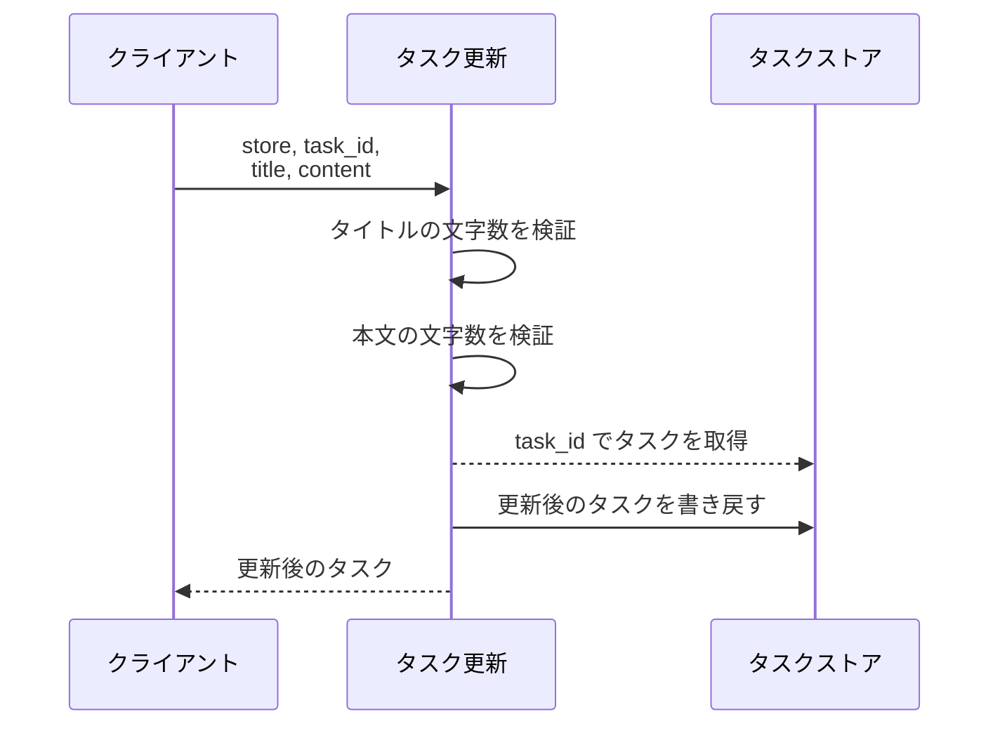
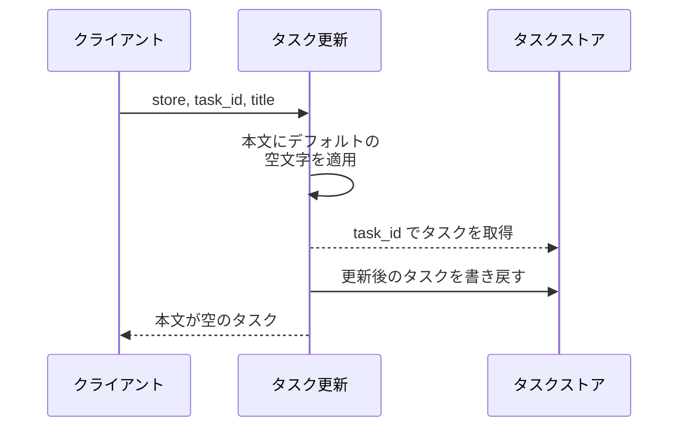
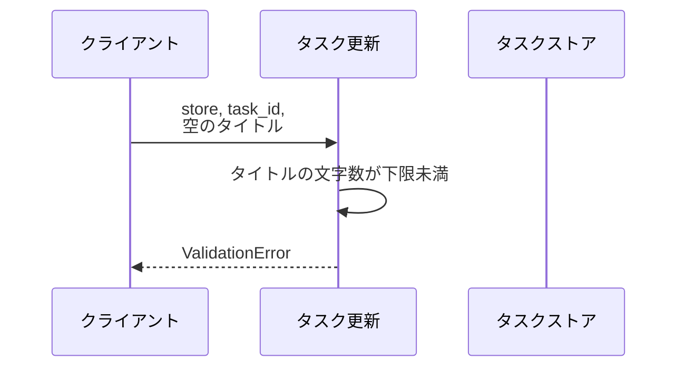
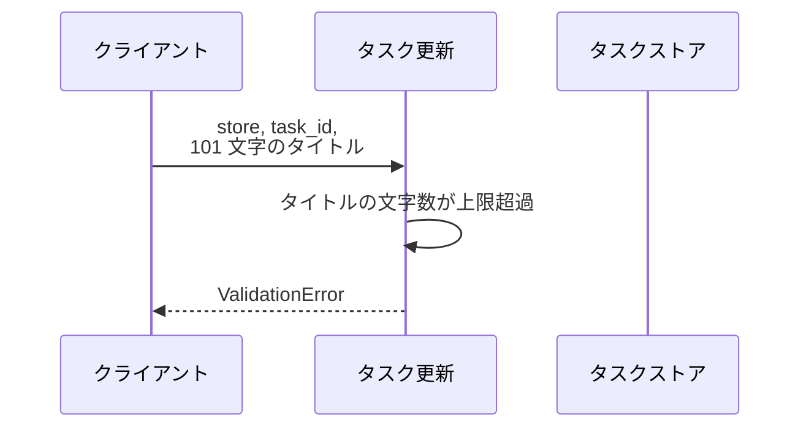
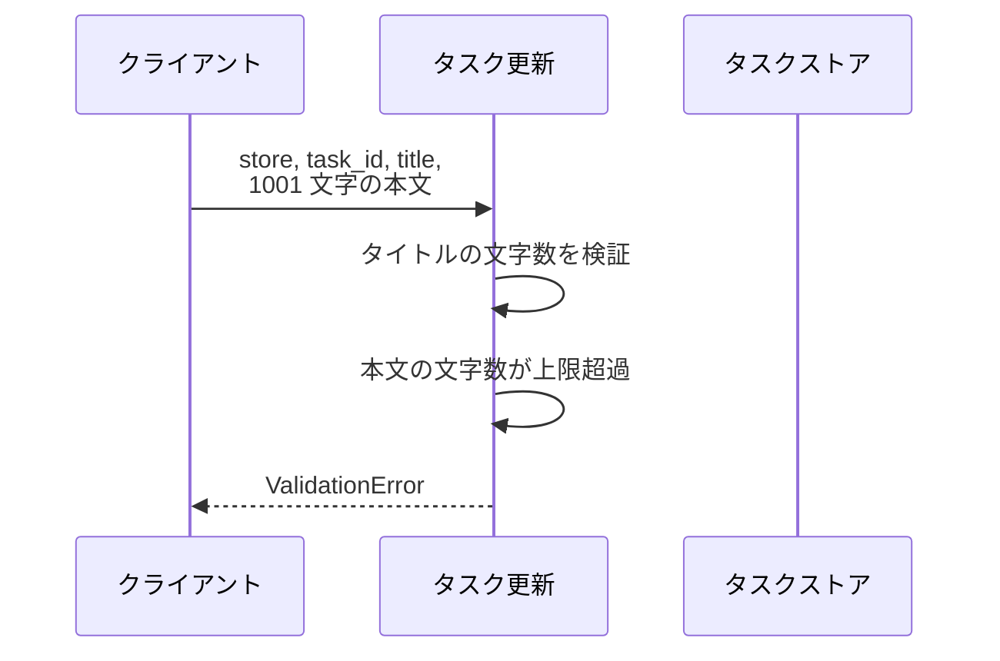
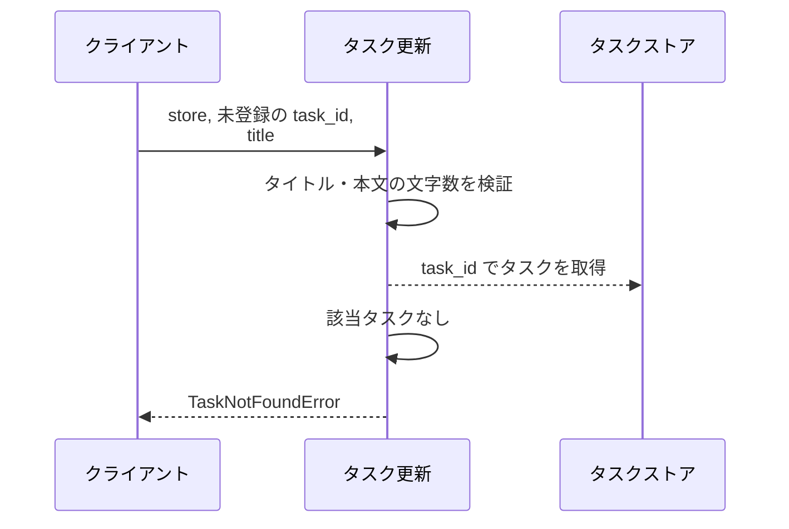

# タスク更新

操作: `update_task(store, task_id, title, content)`

登録済みタスクのタイトルと本文を更新し、更新後のタスクを返す。
タスクストアは呼び出し側が保持する in-memory の辞書で、更新は同じ辞書に書き戻す。

- 対応テストファイル: なし（結合テストは未整備。関数単位の検証は `tests/tasks/test_service.py`）

## インターフェース

### リクエスト

| パラメータ | 型 | 必須 | デフォルト | 説明 | 制限 | 補足 |
| --- | --- | --- | --- | --- | --- | --- |
| `store` | `dict[str, Task]` | ✅ | - | タスク ID をキーに持つタスクストア | - | 呼び出し側が保持する |
| `task_id` | `str` | ✅ | - | 更新対象のタスク ID | - | `store` に登録済みであること |
| `title` | `str` | ✅ | - | 更新後のタイトル | 1 文字以上 100 文字以内 | - |
| `content` | `str` | - | `""` | 更新後の本文 | 1000 文字以内 | 省略すると本文が空になる |

リクエスト例:

```python
update_task(store, "t1", "新タイトル", "新本文")
```

### レスポンス

| フィールド | 型 | 説明 | 制限 | 補足 |
| --- | --- | --- | --- | --- |
| `id` | `str` | タスク ID | - | 更新前の値を引き継ぐ |
| `title` | `str` | 更新後のタイトル | - | - |
| `content` | `str` | 更新後の本文 | - | 省略時は空文字 |

レスポンス例:

```python
Task(id="t1", title="新タイトル", content="新本文")
```

補足:

- 戻り値と `store[task_id]` は同一のタスクを指す（更新はストアにも反映される）

## 制約

| 項目 | 制約 | 補足 |
| --- | --- | --- |
| タイムアウト | 制限なし | in-memory 操作のみで外部 I/O を持たない |
| 認可 | 制限なし | 呼び出し元の権限判定は本操作の範囲外 |
| 更新対象 | 登録済みのタスク 1 件のみ | 未登録の ID は 異常系（タスク未登録・TaskNotFoundError） |
| 部分更新 | 不可（タイトルと本文を毎回まとめて置き換える） | 本文を残したい場合も呼び出し側が現在値を渡す |

## フロー一覧

| 分類 | フロー名 | 概要 | 補足 |
| --- | --- | --- | --- |
| 正常 | 正常系 | タイトルと本文を更新してストアに書き戻す | - |
| 正常 | 正常系（本文省略時） | 本文を省略すると空文字で上書きする | - |
| 異常 | 異常系（タイトル未入力・ValidationError） | 空タイトルを検証で弾く | - |
| 異常 | 異常系（タイトル長さ超過・ValidationError） | 101 文字以上のタイトルを検証で弾く | - |
| 異常 | 異常系（本文長さ超過・ValidationError） | 1001 文字以上の本文を検証で弾く | - |
| 異常 | 異常系（タスク未登録・TaskNotFoundError） | 未登録の ID を弾く | ストアは変更されない |

## 正常系

### セットアップ

| セットアップ | 説明 | 補足 |
| --- | --- | --- |
| Mock | なし（in-memory のタスクストアを実オブジェクトで使用） | - |
| タスク | `t1` のタスクを登録済み | タイトル・本文とも更新前の値が入っている |

### フロー



### 期待値

- 更新後のタイトル・本文を持つタスクが返る
- `store[task_id]` が更新後のタスクに置き換わっている

## 正常系（本文省略時）

### セットアップ

| セットアップ | 説明 | 補足 |
| --- | --- | --- |
| Mock | なし（in-memory のタスクストアを実オブジェクトで使用） | - |
| タスク | `t1` のタスクを本文付きで登録済み | - |
| 入力 | 本文を省略して呼び出す | デフォルト値の適用を決定的に誘発 |

### フロー



### 期待値

- 返るタスクの本文が空文字になっている
- `store[task_id]` の本文も空文字に置き換わっている

## 異常系（タイトル未入力・ValidationError）

### セットアップ

| セットアップ | 説明 | 補足 |
| --- | --- | --- |
| Mock | なし（in-memory のタスクストアを実オブジェクトで使用） | - |
| タスク | `t1` のタスクを登録済み | - |
| 入力 | タイトルを空文字で送信 | 検証失敗を決定的に誘発 |

### フロー



### 期待値

- `ValidationError` が送出される
- タスクストアは更新されていない

## 異常系（タイトル長さ超過・ValidationError）

### セットアップ

| セットアップ | 説明 | 補足 |
| --- | --- | --- |
| Mock | なし（in-memory のタスクストアを実オブジェクトで使用） | - |
| タスク | `t1` のタスクを登録済み | - |
| 入力 | 101 文字のタイトルで送信 | 検証失敗を決定的に誘発 |

### フロー



### 期待値

- `ValidationError` が送出される
- タスクストアは更新されていない

## 異常系（本文長さ超過・ValidationError）

### セットアップ

| セットアップ | 説明 | 補足 |
| --- | --- | --- |
| Mock | なし（in-memory のタスクストアを実オブジェクトで使用） | - |
| タスク | `t1` のタスクを登録済み | - |
| 入力 | 1001 文字の本文で送信 | 検証失敗を決定的に誘発 |

### フロー



### 期待値

- `ValidationError` が送出される
- タスクストアは更新されていない

## 異常系（タスク未登録・TaskNotFoundError）

### セットアップ

| セットアップ | 説明 | 補足 |
| --- | --- | --- |
| Mock | なし（in-memory のタスクストアを実オブジェクトで使用） | - |
| タスク | `t1` のタスクを登録済み | 更新対象の ID とは別 |
| 入力 | ストアに存在しない ID で送信 | 取得失敗を決定的に誘発 |

### フロー



### 期待値

- `TaskNotFoundError` が送出される
- 既存タスクのタイトル・本文は変更されていない
