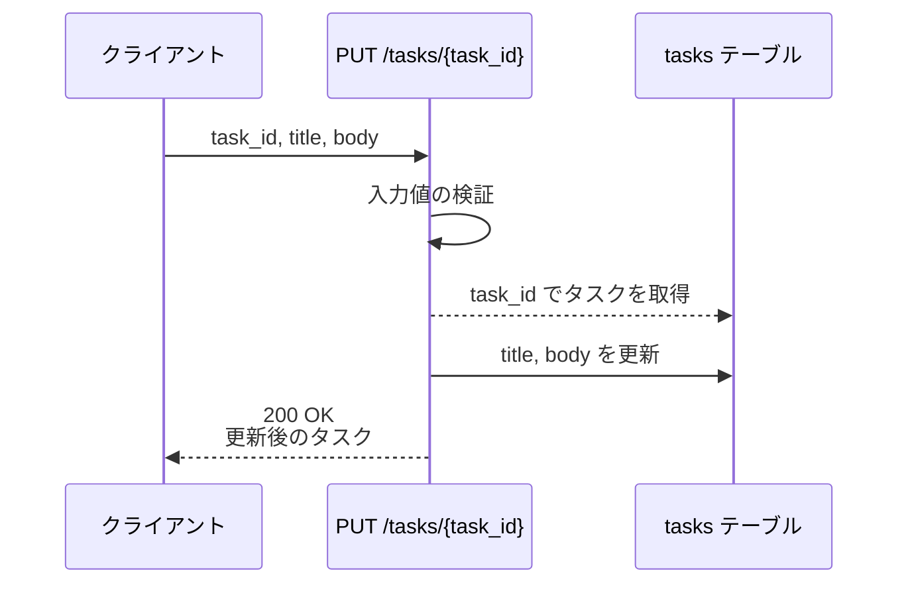
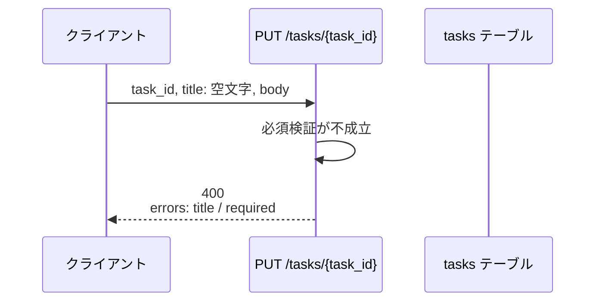
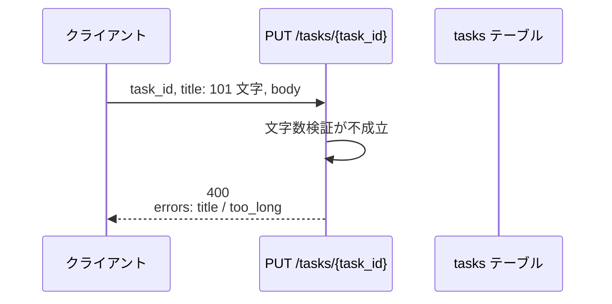
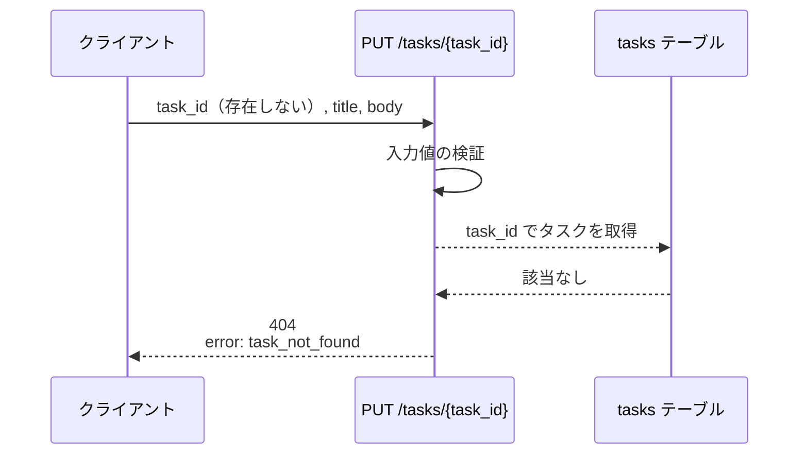
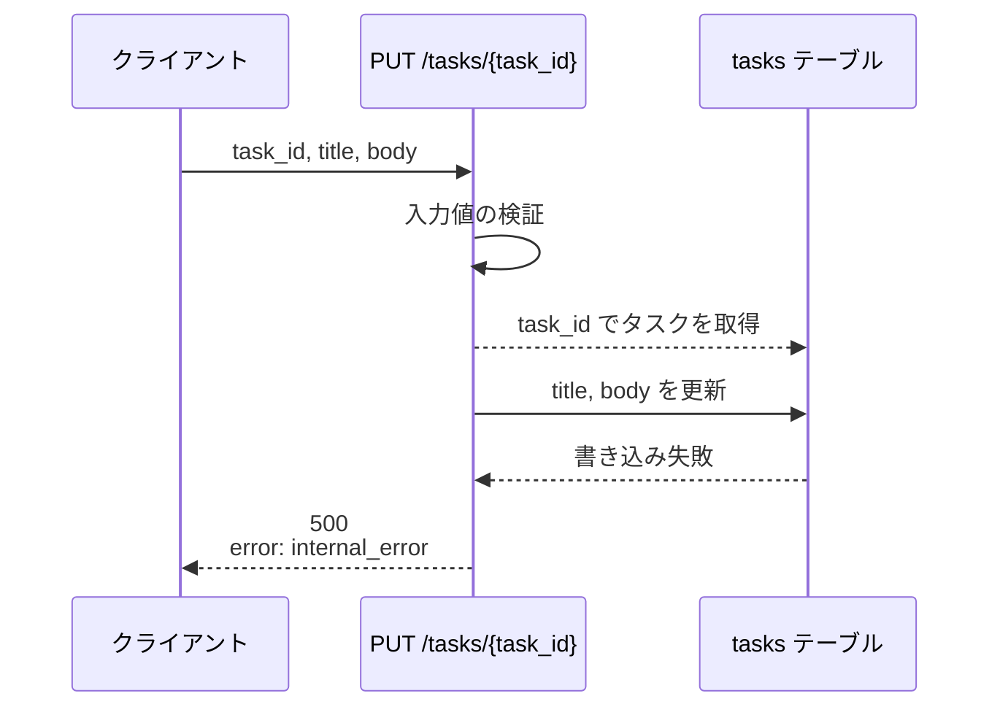

# タスク更新

エンドポイント: PUT /tasks/{task_id}

既存タスクのタイトル・本文を検証して更新し、更新後のタスクを返す。
検証に失敗した場合はフィールド単位のエラー内容を返して更新しない。

- 対応テストファイル: 未記入（tester のテスト作成後に記入）

## インターフェース

### リクエスト

| パラメータ | 型 | 必須 | デフォルト | 説明 | 制限 | 補足 |
| --- | --- | --- | --- | --- | --- | --- |
| `task_id` | str | ✅ | - | 更新対象のタスク ID | - | パスパラメータ |
| `title` | str | ✅ | - | タスク名 | 1〜100 文字 | 空文字不可 |
| `body` | str | ✅ | - | タスク本文 | 制限なし | 空文字は本文なしを表す |

リクエスト例:

```json
{
  "title": "決算資料の作成",
  "body": "四半期分の売上を集計してレビュー依頼まで行う。"
}
```

### レスポンス

| フィールド | 型 | 説明 | 制限 | 補足 |
| --- | --- | --- | --- | --- |
| `task` | object | 更新後のタスク | - | 更新成功時のみ |
| `task.id` | str | タスク ID | - | リクエストの `task_id` と一致 |
| `task.title` | str | 更新後のタスク名 | - | - |
| `task.body` | str | 更新後のタスク本文 | - | - |
| `task.updated_at` | str | 更新日時 | - | ISO 8601・UTC タイムゾーン付き |
| `errors` | object[] | 検証エラーの一覧 | - | 検証失敗時のみ。失敗した規則ごとに 1 要素 |
| `errors[].field` | str | エラー対象のフィールド名 | - | リクエストのパラメータ名と一致 |
| `errors[].code` | `"required"` \| `"too_long"` | エラー種別 | - | - |
| `errors[].message` | str | 表示用のエラーメッセージ | - | 呼び出し元がインライン表示に使う |
| `error` | `"task_not_found"` \| `"internal_error"` | エラー種別 | - | 検証失敗以外のエラー時のみ |

レスポンス例:

```json
{
  "task": {
    "id": "3f2b1c88-9d41-4a7e-8b02-5c6d7e8f9a01",
    "title": "決算資料の作成",
    "body": "四半期分の売上を集計してレビュー依頼まで行う。",
    "updated_at": "2026-07-26T13:20:41+00:00"
  }
}
```

検証エラー時のレスポンス例:

```json
{
  "errors": [
    { "field": "title", "code": "required", "message": "タスク名を入力してください。" }
  ]
}
```

### ステータスコード

| ステータスコード | 発生条件 | 補足 |
| --- | --- | --- |
| `200` | 更新成功 | - |
| `400` | 入力値の検証失敗 | `errors` を返す |
| `404` | 対象タスクが存在しない | `error: "task_not_found"` を返す |
| `500` | DB 書き込み失敗 | `error: "internal_error"` を返す |

## 制約

| 項目 | 制約 | 補足 |
| --- | --- | --- |
| タイムアウト | 1 秒以内に応答する | - |
| 認可 | 制限なし | 認証・認可の要件が未確定のため本エンドポイントでは扱わない |
| レート制限 | 制限なし | - |
| 更新可能なフィールド | `title` / `body` のみ | 状態・期限等の他フィールドは本エンドポイントでは変更しない |
| 検証エラーの返却単位 | 失敗した規則を全件返す | 最初の 1 件で打ち切らない |

## フロー一覧

| 分類 | フロー名 | 概要 | 補足 |
| --- | --- | --- | --- |
| 正常 | 正常系 | 検証を通過してタイトル・本文を更新 | - |
| 異常 | 異常系（タスク名が空・400） | 必須検証で弾いて更新しない | 単一 UC シナリオの異常シナリオに対応 |
| 異常 | 異常系（タスク名が 100 文字超・400） | 文字数検証で弾いて更新しない | - |
| 異常 | 異常系（タスク不存在・404） | 対象が無いため更新しない | - |
| 異常 | 異常系（DB 書き込み失敗・500） | 更新の書き込みに失敗 | - |

## 正常系

### セットアップ

| セットアップ | 説明 | 補足 |
| --- | --- | --- |
| Mock | DB を stub に差し替え | - |
| タスク | 更新対象のタスクを 1 件登録済み | - |

### フロー



### 期待値

- `200 OK` + 更新後のタスクが返る
- tasks テーブルの対象行の `title` / `body` が送信値になっている
- レスポンスの `task.updated_at` が更新前の更新日時より後になっている

## 異常系（タスク名が空・400）

### セットアップ

| セットアップ | 説明 | 補足 |
| --- | --- | --- |
| Mock | DB を stub に差し替え | - |
| タスク | 更新対象のタスクを 1 件登録済み | - |
| 入力 | `title` に空文字を指定して送信 | 必須検証の失敗を決定的に誘発 |

### フロー



### 期待値

- `400` + `errors` に `field: "title"` / `code: "required"` の 1 件が返る
- tasks テーブルの対象行は変化していない

## 異常系（タスク名が 100 文字超・400）

### セットアップ

| セットアップ | 説明 | 補足 |
| --- | --- | --- |
| Mock | DB を stub に差し替え | - |
| タスク | 更新対象のタスクを 1 件登録済み | - |
| 入力 | `title` に 101 文字を指定して送信 | 文字数検証の失敗を決定的に誘発 |

### フロー



### 期待値

- `400` + `errors` に `field: "title"` / `code: "too_long"` の 1 件が返る
- tasks テーブルの対象行は変化していない

## 異常系（タスク不存在・404）

### セットアップ

| セットアップ | 説明 | 補足 |
| --- | --- | --- |
| Mock | DB を stub に差し替え | - |
| タスク | 対象のタスクを登録しない | 不存在を決定的に誘発 |
| 入力 | 存在しない `task_id` を指定して送信 | - |

### フロー



### 期待値

- `404` + `error: "task_not_found"` が返る
- tasks テーブルに新規行は作成されていない

## 異常系（DB 書き込み失敗・500）

### セットアップ

| セットアップ | 説明 | 補足 |
| --- | --- | --- |
| Mock | DB を stub に差し替え（更新の書き込みで例外を返す） | 書き込み失敗を決定的に誘発 |
| タスク | 更新対象のタスクを 1 件登録済み | - |

### フロー



### 期待値

- `500` + `error: "internal_error"` が返る
- tasks テーブルの対象行は変化していない
