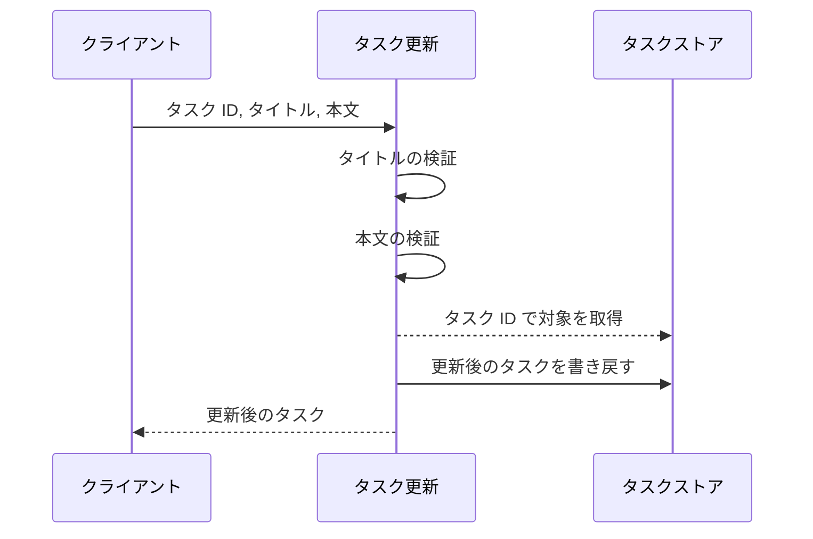
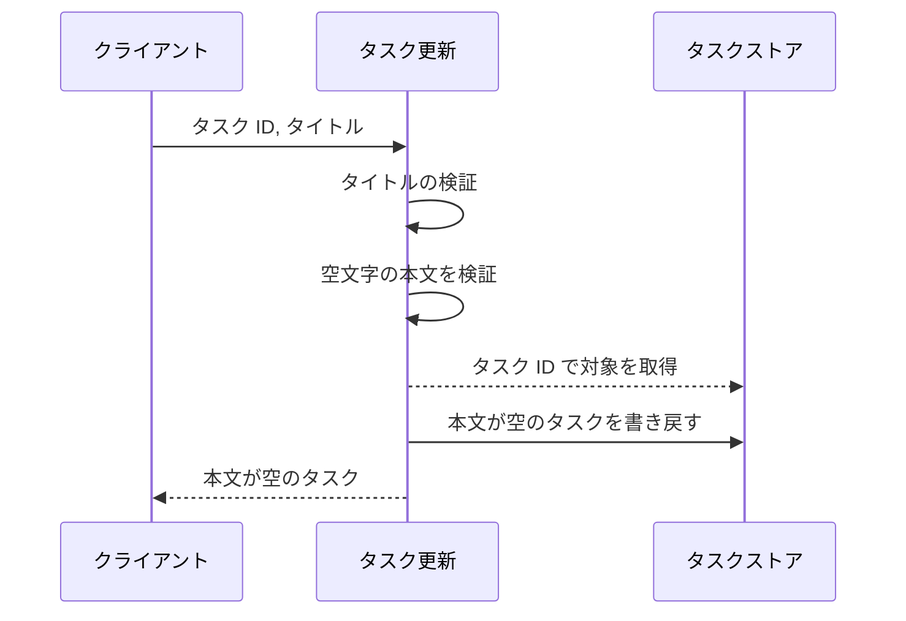
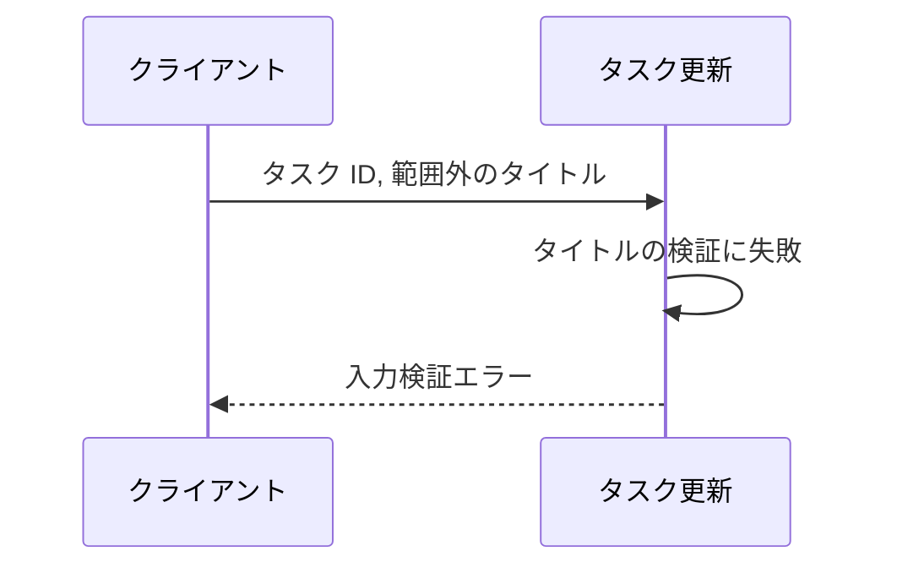
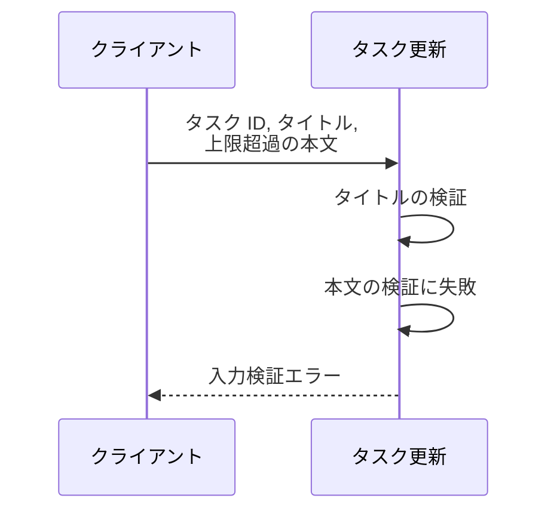
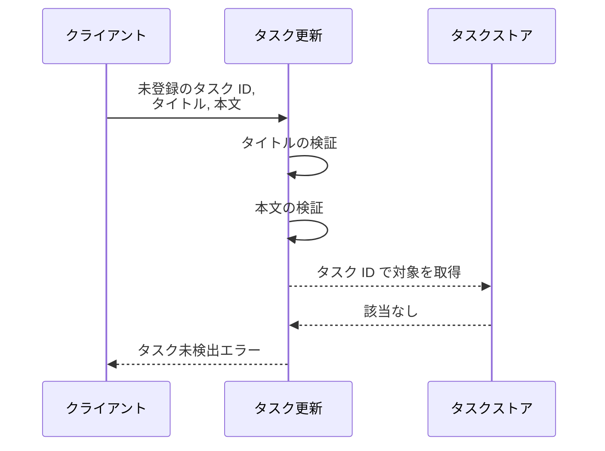

# タスク更新

操作: `update_task`（`src/tasks/service.py`）

登録済みタスクのタイトルと本文を更新して、更新後のタスクを返す。
タスクの入れ物は呼び出し側が持つストア（タスク ID をキーにした辞書）で受け渡す。

- 対応テストファイル: なし（本プロジェクトは結合テストを持たない。通しの動作は単一UC E2E `tests/e2e/単一ユースケース/test_タスク編集.py` で担保する）

## インターフェース

### リクエスト

| パラメータ | 型 | 必須 | デフォルト | 説明 | 制限 | 補足 |
| --- | --- | --- | --- | --- | --- | --- |
| `store` | `dict[str, Task]` | ✅ | - | タスク ID をキーにしたタスクの入れ物 | - | 更新は本引数を直接書き換える |
| `task_id` | `str` | ✅ | - | 更新対象のタスク ID | `store` に登録済みの ID のみ | - |
| `title` | `str` | ✅ | - | 更新後のタイトル | 1 文字以上 100 文字以内 | - |
| `content` | `str` | - | `""` | 更新後の本文 | 1000 文字以内 | 省略すると本文は空になる |

リクエスト例:

```json
{
  "task_id": "t1",
  "title": "新タイトル",
  "content": "新本文"
}
```

### レスポンス

| フィールド | 型 | 説明 | 制限 | 補足 |
| --- | --- | --- | --- | --- |
| `id` | `str` | 更新したタスクの ID | - | リクエストの `task_id` と一致する |
| `title` | `str` | 更新後のタイトル | - | - |
| `content` | `str` | 更新後の本文 | - | 本文を省略した場合は空文字 |

レスポンス例:

```json
{
  "id": "t1",
  "title": "新タイトル",
  "content": "新本文"
}
```

**補足:**

- 返すタスクと `store` に書き戻すタスクは同一の値。
  呼び出し側は戻り値を受け取らずに `store` から読み直しても同じ結果になる

## 制約

| 項目 | 制約 | 補足 |
| --- | --- | --- |
| 認可 | 制限なし | 呼び出し元の権限判定は持たない |
| タイムアウト | 制限なし | 外部 I/O を持たない同期処理 |
| 更新件数 | 1 回の呼び出しにつき 1 件 | 複数件の更新は呼び出し側で繰り返す |

## フロー一覧

| 分類 | フロー名 | 概要 | 補足 |
| --- | --- | --- | --- |
| 正常 | 正常系 | タイトルと本文を更新して更新後のタスクを返す | - |
| 正常 | 正常系（本文の省略時） | 本文を空文字にして更新する | - |
| 異常 | 異常系（タイトルの長さ違反） | タイトルの文字数が範囲外で検証に失敗する | - |
| 異常 | 異常系（本文の長さ違反） | 本文の文字数が上限超過で検証に失敗する | - |
| 異常 | 異常系（タスク未登録） | 対象 ID がストアに無い | - |

## 正常系

### セットアップ

| セットアップ | 説明 | 補足 |
| --- | --- | --- |
| Mock | なし | 外部依存を持たない |
| タスク | `t1` のタスクをストアに登録済み | タイトル・本文とも更新前の値 |

### フロー



### 期待値

- 更新後のタイトルと本文を持つタスクが返る
- ストアの同 ID の値も更新後のタスクに差し替わっている

## 正常系（本文の省略時）

### セットアップ

| セットアップ | 説明 | 補足 |
| --- | --- | --- |
| Mock | なし | 外部依存を持たない |
| タスク | `t1` のタスクをストアに登録済み | 本文は更新前の値が入っている |
| 入力 | 本文を指定せずに送信 | デフォルト値の適用を決定的に誘発 |

### フロー



### 期待値

- 本文が空文字のタスクが返る
- 更新前の本文はストアに残っていない

## 異常系（タイトルの長さ違反）

### セットアップ

| セットアップ | 説明 | 補足 |
| --- | --- | --- |
| Mock | なし | 外部依存を持たない |
| タスク | `t1` のタスクをストアに登録済み | - |
| 入力 | 空のタイトル、または 101 文字のタイトルで送信 | 検証失敗を決定的に誘発 |

### フロー



### 期待値

- 入力検証エラーが送出される
- ストアのタスクは更新前のまま変わっていない

## 異常系（本文の長さ違反）

### セットアップ

| セットアップ | 説明 | 補足 |
| --- | --- | --- |
| Mock | なし | 外部依存を持たない |
| タスク | `t1` のタスクをストアに登録済み | - |
| 入力 | 1001 文字の本文で送信 | 検証失敗を決定的に誘発 |

### フロー



### 期待値

- 入力検証エラーが送出される
- ストアのタスクは更新前のまま変わっていない

## 異常系（タスク未登録）

### セットアップ

| セットアップ | 説明 | 補足 |
| --- | --- | --- |
| Mock | なし | 外部依存を持たない |
| タスク | `t1` のタスクだけをストアに登録済み | - |
| 入力 | ストアに無いタスク ID で送信 | 取得失敗を決定的に誘発 |

### フロー



### 期待値

- タスク未検出エラーが送出される
- ストアには新しいタスクが追加されていない
