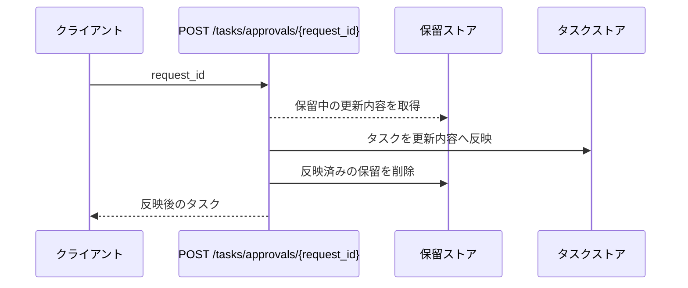
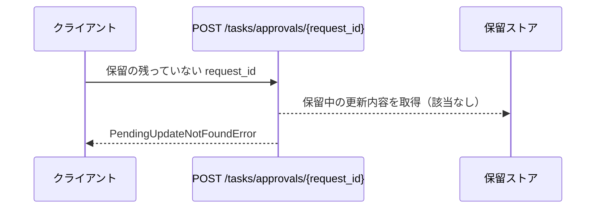

# タスク更新確定

エンドポイント: POST /tasks/approvals/{request_id}

承認基盤から届いた更新の確定を受けて、保留中の更新内容をタスクへ反映する。
[タスク更新](./タスク更新.py.md) が受け付けた依頼と `request_id` で対応し、反映が済んだ保留は削除する。
受け付けるのは承認確定の通知のみで、否認の通知の扱いは未決定。

## インターフェース

### リクエスト

| パラメータ | 型 | 必須 | デフォルト | 説明 | 制限 | 補足 |
| --- | --- | --- | --- | --- | --- | --- |
| `request_id` | str | ✅ | - | 確定した更新の承認依頼 ID | - | パスパラメータ |

### レスポンス

| フィールド | 型 | 説明 | 制限 | 補足 |
| --- | --- | --- | --- | --- |
| `id` | str | 反映したタスクの ID | - | - |
| `title` | str | 反映後のタスク名 | - | - |
| `content` | str | 反映後の本文 | - | - |

## 制約

| 項目 | 制約 | 補足 |
| --- | --- | --- |
| タイムアウト | 制限なし | - |
| 認可 | なし | sandbox 用の最小実装 |
| 受け付ける通知 | 承認確定のみ | 否認の通知の扱いは未決定 |

## フロー一覧

| 分類 | フロー名 | 概要 | 補足 |
| --- | --- | --- | --- |
| 正常 | 正常系 | 保留中の更新内容をタスクへ反映して保留を削除する | - |
| 異常 | 異常系（保留が不明） | 保留の残っていない承認依頼 ID を指定 | 同じ承認依頼 ID で 2 回目の通知が届いた場合も本フローになる |

## 正常系

### セットアップ

| セットアップ | 説明 | 補足 |
| --- | --- | --- |
| Mock | なし（インメモリのストアを実物のまま使う） | 呼び出し元の承認基盤は通知の送信元のため Mock 対象にならない |
| タスク | `t1` のタスクを編集前の内容で登録済み | - |
| 保留 | `r1` の承認依頼 ID で `t1` の更新内容を記録済み | - |

### フロー

### 期待値

- 反映後のタイトルと本文を持つタスクが返る
- タスクストアの `t1` が更新内容になっている
- 保留ストアから `r1` が削除されている

## 異常系（保留が不明）

### セットアップ

| セットアップ | 説明 | 補足 |
| --- | --- | --- |
| Mock | なし（インメモリのストアを実物のまま使う） | - |
| 入力 | 保留の残っていない `request_id` を指定 | 検索失敗を決定的に誘発 |

### フロー

### 期待値

- `PendingUpdateNotFoundError` が送出される
- タスクストアが変更されていない
