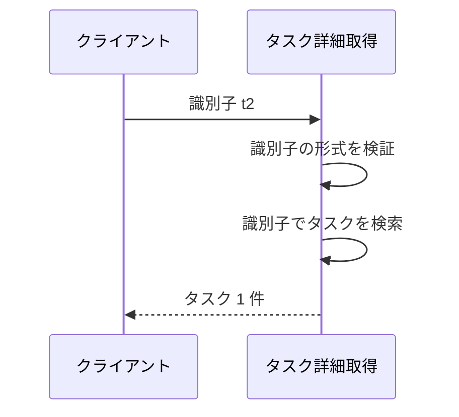
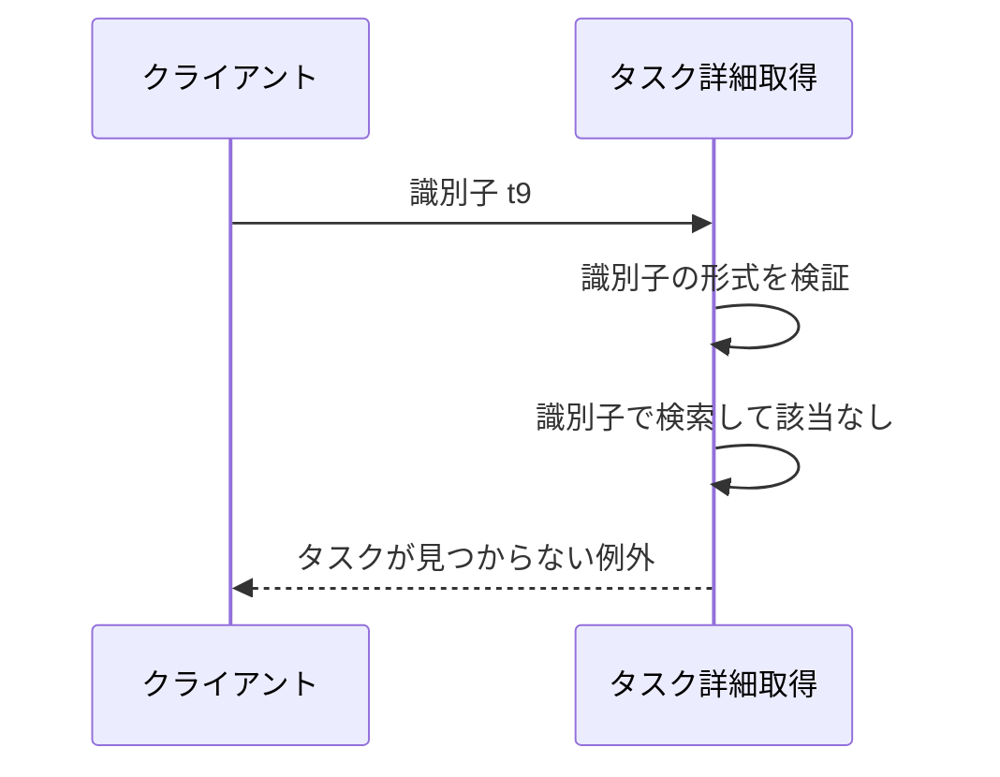
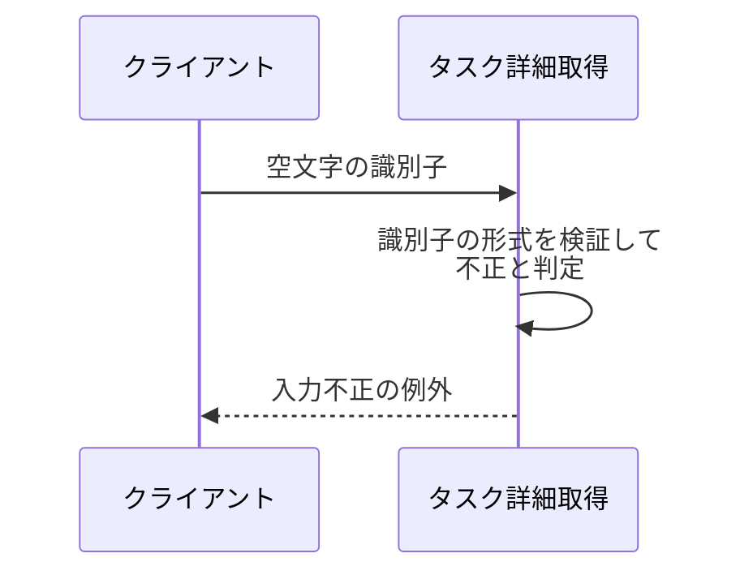

# タスク詳細取得

呼び出し形式: Python サービス関数（同期呼び出し）

識別子を指定して、対応するタスク 1 件の詳細（タイトル・本文）を返す操作。
編集画面の初期表示値の供給元になる。

- 対応テストファイル: `tests/integration/tasks/test_get_task.py`

## インターフェース

### リクエスト

| パラメータ | 型 | 必須 | デフォルト | 説明 | 制限 | 補足 |
| --- | --- | --- | --- | --- | --- | --- |
| `task_id` | `str` | ✅ | - | 取得対象のタスクの識別子 | 1〜100 文字 | 一覧の要素が持つ識別子をそのまま渡す |

リクエスト例:

```python
task_id = "t2"
```

### レスポンス

| フィールド | 型 | 説明 | 制限 | 補足 |
| --- | --- | --- | --- | --- |
| （戻り値） | `Task` | 指定した識別子のタスク | - | - |
| `id` | `str` | タスクの識別子 | 1〜100 文字 | 指定した識別子と一致する |
| `title` | `str` | タスクのタイトル | 1〜100 文字 | 編集画面のタイトルの初期値 |
| `content` | `str` | タスクの本文 | 1000 文字以内 | 編集画面の本文の初期値。本文が未設定なら空文字 |

レスポンス例:

```python
Task(id="t2", title="週次レポートの提出", content="今週の進捗をまとめる")
```

補足:

- 対象が見つからない場合は戻り値を返さず、専用の例外を送出する。
- 制限列のうちタイトル・本文は保管されている値が満たす想定範囲。
  本操作が検証するのは識別子のみ。

## 制約

| 項目 | 制約 | 補足 |
| --- | --- | --- |
| 識別子の形式 | 1 文字以上 100 文字以内の文字列 | 境界（1 文字 / 100 文字は有効、0 文字 / 101 文字は無効）を単体テストで固定する |
| 形式が不正な識別子の扱い | 入力不正を表す例外で返す | 内部エラー（未捕捉の例外）にはしない |
| 対象が存在しない場合の扱い | タスクが見つからないことを表す専用の例外で返す | 入力不正の例外とは別の型にし、呼び出し側が区別できるようにする |
| エラーメッセージ | 判定条件と一致した内容にする | メッセージだけが正しく判定条件が欠落する事象の再発を防ぐ |
| 認可 | 制限なし | 認証・タスク所有者の概念を導入しない |
| タイムアウト | 制限なし | 保管先の参照のみで待ち合わせが発生しない |
| 応答時間 | p95 500ms 以内 | - |
| 副作用 | なし（保管されているタスクを変更しない） | - |

## フロー一覧

| 分類 | フロー名 | 概要 | 補足 |
| --- | --- | --- | --- |
| 正常 | 正常系 | 登録済みの識別子でタスク 1 件を返す | - |
| 異常 | 異常系（未登録の識別子） | タスクが見つからないことを表す例外を送出 | 一覧表示後に削除されたタスクの行をクリックした場合に相当 |
| 異常 | 異常系（識別子の形式が不正） | 入力不正を表す例外を送出 | 空文字 / 101 文字以上を渡した場合 |

## 正常系

### セットアップ

| セットアップ | 説明 | 補足 |
| --- | --- | --- |
| Mock | なし（タスクの保管先はテストデータで直接構築する） | 外部 DB / 外部 API に依存しない |
| タスク | 識別子 `t1` のタスクを登録 | `title: 買い物リストの作成` |
| タスク | 識別子 `t2` のタスクを登録 | `title: 週次レポートの提出` / `content: 今週の進捗をまとめる` |
| 入力 | 識別子 `t2` を指定 | 一覧の 2 件目を選んだ状態を再現 |

### フロー



### 期待値

- 識別子 `t2` のタスクが返る
- タイトル・本文が登録時の値と一致する
- 保管されているタスクの内容が呼び出しの前後で変化していない

## 異常系（未登録の識別子）

### セットアップ

| セットアップ | 説明 | 補足 |
| --- | --- | --- |
| Mock | なし（タスクの保管先はテストデータで直接構築する） | 外部 DB / 外部 API に依存しない |
| タスク | 識別子 `t1` のタスクを登録 | `title: 買い物リストの作成` |
| 入力 | 登録されていない識別子 `t9` を指定 | 一覧表示後に対象が削除された状態を再現 |

### フロー



### 期待値

- タスクが見つからないことを表す例外が送出される
- 送出された例外が入力不正の例外と型で区別できる
- 保管されているタスクの内容が変化していない

## 異常系（識別子の形式が不正）

### セットアップ

| セットアップ | 説明 | 補足 |
| --- | --- | --- |
| Mock | なし（タスクの保管先はテストデータで直接構築する） | 外部 DB / 外部 API に依存しない |
| タスク | 識別子 `t1` のタスクを登録 | `title: 買い物リストの作成` |
| 入力 | 空文字の識別子を指定 | 形式検証の下限違反を決定的に誘発する |

### フロー



### 期待値

- 入力不正を表す例外が送出される
- 未捕捉の内部エラーにはならない
- 例外メッセージの内容が判定条件（1 文字以上 100 文字以内）と一致している
- 保管されているタスクの内容が変化していない
