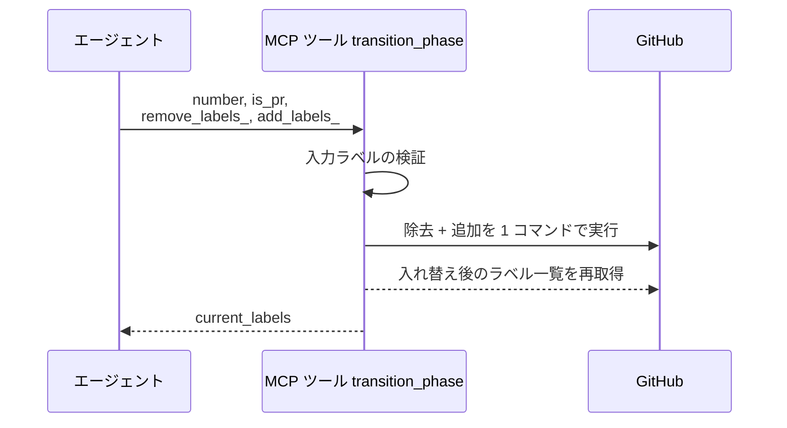
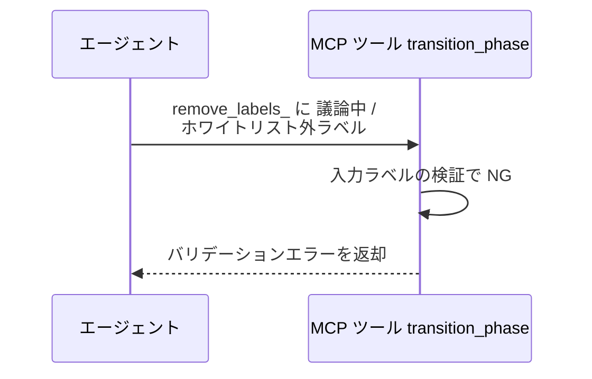
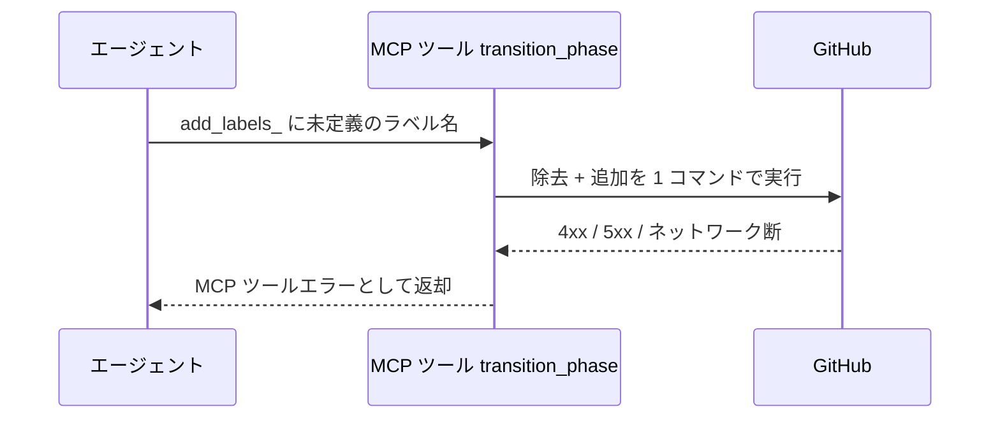

# フェーズ遷移

MCP ツール: `transition_phase`

ラベルの除去と追加を 1 API 呼び出しで行う複合操作。
エージェントの完了処理（`確認:{自身}` 除去 + 次の `確認:{次エージェント}` 付与）で使う。

- 対応テストファイル: `tests/integration/mcp/test_transition_phase.py`

## インターフェース

### リクエスト

| パラメータ | 型 | 必須 | デフォルト | 説明 | 制限 | 補足 |
| --- | --- | --- | --- | --- | --- | --- |
| `number` | int | ✅ | - | 対象の Issue / PR 番号 | - | - |
| `is_pr` | bool | ✅ | - | PR なら `True` | - | - |
| `remove_labels_` | list[str] | - | `[]` | 除去するラベル配列 | - | 省略時は追加のみ |
| `add_labels_` | list[str] | - | `[]` | 追加するラベル配列 | - | 省略時は除去のみ |

リクエスト例:

```json
{
  "number": 40,
  "is_pr": true,
  "remove_labels_": ["確認:architect"],
  "add_labels_": ["確認:tester"]
}
```

### レスポンス

| フィールド | 型 | 説明 | 制限 | 補足 |
| --- | --- | --- | --- | --- |
| `current_labels` | list[str] | 入れ替え後のラベル一覧 | - | 呼び出し側が遷移結果を検証できる |

レスポンス例:

```json
{
  "current_labels": ["type:feat", "確認:tester"]
}
```

## 制約

| 項目 | 制約 | 補足 |
| --- | --- | --- |
| タイムアウト | 制限なし | - |
| 操作可能ラベル | `確認:*` 系のみ | 許可外の指定は 異常系（許可外ラベル指定） |

## フロー一覧

| 分類 | フロー名 | 概要 | 補足 |
| --- | --- | --- | --- |
| 正常 | 正常系 | 除去 + 追加を 1 コマンドで実行し現況を返す | - |
| 異常 | 異常系（許可外ラベル指定） | `議論中` の除去指定 / ホワイトリスト外 → エラー返却 | バリデーション実装後に有効 |
| 異常 | 異常系（API エラー） | 認証切れ / 対象不存在 / ネットワーク断 | - |

## 正常系

### セットアップ

| セットアップ | 説明 | 補足 |
| --- | --- | --- |
| Mock | GitHub API を差し替え（正常応答を返す） | - |
| 対象 Issue / PR | `確認:architect` が付与済み | 入れ替え元のラベル |

### フロー



### 期待値

- `確認:architect` が外れ、`確認:tester` が付与されている
- 戻り値 `current_labels` が入れ替え後のラベル一覧と一致している

## 異常系（許可外ラベル指定）

### セットアップ

| セットアップ | 説明 | 補足 |
| --- | --- | --- |
| Mock | GitHub API を差し替え（呼び出されないことを検証） | - |
| 入力 | `remove_labels_` に `議論中` を含めて呼び出す | バリデーション NG を決定的に誘発 |

### フロー



### 期待値

- バリデーションエラーが返り、API は呼ばれない
- 対象のラベルは変化していない

## 異常系（API エラー）

### セットアップ

| セットアップ | 説明 | 補足 |
| --- | --- | --- |
| Mock | GitHub API を差し替え（4xx / 5xx を返す） | - |
| 入力 | リポジトリ未定義のラベル名を追加指定する | API エラーを決定的に誘発 |

### フロー



### 期待値

- MCP ツールエラーが返る（HTTP ステータスと本文を含む）
- 対象の状態は変化していない
