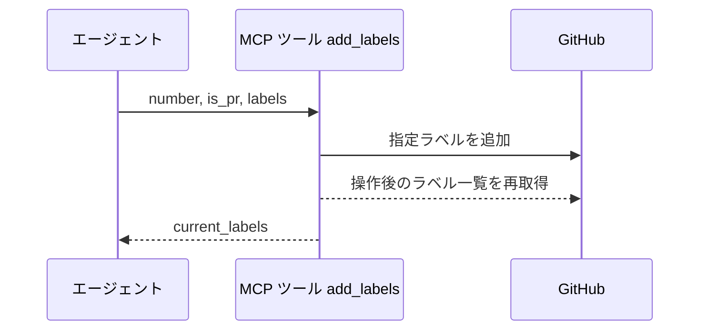
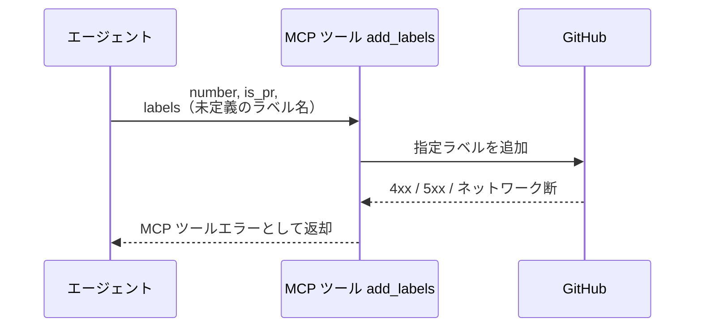

# ラベル追加

MCP ツール: `add_labels`

Issue / PR にラベルを追加する（冪等・既存ラベルは維持）。
`確認:*` の付与・待機開始時の `議論中` 付与はこのツールを使う。

- 対応テストファイル: `tests/integration/mcp/test_add_labels.py`

## インターフェース

### リクエスト

| パラメータ | 型 | 必須 | デフォルト | 説明 | 制限 | 補足 |
| --- | --- | --- | --- | --- | --- | --- |
| `number` | int | ✅ | - | 対象の Issue / PR 番号 | - | - |
| `is_pr` | bool | ✅ | - | PR なら `True` | - | - |
| `labels` | list[str] | ✅ | - | 追加するラベル名の配列 | リポジトリに定義済みのラベルのみ | - |

リクエスト例:

```json
{
  "number": 35,
  "is_pr": false,
  "labels": ["確認:epic-conductor", "議論中"]
}
```

### レスポンス

| フィールド | 型 | 説明 | 制限 | 補足 |
| --- | --- | --- | --- | --- |
| `current_labels` | list[str] | 操作後のラベル一覧 | - | 呼び出し側が結果を検証できる |

レスポンス例:

```json
{
  "current_labels": ["layer:epic", "確認:epic-conductor", "議論中"]
}
```

## 制約

| 項目 | 制約 | 補足 |
| --- | --- | --- |
| タイムアウト | 制限なし | - |

## フロー一覧

| 分類 | フロー名 | 概要 | 補足 |
| --- | --- | --- | --- |
| 正常 | 正常系 | ラベル追加 → ラベル一覧の再取得 | - |
| 異常 | 異常系（API エラー） | 認証切れ / 未定義ラベル / ネットワーク断 | - |

## 正常系

### セットアップ

| セットアップ | 説明 | 補足 |
| --- | --- | --- |
| Mock | GitHub API を差し替え（正常応答を返す） | - |
| 対象 Issue / PR | 追加対象ラベルが未付与 | - |
| ラベル定義 | 追加するラベルがリポジトリに定義済み | - |

### フロー



### 期待値

- 指定ラベルが対象に付与されている
- 戻り値 `current_labels` が付与後のラベル一覧と一致している

## 異常系（API エラー）

### セットアップ

| セットアップ | 説明 | 補足 |
| --- | --- | --- |
| Mock | GitHub API を差し替え（4xx / 5xx を返す） | - |
| 入力 | リポジトリ未定義のラベル名を指定して呼び出す | API エラーを決定的に誘発 |

### フロー



### 期待値

- MCP ツールエラーが返る（HTTP ステータスと本文を含む）
- 対象のラベルは変化していない
