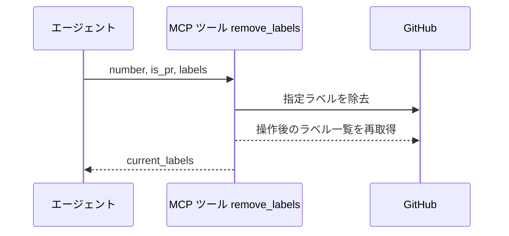
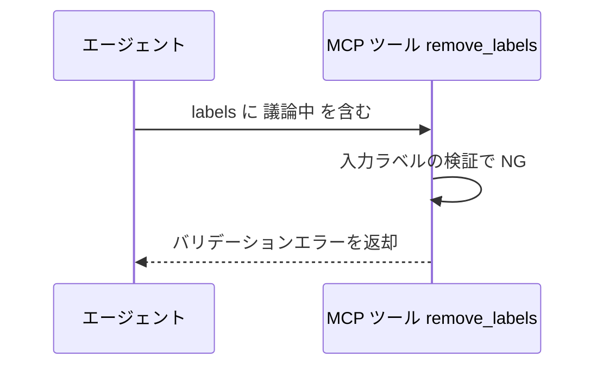
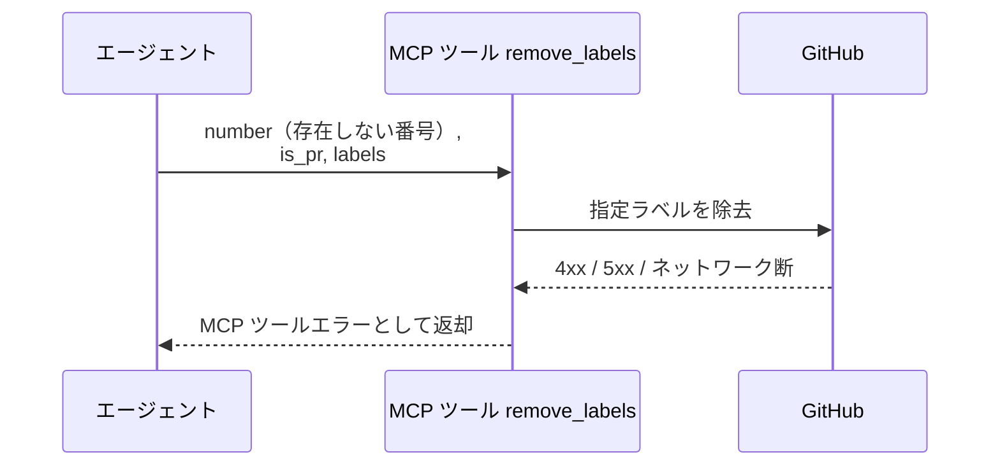

# ラベル除去

MCP ツール: `remove_labels`

Issue / PR からラベルを除去する。
完了処理での `確認:{自身}` の除去はこのツールを使う。

- 対応テストファイル: `tests/integration/mcp/test_remove_labels.py`

## インターフェース

### リクエスト

| パラメータ | 型 | 必須 | デフォルト | 説明 | 制限 | 補足 |
| --- | --- | --- | --- | --- | --- | --- |
| `number` | int | ✅ | - | 対象の Issue / PR 番号 | - | - |
| `is_pr` | bool | ✅ | - | PR なら `True` | - | - |
| `labels` | list[str] | ✅ | - | 除去するラベル名の配列 | - | 付与されていないラベルは無視される |

リクエスト例:

```json
{
  "number": 35,
  "is_pr": false,
  "labels": ["確認:epic-conductor"]
}
```

### レスポンス

| フィールド | 型 | 説明 | 制限 | 補足 |
| --- | --- | --- | --- | --- |
| `current_labels` | list[str] | 操作後のラベル一覧 | - | 呼び出し側が結果を検証できる |

レスポンス例:

```json
{
  "current_labels": ["layer:epic"]
}
```

## 制約

| 項目 | 制約 | 補足 |
| --- | --- | --- |
| タイムアウト | 制限なし | - |
| 除去可能ラベル | `確認:*` 系のみ | 許可外の指定は 異常系（許可外ラベル指定） |

## フロー一覧

| 分類 | フロー名 | 概要 | 補足 |
| --- | --- | --- | --- |
| 正常 | 正常系 | ラベル除去 → ラベル一覧の再取得 | - |
| 異常 | 異常系（許可外ラベル指定） | `議論中` の除去指定 → エラー返却 | 外せるのはユーザーのみ |
| 異常 | 異常系（API エラー） | 認証切れ / 対象不存在 / ネットワーク断 | - |

## 正常系

### セットアップ

| セットアップ | 説明 | 補足 |
| --- | --- | --- |
| Mock | GitHub API を差し替え（正常応答を返す） | - |
| 対象 Issue / PR | 除去対象ラベルが付与済み | - |

### フロー



### 期待値

- 指定ラベルが対象から外れている
- 戻り値 `current_labels` が除去後のラベル一覧と一致している

## 異常系（許可外ラベル指定）

### セットアップ

| セットアップ | 説明 | 補足 |
| --- | --- | --- |
| Mock | GitHub API を差し替え（呼び出されないことを検証） | - |
| 入力 | `labels` に `議論中` を含めて呼び出す | バリデーション NG を決定的に誘発 |

### フロー



### 期待値

- バリデーションエラーが返り、API は呼ばれない（外せるのはユーザーのみ）
- 対象のラベルは変化していない

## 異常系（API エラー）

### セットアップ

| セットアップ | 説明 | 補足 |
| --- | --- | --- |
| Mock | GitHub API を差し替え（4xx / 5xx を返す） | - |
| 対象番号 | 存在しない番号を指定して呼び出す | API エラーを決定的に誘発 |

### フロー



### 期待値

- MCP ツールエラーが返る（HTTP ステータスと本文を含む）
- 対象の状態は変化していない
