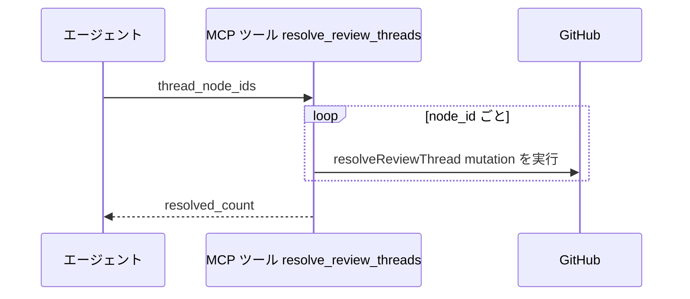
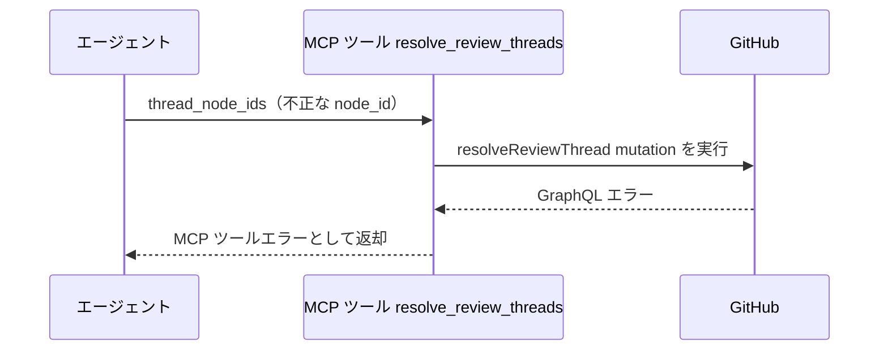

# レビュースレッド一括Resolve

MCP ツール: `resolve_review_threads`

レビュースレッド（インライン指摘のスレッド）を `resolveReviewThread` mutation で一括解決する。
会話欄コメントの Resolve（コメント一括Resolve = `minimizeComment`）とは別系統で、指摘対応の修正確定後にレビュー担当（architect / scenario-writer）が呼ぶ。

- 対応テストファイル: `tests/integration/mcp/test_resolve_review_threads.py`

## インターフェース

### リクエスト

| パラメータ | 型 | 必須 | デフォルト | 説明 | 制限 | 補足 |
| --- | --- | --- | --- | --- | --- | --- |
| `thread_node_ids` | list[str] | ✅ | - | 解決対象スレッドの GraphQL node_id 配列 | 1 件以上 | `PRRT_` 始まり（レビュースレッド一覧で取得） |

リクエスト例:

```json
{
  "thread_node_ids": ["PRRT_kwDOAbc123", "PRRT_kwDOAbc456"]
}
```

### レスポンス

| フィールド | 型 | 説明 | 制限 | 補足 |
| --- | --- | --- | --- | --- |
| `resolved_count` | int | 解決した件数 | - | `thread_node_ids` の件数と一致 |

レスポンス例:

```json
{
  "resolved_count": 2
}
```

## 制約

| 項目 | 制約 | 補足 |
| --- | --- | --- |
| タイムアウト | 制限なし | - |
| 対象 | レビュースレッドの node_id のみ | 会話欄コメントの Resolve は コメント一括Resolve |

## フロー一覧

| 分類 | フロー名 | 概要 | 補足 |
| --- | --- | --- | --- |
| 正常 | 正常系 | node_id ごとに resolveReviewThread を実行 | - |
| 異常 | 異常系（node_id 不正） | GraphQL エラー | - |

## 正常系

### セットアップ

| セットアップ | 説明 | 補足 |
| --- | --- | --- |
| Mock | GitHub API を差し替え（mutation の正常応答を返す） | - |
| 対象スレッド | sandbox の PR に未解決のレビュースレッドが 2 件存在 | node_id を入力に使う |

### フロー



### 期待値

- 指定した全スレッドが解決済み（`isResolved: true`）になっている
- 戻り値の `resolved_count` が指定件数と一致する

## 異常系（node_id 不正）

### セットアップ

| セットアップ | 説明 | 補足 |
| --- | --- | --- |
| Mock | GitHub API を差し替え（GraphQL エラーを返す） | - |
| 対象 | 存在しない node_id を指定して呼び出す | エラーを決定的に誘発 |

### フロー



### 期待値

- MCP ツールエラーが返る（GraphQL エラーの内容を含む）
