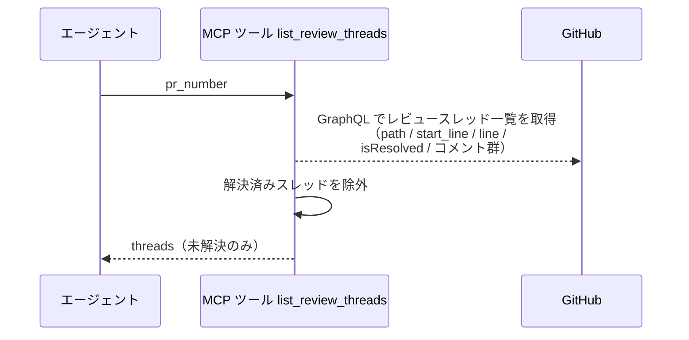
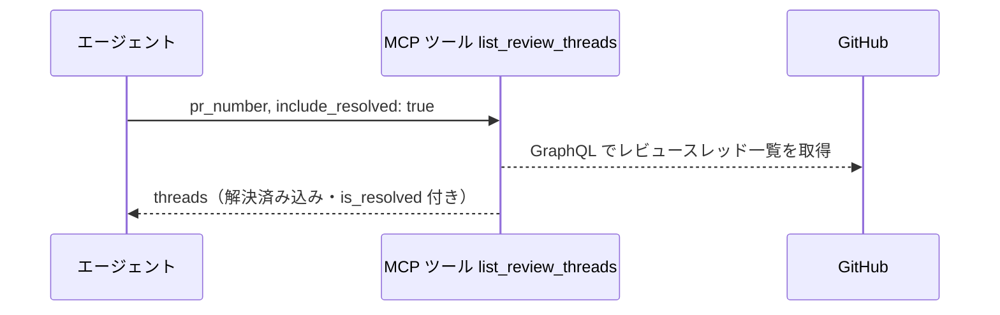
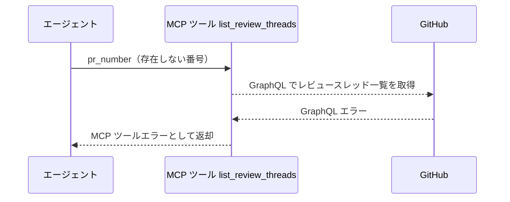

# レビュースレッド一覧

MCP ツール: `list_review_threads`

PR のレビュースレッド（インライン指摘のスレッド）を対象ファイル・行・解決状態・コメント群付きで取得する。
tester / implementer が指摘対応の対象を把握する入口で、既定では解決済みスレッドを除外する。

- 対応テストファイル: `tests/integration/mcp/test_list_review_threads.py`

## インターフェース

### リクエスト

| パラメータ | 型 | 必須 | デフォルト | 説明 | 制限 | 補足 |
| --- | --- | --- | --- | --- | --- | --- |
| `pr_number` | int | ✅ | - | 対象の PR 番号 | - | - |
| `include_resolved` | bool | - | `False` | 解決済みスレッドも含めるか | - | - |

リクエスト例:

```json
{
  "pr_number": 52
}
```

### レスポンス

| フィールド | 型 | 説明 | 制限 | 補足 |
| --- | --- | --- | --- | --- |
| `threads` | object[] | レビュースレッドの配列 | スレッド先頭 100 件・スレッド内コメント先頭 50 件 | - |
| `threads[].node_id` | str | スレッドの GraphQL node_id | - | `PRRT_` 始まり。レビュースレッド一括Resolve の対象指定に使う |
| `threads[].path` | str | 対象ファイルパス | - | - |
| `threads[].line` | int \| null | 対象行番号（範囲コメントは終端行） | - | diff の変化で outdated になった場合 null |
| `threads[].start_line` | int \| null | 範囲コメントの開始行 | - | 単一行コメントは null |
| `threads[].is_resolved` | bool | 解決済みか | - | `include_resolved=true` のときのみ `true` があり得る |
| `threads[].comments` | object[] | スレッド内のコメント（投稿順） | - | - |
| `threads[].comments[].id` | str | コメントの GraphQL node_id | - | - |
| `threads[].comments[].body` | str | コメント本文 | - | - |
| `threads[].comments[].author` | str | 投稿者のログイン名 | - | - |

レスポンス例:

```json
{
  "threads": [
    {
      "node_id": "PRRT_kwDOAbc123",
      "path": "src/ai_monitor/features/agents/service.py",
      "line": 48,
      "start_line": 42,
      "is_resolved": false,
      "comments": [
        { "id": "PRRC_kwDOAbc123xyz", "body": "> from: @architect\n> to: @implementer\n\nnull チェックを追加してください。", "author": "shuhei1101" }
      ]
    }
  ]
}
```

## 制約

| 項目 | 制約 | 補足 |
| --- | --- | --- |
| タイムアウト | 制限なし | - |
| 取得件数 | スレッド先頭 100 件・スレッド内コメント先頭 50 件 | GraphQL のページ指定 |

## フロー一覧

| 分類 | フロー名 | 概要 | 補足 |
| --- | --- | --- | --- |
| 正常 | 正常系 | GraphQL でスレッド取得 → 解決済みを除外して返却 | - |
| 正常 | 正常系（解決済みを含める） | `include_resolved=true` で全スレッド返却 | - |
| 異常 | 異常系（API エラー） | PR 不存在 / 認証切れ | - |

## 正常系

### セットアップ

| セットアップ | 説明 | 補足 |
| --- | --- | --- |
| Mock | GitHub API を差し替え（未解決 + 解決済みが混在する応答を返す） | - |
| 対象 PR | sandbox にレビュースレッド付きの PR が存在 | 番号を入力に使う |

### フロー



### 期待値

- 未解決スレッドだけが返り、各スレッドに `node_id` / `path` / `line` / コメント群（投稿順）が入っている

## 正常系（解決済みを含める）

### セットアップ

| セットアップ | 説明 | 補足 |
| --- | --- | --- |
| Mock | GitHub API を差し替え（未解決 + 解決済みが混在する応答を返す） | - |
| 入力 | `include_resolved: true` で呼び出す | 分岐を決定的に誘発 |

### フロー



### 期待値

- 解決済みスレッドも `is_resolved: true` で含まれて返る

## 異常系（API エラー）

### セットアップ

| セットアップ | 説明 | 補足 |
| --- | --- | --- |
| Mock | GitHub API を差し替え（GraphQL エラーを返す） | - |
| 対象番号 | 存在しない PR 番号を指定して呼び出す | エラーを決定的に誘発 |

### フロー



### 期待値

- MCP ツールエラーが返る（GraphQL エラーの内容を含む）
