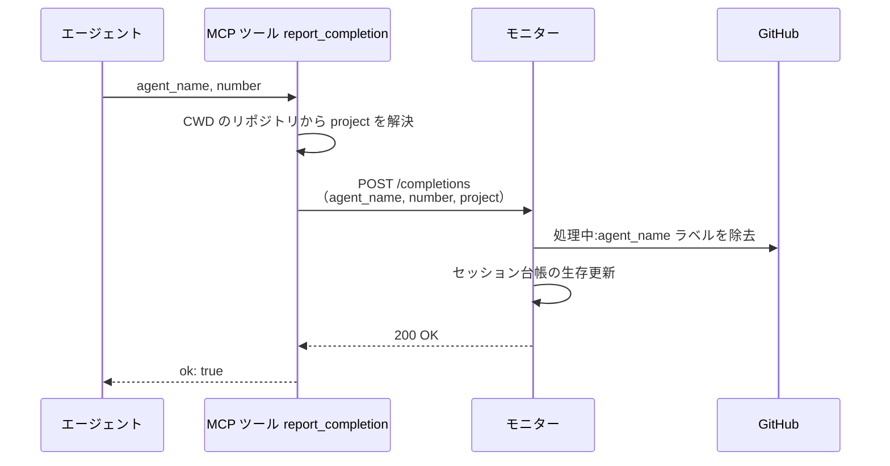
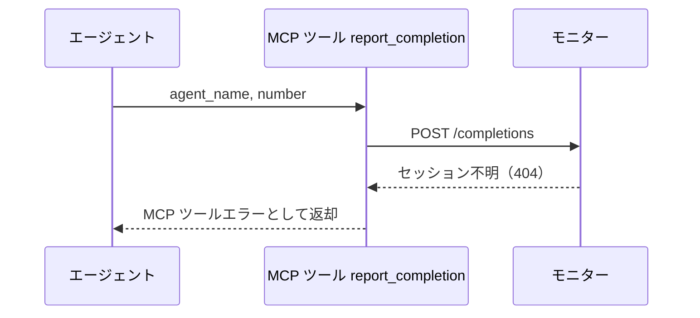
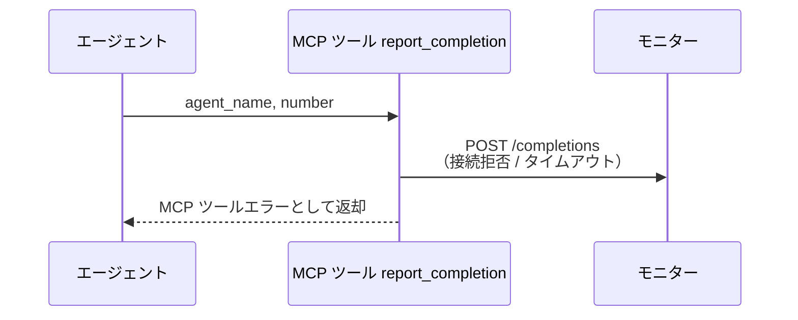

# 作業完了報告

MCP ツール: `report_completion`

エージェントが自分のターン終了（完了処理 or 待機入り）をモニターへ通知する。
ツール内部でモニターが `127.0.0.1` で待ち受ける HTTP API（`POST /completions`・ポートは設定の `port`）を呼ぶラッパーで、エージェントから見える連絡手段は GitHub 操作と同じく MCP に統一される。
モニターはセッション台帳の生存時刻を更新し、send-keys 時に付けた `処理中:{エージェント}` ラベルを対で外す（誰が作業中かの管理はこのラベルの対で成立する）。
報告は best-effort で、失敗してもエージェント側の完了処理は続行してよい（ワークフロー状態の SoT は GitHub 側にあり、未報告セッションはタイムアウト検知が回収する）。

- 対応テストファイル: `tests/integration/mcp/test_report_completion.py`

## インターフェース

### リクエスト

| パラメータ | 型 | 必須 | デフォルト | 説明 | 制限 | 補足 |
| --- | --- | --- | --- | --- | --- | --- |
| `agent_name` | str | ✅ | - | 報告するエージェント名 | - | セッションキーの片割れ |
| `number` | int | ✅ | - | セッションの主番号（スキル起動時に渡された Issue / PR 番号） | - | conductor は常に Issue 番号 |

リクエスト例:

```json
{
  "agent_name": "architect",
  "number": 52
}
```

### レスポンス

| フィールド | 型 | 説明 | 制限 | 補足 |
| --- | --- | --- | --- | --- |
| `ok` | bool | 受理したかどうか | - | 常に `true`（失敗は HTTP ステータスで表現） |

レスポンス例:

```json
{
  "ok": true
}
```

**補足:**

- 同一報告の再送は no-op で `ok: true` を返す（冪等）

### ステータスコード

| ステータスコード | 発生条件 | 補足 |
| --- | --- | --- |
| `200` | 正常受理 | 同一報告の再送（no-op）も `200` |
| `404` | 台帳に該当セッションがない | - |

## 制約

| 項目 | 制約 | 補足 |
| --- | --- | --- |
| タイムアウト | 制限なし | - |
| 受付元 | `127.0.0.1`（localhost）からのみ待受 | - |
| 対象プロジェクト | モニターは単一プロセスで複数プロジェクトを監視し、セッションは `project` + `agent_name` + `number` で特定する | `project` はツールが CWD のリポジトリから解決して自動付与 |

## フロー一覧

| 分類 | フロー名 | 概要 | 補足 |
| --- | --- | --- | --- |
| 正常 | 正常系 | MCP 委譲 → HTTP POST → セッション検索 → `処理中:*` ラベル除去 → 生存更新 | - |
| 異常 | 異常系（セッション不明・404） | 台帳に該当セッションがない | コールドスタート・台帳喪失 |
| 異常 | 異常系（モニター未起動） | デーモン停止中の報告 | エージェント側は無視して続行 |

## 正常系

### セットアップ

| セットアップ | 説明 | 補足 |
| --- | --- | --- |
| Mock | モニターの `POST /completions`（200 を返す） | - |
| モニター | 起動して `POST /completions` を待受中 | - |
| セッション | 台帳に該当セッションが登録済みで、対象に `処理中:{agent_name}` が付与済み | send-keys 直後の状態 |

### フロー



### 期待値

- 対象の `処理中:{agent_name}` ラベルが外れている
- セッション台帳の生存時刻（`last_seen_at`）が更新されている
- 戻り値が `ok: true`

## 異常系（セッション不明・404）

### セットアップ

| セットアップ | 説明 | 補足 |
| --- | --- | --- |
| Mock | モニターの `POST /completions`（404 を返す） | - |
| セッション | モニターを再起動して台帳から該当セッションを消した状態にする | 404 を決定的に誘発 |

### フロー



### 期待値

- MCP ツールエラー（404 の内容を含む）が返る
- エージェントは警告ログのみで続行できる（ワークフロー状態は GitHub 側で完結しており、報告できなくても進行は壊れない）

## 異常系（モニター未起動）

### セットアップ

| セットアップ | 説明 | 補足 |
| --- | --- | --- |
| Mock | なし（未使用ポートへ接続） | - |
| モニター | プロセスを停止した状態にする | 接続拒否を決定的に誘発 |

### フロー



### 期待値

- MCP ツールエラーが返る
- エージェントは失敗を無視して完了処理を続行できる（残った `処理中:*` ラベルと生存時刻は、モニター再起動後のタイムアウト検知と polling の再同期で回収される）
