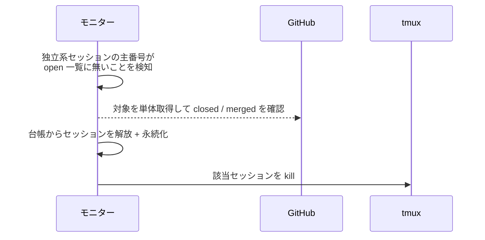
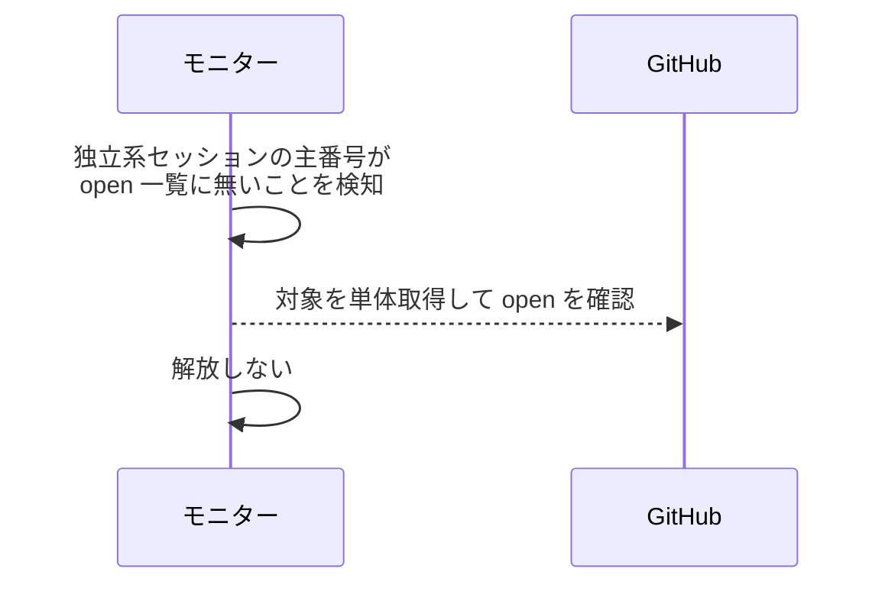
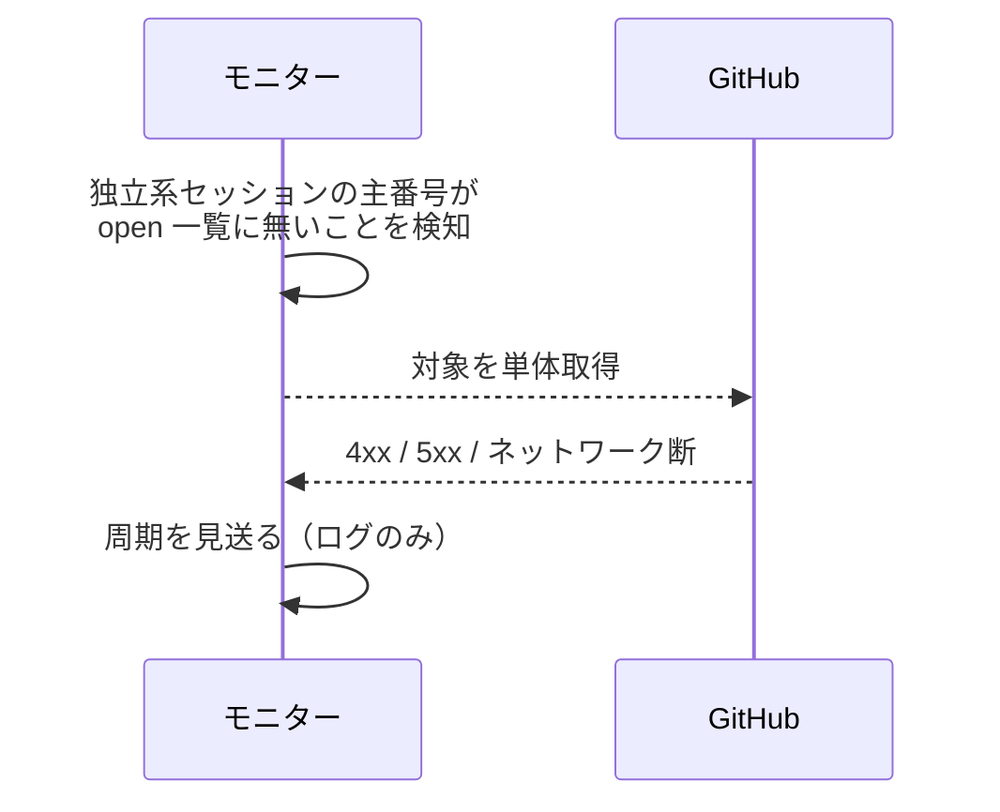

# 個別解放

トリガー: polling 周期（台帳セッションの主番号が open 対象一覧に無いことを検知）

独立系エージェントのセッションを、担当面（PoC PR・chore / question Issue 等）の close / merge 検知で個別に解放する。
ワークフロー系エージェントのセッションは対象外（epic 完了まで常駐し、epic一括解放で解放する）。
クローズは主番号が open 一覧から消えたことを候補化し、単体取得で closed / merged を確認してから解放する（一覧の取りこぼしを除外するため）。

- 対応テストファイル: `tests/integration/monitor/test_個別解放.py`

## 制約

| 項目 | 制約 | 補足 |
| --- | --- | --- |
| 対象エージェント | `epic-poc-runner` / `library-poc-runner` / `resetter` / `quick-implementer` / `questioner` のセッションのみ | - |

## フロー一覧

| 分類 | フロー名 | 概要 | 補足 |
| --- | --- | --- | --- |
| 正常 | 正常系 | 担当面の close を確認してセッションを kill + 台帳から解放 | - |
| 正常 | 正常系（対象が open のまま） | 単体取得で open なら何もしない | 一覧の取りこぼし |
| 異常 | 異常系（GitHub API エラー） | 単体取得の失敗で周期を見送る | - |

## 正常系

### セットアップ

| セットアップ | 説明 | 補足 |
| --- | --- | --- |
| Mock | GitHub API / tmux を差し替え | - |
| 台帳 | `library-poc-runner` のセッション（主番号 = PoC PR #60）が登録済み | - |
| 今周期 | #60 が open 一覧に無く、単体取得は closed を返す | - |

### フロー

### 期待値

- 該当セッションが台帳から除去され永続化されている
- 該当する tmux セッションが kill されている

## 正常系（対象が open のまま）

### セットアップ

| セットアップ | 説明 | 補足 |
| --- | --- | --- |
| Mock | GitHub API / tmux を差し替え | - |
| 今周期 | 主番号が open 一覧に無いが、単体取得は open を返す | 一覧の取りこぼしを再現 |

### フロー

### 期待値

- 台帳・tmux セッションが変化していない

## 異常系（GitHub API エラー）

### セットアップ

| セットアップ | 説明 | 補足 |
| --- | --- | --- |
| Mock | GitHub API を差し替え（単体取得で 4xx / 5xx を返す） | 異常を決定的に誘発 |

### フロー

### 期待値

- モニタープロセスが落ちない
- 台帳・tmux セッションが変化せず、次周期で再試行される
