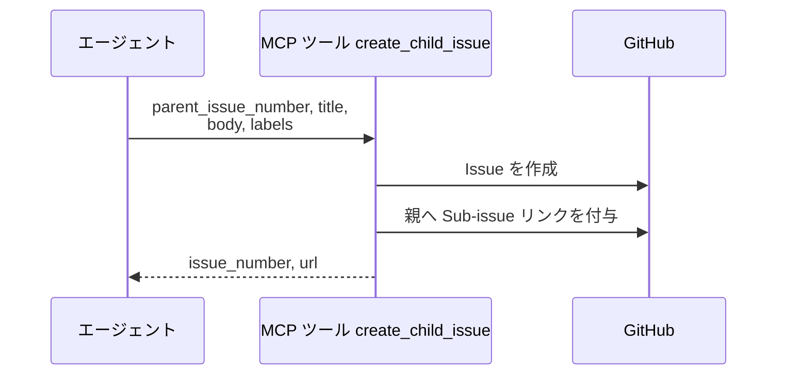
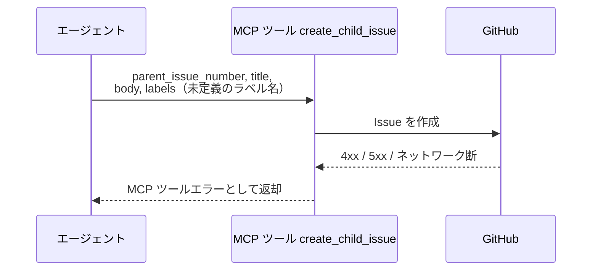

# 子Issue作成

MCP ツール: `create_child_issue`

子 Issue を作成し、GitHub の Sub-issue 機能で親と紐づける。
intake-issue-triager のサブ Issue 起票・conductor の子 story / subsystem 起票はこのツールを使う（子側から `parent` メタデータで親を辿れる）。

- 対応テストファイル: `tests/integration/mcp/test_create_child_issue.py`

## インターフェース

### リクエスト

| パラメータ | 型 | 必須 | デフォルト | 説明 | 制限 | 補足 |
| --- | --- | --- | --- | --- | --- | --- |
| `parent_issue_number` | int | ✅ | - | 親 Issue 番号 | - | Sub-issue リンクの親 |
| `title` | str | ✅ | - | 子 Issue のタイトル | - | - |
| `body` | str | ✅ | - | 子 Issue の本文 | - | - |
| `labels` | list[str] | - | `[]` | 子 Issue に付与するラベル配列 | - | `layer:*` + `確認:*` を付ける運用 |

リクエスト例:

```json
{
  "parent_issue_number": 35,
  "title": "プロフィールを編集する",
  "body": "## 前提条件\n\nなし",
  "labels": ["layer:story", "確認:story-conductor"]
}
```

### レスポンス

| フィールド | 型 | 説明 | 制限 | 補足 |
| --- | --- | --- | --- | --- |
| `issue_number` | int | 作成した Issue 番号 | - | - |
| `url` | str | Issue の html URL | - | - |
| `parent_issue_number` | int | 親 Issue 番号 | - | 参照用 |

レスポンス例:

```json
{
  "issue_number": 36,
  "url": "https://github.com/{owner}/{repo}/issues/36",
  "parent_issue_number": 35
}
```

## 制約

| 項目 | 制約 | 補足 |
| --- | --- | --- |
| タイムアウト | 制限なし | - |

## フロー一覧

| 分類 | フロー名 | 概要 | 補足 |
| --- | --- | --- | --- |
| 正常 | 正常系 | Issue 作成 → 子の REST id 取得 → Sub-issue リンク付与 | - |
| 異常 | 異常系（API エラー） | 認証切れ / 未定義ラベル / ネットワーク断 | リンク付与で失敗した場合、子 Issue は作成済みで残る |

## 正常系

### セットアップ

| セットアップ | 説明 | 補足 |
| --- | --- | --- |
| Mock | GitHub API を差し替え（正常応答を返す） | - |
| 親 Issue | open の親 Issue が存在 | - |
| ラベル定義 | 付与するラベルがリポジトリに定義済み | - |

### フロー



### 期待値

- 子 Issue が指定のタイトル・本文・ラベルで作成されている
- 親の Sub-issue に紐づいている（子の `parent` が親番号を指す）
- 戻り値の `issue_number` / `url` が作成した Issue を指している

## 異常系（API エラー）

### セットアップ

| セットアップ | 説明 | 補足 |
| --- | --- | --- |
| Mock | GitHub API を差し替え（4xx / 5xx を返す） | - |
| 入力 | リポジトリ未定義のラベル名を指定して呼び出す | API エラーを決定的に誘発 |

### フロー



### 期待値

- MCP ツールエラーが返る（HTTP ステータスと本文を含む）
- Sub-issue リンク付与の段で失敗した場合、子 Issue は作成済み・リンクなしの状態で残る

