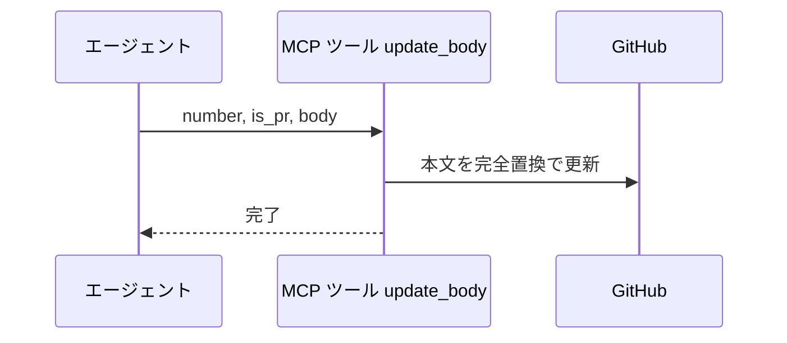
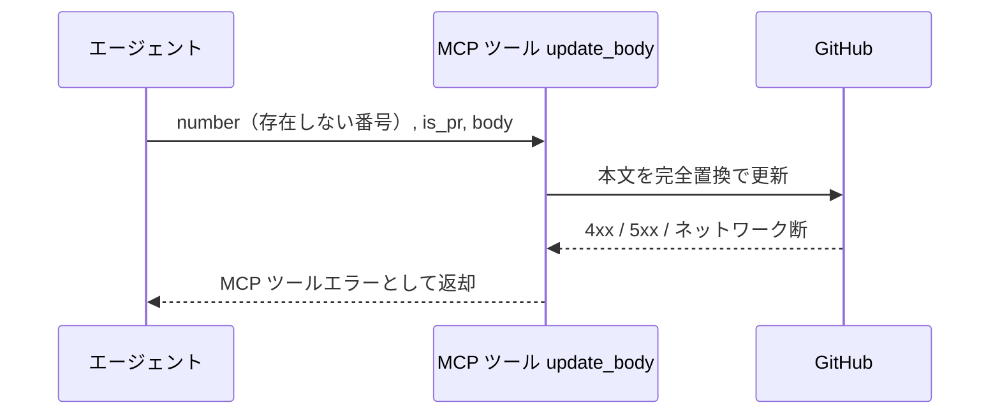

# 本文更新

MCP ツール: `update_body`

Issue / PR の本文を上書きする（既存本文を完全置換）。
「確定した内容は本文・議論はコメント」の原則で、担当セクションの丸ごと置換はこのツールを使う。

- 対応テストファイル: `tests/integration/mcp/test_update_body.py`

## インターフェース

### リクエスト

| パラメータ | 型 | 必須 | デフォルト | 説明 | 制限 | 補足 |
| --- | --- | --- | --- | --- | --- | --- |
| `number` | int | ✅ | - | 対象の Issue / PR 番号 | - | - |
| `is_pr` | bool | ✅ | - | PR なら `True` | - | - |
| `body` | str | ✅ | - | 上書き後の本文 | - | 既存本文を完全置換（部分更新はない） |

リクエスト例:

```json
{
  "number": 35,
  "is_pr": false,
  "body": "## 前提条件\n\nなし\n\n## 概要\n\nプロフィール編集機能を追加する。"
}
```

### レスポンス

| フィールド | 型 | 説明 | 制限 | 補足 |
| --- | --- | --- | --- | --- |
| なし | - | 空オブジェクト | - | 副作用のみ |

レスポンス例:

```json
{}
```

## 制約

| 項目 | 制約 | 補足 |
| --- | --- | --- |
| タイムアウト | 制限なし | - |

## フロー一覧

| 分類 | フロー名 | 概要 | 補足 |
| --- | --- | --- | --- |
| 正常 | 正常系 | body を完全置換で更新 | - |
| 異常 | 異常系（API エラー） | 認証切れ / 対象不存在 / ネットワーク断 | - |

## 正常系

### セットアップ

| セットアップ | 説明 | 補足 |
| --- | --- | --- |
| Mock | GitHub API を差し替え（正常応答を返す） | - |
| 対象 Issue / PR | 既存本文を持つ対象が存在 | - |

### フロー



### 期待値

- 対象の本文が送信した内容に完全置換されている

## 異常系（API エラー）

### セットアップ

| セットアップ | 説明 | 補足 |
| --- | --- | --- |
| Mock | GitHub API を差し替え（4xx / 5xx を返す） | - |
| 対象番号 | 存在しない番号を指定して呼び出す | API エラーを決定的に誘発 |

### フロー



### 期待値

- MCP ツールエラーが返る（HTTP ステータスと本文を含む）
- 本文は変化していない
