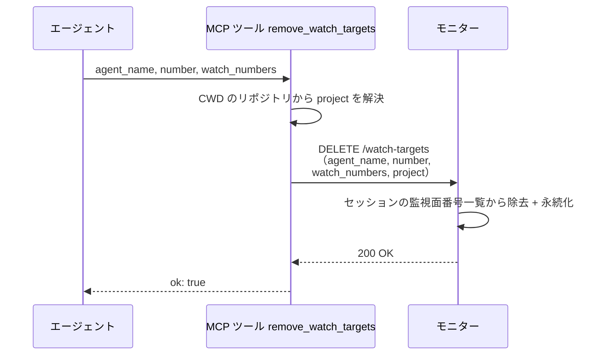
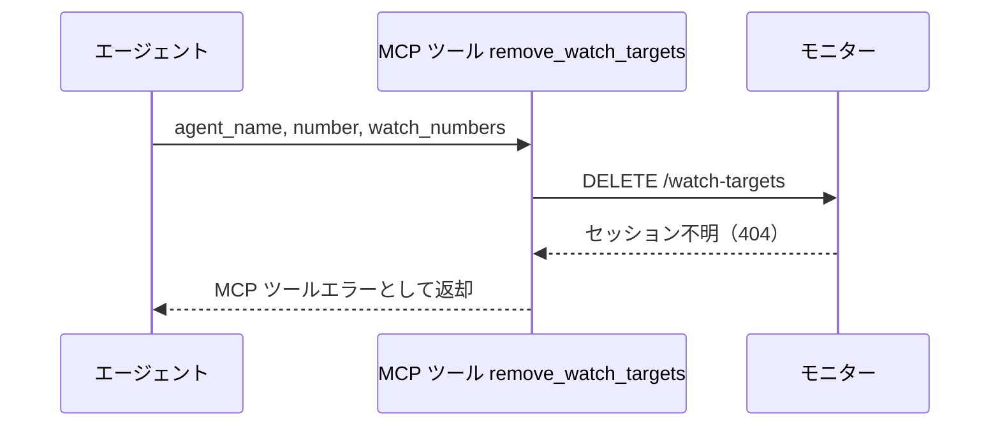

# 監視対象除去

MCP ツール: `remove_watch_targets`

自セッションの監視面としてモニターの台帳に登録した番号を取り除く（PoC PR close 後の完了処理 等）。
ツール内部でモニターの HTTP API（`DELETE /watch-targets`・ポートは設定の `port`）を呼ぶラッパー。

- 対応テストファイル: `tests/integration/mcp/test_remove_watch_targets.py`

## インターフェース

### リクエスト

| パラメータ | 型 | 必須 | デフォルト | 説明 | 制限 | 補足 |
| --- | --- | --- | --- | --- | --- | --- |
| `agent_name` | str | ✅ | - | 報告するエージェント名 | - | セッションキーの片割れ |
| `number` | int | ✅ | - | 自セッションの主番号 | - | スキル起動時に渡された Issue / PR 番号 |
| `watch_numbers` | list[int] | ✅ | - | 監視面から取り除く Issue / PR 番号 | 1 件以上 | - |

リクエスト例:

```json
{
  "agent_name": "architect",
  "number": 52,
  "watch_numbers": [60, 61]
}
```

### レスポンス

| フィールド | 型 | 説明 | 制限 | 補足 |
| --- | --- | --- | --- | --- |
| `ok` | bool | 受理したかどうか | - | 常に `true`（失敗は HTTP ステータスで表現） |

レスポンス例:

```json
{
  "ok": true
}
```

**補足:**

- 未登録番号の指定は no-op で `ok: true` を返す（冪等）

### ステータスコード

| ステータスコード | 発生条件 | 補足 |
| --- | --- | --- |
| `200` | 正常受理 | 未登録番号の指定（no-op）も `200` |
| `404` | 台帳に該当セッションがない | - |

## 制約

| 項目 | 制約 | 補足 |
| --- | --- | --- |
| タイムアウト | 制限なし | - |
| 受付元 | `127.0.0.1`（localhost）からのみ待受 | - |
| 対象プロジェクト | セッションは `project` + `agent_name` + `number` で特定する | `project` はツールが CWD のリポジトリから解決して自動付与 |

## フロー一覧

| 分類 | フロー名 | 概要 | 補足 |
| --- | --- | --- | --- |
| 正常 | 正常系 | MCP 委譲 → HTTP DELETE → セッション検索 → 監視面除去 | - |
| 異常 | 異常系（セッション不明・404） | 台帳に該当セッションがない | コールドスタート・台帳喪失 |

## 正常系

### セットアップ

| セットアップ | 説明 | 補足 |
| --- | --- | --- |
| Mock | モニターの `DELETE /watch-targets`（200 を返す） | - |
| セッション | 台帳に主番号 52 のセッションが監視面 `[60, 61]` 付きで登録済み | - |

### フロー



### 期待値

- 対象セッションの監視面番号一覧から `watch_numbers` が取り除かれている
- 戻り値が `ok: true`

## 異常系（セッション不明・404）

### セットアップ

| セットアップ | 説明 | 補足 |
| --- | --- | --- |
| Mock | モニターの `DELETE /watch-targets`（404 を返す） | - |
| セッション | 台帳に該当セッションが無い状態にする | 404 を決定的に誘発 |

### フロー



### 期待値

- MCP ツールエラー（404 の内容を含む）が返る
- エージェントは警告ログのみで続行できる（残った監視面はセッション解放時に台帳ごと消える）
