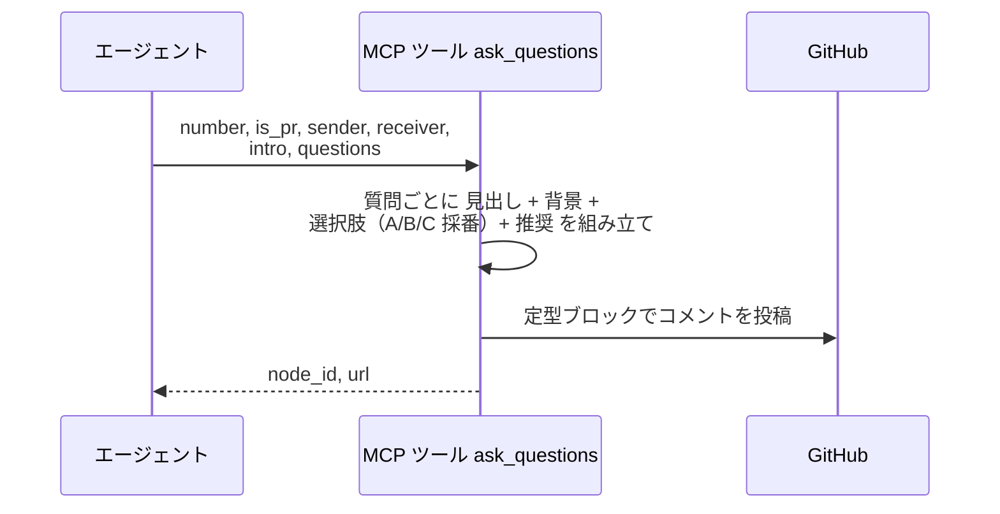
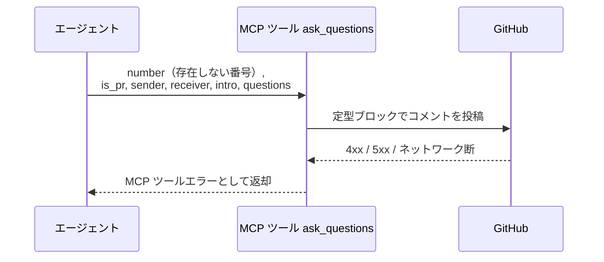

# 質問投稿

MCP ツール: `ask_questions`

選択肢 + 推奨マーク付きの確認質問コメントを投稿する。
各質問は「質問文 / 背景 / 選択肢（A / B / C ... + 理由）/ 推奨」の形式で提示され、ユーザーは記号で返信する。
エージェント質問案の投稿書式はこのツールで強制される。

- 対応テストファイル: `tests/integration/mcp/test_ask_questions.py`

## インターフェース

### リクエスト

| パラメータ | 型 | 必須 | デフォルト | 説明 | 制限 | 補足 |
| --- | --- | --- | --- | --- | --- | --- |
| `number` | int | ✅ | - | 対象の Issue / PR 番号 | - | - |
| `is_pr` | bool | ✅ | - | PR なら `True` | - | - |
| `sender` | str | ✅ | - | 送信者のエージェント名 | - | `@` は不要 |
| `receiver` | str | - | なし（to 行なし = 現担当宛） | 宛先名 | - | 通常はユーザーのログイン名 |
| `intro` | str | ✅ | - | 質問リストの前に置く前置き文 | - | 空文字なら省略される |
| `questions[].question` | str | ✅ | - | 質問文 | - | 各質問の `##` 見出しになる |
| `questions[].background` | str | ✅ | - | 質問の背景説明（なぜこの確認が必要か） | - | 空文字なら省略される |
| `questions[].choices[].label` | str | ✅ | - | 選択肢の要約ラベル（1〜数語） | - | - |
| `questions[].choices[].reason` | str | ✅ | - | この選択肢を選ぶ理由・説明 | - | - |
| `questions[].recommended_index` | int | - | `-1` | 推奨する選択肢の 0-indexed | - | `-1` で推奨なし（推奨行が省略される） |
| `questions[].recommended_reason` | str | - | `""` | 推奨の理由 | - | - |

リクエスト例:

```json
{
  "number": 35,
  "is_pr": false,
  "sender": "epic-conductor",
  "receiver": "shuhei1101",
  "intro": "epic の要件確定にあたり 1 点確認させてください。",
  "questions": [
    {
      "question": "実現可能性 PoC は必要ですか？",
      "background": "本 epic はリアルタイム同期という未検証の機構に依存しています。",
      "choices": [
        { "label": "必要", "reason": "核心機構が未検証のため先に成立確認する" },
        { "label": "不要", "reason": "既存技術の組み合わせで成立が自明" }
      ],
      "recommended_index": 0,
      "recommended_reason": "性能が成立条件になっているため"
    }
  ]
}
```

### レスポンス

| フィールド | 型 | 説明 | 制限 | 補足 |
| --- | --- | --- | --- | --- |
| `node_id` | str | 投稿コメントの GraphQL node_id | - | Resolve / 返信の対象指定に使う |
| `url` | str | コメントの html URL | - | - |

レスポンス例:

```json
{
  "node_id": "IC_kwDOAbc123xyz",
  "url": "https://github.com/{owner}/{repo}/issues/35#issuecomment-123456"
}
```

## 制約

| 項目 | 制約 | 補足 |
| --- | --- | --- |
| タイムアウト | 制限なし | - |

## フロー一覧

| 分類 | フロー名 | 概要 | 補足 |
| --- | --- | --- | --- |
| 正常 | 正常系 | 質問リストの本文組み立て → 定型ブロック化 → REST 投稿 | - |
| 異常 | 異常系（API エラー） | 認証切れ / 対象不存在 / ネットワーク断 | - |

## 正常系

### セットアップ

| セットアップ | 説明 | 補足 |
| --- | --- | --- |
| Mock | GitHub API を差し替え（正常応答を返す） | - |
| 対象 Issue / PR | sandbox に open の対象が存在 | 番号を入力に使う |

### フロー



### 期待値

- 質問見出し・背景・選択肢（A / B / C ...）・推奨行を含む定型コメントが追加されている
- 戻り値の `node_id` / `url` が追加されたコメントを指している

## 異常系（API エラー）

### セットアップ

| セットアップ | 説明 | 補足 |
| --- | --- | --- |
| Mock | GitHub API を差し替え（4xx / 5xx を返す） | - |
| 対象番号 | 存在しない番号を指定して呼び出す | API エラーを決定的に誘発 |

### フロー



### 期待値

- MCP ツールエラーが返る（HTTP ステータスと本文を含む）
- コメントは追加されていない
