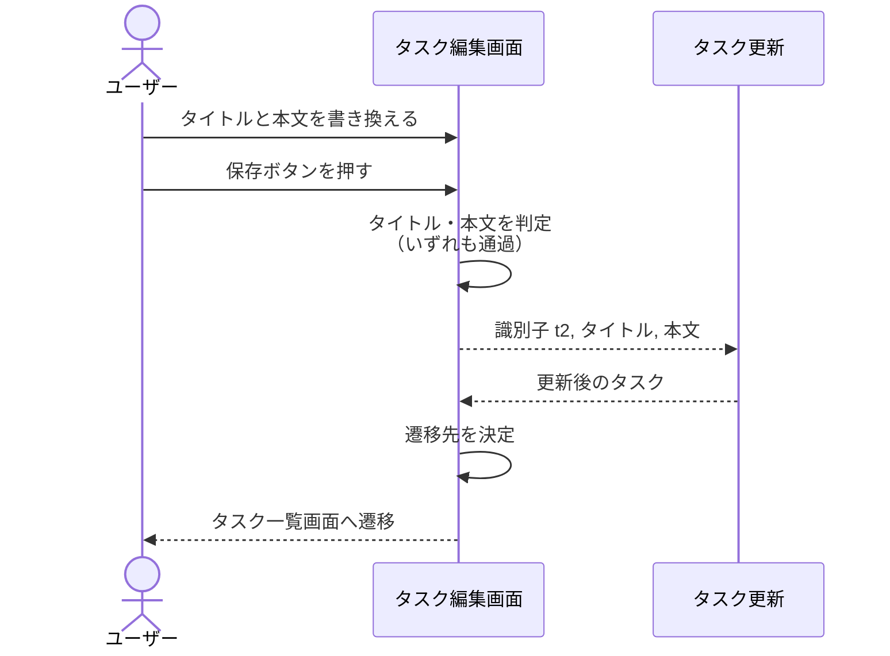
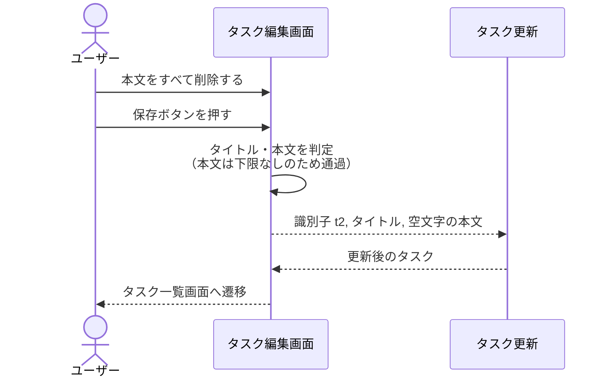
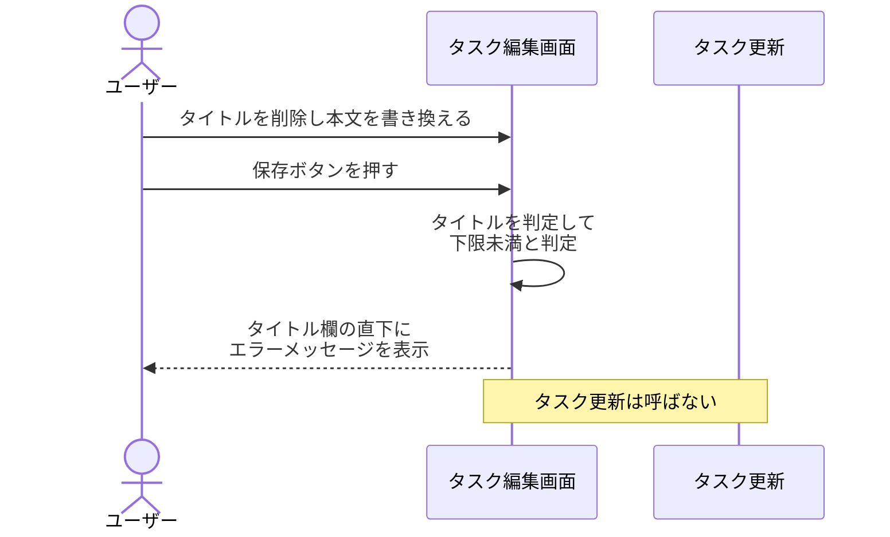
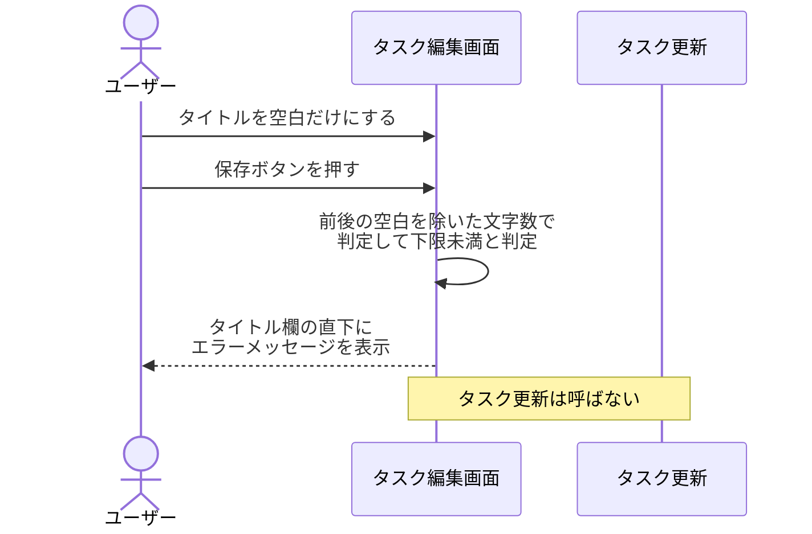
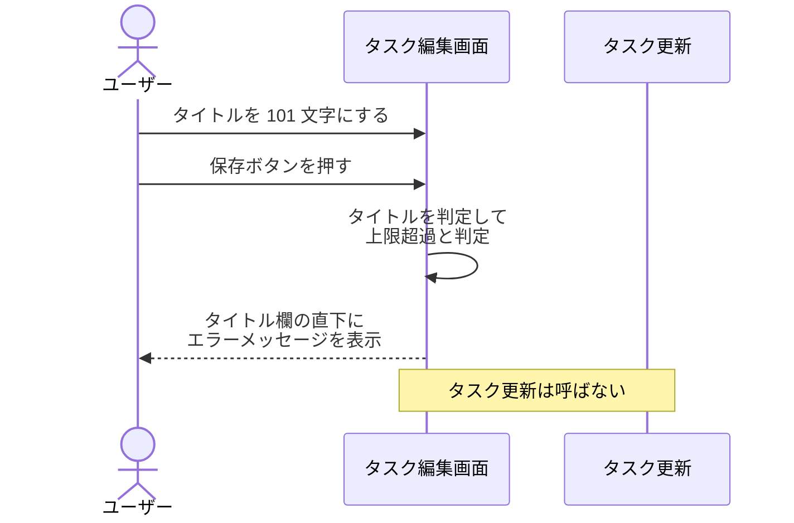
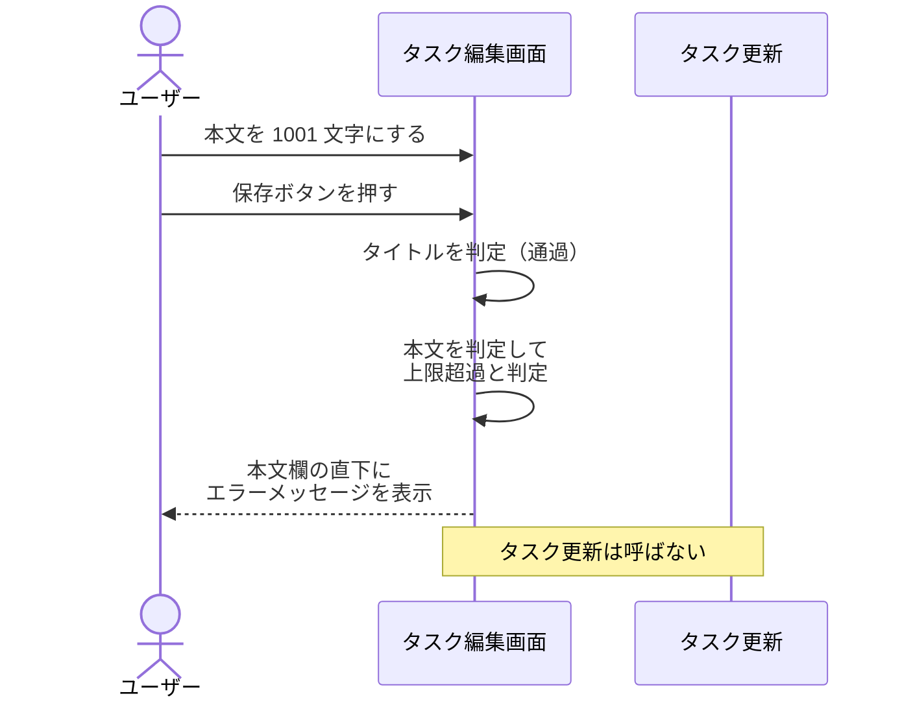
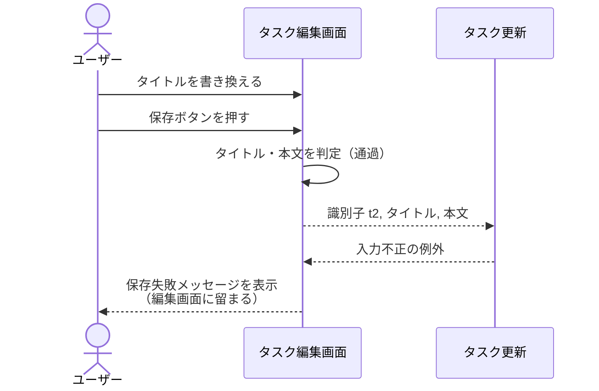
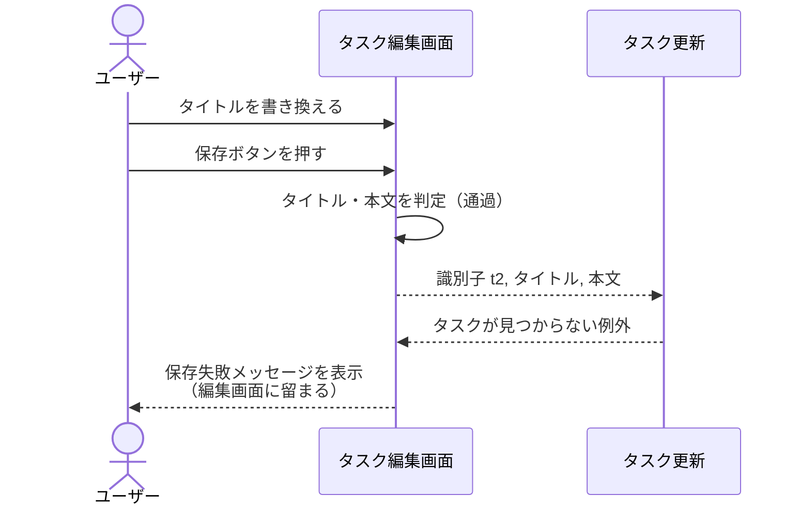

# タスクの保存

画面: `src/screens/task_edit.py`
呼び出し先: `タスク更新`（Mock）

タスク編集画面で保存ボタンを押したときに、入力チェックを行い、通過したらバックエンドのタスク更新を呼び、成功したらタスク一覧画面へ遷移する操作。
入力チェックで弾いたときはバックエンドを呼ばず、更新が例外を返したときは一覧画面へ遷移せず、いずれも編集画面に留まって書き換えた入力内容を保持する。

- 対応テストファイル: -

## 制約

| 項目 | 制約 | 補足 |
| --- | --- | --- |
| 保存操作の実行条件 | 常に実行できる | 入力内容による保存ボタンの非活性化を行わない（epic #1069 の PR #1072 の確定画面仕様） |
| 入力チェックの対象と順序 | タイトル → 本文 の順に判定し、違反を検出した時点で以降の判定と `タスク更新` の呼び出しを行わない | 判定条件は [タスク編集画面](../画面構成/タスク編集画面.py.md) の ※1 |
| タイトルの判定値 | 前後の空白を除いた文字数が 1 文字以上 100 文字以内 | 下限は定数と比較して判定し、「空文字かどうか」の直接比較にしない |
| 本文の判定値 | 入力値そのままの文字数が 1000 文字以内 | 下限は設けない |
| 判定値の持ち方 | 判定値を定数として定義し、上限のエラーメッセージを同じ定数から組み立てる | 判定条件とメッセージの食い違いを防ぐ |
| 入力チェック違反時の呼び出し | `タスク更新` を呼ばない | 呼んでいないことを期待値で確認する |
| `タスク更新` へ渡す値 | タイトル・本文の両方を必ず渡す | 片方だけの部分更新は受け付けない（PR #1082 の申し送り） |
| タイトルに渡す値 | 前後の空白を除いた値 | 判定に使った値と送る値を一致させる |
| 本文に渡す値 | 入力値そのまま（空のときは空文字） | 前後の空白も内容の一部として扱う |
| 保存成功時の遷移先 | タスク一覧画面（画面識別子 `task-list`） | 遷移時に引き渡す値は持たない |
| 遷移先の決定 | 1 箇所に集約する | 編集画面・一覧画面の URL 形式が #1079 側で確定したときの変更箇所を 1 点に留める（Issue #1085 の非機能要件） |
| 保存失敗時の扱い | 一覧画面へ遷移せず、書き換えた入力内容を保持したまま保存失敗メッセージを表示する | 文言は [タスク編集画面](../画面構成/タスク編集画面.py.md) の ※4 |
| 入力内容の保持 | 入力チェック違反時・保存失敗時とも、書き換えた入力値をそのまま保持する | 初期表示値の側は書き換えない |
| 認可 | 制限なし | 認証・タスク所有者の概念を導入しない |
| 同時更新の制御 | 制限なし | 楽観的ロック・競合検出は行わない |
| 二重送信の防止 | 行わない | 画面層とバックエンドが同期呼び出しで処理中の状態が発生しない |
| 応答時間 | 保存操作から一覧画面の表示開始まで 1 秒以内 | 呼び出し先の `タスク更新` が p95 500ms 以内 |
| 副作用 | 保存成功時のみ保管先の対象タスクが更新される | 入力チェック違反時・保存失敗時は保管されているタスクを変更しない |

## フロー一覧

| 分類 | フロー名 | 概要 | 補足 |
| --- | --- | --- | --- |
| 正常 | 正常系 | タイトル・本文を書き換えて保存し、一覧画面へ遷移する | 単一 UC シナリオ「正常シナリオ」に対応 |
| 正常 | 正常系（本文を空にして保存） | 本文に空文字を渡して保存する | 単一 UC シナリオ「正常シナリオ（本文を空にして保存）」に対応 |
| 異常 | 異常系（タイトルが未入力） | `タスク更新` を呼ばずタイトル欄にインライン表示する | 単一 UC シナリオ「異常シナリオ（タイトル未入力）」に対応 |
| 異常 | 異常系（タイトルが空白のみ） | 未入力と同じ扱いで弾く | 前後の空白を除いてから判定していることを固定する |
| 異常 | 異常系（タイトルが上限超過） | `タスク更新` を呼ばずタイトル欄にインライン表示する | 101 文字を入力した場合 |
| 異常 | 異常系（本文が上限超過） | `タスク更新` を呼ばず本文欄にインライン表示する | 1001 文字を入力した場合。タイトルは有効な値にする |
| 異常 | 異常系（保存が入力不正で失敗） | 一覧画面へ遷移せず保存失敗メッセージを表示する | 画面のチェックをすり抜けた入力をバックエンドが弾いた場合 |
| 異常 | 異常系（保存でタスクが見つからない） | 一覧画面へ遷移せず保存失敗メッセージを表示する | 編集画面を開いた後に対象が削除された場合に相当 |

タイトル・本文の境界値（下限未満 / 下限ちょうど / 上限ちょうど / 上限超過）の網羅は単体テストで固定する。
本セクションでは判定対象ごとに違反時の振る舞いを 1 フローずつ置く。

## 正常系

### セットアップ

| セットアップ | 説明 | 補足 |
| --- | --- | --- |
| Mock | `タスク更新` が更新後のタスクを返す | 呼び出し先の関数を差し替える |
| 画面 | 識別子 `t2` / タイトル `週次レポートの提出` / 本文 `今週の進捗をまとめる` を初期表示値として編集画面を表示済み | `タスク編集画面の表示` を済ませた状態にする |
| 入力 | タイトルを `週次レポートの提出（改訂）`、本文を `今週の進捗と来週の予定をまとめる` に書き換える | 両方を書き換えた状態を再現 |

### フロー

### 期待値

- タスク一覧画面への遷移先が返っている
- `タスク更新` に渡した識別子が `t2`、タイトルが `週次レポートの提出（改訂）`、本文が `今週の進捗と来週の予定をまとめる` である
- `タスク更新` の呼び出しが 1 回である
- タイトルエラーメッセージ・本文エラーメッセージ・保存失敗メッセージのいずれも表示されていない
- 遷移先が引き渡す値を持っていない

## 正常系（本文を空にして保存）

### セットアップ

| セットアップ | 説明 | 補足 |
| --- | --- | --- |
| Mock | `タスク更新` が更新後のタスクを返す | 呼び出し先の関数を差し替える |
| 画面 | 識別子 `t2` / タイトル `週次レポートの提出` / 本文 `今週の進捗をまとめる` を初期表示値として編集画面を表示済み | - |
| 入力 | 本文をすべて削除して空にする。タイトルは初期表示値のままにする | 本文を空にして保存した状態を再現 |

### フロー

### 期待値

- タスク一覧画面への遷移先が返っている
- `タスク更新` に渡した本文が空文字である
- `タスク更新` に渡したタイトルが初期表示値と同じ `週次レポートの提出` である
- 本文エラーメッセージが表示されていない

## 異常系（タイトルが未入力）

### セットアップ

| セットアップ | 説明 | 補足 |
| --- | --- | --- |
| Mock | `タスク更新` を呼び出し回数が数えられる関数に差し替える | 呼んでいないことを確認するため |
| 画面 | 識別子 `t2` / タイトル `週次レポートの提出` / 本文 `今週の進捗をまとめる` を初期表示値として編集画面を表示済み | - |
| 入力 | タイトルをすべて削除して空にし、本文を `来週の予定もまとめる` に書き換える | タイトル判定の下限違反を決定的に誘発する |

### フロー

### 期待値

- タイトルエラーメッセージ「タイトルを入力してください。」が表示されている
- `タスク更新` が 1 回も呼び出されていない
- タスク一覧画面への遷移が起きておらず、編集画面の表示状態が返っている
- 書き換えた本文 `来週の予定もまとめる` が本文入力欄に保持されている
- 本文エラーメッセージ・保存失敗メッセージが表示されていない

## 異常系（タイトルが空白のみ）

### セットアップ

| セットアップ | 説明 | 補足 |
| --- | --- | --- |
| Mock | `タスク更新` を呼び出し回数が数えられる関数に差し替える | 呼んでいないことを確認するため |
| 画面 | 識別子 `t2` / タイトル `週次レポートの提出` / 本文 `今週の進捗をまとめる` を初期表示値として編集画面を表示済み | - |
| 入力 | タイトルを空白だけの文字列に書き換える | 前後の空白を除いてから判定していることを決定的に確認する |

### フロー

### 期待値

- タイトルエラーメッセージ「タイトルを入力してください。」が表示されている
- `タスク更新` が 1 回も呼び出されていない
- タスク一覧画面への遷移が起きておらず、編集画面の表示状態が返っている
- 入力したタイトル（空白だけの文字列）がタイトル入力欄に保持されている

## 異常系（タイトルが上限超過）

### セットアップ

| セットアップ | 説明 | 補足 |
| --- | --- | --- |
| Mock | `タスク更新` を呼び出し回数が数えられる関数に差し替える | 呼んでいないことを確認するため |
| 画面 | 識別子 `t2` / タイトル `週次レポートの提出` / 本文 `今週の進捗をまとめる` を初期表示値として編集画面を表示済み | - |
| 入力 | タイトルを 101 文字に書き換える | タイトル判定の上限違反を決定的に誘発する |

### フロー

### 期待値

- タイトルエラーメッセージが表示されており、文言に上限の値（100）が含まれている
- `タスク更新` が 1 回も呼び出されていない
- タスク一覧画面への遷移が起きておらず、編集画面の表示状態が返っている
- 入力した 101 文字のタイトルがタイトル入力欄に保持されている

## 異常系（本文が上限超過）

### セットアップ

| セットアップ | 説明 | 補足 |
| --- | --- | --- |
| Mock | `タスク更新` を呼び出し回数が数えられる関数に差し替える | 呼んでいないことを確認するため |
| 画面 | 識別子 `t2` / タイトル `週次レポートの提出` / 本文 `今週の進捗をまとめる` を初期表示値として編集画面を表示済み | - |
| 入力 | タイトルは有効な値のままにし、本文を 1001 文字に書き換える | 本文判定の上限違反だけを誘発する |

### フロー

### 期待値

- 本文エラーメッセージが表示されており、文言に上限の値（1000）が含まれている
- タイトルエラーメッセージが表示されていない
- `タスク更新` が 1 回も呼び出されていない
- タスク一覧画面への遷移が起きておらず、編集画面の表示状態が返っている
- 入力した 1001 文字の本文が本文入力欄に保持されている

## 異常系（保存が入力不正で失敗）

### セットアップ

| セットアップ | 説明 | 補足 |
| --- | --- | --- |
| Mock | `タスク更新` が入力不正の例外を送出する | 画面のチェックをすり抜けた入力をバックエンドが弾いた状態を再現 |
| 画面 | 識別子 `t2` / タイトル `週次レポートの提出` / 本文 `今週の進捗をまとめる` を初期表示値として編集画面を表示済み | - |
| 入力 | タイトルを `週次レポートの提出（改訂）` に書き換える | 画面の判定は通過する値にする |

### フロー

### 期待値

- 保存失敗メッセージ「保存できませんでした。入力内容を確認してください。」が表示されている
- タスク一覧画面への遷移が起きておらず、編集画面の表示状態が返っている
- 書き換えたタイトル `週次レポートの提出（改訂）` がタイトル入力欄に保持されている
- 未捕捉の内部エラーになっていない

## 異常系（保存でタスクが見つからない）

### セットアップ

| セットアップ | 説明 | 補足 |
| --- | --- | --- |
| Mock | `タスク更新` が「タスクが見つからない」の例外を送出する | 編集画面を開いた後に対象が削除された状態を再現 |
| 画面 | 識別子 `t2` / タイトル `週次レポートの提出` / 本文 `今週の進捗をまとめる` を初期表示値として編集画面を表示済み | - |
| 入力 | タイトルを `週次レポートの提出（改訂）` に書き換える | 画面の判定は通過する値にする |

### フロー

### 期待値

- 保存失敗メッセージ「タスクが見つかりません」が表示されている
- 入力不正のときとは異なる文言が表示されている
- タスク一覧画面への遷移が起きておらず、編集画面の表示状態が返っている
- 書き換えたタイトル `週次レポートの提出（改訂）` がタイトル入力欄に保持されている
- 未捕捉の内部エラーになっていない
