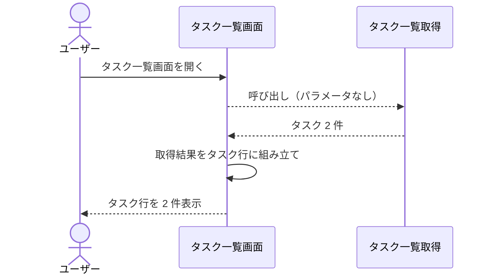
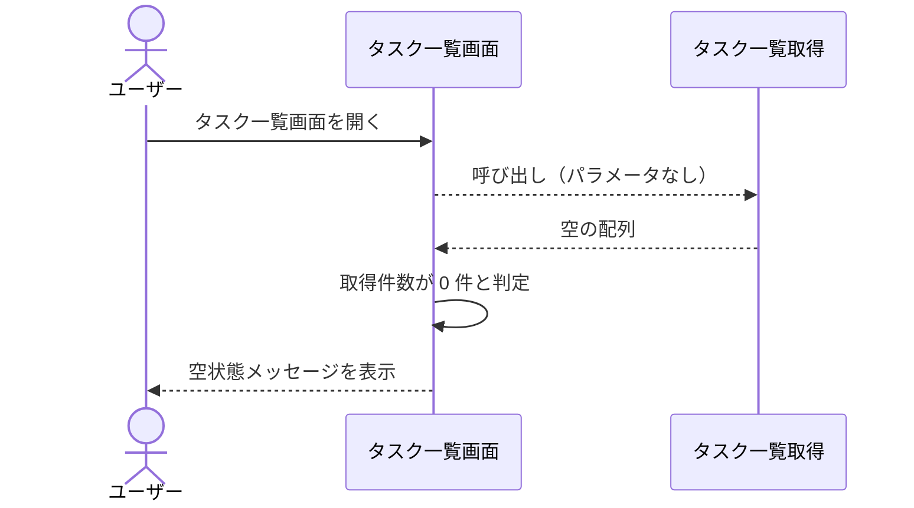
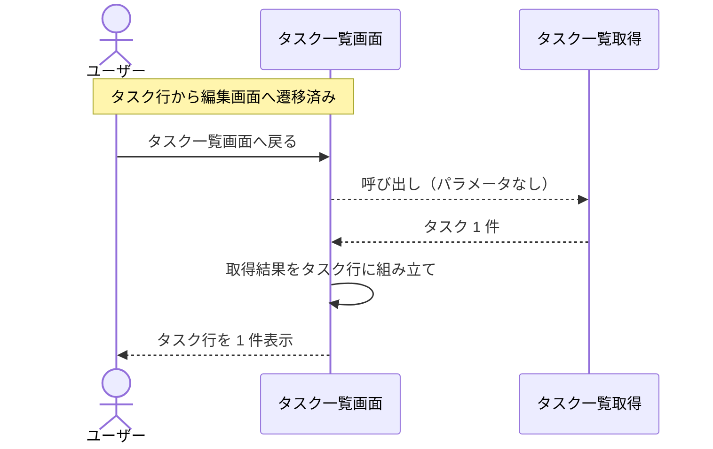

# タスク一覧画面の表示

画面: `src/screens/task_list.py`
呼び出し先: `タスク一覧取得`（Mock）

タスク一覧画面を開いたときに、バックエンドのタスク一覧取得を呼び、取得結果をタスク行として表示する操作。
編集画面から一覧画面へ戻ったときの再表示も本操作で行う。

- 対応テストファイル: -

## 制約

| 項目 | 制約 | 補足 |
| --- | --- | --- |
| 表示件数 | 制限なし（取得結果を全件表示する） | ページング・最大表示件数は設けない |
| 並び順 | `タスク一覧取得` が返した順（識別子の昇順）のまま | 画面側で並べ替え・絞り込みをしない |
| 表示項目 | 識別子・タイトルの 2 項目 | 要素の確定値は [タスク一覧画面](../画面構成/タスク一覧画面.py.md) の要素一覧 |
| 表示の再取得 | 画面を開くたびに `タスク一覧取得` を呼ぶ（取得結果をまたぎで保持しない） | 編集画面から戻ったときに最新の内容になることを担保する |
| 認可 | 制限なし | 認証・タスク所有者の概念を導入しない |
| 応答時間 | 制限なし | 呼び出し先の `タスク一覧取得` が p95 500ms 以内 |
| 副作用 | なし（保管されているタスクを変更しない） | - |

## フロー一覧

| 分類 | フロー名 | 概要 | 補足 |
| --- | --- | --- | --- |
| 正常 | 正常系 | 取得したタスクを識別子の昇順でタスク行として表示する | - |
| 正常 | 正常系（登録が 0 件） | タスク表を出さず空状態メッセージを表示する | - |
| 正常 | 正常系（編集画面から戻ったとき） | 一覧を取得し直して最新の内容で表示する | - |

## 正常系

### セットアップ

| セットアップ | 説明 | 補足 |
| --- | --- | --- |
| Mock | `タスク一覧取得` がタスク 2 件を識別子の昇順で返す | 呼び出し先の関数を差し替える |
| タスク | 識別子 `t1` のタスク | `title: 買い物リストの作成` |
| タスク | 識別子 `t2` のタスク | `title: 週次レポートの提出` |

### フロー

### 期待値

- タスク行が `t1`, `t2` の順で 2 件表示されている
- 各行に識別子とタイトルが表示されている
- 空状態メッセージ・未検出メッセージが表示されていない

## 正常系（登録が 0 件）

### セットアップ

| セットアップ | 説明 | 補足 |
| --- | --- | --- |
| Mock | `タスク一覧取得` が空の配列を返す | 0 件の状態を決定的に作る |
| タスク | 1 件も登録しない | - |

### フロー

### 期待値

- 空状態メッセージ「タスクがありません」が表示されている
- タスク表が表示されていない
- 例外は送出されない

## 正常系（編集画面から戻ったとき）

### セットアップ

| セットアップ | 説明 | 補足 |
| --- | --- | --- |
| Mock | `タスク一覧取得` が 1 回目にタスク 2 件、2 回目にタスク 1 件を返す | 戻ったときに取得し直していることを決定的に確認する |
| 画面 | 一覧画面から編集画面へ遷移済み | 1 回目の取得を済ませた状態にする |

### フロー

### 期待値

- `タスク一覧取得` が 2 回目の呼び出しを受けている
- タスク行が 2 回目の取得結果（1 件）で表示されている
- 遷移前の取得結果（2 件）が残っていない

## 異常系

なし（`タスク一覧取得` は入力を受け取らず例外を送出しないため、本操作に失敗要因がない）。
