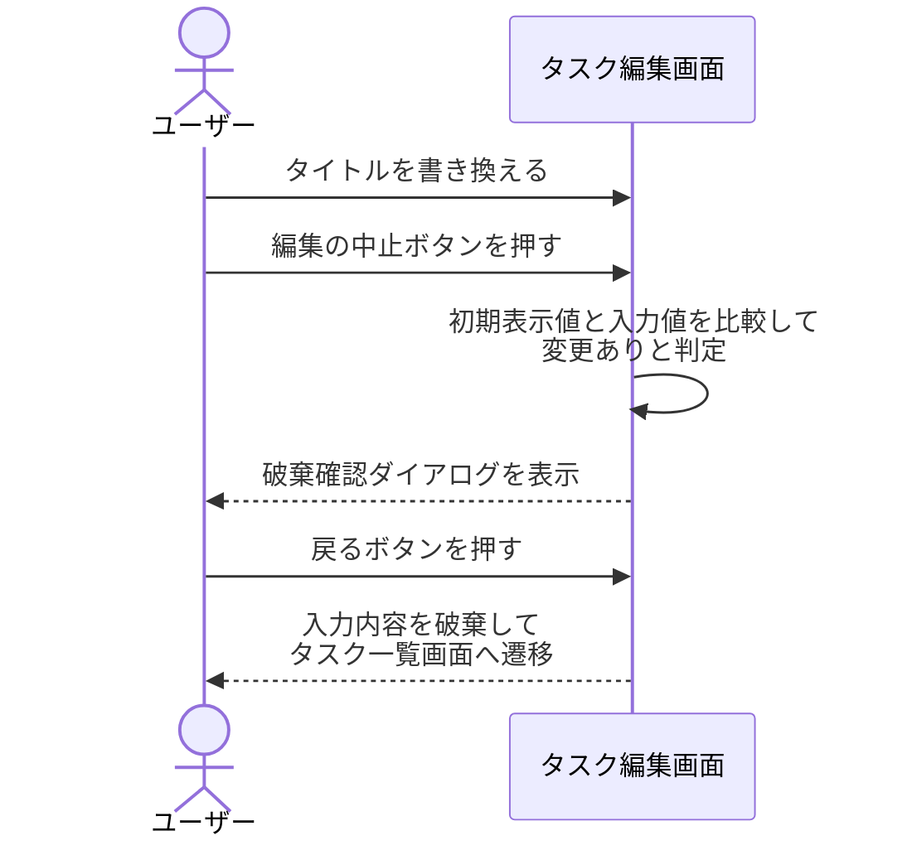
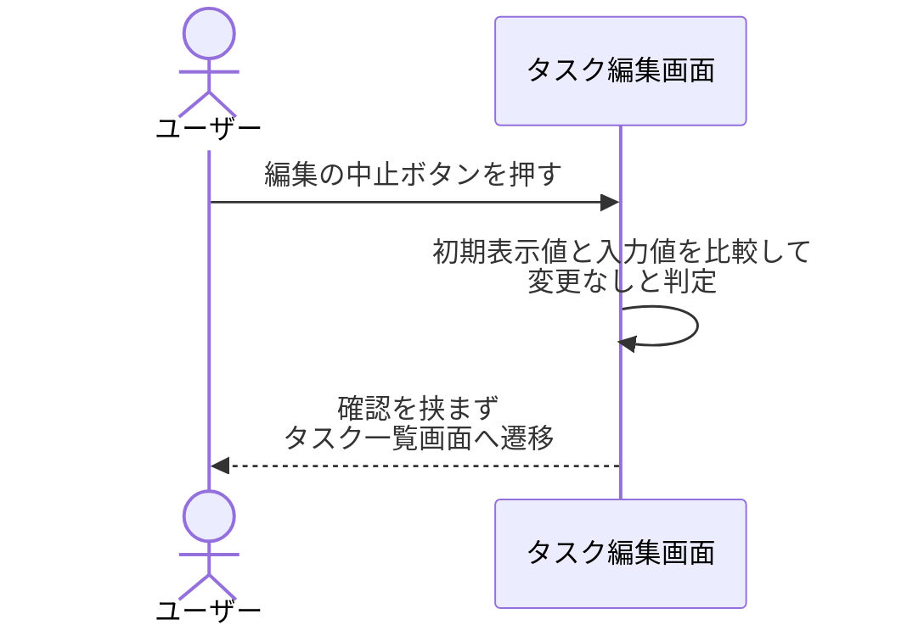
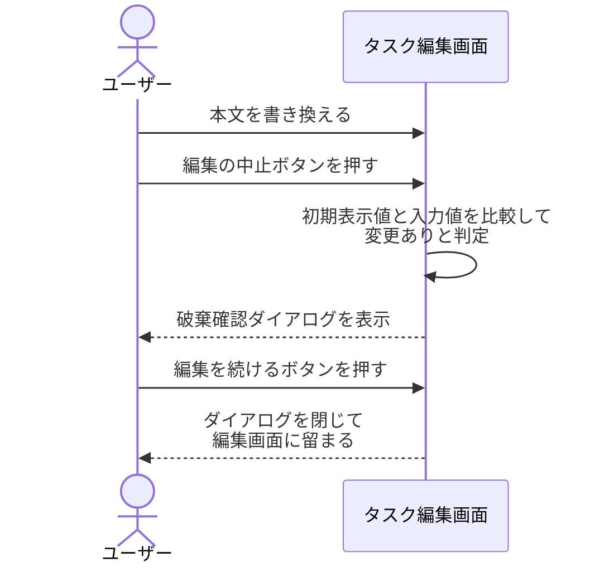
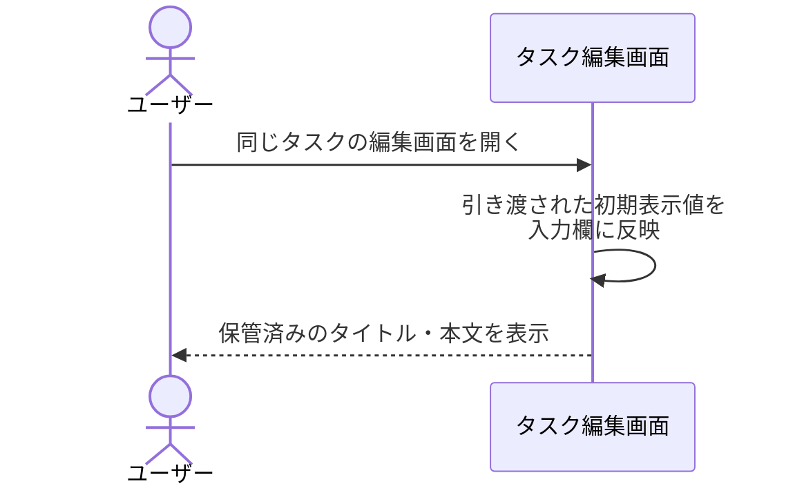

# タスク編集の中止

画面: `src/screens/task_edit.py`
呼び出し先: なし（更新・取得のいずれの操作も呼ばない）

タスク編集画面で「編集の中止」を押したときに、入力内容の変更有無を判定し、変更があれば破棄確認を挟んでタスク一覧画面へ戻る操作。
更新操作を呼ばず画面上の入力内容だけを捨てるため、対象タスクの内容は編集前のまま保持される。
初期表示値は一覧画面から引き渡された値を使い、本画面では取得操作を呼ばない。

- 対応テストファイル: `tests/integration/screens/test_task_edit_cancel.py`

## 制約

| 項目 | 制約 | 補足 |
| --- | --- | --- |
| 変更判定の対象 | タイトル入力欄・本文入力欄の 2 要素 | 画面上のそれ以外の要素は判定に含めない |
| 変更判定の方法 | 初期表示値と現在の入力値を文字列としてそのまま比較する | 前後の空白の除去などの正規化を行わない。いずれか 1 つでも一致しなければ変更ありとする |
| 破棄確認の表示条件 | 変更ありのときのみ表示する | 変更なしのときは確認を挟まない |
| 遷移先 | タスク一覧画面（画面識別子 `task-list`） | URL 形式は #1079 の確定に従い、本操作では新規に定義しない |
| 遷移時に引き渡す値 | なし | 一覧画面は自身で一覧を取得し直す |
| 入力内容の保存先 | 持たない（画面の外に書き出さない） | 中止後に同じタスクを開き直すと保管済みの値が初期表示される |
| 呼び出す操作 | なし | 更新・取得のいずれも呼ばないことを期待値で確認する |
| キーボード操作 | 破棄確認の「戻る」「編集を続ける」を両方選択できる | Issue #1081 の非機能要件 |
| 認可 | 制限なし | 認証・タスク所有者の概念を導入しない |
| タイムアウト | 制限なし | 外部の呼び出しを伴わない |
| 応答時間 | 中止ボタンの押下から遷移開始まで 1 秒以内 | 画面内で完結し待ち合わせが発生しない |
| 副作用 | なし（保管されているタスクを変更しない） | - |

## フロー一覧

| 分類 | フロー名 | 概要 | 補足 |
| --- | --- | --- | --- |
| 正常 | 正常系 | 変更ありで中止し、破棄確認の「戻る」で一覧画面へ戻る | シナリオ「入力を変更してから中止する」に対応 |
| 正常 | 正常系（入力を変更していない） | 破棄確認を挟まず一覧画面へ戻る | シナリオ「入力を変更せずに中止する」に対応 |
| 正常 | 正常系（破棄確認で編集を続ける） | 確認を閉じて編集画面に留まり、入力を保持する | シナリオ「確認ダイアログで編集を続ける」に対応 |
| 正常 | 正常系（中止後に同じタスクを開き直す） | 保管済みの値が初期表示され、破棄した入力は残らない | シナリオ「中止したあとに同じタスクの編集画面を開き直す」に対応 |

## 正常系

### セットアップ

| セットアップ | 説明 | 補足 |
| --- | --- | --- |
| Mock | なし（外部の呼び出しを伴わないため差し替える依存がない） | 更新・取得のいずれも呼ばないことが本操作の要件 |
| 画面 | タイトル `週次レポートの提出` / 本文 `今週の進捗をまとめる` を初期表示値として編集画面を表示済み | 一覧画面から引き渡された状態を再現 |
| 入力 | タイトルを `週次レポートの提出（改訂）` に書き換える | 変更ありを決定的に誘発する |

### フロー

### 期待値

- タスク一覧画面へ遷移している
- 更新操作・取得操作のいずれも呼び出していない
- 保管されているタスクのタイトル・本文が編集前の値のまま変化していない

## 正常系（入力を変更していない）

### セットアップ

| セットアップ | 説明 | 補足 |
| --- | --- | --- |
| Mock | なし（外部の呼び出しを伴わないため差し替える依存がない） | - |
| 画面 | タイトル `週次レポートの提出` / 本文 `今週の進捗をまとめる` を初期表示値として編集画面を表示済み | 一覧画面から引き渡された状態を再現 |
| 入力 | タイトル・本文のいずれも書き換えない | 変更なしを決定的に誘発する |

### フロー

### 期待値

- タスク一覧画面へ遷移している
- 破棄確認ダイアログが表示されていない
- 更新操作・取得操作のいずれも呼び出していない
- 保管されているタスクのタイトル・本文が編集前の値のまま変化していない

## 正常系（破棄確認で編集を続ける）

### セットアップ

| セットアップ | 説明 | 補足 |
| --- | --- | --- |
| Mock | なし（外部の呼び出しを伴わないため差し替える依存がない） | - |
| 画面 | タイトル `週次レポートの提出` / 本文 `今週の進捗をまとめる` を初期表示値として編集画面を表示済み | 一覧画面から引き渡された状態を再現 |
| 入力 | 本文を `来週の予定もまとめる` に書き換える | 破棄確認の表示を決定的に誘発する |

### フロー

### 期待値

- タスク編集画面が表示されたままで、タスク一覧画面へ遷移していない
- 書き換えた本文 `来週の予定もまとめる` が本文入力欄に保持されている
- タイトル入力欄が初期表示値のまま保持されている
- 破棄確認ダイアログが表示されていない
- 保管されているタスクのタイトル・本文が編集前の値のまま変化していない

## 正常系（中止後に同じタスクを開き直す）

### セットアップ

| セットアップ | 説明 | 補足 |
| --- | --- | --- |
| Mock | なし（外部の呼び出しを伴わないため差し替える依存がない） | - |
| 画面 | タイトルを `週次レポートの提出（改訂）` に書き換えたあと、編集の中止でタスク一覧画面へ戻った直後の状態 | 破棄した入力が持ち越されないことを確認するための前提 |
| 入力 | 保管済みの値（タイトル `週次レポートの提出` / 本文 `今週の進捗をまとめる`）を初期表示値として、同じタスクの編集画面をもう一度開く | 一覧画面からの引き渡しを再現 |

### フロー

### 期待値

- タイトル入力欄に `週次レポートの提出`、本文入力欄に `今週の進捗をまとめる` が表示されている
- 中止する前に入力していた `週次レポートの提出（改訂）` が画面のどこにも表示されていない
- 破棄確認ダイアログが表示されていない

## 異常系

なし（更新・取得のいずれの操作も呼ばず画面内で完結するため、業務的に意味のある異常が発生しない）。
編集画面を開く時点の取得失敗は `編集画面への遷移` のフロントエンド結合で扱う。
