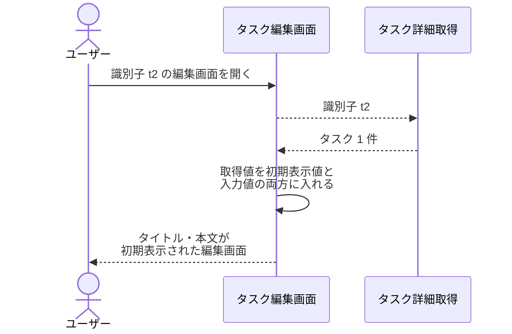
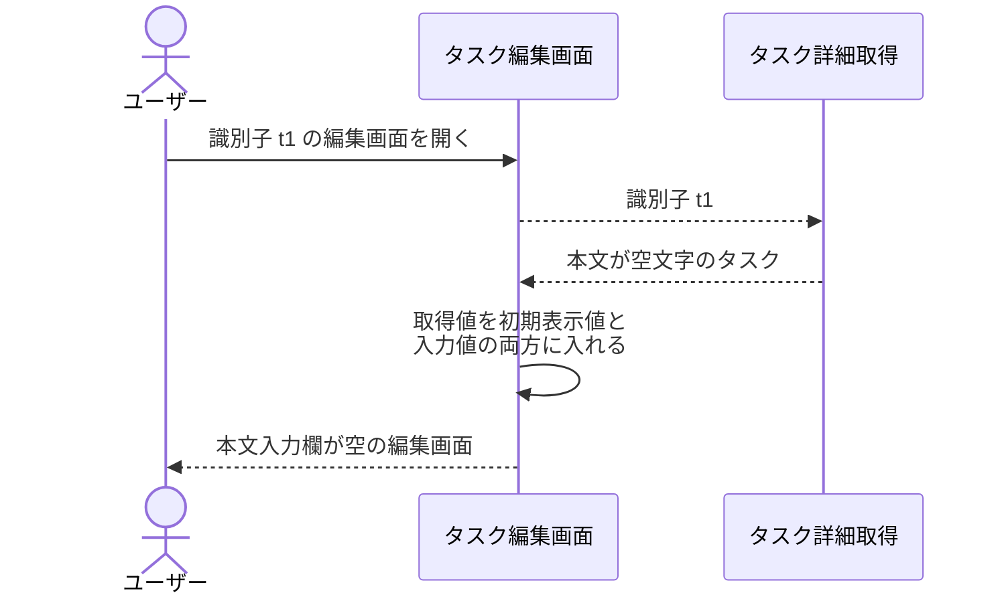
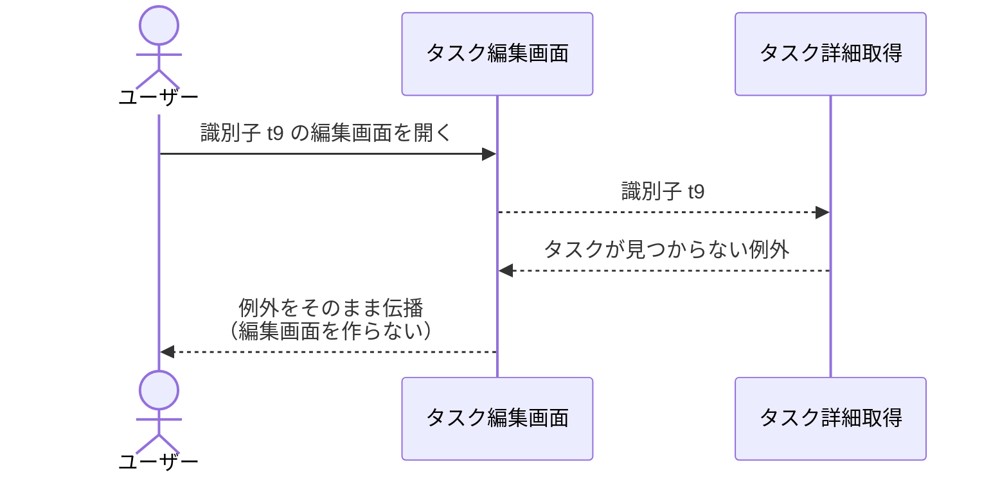
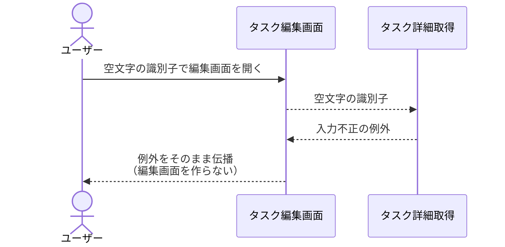

# タスク編集画面の表示

画面: `src/screens/task_edit.py`
呼び出し先: `タスク詳細取得`（Mock）

編集対象の識別子を受け取ってタスク編集画面を開いたときに、バックエンドのタスク詳細取得を呼び、タイトル・本文の初期表示値を組み立てる操作。
一覧画面から編集画面へ遷移する導線は別サブシステム #1079（PR #1083）の担当のため、本操作は編集対象の識別子を受け取ったところを起点にする。
取得した値は入力欄の現在値と初期表示値の両方に入れ、以降の入力で初期表示値の側は書き換えない。

- 対応テストファイル: -

## 制約

| 項目 | 制約 | 補足 |
| --- | --- | --- |
| 取得の呼び出し | 画面を開くたびに `タスク詳細取得` を 1 回だけ呼ぶ | 取得結果を画面をまたいで保持しない |
| 渡す識別子 | 受け取った識別子をそのまま渡す | 画面側で加工しない |
| 初期表示値 | `タスク詳細取得` が返したタイトル・本文をそのまま入力欄に入れる | 画面側で加工しない |
| 初期表示値の保持 | 取得値を初期表示値としても保持し、以降の入力で書き換えない | 入力変更の有無の判定に使う（#1081 / PR #1084 の表示状態の定義に合わせる） |
| 本文が未設定のとき | 空文字を初期表示値にする | `タスク詳細取得` が空文字を返す |
| 取得に失敗したときの扱い | 例外を捕捉せず呼び出し元へ伝播させ、編集画面を表示しない | 未検出時の画面表示は遷移導線を持つ #1079 の担当（※1） |
| 入力チェック | 行わない | 保管済みの値をそのまま表示するだけで、検証は保存操作の側で行う |
| 認可 | 制限なし | 認証・タスク所有者の概念を導入しない |
| タイムアウト | 制限なし | 保管先の参照のみで待ち合わせが発生しない |
| 応答時間 | 画面を開いてから初期表示まで 1 秒以内 | 呼び出し先の `タスク詳細取得` が p95 500ms 以内。#1079 の「行の選択から編集画面の表示開始まで 1 秒以内」に揃える |
| 副作用 | なし（保管されているタスクを変更しない） | - |

※1: `タスク詳細取得` が送出する「タスクが見つからない」「識別子の形式が不正」の例外は、本操作では捕捉しない。
一覧画面に留まって未検出メッセージを表示し一覧を取得し直す扱いは、遷移導線を持つ #1079（PR #1083 の `編集画面への遷移`）が確定済みで、同じ責務を本操作にも置くと表示の出し分けが 2 箇所に分かれるため。
本操作の異常系は「例外がそのまま伝播し、編集画面の表示状態が作られない」ことだけを固定する。

## フロー一覧

| 分類 | フロー名 | 概要 | 補足 |
| --- | --- | --- | --- |
| 正常 | 正常系 | 取得したタイトル・本文を初期表示値として編集画面を表示する | 単一 UC シナリオ 3 本すべての起点 |
| 正常 | 正常系（本文が未設定） | 本文入力欄を空で表示する | 本文が未設定のタスクを開いた場合 |
| 異常 | 異常系（対象タスクが見つからない） | 例外をそのまま伝播させ、編集画面を表示しない | 一覧表示後に対象が削除された場合に相当 |
| 異常 | 異常系（識別子の形式が不正） | 例外をそのまま伝播させ、編集画面を表示しない | 一覧由来の識別子では発生しない想定の防御 |

## 正常系

### セットアップ

| セットアップ | 説明 | 補足 |
| --- | --- | --- |
| Mock | `タスク詳細取得` が識別子 `t2` のタスクを返す | 呼び出し先の関数を差し替える |
| タスク | 識別子 `t2` のタスク | `title: 週次レポートの提出` / `content: 今週の進捗をまとめる` |
| 入力 | 識別子 `t2` を指定して編集画面を開く | 一覧の 2 件目を選んで遷移してきた状態を再現 |

### フロー

### 期待値

- タイトル入力欄に `週次レポートの提出`、本文入力欄に `今週の進捗をまとめる` が表示されている
- 初期表示値として保持しているタイトル・本文が、入力欄の現在値と同じ値になっている
- `タスク詳細取得` に渡した識別子が `t2` である
- `タスク詳細取得` の呼び出しが 1 回である
- タイトルエラーメッセージ・本文エラーメッセージ・保存失敗メッセージのいずれも表示されていない
- 保管されているタスクの内容が変化していない

## 正常系（本文が未設定）

### セットアップ

| セットアップ | 説明 | 補足 |
| --- | --- | --- |
| Mock | `タスク詳細取得` が本文が空文字のタスクを返す | 本文が未設定の状態を決定的に作る |
| タスク | 識別子 `t1` のタスク | `title: 買い物リストの作成` / `content: 空文字` |
| 入力 | 識別子 `t1` を指定して編集画面を開く | - |

### フロー

### 期待値

- タイトル入力欄に `買い物リストの作成` が表示されている
- 本文入力欄が空文字である
- 初期表示値として保持している本文が空文字である
- 例外は送出されない

## 異常系（対象タスクが見つからない）

### セットアップ

| セットアップ | 説明 | 補足 |
| --- | --- | --- |
| Mock | `タスク詳細取得` が「タスクが見つからない」の例外を送出する | 一覧表示後に対象が削除された状態を再現 |
| 入力 | 登録されていない識別子 `t9` を指定して編集画面を開く | - |

### フロー

### 期待値

- タスクが見つからないことを表す例外が呼び出し元へ伝播している
- 編集画面の表示状態が作られていない
- 例外が入力不正の例外と型で区別できる
- 保管されているタスクの内容が変化していない

## 異常系（識別子の形式が不正）

### セットアップ

| セットアップ | 説明 | 補足 |
| --- | --- | --- |
| Mock | `タスク詳細取得` が入力不正の例外を送出する | 形式検証の違反を決定的に誘発する |
| 入力 | 空文字の識別子を指定して編集画面を開く | 一覧由来では起こらない値を仕込む |

### フロー

### 期待値

- 入力不正を表す例外が呼び出し元へ伝播している
- 編集画面の表示状態が作られていない
- 未捕捉の内部エラーとして別の例外型に化けていない
- 保管されているタスクの内容が変化していない
