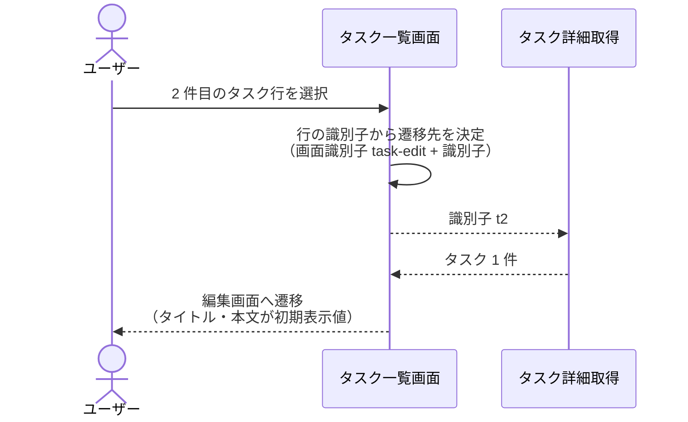
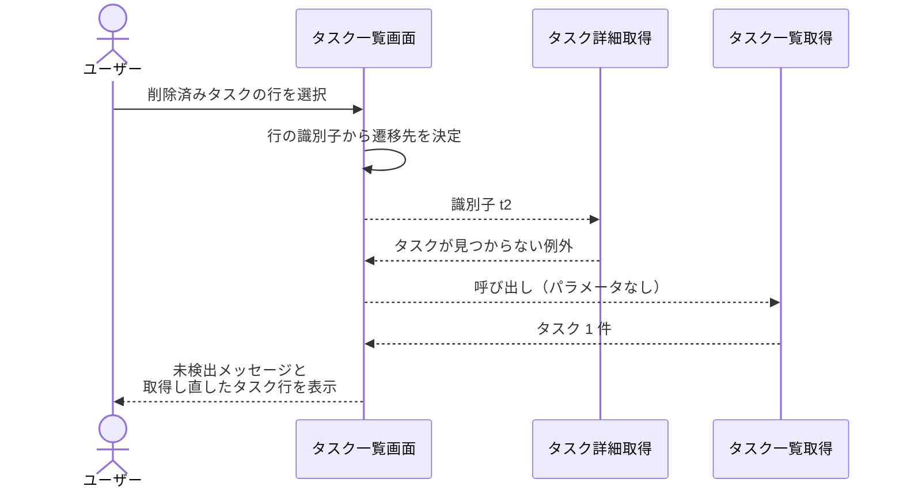
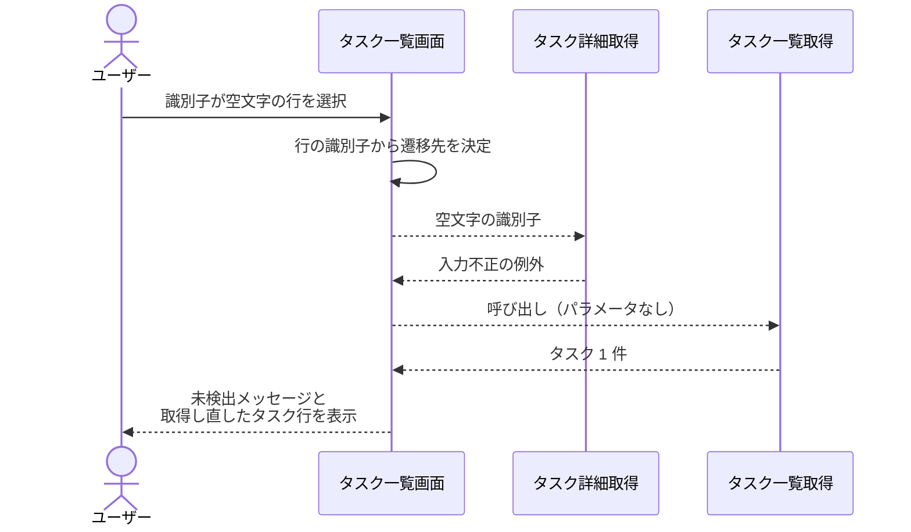

# 編集画面への遷移

画面: `src/screens/task_list.py`
呼び出し先: `タスク詳細取得` / `タスク一覧取得`（Mock）

タスク一覧画面でタスク行を選択したときに、そのタスクの編集画面への遷移先を決め、対象タスクの詳細を取得して初期表示値として引き渡す操作。
詳細取得に失敗した場合は遷移せず、一覧画面に留まって未検出メッセージを表示する。

- 対応テストファイル: `tests/integration/test_select_task_row.py`

## 制約

| 項目 | 制約 | 補足 |
| --- | --- | --- |
| 導線の対象 | 一覧に表示されている全てのタスク行 | 編集可否による導線の出し分けを行わない |
| 遷移先の表現 | 画面識別子 `task-edit` と対象タスクの識別子の組で持つ | 画面識別子は epic #1069 の PR#1072 で確定済み |
| 遷移先の URL 形式 | `/task-edit/{タスク識別子}` | 編集画面の URL 形式が epic #1069 で確定するまでの暫定値。URL 文字列への変換は 1 箇所に集約し、確定時の変更箇所を 1 点に留める |
| URL への識別子の埋め込み | パーセントエンコードして埋め込む | 識別子の文字種は保証されていない（`タスク詳細取得` の制約は長さのみ）ため、区切り文字が混入してもパスの構造が変わらないようにする |
| 詳細取得に渡す識別子 | 選択した行の識別子セルの値をそのまま渡す | 画面側で加工しない |
| 初期表示値 | `タスク詳細取得` が返したタイトル・本文をそのまま引き渡す | 画面側で加工しない |
| 遷移の担当範囲 | 遷移先と初期表示値を決めて引き渡すところまで | 編集画面本体（フォーム・保存・中止）は epic #1069 の担当 |
| 所要時間 | 行の選択から編集画面の表示開始まで 1 秒以内 | 呼び出し先の `タスク詳細取得` が p95 500ms 以内 |
| 認可 | 制限なし | 認証・タスク所有者の概念を導入しない |
| 副作用 | なし（保管されているタスクを変更しない） | - |

## フロー一覧

| 分類 | フロー名 | 概要 | 補足 |
| --- | --- | --- | --- |
| 正常 | 正常系 | 選択した行のタスクの詳細を取得し、編集画面へ遷移する | - |
| 異常 | 異常系（対象タスクが見つからない） | 未検出メッセージを表示し、一覧を取得し直す | 一覧表示後に対象が削除された場合 |
| 異常 | 異常系（識別子の形式が不正） | 見つからない場合と同じ表示にする | 一覧由来の識別子では発生しない想定の防御 |

## 正常系

### セットアップ

| セットアップ | 説明 | 補足 |
| --- | --- | --- |
| Mock | `タスク詳細取得` が識別子 `t2` のタスクを返す | 呼び出し先の関数を差し替える |
| 画面 | タスク行が `t1`, `t2` の 2 件表示されている | 一覧画面の表示を済ませた状態にする |
| 入力 | 2 件目（`t2`）の行を選択する | 一覧の 2 件目を選んだ状態を再現 |

### フロー

### 期待値

- 遷移先が編集画面（画面識別子 `task-edit`）で、遷移先の URL に選択したタスクの識別子 `t2` が含まれている
- 編集画面へ引き渡す初期表示値のタイトル・本文が `t2` の登録値と一致している
- 未検出メッセージが表示されていない
- 保管されているタスクの内容が変化していない

## 異常系（対象タスクが見つからない）

### セットアップ

| セットアップ | 説明 | 補足 |
| --- | --- | --- |
| Mock | `タスク詳細取得` が「タスクが見つからない」の例外を送出する | 一覧表示後に対象が削除された状態を再現 |
| Mock | `タスク一覧取得` が残りのタスク 1 件を返す | 再取得の結果が変わることを決定的に確認する |
| 画面 | タスク行が `t1`, `t2` の 2 件表示されている | 一覧画面の表示を済ませた状態にする |
| 入力 | 削除済みの `t2` の行を選択する | - |

### フロー

### 期待値

- 編集画面へ遷移しておらず、タスク一覧画面に留まっている
- 未検出メッセージ「タスクが見つかりません」が表示されている
- タスク行が取得し直した内容（1 件）で表示されている
- 未捕捉の内部エラーになっていない
- 保管されているタスクの内容が変化していない

## 異常系（識別子の形式が不正）

### セットアップ

| セットアップ | 説明 | 補足 |
| --- | --- | --- |
| Mock | `タスク詳細取得` が入力不正の例外を送出する | 形式検証の違反を決定的に誘発する |
| Mock | `タスク一覧取得` がタスク 1 件を返す | 再取得の呼び出しを受けられるようにする |
| 画面 | 識別子が空文字のタスク行が 1 件表示されている | 一覧由来では起こらない値を仕込む |
| 入力 | 識別子が空文字の行を選択する | - |

### フロー

### 期待値

- 編集画面へ遷移しておらず、タスク一覧画面に留まっている
- 未検出メッセージ「タスクが見つかりません」が表示されている（見つからない場合と同じ表示）
- 未捕捉の内部エラーになっていない
- 保管されているタスクの内容が変化していない
