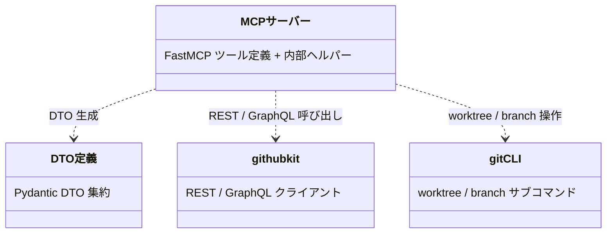
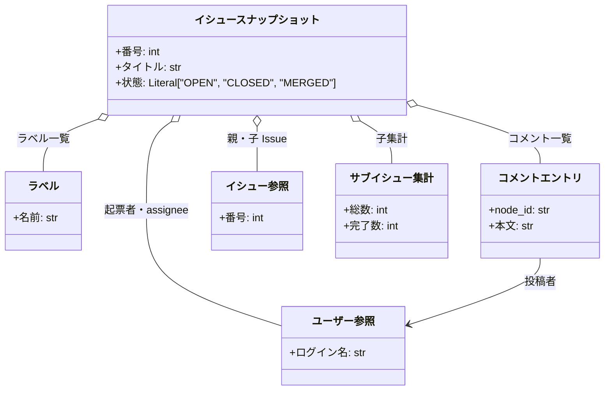
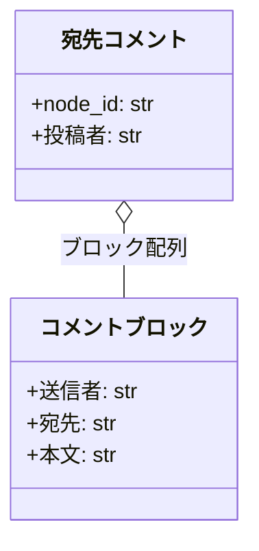
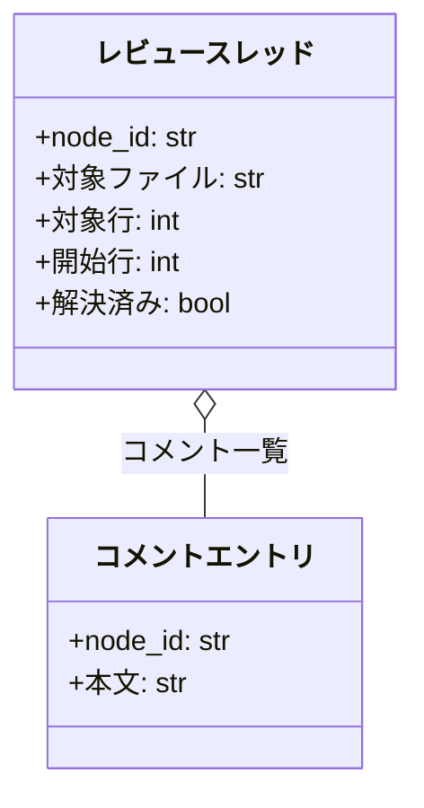
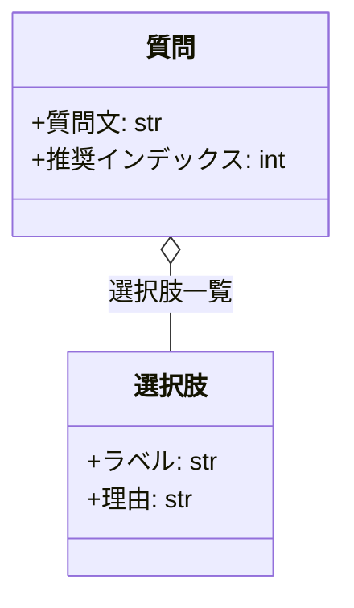

# モジュール構成: MCP / GitHub操作

`GitHub操作` ドメイン（MCP 側）に属する構成要素詳細。
エージェントが使う GitHub 操作 MCP サーバーを扱う。
ツール定義（`mcp/server.py`）が githubkit（GitHub API）/ git CLI を直接呼ぶ。

## 一覧

| ユースケース | 役割 | コンテナ | 種別 | 名前 | 概要 | 補足 |
| --- | --- | --- | --- | --- | --- | --- |
| 共通 | クライアント生成 | `mcp/server.py` | 関数 | [`_get_client`](#クライアント生成) | 設定の `github_token` から githubkit クライアントを生成・共有 | - |
| 共通 | リポジトリ解決 | `mcp/server.py` | 関数 | [`_get_repo`](#リポジトリ解決) | git の remote URL から `(owner, repo)` を解決 | - |
| 共通 | ログイン解決 | `mcp/server.py` | 関数 | [`_get_current_login`](#ログイン解決) | 認証中ユーザーのログイン名を返す | assignee 操作の対象解決 |
| 共通 | ラベル再取得 | `mcp/server.py` | 関数 | [`_get_labels`](#ラベル再取得) | 操作後の現在ラベル一覧を返す | - |
| 共通 | assignee 再取得 | `mcp/server.py` | 関数 | [`_get_assignees`](#assignee-再取得) | 操作後の現在 assignee 一覧を返す | - |
| 共通 | Resolve 実行 | `mcp/server.py` | 関数 | [`_minimize_comment`](#resolve-実行) | GraphQL `minimizeComment` を実行 | `classifier=RESOLVED` |
| 共通 | Resolved 状態取得 | `mcp/server.py` | 関数 | [`_is_minimized`](#resolved-状態取得) | コメントの `isMinimized` を GraphQL で取得 | - |
| 共通 | コメント投稿実体 | `mcp/server.py` | 関数 | [`_create_issue_comment`](#コメント投稿実体) | REST でコメントを投稿 | PR も同エンドポイント |
| 共通 | コメント解析 | `mcp/server.py` | 関数 | [`_parse_comment_blocks`](#コメント解析) | `---` 区切りブロックの from / to と本文をパース | - |
| 共通 | 定型ブロック組立 | `mcp/server.py` | 関数 | [`_format_block`](#定型ブロック組立) | from / to ヘッダー + 本文を組み立てる | 書式は `規約/コメント.md` |
| 共通 | アット付与 | `mcp/server.py` | 関数 | [`_ensure_at`](#アット付与) | 先頭に `@` がなければ付与 | - |
| 共通 | git 実行入口 | `mcp/server.py` | 関数 | [`_run_git`](#git-実行入口) | git CLI 呼び出しの単一入口 | 失敗時 `CalledProcessError` |
| 共通 | リポジトリルート解決 | `mcp/server.py` | 関数 | [`_repo_root`](#リポジトリルート解決) | 共通 `.git` からメインリポジトリのルートを解決 | worktree 内からの呼び出しに対応 |
| 共通 | worktree パス解決 | `mcp/server.py` | 関数 | [`_worktree_path`](#worktree-パス解決) | `.claude/worktrees/` 配下の絶対パスを求める | `/` を `-` に置換 |
| 共通 | base ref 解決 | `mcp/server.py` | 関数 | [`_resolve_base_ref`](#base-ref-解決) | `origin/{current}` or `HEAD` を返す | - |
| 共通 | 質問 DTO | `mcp/models.py` | データモデル | [`Question`](#質問) / [`Choice`](#選択肢) | ask_questions の質問・選択肢 | - |
| 共通 | コメント解析 DTO | `mcp/models.py` | データモデル | [`CommentBlock`](#コメントブロック) / [`AddressedComment`](#宛先コメント) | `---` 区切りブロックのパース結果 | - |
| 共通 | レビュースレッド DTO | `mcp/models.py` | データモデル | [`ReviewThread`](#レビュースレッド) | list_review_threads の戻り値 | - |
| 共通 | 検索結果 DTO | `mcp/models.py` | データモデル | [`SearchResultItem`](#検索結果) | search_issues_and_prs の戻り値要素 | - |
| 共通 | 操作結果 DTO | `mcp/models.py` | データモデル | [`CommentResult`](#コメント結果) / [`ResolveResult`](#resolve-結果) / [`LabelsResult`](#ラベル結果) / [`AssigneesResult`](#assignee-結果) / [`EmptyResult`](#空結果) / [`CreatedIssueResult`](#issue-作成結果) / [`CreatedPRResult`](#pr-作成結果) | 各ツールの戻り値 | - |
| 共通 | worktree 結果 DTO | `mcp/models.py` | データモデル | [`WorktreeCreateResult`](#worktree-作成結果) / [`WorktreeRemoveResult`](#worktree-削除結果) | worktree 操作の戻り値 | - |
| 共通 | スナップショット DTO | `mcp/models.py` | データモデル | [`IssueSnapshot`](#イシュースナップショット) / [`Label`](#ラベル) / [`UserRef`](#ユーザー参照) / [`IssueRef`](#イシュー参照) / [`IssueCommentEntry`](#コメントエントリ) / [`SubIssuesSummary`](#サブイシュー集計) | get_issue_or_pr の戻り値ツリー | - |
| Issue・PR情報取得 | MCP ツール | `mcp/server.py` | 関数 | [`get_issue_or_pr`](#issuepr情報取得) | Issue / PR の情報を 1 コマンドで取得 | 読み取り専用 |
| コメント投稿 | MCP ツール | `mcp/server.py` | 関数 | [`comment`](#コメント投稿) | 定型ブロックでコメントを投稿 | - |
| 質問投稿 | MCP ツール | `mcp/server.py` | 関数 | [`ask_questions`](#質問投稿) | 選択肢 + 推奨付きの質問コメントを投稿 | - |
| コメント返信 | MCP ツール | `mcp/server.py` | 関数 | [`reply_comment`](#コメント返信) | 既存コメントに `---` 区切りで追記 | - |
| コメント一括Resolve | MCP ツール | `mcp/server.py` | 関数 | [`resolve_comments`](#コメント一括resolve) | 複数コメントを一括 Resolve | - |
| 宛先コメント一覧 | MCP ツール | `mcp/server.py` | 関数 | [`list_addressed_comments`](#宛先コメント一覧) | 自分宛のコメントをブロック配列付きで返す | 読み取り専用 |
| Issue・PR検索 | MCP ツール | `mcp/server.py` | 関数 | [`search_issues_and_prs`](#issuepr検索) | キーワードで Issue / PR を横断検索 | 読み取り専用 |
| インラインコメント投稿 | MCP ツール | `mcp/server.py` | 関数 | [`create_review_comment`](#インラインコメント投稿) | PR の特定ファイル・行に紐づくレビューコメントを投稿 | - |
| レビュースレッド一覧 | MCP ツール | `mcp/server.py` | 関数 | [`list_review_threads`](#レビュースレッド一覧) | インライン指摘のスレッドを取得 | 読み取り専用 |
| レビュースレッド一括Resolve | MCP ツール | `mcp/server.py` | 関数 | [`resolve_review_threads`](#レビュースレッド一括resolve) | レビュースレッドを一括で解決 | - |
| ラベル追加 | MCP ツール | `mcp/server.py` | 関数 | [`add_labels`](#ラベル追加) | ラベルを追加して現況を返す | 冪等 |
| ラベル除去 | MCP ツール | `mcp/server.py` | 関数 | [`remove_labels`](#ラベル除去) | ラベルを除去して現況を返す | `議論中` は対象外 |
| フェーズ遷移 | MCP ツール | `mcp/server.py` | 関数 | [`transition_phase`](#フェーズ遷移) | ラベルの除去 + 追加を 1 呼び出しで実行 | - |
| assignee 設定 | MCP ツール | `mcp/server.py` | 関数 | [`set_assignee`](#assignee設定) | 認証ユーザーを assignee に設定して現況を返す | - |
| assignee 除去 | MCP ツール | `mcp/server.py` | 関数 | [`remove_assignee`](#assignee除去) | 認証ユーザーの assignee を除去して現況を返す | - |
| 本文更新 | MCP ツール | `mcp/server.py` | 関数 | [`update_body`](#本文更新) | 本文を完全置換で更新 | - |
| タイトル更新 | MCP ツール | `mcp/server.py` | 関数 | [`update_title`](#タイトル更新) | タイトルを更新 | - |
| クローズ | MCP ツール | `mcp/server.py` | 関数 | [`close`](#クローズ) | Issue / PR をクローズ | - |
| Issue 再オープン | MCP ツール | `mcp/server.py` | 関数 | [`reopen_issue`](#issue再オープン) | クローズ済み Issue を再オープン | バグ差し戻し用 |
| 子 Issue 作成 | MCP ツール | `mcp/server.py` | 関数 | [`create_child_issue`](#子issue作成) | Sub-issue リンク付きで子 Issue を作成 | - |
| Draft PR 作成 | MCP ツール | `mcp/server.py` | 関数 | [`create_draft_pr`](#draftpr作成) | base 明示で Draft PR を作成 | Stacked PR 対応 |
| PR Ready 化 | MCP ツール | `mcp/server.py` | 関数 | [`mark_pr_ready`](#pr_ready化) | Draft を解除 | - |
| PR マージ | MCP ツール | `mcp/server.py` | 関数 | [`merge_pr`](#prマージ) | 既定 squash + ブランチ削除でマージ | - |
| worktree 作成 | MCP ツール | `mcp/server.py` | 関数 | [`worktree_create`](#worktree作成) | ブランチと worktree を作成 | 命名は `規約/ブランチ戦略.md` |
| worktree 削除 | MCP ツール | `mcp/server.py` | 関数 | [`worktree_remove`](#worktree削除) | worktree とブランチを削除 | - |

## ディレクトリ構成

```
plugins/ai-monitor/mcp/
├── server.py    # FastMCP ツール定義 + 内部ヘルパー（githubkit / git CLI 呼び出し）
└── models.py    # Pydantic DTO 集約
```

## 構成図

### 全体



---

### スナップショット



---

### 宛先コメント



---

### レビュースレッド



---

### 質問



## `mcp/server.py`
> 種別: ファイル

FastMCP（stdio）でツールを公開するエントリポイント。
各ツール関数が githubkit / git CLI を直接呼ぶ（委譲層は持たない）。
GitHub 系の全ツールは[クライアント生成](#クライアント生成)と[リポジトリ解決](#リポジトリ解決)を、worktree 系の全ツールは [git 実行入口](#git-実行入口)を共通で通る。
各ツールのインターフェース（リクエスト / レスポンス / 制約）は [バックエンド結合](../../バックエンド結合/README.md) の詳細ファイルが SoT。
疎通テストは sandbox（`shuhei1101/ai-monitor-e2e`）のクローンを CWD にして手動実行する（[リポジトリ解決](#リポジトリ解決)が CWD の remote から対象リポジトリを決めるため。手順は `テスト/テスト実行方法.md`）。

---

### ツール定義群
> 物理名: `get_issue_or_pr` ほか（`一覧` の MCP ツール行と 1:1）<br>
> 種別: 関数

#### 単体テスト

| テスト名 | 正常/異常 | 概要 | 条件 | Mock | 期待値 | 補足 |
| --- | --- | --- | --- | --- | --- | --- |
| `test_registered_tools` | 正常 | 全ツールの登録 | FastMCP サーバー生成 | なし | ツール名一覧がバックエンド結合の索引と一致 | - |
| `test_tool_annotations` | 正常 | ヒント宣言 | FastMCP サーバー生成 | なし | `get_issue_or_pr` / `list_addressed_comments` / `list_review_threads` / `search_issues_and_prs` が readOnlyHint・remove 系 / close / merge が destructiveHint | - |

---

### Issue・PR情報取得
> 物理名: `get_issue_or_pr`<br>
> 種別: 関数

Issue / PR の情報を取得し[イシュースナップショット](#イシュースナップショット)に変換する。

#### 引数

| 論理名 | 引数名 | 型 | 必須 | デフォルト | 説明 | 補足 |
| --- | --- | --- | --- | --- | --- | --- |
| 番号 | `number` | `int` | ✅ | - | 対象の Issue / PR 番号 | - |
| PR フラグ | `is_pr` | `bool` | ✅ | - | PR なら `True` | - |
| タイトル取得 | `title` | `bool` | - | `True` | タイトルを取得するか | - |
| 本文取得 | `body` | `bool` | - | `True` | 本文を取得するか | - |
| URL取得 | `url` | `bool` | - | `True` | URLを取得するか | - |
| 状態取得 | `state` | `bool` | - | `True` | 状態を取得するか | - |
| クローズ済み取得 | `closed` | `bool` | - | `True` | クローズ済みを取得するか | - |
| クローズ日時取得 | `closed_at` | `bool` | - | `True` | クローズ日時を取得するか | - |
| 作成日時取得 | `created_at` | `bool` | - | `True` | 作成日時を取得するか | - |
| 更新日時取得 | `updated_at` | `bool` | - | `True` | 更新日時を取得するか | - |
| ラベル取得 | `labels` | `bool` | - | `True` | ラベルを取得するか | - |
| コメント取得 | `comments` | `bool` | - | `True` | コメントを取得するか | - |
| 担当者取得 | `assignees` | `bool` | - | `True` | 担当者を取得するか | - |
| 起票者取得 | `author` | `bool` | - | `True` | 起票者を取得するか | - |
| 親 Issue取得 | `parent` | `bool` | - | `True` | 親 Issueを取得するか | - |
| 子 Issue取得 | `sub_issues` | `bool` | - | `True` | 子 Issueを取得するか | - |
| 子集計取得 | `sub_issues_summary` | `bool` | - | `True` | 子集計を取得するか | - |

引数例:

```python
get_issue_or_pr(35, is_pr=False, comments=False)
```

#### 戻り値

| 型 | 説明 | 補足 |
| --- | --- | --- |
| [`IssueSnapshot`](#イシュースナップショット) | Issue / PR のスナップショット | `False` のフィールドは `None` |

戻り値例:

```python
IssueSnapshot(number=35, title="プロフィール編集機能", state="OPEN", labels=[Label(name="layer:epic")], comments=None, ...)
```

#### 処理

1. REST で Issue / PR の基本情報を取得する（PR は `is_pr` でエンドポイントを切り替え）
2. 取得フラグが `True` のフィールド（コメント / 親子 Issue / 子集計 等）を追加取得する（コメントの `isMinimized` は GraphQL）
3. 結果を[イシュースナップショット](#イシュースナップショット)に変換して返す（取得しなかったフィールドは `None`）

#### 例外

| 例外名 | 発生条件 | メッセージ | 補足 |
| --- | --- | --- | --- |
| `RequestFailed` | API 応答が 4xx / 5xx（対象不存在・認証エラー 等） | HTTP ステータスと本文 | MCP がツールエラーとして呼び出し元エージェントに返す |
| `GraphQLFailed` | GraphQL がエラーを返す（node_id 不正 等） | `errors[].message` | - |

#### 単体テスト

| テスト名 | 正常/異常 | 概要 | 条件 | Mock | 期待値 | 補足 |
| --- | --- | --- | --- | --- | --- | --- |
| `test_get_issue_or_pr` | 正常 | スナップショット組み立て | REST 応答をモック | githubkit | `IssueSnapshot` の各フィールドが対応 | - |
| `test_get_issue_or_pr_when_flags_false` | 正常 | 取得フラグ `False` の除外 | `comments=False` で呼び出し | githubkit | `comments` が `None` で返る | - |
| `test_get_issue_or_pr_when_api_error` | 異常 | API エラーの伝播 | REST が 404 を返す | githubkit | `RequestFailed` がそのまま伝播 | 代表 1 ツールで共通経路を確認 |

#### 疎通テスト

| テスト名 | 対象 API | 概要 | 確認内容 | 補足 |
| --- | --- | --- | --- | --- |
| `test_ext_get_issue_or_pr_when_issue` | GitHub | Issue を全フィールドで取得 | 認証 / 親子 Issue の解決 / `IssueSnapshot` 構造 | 副作用: なし（読み取りのみ） |
| `test_ext_get_issue_or_pr_when_pr` | GitHub | `is_pr=True` で PR を取得 | state=`MERGED` 判定 / コメントの `isMinimized` | 副作用: なし（読み取りのみ） |

---

### コメント投稿
> 物理名: `comment`<br>
> 種別: 関数

定型ブロック（from / to ヘッダー + 本文）のコメントを投稿する。

#### 引数

| 論理名 | 引数名 | 型 | 必須 | デフォルト | 説明 | 補足 |
| --- | --- | --- | --- | --- | --- | --- |
| 番号 | `number` | `int` | ✅ | - | 対象の Issue / PR 番号 | - |
| PR フラグ | `is_pr` | `bool` | ✅ | - | PR なら `True` | - |
| 送信者 | `sender` | `str` | ✅ | - | 送信者のエージェント名 | `@` は不要（自動付与） |
| 宛先 | `receiver` | `str \| None` | - | `None`（to 行なし = 現担当宛） | 宛先名 | - |
| 本文 | `body` | `str` | ✅ | - | 本文 | Markdown 可 |

引数例:

```python
comment(35, is_pr=False, sender="architect", body="設計 Wiki を更新しました。")
```

#### 戻り値

| 型 | 説明 | 補足 |
| --- | --- | --- |
| [`CommentResult`](#コメント結果) | 投稿コメントの node_id / url | - |

戻り値例:

```python
CommentResult(node_id="IC_kwDO...", url="https://github.com/.../issues/35#issuecomment-1")
```

#### 処理

1. from / to ヘッダー + 本文を組み立てる（[定型ブロック組立](#定型ブロック組立)）
2. 投稿して `CommentResult` を返す（[コメント投稿実体](#コメント投稿実体)）

#### 例外

| 例外名 | 発生条件 | メッセージ | 補足 |
| --- | --- | --- | --- |
| `RequestFailed` | API 応答が 4xx / 5xx（対象不存在・認証エラー 等） | HTTP ステータスと本文 | MCP がツールエラーとして呼び出し元エージェントに返す |

#### 単体テスト

| テスト名 | 正常/異常 | 概要 | 条件 | Mock | 期待値 | 補足 |
| --- | --- | --- | --- | --- | --- | --- |
| `test_comment` | 正常 | 定型ブロックで投稿 | sender / receiver / body | githubkit | `_format_block` の出力で投稿され `CommentResult` を返す | - |

#### 疎通テスト

| テスト名 | 対象 API | 概要 | 確認内容 | 補足 |
| --- | --- | --- | --- | --- |
| `test_ext_comment` | GitHub | 定型ブロックでコメント投稿 | `node_id` / `url` の返却 / 本文書式 | 副作用: sandbox にコメント投稿 |

---

### 質問投稿
> 物理名: `ask_questions`<br>
> 種別: 関数

選択肢 + 推奨付きの質問コメントを投稿する。

#### 引数

| 論理名 | 引数名 | 型 | 必須 | デフォルト | 説明 | 補足 |
| --- | --- | --- | --- | --- | --- | --- |
| 番号 | `number` | `int` | ✅ | - | 対象の Issue / PR 番号 | - |
| PR フラグ | `is_pr` | `bool` | ✅ | - | PR なら `True` | - |
| 送信者 | `sender` | `str` | ✅ | - | 送信者のエージェント名 | `@` は不要 |
| 宛先 | `receiver` | `str \| None` | - | `None`（to 行なし = 現担当宛） | 宛先名 | 通常はユーザーのログイン名 |
| 前置き | `intro` | `str` | ✅ | - | 質問リストの前に置く前置き文 | 空文字なら省略される |
| 質問一覧 | `questions` | [`list[Question]`](#質問) | ✅ | - | 質問の配列 | - |

引数例:

```python
ask_questions(35, is_pr=False, sender="epic-conductor", intro="要件の確認です。", questions=[Question(question="レスポンス形式は？", background="...", choices=[Choice(label="案 A", reason="...")])])
```

#### 戻り値

| 型 | 説明 | 補足 |
| --- | --- | --- |
| [`CommentResult`](#コメント結果) | 投稿コメントの node_id / url | - |

戻り値例:

```python
CommentResult(node_id="IC_kwDO...", url="https://github.com/.../issues/35#issuecomment-2")
```

#### 処理

1. `intro` と各質問（背景・選択肢・推奨）から質問本文を組み立てる（空文字のセクション・`recommended_index=-1` の推奨行は省略）
2. ヘッダーを付ける（[定型ブロック組立](#定型ブロック組立)）
3. 投稿して `CommentResult` を返す（[コメント投稿実体](#コメント投稿実体)）

#### 例外

| 例外名 | 発生条件 | メッセージ | 補足 |
| --- | --- | --- | --- |
| `RequestFailed` | API 応答が 4xx / 5xx（対象不存在・認証エラー 等） | HTTP ステータスと本文 | MCP がツールエラーとして呼び出し元エージェントに返す |

#### 単体テスト

| テスト名 | 正常/異常 | 概要 | 条件 | Mock | 期待値 | 補足 |
| --- | --- | --- | --- | --- | --- | --- |
| `test_ask_questions` | 正常 | 選択肢 + 推奨付き質問投稿 | `Question` x2 + recommended_index | githubkit | 選択肢と推奨の書式を含む本文で投稿 | - |
| `test_ask_questions_when_no_recommendation` | 正常 | 推奨なしの省略 | `recommended_index=-1` | githubkit | 推奨行を含まない本文で投稿 | - |
| `test_ask_questions_when_empty_intro_and_background` | 正常 | 空文字セクションの省略 | `intro` / `background` が空文字 | githubkit | 前置き・背景を含まない本文で投稿 | - |

#### 疎通テスト

| テスト名 | 対象 API | 概要 | 確認内容 | 補足 |
| --- | --- | --- | --- | --- |
| `test_ext_ask_questions` | GitHub | 選択肢 + 推奨付きの質問投稿 | 選択肢・推奨マークの書式 | 副作用: sandbox にコメント投稿 |

---

### コメント返信
> 物理名: `reply_comment`<br>
> 種別: 関数

既存コメントに `---` 区切りで定型ブロックを追記する。

#### 引数

| 論理名 | 引数名 | 型 | 必須 | デフォルト | 説明 | 補足 |
| --- | --- | --- | --- | --- | --- | --- |
| 返信先 | `comment_node_id` | `str` | ✅ | - | 追記対象コメントの GraphQL node_id | `get_issue_or_pr` / `list_addressed_comments` で取得 |
| 送信者 | `sender` | `str` | ✅ | - | 送信者のエージェント名 | `@` は不要 |
| 宛先 | `receiver` | `str \| None` | - | `None`（to 行なし = 現担当宛） | 宛先名 | - |
| 本文 | `body` | `str` | ✅ | - | 追記ブロックの本文 | Markdown 可 |

引数例:

```python
reply_comment("IC_kwDO...", sender="tester", body="修正しました。")
```

#### 戻り値

| 型 | 説明 | 補足 |
| --- | --- | --- |
| [`CommentResult`](#コメント結果) | 追記したコメントの node_id / url | - |

戻り値例:

```python
CommentResult(node_id="IC_kwDO...", url="https://github.com/.../issues/35#issuecomment-1")
```

#### 処理

1. `comment_node_id` から既存コメントの現在本文を取得する
2. `---` 区切りの追記ブロックを組み立てる（[定型ブロック組立](#定型ブロック組立)・`is_reply=True`）
3. 既存本文の末尾に連結してコメントを更新し、`CommentResult` を返す

#### 例外

| 例外名 | 発生条件 | メッセージ | 補足 |
| --- | --- | --- | --- |
| `RequestFailed` | API 応答が 4xx / 5xx（対象不存在・認証エラー 等） | HTTP ステータスと本文 | MCP がツールエラーとして呼び出し元エージェントに返す |
| `GraphQLFailed` | GraphQL がエラーを返す（node_id 不正 等） | `errors[].message` | - |

#### 単体テスト

| テスト名 | 正常/異常 | 概要 | 条件 | Mock | 期待値 | 補足 |
| --- | --- | --- | --- | --- | --- | --- |
| `test_reply_comment` | 正常 | `---` 区切りの返信追記 | 既存コメントの node_id | githubkit | 先頭 `---` + 宛先ヘッダー付きで追記 | - |

#### 疎通テスト

| テスト名 | 対象 API | 概要 | 確認内容 | 補足 |
| --- | --- | --- | --- | --- |
| `test_ext_reply_comment` | GitHub | 既存コメントへ `---` 区切りで追記 | コメント更新 API / 追記後の本文 | 副作用: sandbox のコメント更新 |

---

### コメント一括Resolve
> 物理名: `resolve_comments`<br>
> 種別: 関数

複数コメントの Resolve をまとめて実行する。

#### 引数

| 論理名 | 引数名 | 型 | 必須 | デフォルト | 説明 | 補足 |
| --- | --- | --- | --- | --- | --- | --- |
| 対象一覧 | `node_ids` | `list[str]` | ✅ | - | Resolve 対象コメントの node_id 配列 | 1 件以上 |

引数例:

```python
resolve_comments(["IC_kwDO...", "IC_kwDP..."])
```

#### 戻り値

| 型 | 説明 | 補足 |
| --- | --- | --- |
| [`ResolveResult`](#resolve-結果) | Resolve した件数 | - |

戻り値例:

```python
ResolveResult(resolved_count=2)
```

#### 処理

1. `node_ids` を 1 件ずつ Resolve する（[Resolve 実行](#resolve-実行)）
2. 実行件数を `ResolveResult` で返す

#### 例外

| 例外名 | 発生条件 | メッセージ | 補足 |
| --- | --- | --- | --- |
| `GraphQLFailed` | GraphQL がエラーを返す（node_id 不正 等） | `errors[].message` | - |

#### 単体テスト

| テスト名 | 正常/異常 | 概要 | 条件 | Mock | 期待値 | 補足 |
| --- | --- | --- | --- | --- | --- | --- |
| `test_resolve_comments` | 正常 | 一括 Resolve | node_id x3 | githubkit | 3 件とも minimizeComment が実行される | - |

#### 疎通テスト

| テスト名 | 対象 API | 概要 | 確認内容 | 補足 |
| --- | --- | --- | --- | --- |
| `test_ext_resolve_comments` | GitHub | minimizeComment の実行 | `classifier=RESOLVED` で `isMinimized` が true になる | 副作用: sandbox のコメントを Resolve |

---

### 宛先コメント一覧
> 物理名: `list_addressed_comments`<br>
> 種別: 関数

自分宛のコメントだけをブロック配列付きで返す。

#### 引数

| 論理名 | 引数名 | 型 | 必須 | デフォルト | 説明 | 補足 |
| --- | --- | --- | --- | --- | --- | --- |
| 番号 | `number` | `int` | ✅ | - | 対象の Issue / PR 番号 | - |
| PR フラグ | `is_pr` | `bool` | ✅ | - | PR なら `True` | - |
| 宛先名 | `addressee` | `str` | ✅ | - | 最後のブロックの to または from がこの名前のコメントだけ返す | `@` は不要 |
| Resolved 込み | `include_resolved` | `bool` | - | `False` | Resolved 済みも含めるか | - |

引数例:

```python
list_addressed_comments(52, is_pr=True, addressee="architect")
```

#### 戻り値

| 型 | 説明 | 補足 |
| --- | --- | --- |
| [`list[AddressedComment]`](#宛先コメント) | 自分宛コメントの配列 | - |

戻り値例:

```python
[AddressedComment(node_id="IC_kwDO...", blocks=[CommentBlock(sender="tester", receiver="architect", body="テスト作成が完了しました。")], author="shuhei1101", url="...", is_resolved=False)]
```

#### 処理

1. コメント一覧と各コメントの `isMinimized` を取得する（REST + GraphQL）
2. 各コメント本文をブロック配列にパースする（[コメント解析](#コメント解析)）
3. 最後のブロックの to が `addressee` のもの・to なしのユーザー投稿・from が `addressee` のもの（自身の投稿）だけに絞る
4. `include_resolved` が `False` なら Resolved 済みを除外し、`AddressedComment` の配列で返す

#### 例外

| 例外名 | 発生条件 | メッセージ | 補足 |
| --- | --- | --- | --- |
| `RequestFailed` | API 応答が 4xx / 5xx（対象不存在・認証エラー 等） | HTTP ステータスと本文 | MCP がツールエラーとして呼び出し元エージェントに返す |
| `GraphQLFailed` | GraphQL がエラーを返す（node_id 不正 等） | `errors[].message` | - |

#### 単体テスト

| テスト名 | 正常/異常 | 概要 | 条件 | Mock | 期待値 | 補足 |
| --- | --- | --- | --- | --- | --- | --- |
| `test_list_addressed_comments` | 正常 | 最終ブロックの宛先で絞り込み | 宛先違い・宛先なしのコメント混在 | githubkit | 自分宛 + to なしユーザーコメントのみ blocks 付きで返す | - |
| `test_list_addressed_comments_when_own_comment` | 正常 | 自身投稿の包含 | 最後のブロックの from が `addressee`（to はユーザー）のコメント | githubkit | 自身の投稿が返る | 完了処理の一括 Resolve 対象 |
| `test_list_addressed_comments_when_include_resolved` | 正常 | Resolved 込みの取得 | `include_resolved=True` で Resolved 済みが混在 | githubkit | Resolved 済みも `is_resolved=True` で返る | 省略時は除外される |

#### 疎通テスト

| テスト名 | 対象 API | 概要 | 確認内容 | 補足 |
| --- | --- | --- | --- | --- |
| `test_ext_list_addressed_comments` | GitHub | 宛先付きコメントの抽出 | to / from 行の宛先判定 / `isMinimized` の取得 | 副作用: なし（事前投稿は fixture） |

---

### Issue・PR検索
> 物理名: `search_issues_and_prs`<br>
> 種別: 関数

キーワードでリポジトリ内の Issue / PR を横断検索して一覧を返す。

#### 引数

| 論理名 | 引数名 | 型 | 必須 | デフォルト | 説明 | 補足 |
| --- | --- | --- | --- | --- | --- | --- |
| 検索キーワード | `query` | `str` | ✅ | - | 検索キーワード（GitHub search 構文可） | 対象リポジトリの絞り込みは自動付与 |
| 並び順 | `sort` | `Literal["comments", "reactions", "reactions-+1", "reactions--1", "reactions-smile", "reactions-thinking_face", "reactions-heart", "reactions-tada", "interactions", "created", "updated"] \| None` | - | `None`（関連度順） | 並び順 | - |
| 昇順 / 降順 | `order` | `Literal["desc", "asc"]` | - | `"desc"` | 並びの向き | `sort` 指定時のみ有効 |
| 件数 | `limit` | `int` | - | `10` | 最大取得件数（1〜100） | 検索 API の `per_page` に渡す |
| ページ | `page` | `int` | - | `1` | ページ番号 | - |

引数例:

```python
search_issues_and_prs('"プロフィール編集" in:title is:issue', sort="created", limit=10)
```

#### 戻り値

| 型 | 説明 | 補足 |
| --- | --- | --- |
| [`list[SearchResultItem]`](#検索結果) | 検索結果の配列（並びは `sort` 指定に従う） | - |

戻り値例:

```python
[SearchResultItem(number=35, is_pr=False, title="プロフィール編集機能", state="open", url="https://github.com/{owner}/{repo}/issues/35")]
```

#### 処理

1. 対象リポジトリを解決し、検索クエリに `repo:{owner}/{repo}` を付与する（[リポジトリ解決](#リポジトリ解決)）
2. 検索 API を `sort` / `order` / `per_page` / `page` 付きで呼ぶ（REST）
3. 各要素を番号・PR 判定（`pull_request` の有無）・タイトル・状態・URL の `SearchResultItem` に変換して配列で返す

#### 例外

| 例外名 | 発生条件 | メッセージ | 補足 |
| --- | --- | --- | --- |
| `RequestFailed` | API 応答が 4xx / 5xx（検索レートリミット・クエリ構文エラー 等） | HTTP ステータスと本文 | MCP がツールエラーとして呼び出し元エージェントに返す |

#### 単体テスト

| テスト名 | 正常/異常 | 概要 | 条件 | Mock | 期待値 | 補足 |
| --- | --- | --- | --- | --- | --- | --- |
| `test_search_issues_and_prs` | 正常 | 検索結果の変換とリポジトリ絞り込み | Issue 1 件 + PR 1 件の検索応答 | githubkit | クエリに `repo:` が付与され、`SearchResultItem` の配列（PR は `is_pr=True`）で返る | - |
| `test_search_issues_and_prs_when_sort` | 正常 | 並び順指定の受け渡し | `sort="created"` で呼び出し | githubkit | 検索 API に `sort=created` / `order=desc` が渡る | - |
| `test_search_issues_and_prs_when_no_hit` | 正常 | ヒットなしは空配列 | 0 件の検索応答 | githubkit | `[]` | - |

#### 疎通テスト

| テスト名 | 対象 API | 概要 | 確認内容 | 補足 |
| --- | --- | --- | --- | --- |
| `test_ext_search_issues_and_prs` | GitHub | キーワード検索の実行 | 認証 / リポジトリ絞り込み / `SearchResultItem` 構造 | 副作用: なし（読み取りのみ） |

---

### インラインコメント投稿
> 物理名: `create_review_comment`<br>
> 種別: 関数

PR の特定ファイル・特定行に紐づくレビューコメント（インライン指摘）を定型ブロックで投稿する。

#### 引数

| 論理名 | 引数名 | 型 | 必須 | デフォルト | 説明 | 補足 |
| --- | --- | --- | --- | --- | --- | --- |
| PR 番号 | `pr_number` | `int` | ✅ | - | 対象の PR 番号 | - |
| 対象ファイル | `path` | `str` | ✅ | - | 対象ファイルパス（リポジトリルート相対） | - |
| 対象行 | `line` | `int` | ✅ | - | 対象行番号（範囲指定時は終端行） | PR の diff に含まれる行のみ |
| 対象側 | `side` | `"RIGHT"` \| `"LEFT"` | - | `"RIGHT"` | diff のどちら側の行か | 追加・文脈行は RIGHT / 削除行は LEFT |
| 開始行 | `start_line` | `int \| None` | - | `None`（単一行コメント） | 範囲コメントの開始行 | `line` より小さい行。side は `side` を両端に適用 |
| 送信者 | `sender` | `str` | ✅ | - | 送信者のエージェント名 | `@` は不要（自動付与） |
| 宛先 | `receiver` | `str \| None` | - | `None`（to 行なし = 現担当宛） | 宛先名 | - |
| 本文 | `body` | `str` | ✅ | - | 指摘本文 | Markdown 可 |

引数例:

```python
create_review_comment(52, path="src/ai_monitor/features/agents/service.py", line=42, sender="architect", receiver="implementer", body="null チェックを追加してください。")
```

#### 戻り値

| 型 | 説明 | 補足 |
| --- | --- | --- |
| [`CommentResult`](#コメント結果) | 投稿コメントの node_id / url | node_id は `PRRC_` 始まり |

戻り値例:

```python
CommentResult(node_id="PRRC_kwDO...", url="https://github.com/.../pull/52#discussion_r987654321")
```

#### 処理

1. from / to ヘッダー + 本文を組み立てる（[定型ブロック組立](#定型ブロック組立)）
2. PR の head commit SHA を取得する（`rest.pulls.get`）
3. REST でレビューコメントを投稿し、`CommentResult` を返す（`path` / `line` / `side` / `commit_id`、範囲指定時は `start_line` も指定）

#### 例外

| 例外名 | 発生条件 | メッセージ | 補足 |
| --- | --- | --- | --- |
| `RequestFailed` | API 応答が 4xx / 5xx（`line` が diff に含まれない 422 等） | HTTP ステータスと本文 | MCP がツールエラーとして呼び出し元エージェントに返す |

#### 単体テスト

| テスト名 | 正常/異常 | 概要 | 条件 | Mock | 期待値 | 補足 |
| --- | --- | --- | --- | --- | --- | --- |
| `test_create_review_comment` | 正常 | インライン投稿 | path / line / sender / body | githubkit | head SHA + 定型ブロックで投稿 API が呼ばれ `CommentResult` を返す | - |
| `test_create_review_comment_when_multi_line` | 正常 | 範囲指定の投稿 | `start_line=42`・`line=48` | githubkit | `start_line` 付きで投稿 API が呼ばれる | - |
| `test_create_review_comment_when_out_of_diff` | 異常 | diff 外の行 | REST が 422 を返す | githubkit | `RequestFailed` がそのまま伝播 | 例外表「422 等」に対応 |

#### 疎通テスト

| テスト名 | 対象 API | 概要 | 確認内容 | 補足 |
| --- | --- | --- | --- | --- |
| `test_ext_create_review_comment_when_single_line` | GitHub | 単一行のインライン投稿 | `path` / `line` / `side=RIGHT` / head SHA | 副作用: sandbox の PR にレビューコメント投稿 |
| `test_ext_create_review_comment_when_multi_line` | GitHub | 範囲（`start_line`〜`line`）の投稿 | `start_line` の実挙動 | 副作用: sandbox の PR にレビューコメント投稿 |

---

### レビュースレッド一覧
> 物理名: `list_review_threads`<br>
> 種別: 関数

PR のレビュースレッド（インライン指摘のスレッド）を取得する。

#### 引数

| 論理名 | 引数名 | 型 | 必須 | デフォルト | 説明 | 補足 |
| --- | --- | --- | --- | --- | --- | --- |
| PR 番号 | `pr_number` | `int` | ✅ | - | 対象の PR 番号 | - |
| Resolved 込み | `include_resolved` | `bool` | - | `False` | 解決済みスレッドも含めるか | - |

引数例:

```python
list_review_threads(52)
```

#### 戻り値

| 型 | 説明 | 補足 |
| --- | --- | --- |
| [`list[ReviewThread]`](#レビュースレッド) | レビュースレッドの配列 | - |

戻り値例:

```python
[ReviewThread(node_id="PRRT_kwDO...", path="src/ai_monitor/features/agents/service.py", line=48, start_line=42, is_resolved=False, comments=[...])]
```

#### 処理

1. GraphQL で PR のレビュースレッド一覧（path / startLine / line / isResolved / コメント群）を取得する
2. `include_resolved` が `False` の場合、解決済みスレッドを除外する
3. [レビュースレッド](#レビュースレッド)の配列に変換して返す

#### 例外

| 例外名 | 発生条件 | メッセージ | 補足 |
| --- | --- | --- | --- |
| `GraphQLFailed` | GraphQL がエラーを返す（PR 不存在 等） | `errors[].message` | MCP がツールエラーとして呼び出し元エージェントに返す |

#### 単体テスト

| テスト名 | 正常/異常 | 概要 | 条件 | Mock | 期待値 | 補足 |
| --- | --- | --- | --- | --- | --- | --- |
| `test_list_review_threads` | 正常 | スレッドの変換 | 単一行 + 範囲コメントが混在する GraphQL 応答 | githubkit | `node_id` / `path` / `start_line` / `line` / コメント群（投稿順）が対応する | - |
| `test_list_review_threads_when_resolved_mixed` | 正常 | 解決済みの除外 | 未解決 + 解決済みが混在する応答 | githubkit | 未解決スレッドだけが返る | - |
| `test_list_review_threads_when_include_resolved` | 正常 | Resolved 込みの取得 | `include_resolved=True` | githubkit | 解決済みも `is_resolved=True` で返る | - |

#### 疎通テスト

| テスト名 | 対象 API | 概要 | 確認内容 | 補足 |
| --- | --- | --- | --- | --- |
| `test_ext_list_review_threads` | GitHub | レビュースレッドの取得 | `startLine` / `line` / `isResolved` / コメント群 | 副作用: なし（読み取りのみ） |

---

### レビュースレッド一括Resolve
> 物理名: `resolve_review_threads`<br>
> 種別: 関数

レビュースレッドを一括で解決する。

#### 引数

| 論理名 | 引数名 | 型 | 必須 | デフォルト | 説明 | 補足 |
| --- | --- | --- | --- | --- | --- | --- |
| 対象一覧 | `thread_node_ids` | `list[str]` | ✅ | - | 解決対象スレッドの node_id 配列 | 1 件以上（`PRRT_` 始まり） |

引数例:

```python
resolve_review_threads(["PRRT_kwDO...", "PRRT_kwDP..."])
```

#### 戻り値

| 型 | 説明 | 補足 |
| --- | --- | --- |
| [`ResolveResult`](#resolve-結果) | 解決した件数 | - |

戻り値例:

```python
ResolveResult(resolved_count=2)
```

#### 処理

1. `thread_node_ids` を 1 件ずつ `resolveReviewThread` mutation で解決する
2. 件数を `ResolveResult` で返す

#### 例外

| 例外名 | 発生条件 | メッセージ | 補足 |
| --- | --- | --- | --- |
| `GraphQLFailed` | GraphQL がエラーを返す（node_id 不正 等） | `errors[].message` | MCP がツールエラーとして呼び出し元エージェントに返す |

#### 単体テスト

| テスト名 | 正常/異常 | 概要 | 条件 | Mock | 期待値 | 補足 |
| --- | --- | --- | --- | --- | --- | --- |
| `test_resolve_review_threads` | 正常 | 一括解決 | node_id x2 | githubkit | 2 件とも `resolveReviewThread` が実行され件数が返る | - |

#### 疎通テスト

| テスト名 | 対象 API | 概要 | 確認内容 | 補足 |
| --- | --- | --- | --- | --- |
| `test_ext_resolve_review_threads` | GitHub | resolveReviewThread の実行 | スレッドが `isResolved: true` になる | 副作用: sandbox のスレッドを解決 |

---

### ラベル追加
> 物理名: `add_labels`<br>
> 種別: 関数

ラベルを追加して付与後の一覧を返す。

#### 引数

| 論理名 | 引数名 | 型 | 必須 | デフォルト | 説明 | 補足 |
| --- | --- | --- | --- | --- | --- | --- |
| 番号 | `number` | `int` | ✅ | - | 対象の Issue / PR 番号 | - |
| PR フラグ | `is_pr` | `bool` | ✅ | - | PR なら `True` | - |
| ラベル一覧 | `labels` | `list[str]` | ✅ | - | 追加するラベル名の配列 | 未定義のラベルは GitHub 側で自動作成されるため、`constants.env` 定義のラベルのみ使う |

引数例:

```python
add_labels(35, is_pr=False, labels=["確認:tester"])
```

#### 戻り値

| 型 | 説明 | 補足 |
| --- | --- | --- |
| [`LabelsResult`](#ラベル結果) | 付与後のラベル一覧 | - |

戻り値例:

```python
LabelsResult(current_labels=["layer:epic", "確認:tester"])
```

#### 処理

1. REST でラベルを追加する
2. 現在一覧を取り直して `LabelsResult` で返す（[ラベル再取得](#ラベル再取得)）

#### 例外

| 例外名 | 発生条件 | メッセージ | 補足 |
| --- | --- | --- | --- |
| `RequestFailed` | API 応答が 4xx / 5xx（対象不存在・認証エラー 等） | HTTP ステータスと本文 | MCP がツールエラーとして呼び出し元エージェントに返す |

#### 単体テスト

| テスト名 | 正常/異常 | 概要 | 条件 | Mock | 期待値 | 補足 |
| --- | --- | --- | --- | --- | --- | --- |
| `test_add_labels` | 正常 | 付与と現況返却 | ラベル 2 つ付与 | githubkit | ラベル追加 API の実行 + 付与後の `LabelsResult` | - |

#### 疎通テスト

| テスト名 | 対象 API | 概要 | 確認内容 | 補足 |
| --- | --- | --- | --- | --- |
| `test_ext_add_labels` | GitHub | 定義済みラベルの付与 | 付与後の現況返却 | 副作用: sandbox にラベル付与（テスト後除去） |

---

### ラベル除去
> 物理名: `remove_labels`<br>
> 種別: 関数

ラベルを除去して除去後の一覧を返す（`議論中` の指定はバリデーションで拒否）。

#### 引数

| 論理名 | 引数名 | 型 | 必須 | デフォルト | 説明 | 補足 |
| --- | --- | --- | --- | --- | --- | --- |
| 番号 | `number` | `int` | ✅ | - | 対象の Issue / PR 番号 | - |
| PR フラグ | `is_pr` | `bool` | ✅ | - | PR なら `True` | - |
| ラベル一覧 | `labels` | `list[str]` | ✅ | - | 除去するラベル名の配列 | 付与されていないラベルは無視される |

引数例:

```python
remove_labels(35, is_pr=False, labels=["確認:architect"])
```

#### 戻り値

| 型 | 説明 | 補足 |
| --- | --- | --- |
| [`LabelsResult`](#ラベル結果) | 除去後のラベル一覧 | - |

戻り値例:

```python
LabelsResult(current_labels=["layer:epic"])
```

#### 処理

1. `labels` に `議論中` が含まれていれば `ValueError` を投げる（API は呼ばない）
2. REST でラベルを 1 件ずつ除去する（付与されていないラベルは無視）
3. 現在一覧を取り直して `LabelsResult` で返す（[ラベル再取得](#ラベル再取得)）

#### 例外

| 例外名 | 発生条件 | メッセージ | 補足 |
| --- | --- | --- | --- |
| `ValueError` | `labels` に `議論中` を含む | 対象外ラベルの内容 | 外せるのはユーザーのみ・API は呼ばれない |
| `RequestFailed` | API 応答が 4xx / 5xx（対象不存在・認証エラー 等） | HTTP ステータスと本文 | MCP がツールエラーとして呼び出し元エージェントに返す |

#### 単体テスト

| テスト名 | 正常/異常 | 概要 | 条件 | Mock | 期待値 | 補足 |
| --- | --- | --- | --- | --- | --- | --- |
| `test_remove_labels` | 正常 | 確認ラベルの除去 | `確認:architect` を除去 | githubkit | 除去後の `LabelsResult` | - |
| `test_remove_labels_when_in_discussion` | 異常 | `議論中` の除去は拒否 | labels に `議論中` を含む | githubkit | エラー（対象外ラベル）<br>githubkit は呼び出されない | 権限制約 |

#### 疎通テスト

| テスト名 | 対象 API | 概要 | 確認内容 | 補足 |
| --- | --- | --- | --- | --- |
| `test_ext_remove_labels` | GitHub | ラベルの除去 | 除去後の現況返却 | 副作用: sandbox のラベル除去 |

---

### フェーズ遷移
> 物理名: `transition_phase`<br>
> 種別: 関数

ラベルの除去 + 追加を 1 呼び出しで実行し、入れ替え後の一覧を返す。

#### 引数

| 論理名 | 引数名 | 型 | 必須 | デフォルト | 説明 | 補足 |
| --- | --- | --- | --- | --- | --- | --- |
| 番号 | `number` | `int` | ✅ | - | 対象の Issue / PR 番号 | - |
| PR フラグ | `is_pr` | `bool` | ✅ | - | PR なら `True` | - |
| 除去ラベル | `remove_labels_` | `list[str]` | - | `[]` | 除去するラベル配列 | 省略時は追加のみ |
| 追加ラベル | `add_labels_` | `list[str]` | - | `[]` | 追加するラベル配列 | 省略時は除去のみ |

引数例:

```python
transition_phase(52, is_pr=True, remove_labels_=["確認:architect"], add_labels_=["確認:tester"])
```

#### 戻り値

| 型 | 説明 | 補足 |
| --- | --- | --- |
| [`LabelsResult`](#ラベル結果) | 入れ替え後のラベル一覧 | - |

戻り値例:

```python
LabelsResult(current_labels=["layer:subsystem", "確認:tester"])
```

#### 処理

1. `remove_labels_` に `議論中` が含まれていれば `ValueError` を投げる（API は呼ばない）
2. `remove_labels_` の除去 → `add_labels_` の追加の順で実行する
3. 現在一覧を取り直して `LabelsResult` で返す（[ラベル再取得](#ラベル再取得)）

#### 例外

| 例外名 | 発生条件 | メッセージ | 補足 |
| --- | --- | --- | --- |
| `ValueError` | `remove_labels_` に `議論中` を含む | 対象外ラベルの内容 | 外せるのはユーザーのみ・API は呼ばれない |
| `RequestFailed` | API 応答が 4xx / 5xx（対象不存在・認証エラー 等） | HTTP ステータスと本文 | MCP がツールエラーとして呼び出し元エージェントに返す |

#### 単体テスト

| テスト名 | 正常/異常 | 概要 | 条件 | Mock | 期待値 | 補足 |
| --- | --- | --- | --- | --- | --- | --- |
| `test_transition_phase` | 正常 | ラベル一括入れ替え | remove + add の指定 | githubkit | 除去 → 付与の順で実行され現況返却 | - |
| `test_transition_phase_when_in_discussion` | 異常 | `議論中` の除去は拒否 | `remove_labels_` に `議論中` を含む | githubkit | `ValueError`<br>githubkit は呼び出されない | 例外表「`議論中` を含む」に対応 |

#### 疎通テスト

| テスト名 | 対象 API | 概要 | 確認内容 | 補足 |
| --- | --- | --- | --- | --- |
| `test_ext_transition_phase` | GitHub | 確認ラベルの入れ替え | 除去 → 付与の順序 / 現況返却 | 副作用: sandbox のラベル入れ替え |

---

### assignee設定
> 物理名: `set_assignee`<br>
> 種別: 関数

現在の認証ユーザーを assignee に設定し、設定後の一覧を返す。

#### 引数

| 論理名 | 引数名 | 型 | 必須 | デフォルト | 説明 | 補足 |
| --- | --- | --- | --- | --- | --- | --- |
| 番号 | `number` | `int` | ✅ | - | 対象の Issue / PR 番号 | - |
| PR フラグ | `is_pr` | `bool` | ✅ | - | PR なら `True` | - |

引数例:

```python
set_assignee(35, is_pr=False)
```

#### 戻り値

| 型 | 説明 | 補足 |
| --- | --- | --- |
| [`AssigneesResult`](#assignee-結果) | 設定後の assignee 一覧 | - |

戻り値例:

```python
AssigneesResult(assignees=["shuhei1101"])
```

#### 処理

1. 認証ユーザーのログイン名を求める（[ログイン解決](#ログイン解決)）
2. REST で assignee に追加する
3. 現在一覧を取り直して `AssigneesResult` で返す（[assignee 再取得](#assignee-再取得)）

#### 例外

| 例外名 | 発生条件 | メッセージ | 補足 |
| --- | --- | --- | --- |
| `RequestFailed` | API 応答が 4xx / 5xx（対象不存在・認証エラー 等） | HTTP ステータスと本文 | MCP がツールエラーとして呼び出し元エージェントに返す |

#### 単体テスト

| テスト名 | 正常/異常 | 概要 | 条件 | Mock | 期待値 | 補足 |
| --- | --- | --- | --- | --- | --- | --- |
| `test_set_assignee` | 正常 | 認証ユーザーの設定 | assignee 未設定の対象 | githubkit | `_get_current_login` の値で設定され `AssigneesResult` を返す | - |

#### 疎通テスト

| テスト名 | 対象 API | 概要 | 確認内容 | 補足 |
| --- | --- | --- | --- | --- |
| `test_ext_set_assignee` | GitHub | 認証ユーザーの assignee 設定 | 認証ユーザーの解決 / 設定後の現況 | 副作用: sandbox の assignee 設定（テスト後除去） |

---

### assignee除去
> 物理名: `remove_assignee`<br>
> 種別: 関数

現在の認証ユーザーの assignee を除去し、除去後の一覧を返す。

#### 引数

| 論理名 | 引数名 | 型 | 必須 | デフォルト | 説明 | 補足 |
| --- | --- | --- | --- | --- | --- | --- |
| 番号 | `number` | `int` | ✅ | - | 対象の Issue / PR 番号 | - |
| PR フラグ | `is_pr` | `bool` | ✅ | - | PR なら `True` | - |

引数例:

```python
remove_assignee(35, is_pr=False)
```

#### 戻り値

| 型 | 説明 | 補足 |
| --- | --- | --- |
| [`AssigneesResult`](#assignee-結果) | 除去後の assignee 一覧 | - |

戻り値例:

```python
AssigneesResult(assignees=[])
```

#### 処理

1. 認証ユーザーのログイン名を求める（[ログイン解決](#ログイン解決)）
2. REST で assignee から除去する
3. 現在一覧を取り直して `AssigneesResult` で返す（[assignee 再取得](#assignee-再取得)）

#### 例外

| 例外名 | 発生条件 | メッセージ | 補足 |
| --- | --- | --- | --- |
| `RequestFailed` | API 応答が 4xx / 5xx（対象不存在・認証エラー 等） | HTTP ステータスと本文 | MCP がツールエラーとして呼び出し元エージェントに返す |

#### 単体テスト

| テスト名 | 正常/異常 | 概要 | 条件 | Mock | 期待値 | 補足 |
| --- | --- | --- | --- | --- | --- | --- |
| `test_remove_assignee` | 正常 | 認証ユーザーの除去 | 認証ユーザーが assignee 設定済み | githubkit | `_get_current_login` の値で除去され `AssigneesResult` を返す | - |

#### 疎通テスト

| テスト名 | 対象 API | 概要 | 確認内容 | 補足 |
| --- | --- | --- | --- | --- |
| `test_ext_remove_assignee` | GitHub | 認証ユーザーの assignee 除去 | 除去後の現況 | 副作用: sandbox の assignee 除去 |

---

### 本文更新
> 物理名: `update_body`<br>
> 種別: 関数

本文を完全置換で更新する。

#### 引数

| 論理名 | 引数名 | 型 | 必須 | デフォルト | 説明 | 補足 |
| --- | --- | --- | --- | --- | --- | --- |
| 番号 | `number` | `int` | ✅ | - | 対象の Issue / PR 番号 | - |
| PR フラグ | `is_pr` | `bool` | ✅ | - | PR なら `True` | - |
| 本文 | `body` | `str` | ✅ | - | 上書き後の本文 | 既存本文を完全置換 |

引数例:

```python
update_body(35, is_pr=False, body="## 前提条件\n\nなし")
```

#### 戻り値

| 型 | 説明 | 補足 |
| --- | --- | --- |
| [`EmptyResult`](#空結果) | なし（副作用のみ） | - |

戻り値例:

```python
EmptyResult()
```

#### 処理

1. REST の更新（PATCH）で `body` を完全置換し、`EmptyResult` を返す

#### 例外

| 例外名 | 発生条件 | メッセージ | 補足 |
| --- | --- | --- | --- |
| `RequestFailed` | API 応答が 4xx / 5xx（対象不存在・認証エラー 等） | HTTP ステータスと本文 | MCP がツールエラーとして呼び出し元エージェントに返す |

#### 単体テスト

| テスト名 | 正常/異常 | 概要 | 条件 | Mock | 期待値 | 補足 |
| --- | --- | --- | --- | --- | --- | --- |
| `test_update_body` | 正常 | 本文の完全置換 | 新本文 | githubkit | `body` を完全置換で送信 | - |

#### 疎通テスト

| テスト名 | 対象 API | 概要 | 確認内容 | 補足 |
| --- | --- | --- | --- | --- |
| `test_ext_update_body` | GitHub | 本文の完全置換 | Markdown 本文の反映 | 副作用: sandbox の本文更新 |

---

### タイトル更新
> 物理名: `update_title`<br>
> 種別: 関数

タイトルを更新する。

#### 引数

| 論理名 | 引数名 | 型 | 必須 | デフォルト | 説明 | 補足 |
| --- | --- | --- | --- | --- | --- | --- |
| 番号 | `number` | `int` | ✅ | - | 対象の Issue / PR 番号 | - |
| PR フラグ | `is_pr` | `bool` | ✅ | - | PR なら `True` | - |
| タイトル | `title` | `str` | ✅ | - | 新しいタイトル | - |

引数例:

```python
update_title(35, is_pr=False, title="プロフィール編集機能")
```

#### 戻り値

| 型 | 説明 | 補足 |
| --- | --- | --- |
| [`EmptyResult`](#空結果) | なし（副作用のみ） | - |

戻り値例:

```python
EmptyResult()
```

#### 処理

1. REST の更新（PATCH）で `title` を更新し、`EmptyResult` を返す

#### 例外

| 例外名 | 発生条件 | メッセージ | 補足 |
| --- | --- | --- | --- |
| `RequestFailed` | API 応答が 4xx / 5xx（対象不存在・認証エラー 等） | HTTP ステータスと本文 | MCP がツールエラーとして呼び出し元エージェントに返す |

#### 単体テスト

| テスト名 | 正常/異常 | 概要 | 条件 | Mock | 期待値 | 補足 |
| --- | --- | --- | --- | --- | --- | --- |
| `test_update_title` | 正常 | タイトル更新 | 新タイトル | githubkit | `title` を更新で送信 | - |

#### 疎通テスト

| テスト名 | 対象 API | 概要 | 確認内容 | 補足 |
| --- | --- | --- | --- | --- |
| `test_ext_update_title` | GitHub | タイトル更新 | タイトルの反映 | 副作用: sandbox のタイトル更新 |

---

### クローズ
> 物理名: `close`<br>
> 種別: 関数

Issue / PR をクローズする（Issue は `reason`・PR は `delete_branch` に対応）。

#### 引数

| 論理名 | 引数名 | 型 | 必須 | デフォルト | 説明 | 補足 |
| --- | --- | --- | --- | --- | --- | --- |
| 番号 | `number` | `int` | ✅ | - | 対象の Issue / PR 番号 | - |
| PR フラグ | `is_pr` | `bool` | ✅ | - | PR なら `True` | - |
| 理由 | `reason` | `"completed"` \| `"not_planned"` \| `"duplicate"` \| `None` | - | `None`（理由なしクローズ） | Issue のクローズ理由 | Issue のみ有効（PR では無視） |
| ブランチ削除 | `delete_branch` | `bool` | - | `False` | クローズと同時に head ブランチも削除するか | PR のみ有効（Issue では無視） |

引数例:

```python
close(60, is_pr=True, delete_branch=True)
```

#### 戻り値

| 型 | 説明 | 補足 |
| --- | --- | --- |
| [`EmptyResult`](#空結果) | なし（副作用のみ） | - |

戻り値例:

```python
EmptyResult()
```

#### 処理

1. 対象の種類に応じてクローズの更新を実行する
   - Issue（`is_pr=False`）の場合、`state=closed` + `reason` で更新する（`delete_branch` は無視）
   - PR の場合、`state=closed` で更新し、`delete_branch=True` なら head のリモートブランチも削除する
2. `EmptyResult` を返す

#### 例外

| 例外名 | 発生条件 | メッセージ | 補足 |
| --- | --- | --- | --- |
| `RequestFailed` | API 応答が 4xx / 5xx（対象不存在・認証エラー 等） | HTTP ステータスと本文 | MCP がツールエラーとして呼び出し元エージェントに返す |

#### 単体テスト

| テスト名 | 正常/異常 | 概要 | 条件 | Mock | 期待値 | 補足 |
| --- | --- | --- | --- | --- | --- | --- |
| `test_close_when_reason_and_delete_branch` | 正常 | reason / ブランチ削除付き close | `reason=not_planned`・`delete_branch=True` | githubkit | `state=closed` + `state_reason` で更新し、head ブランチも削除 | - |
| `test_close_when_issue_with_delete_branch` | 正常 | Issue 側の分岐 | `is_pr=False`・`delete_branch=True` | githubkit | `state=closed` で更新・ブランチ削除は呼ばれない | - |

#### 疎通テスト

| テスト名 | 対象 API | 概要 | 確認内容 | 補足 |
| --- | --- | --- | --- | --- |
| `test_ext_close_when_issue_not_planned` | GitHub | `reason=not_planned` での Issue クローズ | `state_reason` の反映 | 副作用: sandbox の Issue クローズ |
| `test_ext_close_when_pr_delete_branch` | GitHub | `delete_branch=True` での PR クローズ | head ブランチの削除 | 副作用: sandbox の PR クローズ + ブランチ削除 |

---

### Issue再オープン
> 物理名: `reopen_issue`<br>
> 種別: 関数

クローズ済み Issue を `state=open` + `state_reason=reopened` で再オープンする。

#### 引数

| 論理名 | 引数名 | 型 | 必須 | デフォルト | 説明 | 補足 |
| --- | --- | --- | --- | --- | --- | --- |
| 番号 | `number` | `int` | ✅ | - | 対象の Issue 番号 | Issue のみ対象 |

引数例:

```python
reopen_issue(50)
```

#### 戻り値

| 型 | 説明 | 補足 |
| --- | --- | --- |
| [`EmptyResult`](#空結果) | なし（副作用のみ） | - |

戻り値例:

```python
EmptyResult()
```

#### 処理

1. REST の更新で `state=open` + `state_reason=reopened` にし、`EmptyResult` を返す

#### 例外

| 例外名 | 発生条件 | メッセージ | 補足 |
| --- | --- | --- | --- |
| `RequestFailed` | API 応答が 4xx / 5xx（対象不存在・認証エラー 等） | HTTP ステータスと本文 | MCP がツールエラーとして呼び出し元エージェントに返す |

#### 単体テスト

| テスト名 | 正常/異常 | 概要 | 条件 | Mock | 期待値 | 補足 |
| --- | --- | --- | --- | --- | --- | --- |
| `test_reopen_issue` | 正常 | 再オープン | closed の Issue 番号 | githubkit | `state=open` + `state_reason=reopened` で更新し `EmptyResult` | - |

#### 疎通テスト

| テスト名 | 対象 API | 概要 | 確認内容 | 補足 |
| --- | --- | --- | --- | --- |
| `test_ext_reopen_issue` | GitHub | クローズ済み Issue の再オープン | `state_reason=reopened` の反映 | 副作用: sandbox の Issue 再オープン（テスト後クローズ） |

---

### 子Issue作成
> 物理名: `create_child_issue`<br>
> 種別: 関数

子 Issue を作成し、親へ Sub-issue リンクを付与する。

#### 引数

| 論理名 | 引数名 | 型 | 必須 | デフォルト | 説明 | 補足 |
| --- | --- | --- | --- | --- | --- | --- |
| 親番号 | `parent_issue_number` | `int` | ✅ | - | 親 Issue 番号 | Sub-issue リンクの親 |
| タイトル | `title` | `str` | ✅ | - | 子 Issue のタイトル | - |
| 本文 | `body` | `str` | ✅ | - | 子 Issue の本文 | - |
| ラベル一覧 | `labels` | `list[str]` | - | `[]` | 子 Issue に付与するラベル配列 | `layer:*` + `確認:*` を付ける運用 |

引数例:

```python
create_child_issue(35, title="プロフィールを編集する", body="...", labels=["layer:story", "確認:story-conductor"])
```

#### 戻り値

| 型 | 説明 | 補足 |
| --- | --- | --- |
| [`CreatedIssueResult`](#issue-作成結果) | 作成した Issue の番号 / URL | - |

戻り値例:

```python
CreatedIssueResult(issue_number=36, url="https://github.com/.../issues/36", parent_issue_number=35)
```

#### 処理

1. REST でタイトル / 本文 / ラベル付きの Issue を作成する
2. 作成した Issue の REST ID で親 `parent_issue_number` へ Sub-issue リンクを付与する
3. `CreatedIssueResult` を返す

#### 例外

| 例外名 | 発生条件 | メッセージ | 補足 |
| --- | --- | --- | --- |
| `RequestFailed` | API 応答が 4xx / 5xx（対象不存在・認証エラー 等） | HTTP ステータスと本文 | MCP がツールエラーとして呼び出し元エージェントに返す |

#### 単体テスト

| テスト名 | 正常/異常 | 概要 | 条件 | Mock | 期待値 | 補足 |
| --- | --- | --- | --- | --- | --- | --- |
| `test_create_child_issue` | 正常 | Sub-issue リンク付き起票 | 親番号 + タイトル + ラベル | githubkit | 起票 + 親への Sub-issue リンク + `CreatedIssueResult` | - |

#### 疎通テスト

| テスト名 | 対象 API | 概要 | 確認内容 | 補足 |
| --- | --- | --- | --- | --- |
| `test_ext_create_child_issue` | GitHub | Sub-issue リンク付き起票 | 子 Issue の REST ID での親リンク | 副作用: sandbox に Issue 作成（テスト後クローズ） |

---

### DraftPR作成
> 物理名: `create_draft_pr`<br>
> 種別: 関数

base 明示で Draft PR を作成する（Stacked PR 対応）。

#### 引数

| 論理名 | 引数名 | 型 | 必須 | デフォルト | 説明 | 補足 |
| --- | --- | --- | --- | --- | --- | --- |
| head ブランチ | `head_branch` | `str` | ✅ | - | head ブランチ名 | リモート push 済みが前提 |
| base ブランチ | `base_branch` | `str` | ✅ | - | base ブランチ名 | Stacked PR 用 |
| タイトル | `title` | `str` | ✅ | - | PR タイトル | - |
| 本文 | `body` | `str` | ✅ | - | PR 本文 | 作成時は `## 紐づく Issue` のみの運用 |

引数例:

```python
create_draft_pr(head_branch="feat/backend/profile/edit/edit-api", base_branch="feat/story/profile/edit", title="プロフィール編集 API", body="## 紐づく Issue\n\n- #50")
```

#### 戻り値

| 型 | 説明 | 補足 |
| --- | --- | --- |
| [`CreatedPRResult`](#pr-作成結果) | 作成した PR の番号 / URL | - |

戻り値例:

```python
CreatedPRResult(pr_number=52, url="https://github.com/.../pull/52")
```

#### 処理

1. REST で `draft=true`・`base` 明示の PR を作成し、`CreatedPRResult` を返す

#### 例外

| 例外名 | 発生条件 | メッセージ | 補足 |
| --- | --- | --- | --- |
| `RequestFailed` | API 応答が 4xx / 5xx（対象不存在・認証エラー 等） | HTTP ステータスと本文 | MCP がツールエラーとして呼び出し元エージェントに返す |

#### 単体テスト

| テスト名 | 正常/異常 | 概要 | 条件 | Mock | 期待値 | 補足 |
| --- | --- | --- | --- | --- | --- | --- |
| `test_create_draft_pr` | 正常 | base 明示の Draft PR 作成 | head / base / title / body | githubkit | `draft=true`・`base` 指定で作成 + `CreatedPRResult` | - |

#### 疎通テスト

| テスト名 | 対象 API | 概要 | 確認内容 | 補足 |
| --- | --- | --- | --- | --- |
| `test_ext_create_draft_pr` | GitHub | base 明示の Draft PR 作成 | `draft=true` / base 指定 | 副作用: sandbox に PR 作成（テスト後クローズ + ブランチ削除） |

---

### PR_Ready化
> 物理名: `mark_pr_ready`<br>
> 種別: 関数

Draft を解除して Ready 状態にする。

#### 引数

| 論理名 | 引数名 | 型 | 必須 | デフォルト | 説明 | 補足 |
| --- | --- | --- | --- | --- | --- | --- |
| PR 番号 | `pr_number` | `int` | ✅ | - | 対象 PR 番号 | - |

引数例:

```python
mark_pr_ready(52)
```

#### 戻り値

| 型 | 説明 | 補足 |
| --- | --- | --- |
| [`EmptyResult`](#空結果) | なし（副作用のみ） | - |

戻り値例:

```python
EmptyResult()
```

#### 処理

1. PR の GraphQL node_id を取得する
2. `markPullRequestReadyForReview` mutation を実行し、`EmptyResult` を返す

#### 例外

| 例外名 | 発生条件 | メッセージ | 補足 |
| --- | --- | --- | --- |
| `RequestFailed` | API 応答が 4xx / 5xx（対象不存在・認証エラー 等） | HTTP ステータスと本文 | MCP がツールエラーとして呼び出し元エージェントに返す |
| `GraphQLFailed` | GraphQL がエラーを返す（node_id 不正 等） | `errors[].message` | - |

#### 単体テスト

| テスト名 | 正常/異常 | 概要 | 条件 | Mock | 期待値 | 補足 |
| --- | --- | --- | --- | --- | --- | --- |
| `test_mark_pr_ready` | 正常 | Draft 解除 | pr_number | githubkit | `markPullRequestReadyForReview` mutation が実行される | - |

#### 疎通テスト

| テスト名 | 対象 API | 概要 | 確認内容 | 補足 |
| --- | --- | --- | --- | --- |
| `test_ext_mark_pr_ready` | GitHub | Draft 解除 | `markPullRequestReadyForReview` mutation で `isDraft: false` になる | 副作用: sandbox の PR を Ready 化 |

---

### PRマージ
> 物理名: `merge_pr`<br>
> 種別: 関数

既定 squash + ブランチ削除で PR をマージする。

#### 引数

| 論理名 | 引数名 | 型 | 必須 | デフォルト | 説明 | 補足 |
| --- | --- | --- | --- | --- | --- | --- |
| PR 番号 | `pr_number` | `int` | ✅ | - | 対象 PR 番号 | - |
| 戦略 | `strategy` | `"squash"` \| `"merge"` \| `"rebase"` \| `None` | - | `None`（`squash` で実行） | マージ戦略 | 全ブランチ squash 短命運用が既定 |

引数例:

```python
merge_pr(52)
```

#### 戻り値

| 型 | 説明 | 補足 |
| --- | --- | --- |
| [`EmptyResult`](#空結果) | なし（副作用のみ） | - |

戻り値例:

```python
EmptyResult()
```

#### 処理

1. `strategy`（省略時 `squash`）で REST マージを実行する
2. head のリモートブランチを削除し、`EmptyResult` を返す

#### 例外

| 例外名 | 発生条件 | メッセージ | 補足 |
| --- | --- | --- | --- |
| `RequestFailed` | API 応答が 4xx / 5xx（対象不存在・認証エラー 等） | HTTP ステータスと本文 | MCP がツールエラーとして呼び出し元エージェントに返す |

#### 単体テスト

| テスト名 | 正常/異常 | 概要 | 条件 | Mock | 期待値 | 補足 |
| --- | --- | --- | --- | --- | --- | --- |
| `test_merge_pr` | 正常 | 既定戦略でのマージ | strategy 省略 | githubkit | `merge_method=squash` でマージし、head ブランチを削除 | - |
| `test_merge_pr_when_strategy_given` | 正常 | 戦略指定でのマージ | `strategy="rebase"` | githubkit | `merge_method=rebase` でマージされる | - |

#### 疎通テスト

| テスト名 | 対象 API | 概要 | 確認内容 | 補足 |
| --- | --- | --- | --- | --- |
| `test_ext_merge_pr_when_squash` | GitHub | squash マージ + ブランチ削除 | `merge_method=squash` / head ブランチ削除 | 副作用: sandbox にマージコミット |

---

### worktree作成
> 物理名: `worktree_create`<br>
> 種別: 関数

ブランチと worktree を `.claude/worktrees/` 配下に作成する（worktree フォルダが無ければパスごと作成）。

#### 引数

| 論理名 | 引数名 | 型 | 必須 | デフォルト | 説明 | 補足 |
| --- | --- | --- | --- | --- | --- | --- |
| ブランチ名 | `branch` | `str` | ✅ | - | 作成するフルブランチ名 | 命名は `規約/ブランチ戦略.md` |

引数例:

```python
worktree_create("feat/backend/profile/edit/edit-api")
```

#### 戻り値

| 型 | 説明 | 補足 |
| --- | --- | --- |
| [`WorktreeCreateResult`](#worktree-作成結果) | 作成したブランチ / worktree パス / base ref | - |

戻り値例:

```python
WorktreeCreateResult(branch="feat/backend/profile/edit/edit-api", worktree_path="/home/user/repo/ai-monitor/.claude/worktrees/feat-backend-profile-edit-edit-api", base_ref="origin/feat/story/profile/edit")
```

#### 処理

1. 分岐元（`origin/{current}` or `HEAD`）を求める（[base ref 解決](#base-ref-解決)）
2. 配置先の worktree パスを求める（[worktree パス解決](#worktree-パス解決)）。
   `.claude/worktrees/` が無ければパスごと作成する
3. base ref からブランチと worktree を作成し、`WorktreeCreateResult` を返す（[git 実行入口](#git-実行入口)）

#### 例外

| 例外名 | 発生条件 | メッセージ | 補足 |
| --- | --- | --- | --- |
| `CalledProcessError` | git が非 0 で終了（既存ブランチ名 / worktree 不存在 等） | git の stderr | MCP がツールエラーとして呼び出し元エージェントに返す |

#### 単体テスト

セットアップ:

| セットアップ | 説明 | 補足 |
| --- | --- | --- |
| 一時 git リポジトリ | 一時フォルダに git init + 初期 commit した使い捨てリポジトリ | fixture 名 `tmp_git_repo` |

| テスト名 | 正常/異常 | 概要 | 条件 | Mock | 期待値 | 補足 |
| --- | --- | --- | --- | --- | --- | --- |
| `test_worktree_create` | 正常 | ブランチ + worktree の作成 | 未使用のフルブランチ名 | なし | ブランチと `.claude/worktrees/` 配下の worktree が作られ、戻り値が実体と一致 | - |
| `test_worktree_create_when_dirs_missing` | 正常 | worktree フォルダ未作成時のパス作成 | `.claude/worktrees/` が存在しない | なし | パスが作成されてから worktree が作られる | - |
| `test_worktree_create_when_remote_branch_exists` | 正常 | base ref の解決 | origin に現在ブランチが存在 | なし | `base_ref` が `origin/{current}` | 無ければ `HEAD` |
| `test_worktree_create_when_remote_branch_missing` | 正常 | base ref の HEAD フォールバック | origin に現在ブランチが無い | なし | `base_ref` が `HEAD` | - |
| `test_worktree_create_when_branch_exists` | 異常 | 既存ブランチ名 | 既存のブランチ名を指定 | なし | `CalledProcessError` | 例外表「git が非 0 で終了」に対応 |

---

### worktree削除
> 物理名: `worktree_remove`<br>
> 種別: 関数

worktree とローカルブランチを削除する（ブランチは強制削除）。

#### 引数

| 論理名 | 引数名 | 型 | 必須 | デフォルト | 説明 | 補足 |
| --- | --- | --- | --- | --- | --- | --- |
| ブランチ名 | `branch` | `str` | ✅ | - | 削除対象のブランチ名 | 対応する worktree も削除される |

引数例:

```python
worktree_remove("feat/backend/profile/edit/edit-api")
```

#### 戻り値

| 型 | 説明 | 補足 |
| --- | --- | --- |
| [`WorktreeRemoveResult`](#worktree-削除結果) | 削除したブランチ / worktree パス | - |

戻り値例:

```python
WorktreeRemoveResult(branch="feat/backend/profile/edit/edit-api", worktree_path="/home/user/repo/ai-monitor/.claude/worktrees/feat-backend-profile-edit-edit-api")
```

#### 処理

1. 対象の worktree パスを求める（[worktree パス解決](#worktree-パス解決)）
2. worktree を削除し、ローカルブランチを強制削除（`-D`）する（[git 実行入口](#git-実行入口)）
3. `WorktreeRemoveResult` を返す

#### 例外

| 例外名 | 発生条件 | メッセージ | 補足 |
| --- | --- | --- | --- |
| `CalledProcessError` | git が非 0 で終了（既存ブランチ名 / worktree 不存在 等） | git の stderr | MCP がツールエラーとして呼び出し元エージェントに返す |

#### 単体テスト

セットアップ:

| セットアップ | 説明 | 補足 |
| --- | --- | --- |
| 一時 git リポジトリ | 一時フォルダに git init + 初期 commit した使い捨てリポジトリ | fixture 名 `tmp_git_repo` |

| テスト名 | 正常/異常 | 概要 | 条件 | Mock | 期待値 | 補足 |
| --- | --- | --- | --- | --- | --- | --- |
| `test_worktree_remove` | 正常 | worktree + ブランチの強制削除 | 未マージ commit を持つブランチと worktree | なし | 両方削除され、戻り値が実体と一致 | squash マージ運用の再現 |
| `test_worktree_remove_when_worktree_missing` | 異常 | worktree 不存在 | worktree が無いブランチ名 | なし | `CalledProcessError` | 例外表「git が非 0 で終了」に対応 |

---

### クライアント生成
> 物理名: `_get_client`<br>
> 種別: 関数

設定（`~/.config/ai-monitor/settings.yaml`）の `github_token` から githubkit クライアントを生成し、モジュール内で 1 インスタンスを共有する。

#### 引数

なし

引数例:

```python
_get_client()
```

#### 戻り値

| 型 | 説明 | 補足 |
| --- | --- | --- |
| `GitHub` | githubkit クライアント | 2 回目以降は同一インスタンス |

戻り値例:

```python
GitHub(auth="github_pat_...")
```

#### 処理

1. 初回呼び出し時に設定ファイルを読み込む（ファイルが無ければ `FileNotFoundError`・`github_token` キーが無ければ `KeyError`）
2. `github_token` で `GitHub` クライアントを生成してモジュール内に保持する
3. 2 回目以降は保持済みの同一インスタンスを返す

#### 例外

| 例外名 | 発生条件 | メッセージ | 補足 |
| --- | --- | --- | --- |
| `FileNotFoundError` | 設定ファイルが無い | `~/.config/ai-monitor/settings.yaml` のパス | - |
| `KeyError` | 設定に `github_token` が未設定 | `'github_token'` | - |

#### 単体テスト

セットアップ:

| セットアップ | 説明 | 補足 |
| --- | --- | --- |
| 一時設定ファイル | 一時フォルダに settings.yaml を作成して読み込ませる | fixture 名 `tmp_settings` |

| テスト名 | 正常/異常 | 概要 | 条件 | Mock | 期待値 | 補足 |
| --- | --- | --- | --- | --- | --- | --- |
| `test_get_client` | 正常 | インスタンスの共有 | 2 回呼び出し | なし | 同一インスタンスが返る | - |
| `test_get_client_when_settings_missing` | 異常 | 設定ファイル不在 | 設定ファイルが無い環境 | なし | `FileNotFoundError` | 例外表「設定ファイルが無い」に対応 |
| `test_get_client_when_token_missing` | 異常 | トークン未設定 | `github_token` を消した設定 | なし | `KeyError` | 例外表「`github_token` が未設定」に対応 |

---

### リポジトリ解決
> 物理名: `_get_repo`<br>
> 種別: 関数

git の remote URL（`origin`）から `(owner, repo)` を解決する。

#### 引数

なし

引数例:

```python
_get_repo()
```

#### 戻り値

| 型 | 説明 | 補足 |
| --- | --- | --- |
| `tuple[str, str]` | `(owner, repo)` | - |

戻り値例:

```python
("shuhei1101", "ai-monitor")
```

#### 処理

1. `git remote get-url origin` で remote URL を取得する
2. https / ssh（`git@` / `ssh://`）の各形式をパースして `(owner, repo)` を返す

#### 例外

| 例外名 | 発生条件 | メッセージ | 補足 |
| --- | --- | --- | --- |
| `CalledProcessError` | git が非 0 で終了（remote 未設定 等） | git の stderr | - |

#### 単体テスト

| テスト名 | 正常/異常 | 概要 | 条件 | Mock | 期待値 | 補足 |
| --- | --- | --- | --- | --- | --- | --- |
| `test_get_repo_when_https_url` | 正常 | https 形式の解析 | remote が `https://github.com/o/r.git` | git CLI | `("o", "r")` | - |
| `test_get_repo_when_ssh_url` | 正常 | ssh 形式の解析 | remote が `git@github.com:o/r.git` | git CLI | `("o", "r")` | - |

---

### ログイン解決
> 物理名: `_get_current_login`<br>
> 種別: 関数

`rest.users.get_authenticated` で認証中ユーザーのログイン名を返す（assignee 操作・コメント宛先判定の対象解決）。

#### 引数

なし

引数例:

```python
_get_current_login()
```

#### 戻り値

| 型 | 説明 | 補足 |
| --- | --- | --- |
| `str` | ログイン名 | - |

戻り値例:

```python
"shuhei1101"
```

#### 処理

1. `rest.users.get_authenticated` で認証中ユーザーを取得し、ログイン名を返す

#### 例外

| 例外名 | 発生条件 | メッセージ | 補足 |
| --- | --- | --- | --- |
| `RequestFailed` | API 応答が 4xx / 5xx | HTTP ステータスと本文 | MCP がツールエラーとして呼び出し元エージェントに返す |

#### 単体テスト

| テスト名 | 正常/異常 | 概要 | 条件 | Mock | 期待値 | 補足 |
| --- | --- | --- | --- | --- | --- | --- |
| `test_get_current_login` | 正常 | 認証ユーザーの解決 | REST 応答をモック | githubkit | ログイン名を返す | - |

---

### ラベル再取得
> 物理名: `_get_labels`<br>
> 種別: 関数

`rest.issues.get` で操作後の現在ラベル名一覧を返す（呼び出し側の結果検証用。Issue / PR 共通）。

#### 引数

| 論理名 | 引数名 | 型 | 必須 | デフォルト | 説明 | 補足 |
| --- | --- | --- | --- | --- | --- | --- |
| 番号 | `number` | `int` | ✅ | - | 対象の Issue / PR 番号 | - |

引数例:

```python
_get_labels(35)
```

#### 戻り値

| 型 | 説明 | 補足 |
| --- | --- | --- |
| `list[str]` | 現在のラベル名一覧 | - |

戻り値例:

```python
["layer:epic", "確認:epic-conductor"]
```

#### 処理

1. `rest.issues.get` で対象を取得し、ラベル名の一覧を返す

#### 例外

| 例外名 | 発生条件 | メッセージ | 補足 |
| --- | --- | --- | --- |
| `RequestFailed` | API 応答が 4xx / 5xx | HTTP ステータスと本文 | - |

#### 単体テスト

| テスト名 | 正常/異常 | 概要 | 条件 | Mock | 期待値 | 補足 |
| --- | --- | --- | --- | --- | --- | --- |
| `test_get_labels` | 正常 | ラベル名一覧の取得 | REST 応答をモック | githubkit | 現在のラベル名一覧を返す | - |

---

### assignee 再取得
> 物理名: `_get_assignees`<br>
> 種別: 関数

`rest.issues.get` で操作後の現在 assignee 一覧を返す（呼び出し側の結果検証用。Issue / PR 共通）。

#### 引数

| 論理名 | 引数名 | 型 | 必須 | デフォルト | 説明 | 補足 |
| --- | --- | --- | --- | --- | --- | --- |
| 番号 | `number` | `int` | ✅ | - | 対象の Issue / PR 番号 | - |

引数例:

```python
_get_assignees(35)
```

#### 戻り値

| 型 | 説明 | 補足 |
| --- | --- | --- |
| `list[str]` | 現在の assignee ログイン名一覧 | - |

戻り値例:

```python
["shuhei1101"]
```

#### 処理

1. `rest.issues.get` で対象を取得し、assignee のログイン名一覧を返す

#### 例外

| 例外名 | 発生条件 | メッセージ | 補足 |
| --- | --- | --- | --- |
| `RequestFailed` | API 応答が 4xx / 5xx | HTTP ステータスと本文 | - |

#### 単体テスト

| テスト名 | 正常/異常 | 概要 | 条件 | Mock | 期待値 | 補足 |
| --- | --- | --- | --- | --- | --- | --- |
| `test_get_assignees` | 正常 | assignee 一覧の取得 | REST 応答をモック | githubkit | 現在のログイン名一覧を返す | - |

---

### Resolve 実行
> 物理名: `_minimize_comment`<br>
> 種別: 関数

GraphQL `minimizeComment` mutation（`classifier=RESOLVED`）を実行する。

#### 引数

| 論理名 | 引数名 | 型 | 必須 | デフォルト | 説明 | 補足 |
| --- | --- | --- | --- | --- | --- | --- |
| node_id | `node_id` | `str` | ✅ | - | 対象コメントの GraphQL node_id | - |

引数例:

```python
_minimize_comment("IC_kwDO...")
```

#### 戻り値

| 型 | 説明 | 補足 |
| --- | --- | --- |
| `None` | なし | - |

#### 処理

1. `minimizeComment` mutation（`classifier=RESOLVED`）を実行する

#### 例外

| 例外名 | 発生条件 | メッセージ | 補足 |
| --- | --- | --- | --- |
| `GraphQLFailed` | GraphQL がエラーを返す（node_id 不正 等） | `errors[].message` | - |

#### 単体テスト

| テスト名 | 正常/異常 | 概要 | 条件 | Mock | 期待値 | 補足 |
| --- | --- | --- | --- | --- | --- | --- |
| `test_minimize_comment` | 正常 | minimize の実行 | GraphQL をモック | githubkit | `classifier=RESOLVED` で mutation が実行される | - |

---

### Resolved 状態取得
> 物理名: `_is_minimized`<br>
> 種別: 関数

コメントの Resolved（minimize）状態を GraphQL で取得する。

#### 引数

| 論理名 | 引数名 | 型 | 必須 | デフォルト | 説明 | 補足 |
| --- | --- | --- | --- | --- | --- | --- |
| node_id | `node_id` | `str` | ✅ | - | 対象コメントの GraphQL node_id | - |

引数例:

```python
_is_minimized("IC_kwDO...")
```

#### 戻り値

| 型 | 説明 | 補足 |
| --- | --- | --- |
| `bool` | Resolved（minimize）済みか | - |

戻り値例:

```python
False
```

#### 処理

1. `node(id)` の `isMinimized` を GraphQL で取得して返す

#### 例外

| 例外名 | 発生条件 | メッセージ | 補足 |
| --- | --- | --- | --- |
| `GraphQLFailed` | GraphQL がエラーを返す（node_id 不正 等） | `errors[].message` | - |

#### 単体テスト

| テスト名 | 正常/異常 | 概要 | 条件 | Mock | 期待値 | 補足 |
| --- | --- | --- | --- | --- | --- | --- |
| `test_is_minimized` | 正常 | isMinimized の取得 | GraphQL が `isMinimized: true` を返す | githubkit | `True` を返す | - |

---

### コメント投稿実体
> 物理名: `_create_issue_comment`<br>
> 種別: 関数

`rest.issues.create_comment` でコメントを投稿し `node_id` / `url` を返す（PR も同エンドポイント）。

#### 引数

| 論理名 | 引数名 | 型 | 必須 | デフォルト | 説明 | 補足 |
| --- | --- | --- | --- | --- | --- | --- |
| 番号 | `number` | `int` | ✅ | - | 対象の Issue / PR 番号 | - |
| 本文 | `body` | `str` | ✅ | - | 投稿するコメント本文 | - |

引数例:

```python
_create_issue_comment(35, "> from: @architect\n\n設計 Wiki を更新しました。")
```

#### 戻り値

| 型 | 説明 | 補足 |
| --- | --- | --- |
| [`CommentResult`](#コメント結果) | 投稿コメントの node_id / url | - |

戻り値例:

```python
CommentResult(node_id="IC_kwDO...", url="https://github.com/.../issues/35#issuecomment-1")
```

#### 処理

1. `rest.issues.create_comment` で本文を投稿する
2. 応答の node_id / url を `CommentResult` で返す

#### 例外

| 例外名 | 発生条件 | メッセージ | 補足 |
| --- | --- | --- | --- |
| `RequestFailed` | API 応答が 4xx / 5xx | HTTP ステータスと本文 | - |

#### 単体テスト

| テスト名 | 正常/異常 | 概要 | 条件 | Mock | 期待値 | 補足 |
| --- | --- | --- | --- | --- | --- | --- |
| `test_create_issue_comment` | 正常 | コメント投稿の実行 | REST 応答をモック | githubkit | node_id / url 入りの `CommentResult` を返す | - |

---

### コメント解析
> 物理名: `_parse_comment_blocks`<br>
> 種別: 関数

コメント本文を `---` 区切りごとに分割し、各ブロックの `> from:` / `> to:` 行と本文を抽出する。
ヘッダーなしは sender / receiver とも `None`。

#### 引数

| 論理名 | 引数名 | 型 | 必須 | デフォルト | 説明 | 補足 |
| --- | --- | --- | --- | --- | --- | --- |
| 本文 | `body` | `str` | ✅ | - | コメント本文 | - |

引数例:

```python
_parse_comment_blocks(body)
```

#### 戻り値

| 型 | 説明 | 補足 |
| --- | --- | --- |
| [`list[CommentBlock]`](#コメントブロック) | ブロックの配列（投稿順） | - |

戻り値例:

```python
[CommentBlock(sender="architect", receiver="implementer", body="L42 に null チェックを追加してください。")]
```

#### 処理

1. 本文を `---` 区切りでブロックに分割する
2. 各ブロック先頭の `> from:` / `> to:` 行を抽出して取り除く（無ければ sender / receiver とも `None`）
3. 残りを本文とした `CommentBlock` の配列（投稿順）を返す

#### 例外

なし

#### 単体テスト

| テスト名 | 正常/異常 | 概要 | 条件 | Mock | 期待値 | 補足 |
| --- | --- | --- | --- | --- | --- | --- |
| `test_parse_comment_blocks` | 正常 | from / to ヘッダーと本文の抽出 | `---` 区切り 3 ブロックのコメント本文 | なし | 各ブロックの sender / receiver / body が取れる | - |
| `test_parse_comment_blocks_when_plain_user_comment` | 正常 | ヘッダーなしは宛先なしユーザー投稿 | 素のコメント | なし | sender / receiver とも `None`・本文がそのまま入る | - |

---

### 定型ブロック組立
> 物理名: `_format_block`<br>
> 種別: 関数

`> from: @sender` + `> to: @receiver` + 本文を組み立てる。
書式の SoT は `規約/コメント.md`。

#### 引数

| 論理名 | 引数名 | 型 | 必須 | デフォルト | 説明 | 補足 |
| --- | --- | --- | --- | --- | --- | --- |
| 送信者 | `sender` | `str` | ✅ | - | from 行の送信者名 | - |
| 宛先 | `receiver` | `str \| None` | ✅ | - | to 行の宛先名 | `None` で to 行を省略 |
| 本文 | `body` | `str` | ✅ | - | ブロック本文 | - |
| 返信フラグ | `is_reply` | `bool` | - | `False` | `True` で先頭に `---` を付ける | - |

引数例:

```python
_format_block("architect", "implementer", "L42 に null チェックを追加してください。")
```

#### 戻り値

| 型 | 説明 | 補足 |
| --- | --- | --- |
| `str` | 定型ブロック文字列 | - |

戻り値例:

```python
"> from: @architect\n> to: @implementer\n\nL42 に null チェックを追加してください。"
```

#### 処理

1. `> from:` 行（`receiver` があれば `> to:` 行も）を組み立てる（[アット付与](#アット付与)で `@` を補完）
2. ヘッダーと本文を連結して返す（`is_reply=True` なら先頭に `---` を付ける）

#### 例外

なし

#### 単体テスト

| テスト名 | 正常/異常 | 概要 | 条件 | Mock | 期待値 | 補足 |
| --- | --- | --- | --- | --- | --- | --- |
| `test_format_block` | 正常 | 定型ブロックの組み立て | sender / receiver / body | なし | `> from: @sender` + `> to: @receiver` + 本文 | - |
| `test_format_block_when_reply` | 正常 | 返信は先頭に `---` | `is_reply=True` | なし | 先頭が `---` で始まる | - |
| `test_format_block_when_receiver_none` | 正常 | receiver 省略時は to 行なし | `receiver=None` | なし | from 行 + 本文のみ | - |

---

### アット付与
> 物理名: `_ensure_at`<br>
> 種別: 関数

先頭に `@` がなければ付与する。

#### 引数

| 論理名 | 引数名 | 型 | 必須 | デフォルト | 説明 | 補足 |
| --- | --- | --- | --- | --- | --- | --- |
| 名前 | `name` | `str` | ✅ | - | エージェント名 / ログイン名 | - |

引数例:

```python
_ensure_at("architect")
```

#### 戻り値

| 型 | 説明 | 補足 |
| --- | --- | --- |
| `str` | `@` 付きの名前 | - |

戻り値例:

```python
"@architect"
```

#### 処理

1. 先頭が `@` でなければ付与して返す（既に付いていればそのまま返す）

#### 例外

なし

#### 単体テスト

| テスト名 | 正常/異常 | 概要 | 条件 | Mock | 期待値 | 補足 |
| --- | --- | --- | --- | --- | --- | --- |
| `test_ensure_at` | 正常 | `@` の付与 | `"architect"` | なし | `"@architect"` | - |
| `test_ensure_at_when_already_prefixed` | 正常 | 既に `@` ありは冪等 | `"@architect"` | なし | `"@architect"` | - |

---

### git 実行入口
> 物理名: `_run_git`<br>
> 種別: 関数

`git` を `check=True` で実行する。
worktree 系ツールは全てここを通る。

#### 引数

| 論理名 | 引数名 | 型 | 必須 | デフォルト | 説明 | 補足 |
| --- | --- | --- | --- | --- | --- | --- |
| コマンド引数 | `args` | `list[str]` | ✅ | - | git に渡す引数列 | - |

引数例:

```python
_run_git(["branch", "-D", "feat/backend/profile/edit/edit-api"])
```

#### 戻り値

| 型 | 説明 | 補足 |
| --- | --- | --- |
| `CompletedProcess[str]` | 実行結果 | - |

戻り値例:

```python
CompletedProcess(returncode=0, stdout="")
```

#### 処理

1. `git` を `check=True` で実行し、`CompletedProcess` を返す

#### 例外

| 例外名 | 発生条件 | メッセージ | 補足 |
| --- | --- | --- | --- |
| `CalledProcessError` | git が非 0 で終了（既存ブランチ名 / worktree 不存在 等） | git の stderr | MCP がツールエラーとして呼び出し元エージェントに返す |

#### 単体テスト

セットアップ:

| セットアップ | 説明 | 補足 |
| --- | --- | --- |
| 一時 git リポジトリ | 一時フォルダに git init + 初期 commit した使い捨てリポジトリ | fixture 名 `tmp_git_repo` |

| テスト名 | 正常/異常 | 概要 | 条件 | Mock | 期待値 | 補足 |
| --- | --- | --- | --- | --- | --- | --- |
| `test_run_git` | 正常 | git の実行 | tmp の git リポジトリで実行 | なし | 正常終了の `CompletedProcess` が返る | - |

---

### リポジトリルート解決
> 物理名: `_repo_root`<br>
> 種別: 関数

共通 `.git` からメインリポジトリのルートを解決する（worktree 内からの呼び出しに対応）。

#### 引数

なし

引数例:

```python
_repo_root()
```

#### 戻り値

| 型 | 説明 | 補足 |
| --- | --- | --- |
| `Path` | メインリポジトリのルート絶対パス | - |

戻り値例:

```python
Path("/home/user/repo/ai-monitor")
```

#### 処理

1. 共通 `.git` の場所を git から取得し、その親ディレクトリをメインリポジトリのルートとして返す

#### 例外

| 例外名 | 発生条件 | メッセージ | 補足 |
| --- | --- | --- | --- |
| `CalledProcessError` | git が非 0 で終了 | git の stderr | - |

#### 単体テスト

セットアップ:

| セットアップ | 説明 | 補足 |
| --- | --- | --- |
| 一時 git リポジトリ | 一時フォルダに git init + 初期 commit した使い捨てリポジトリ | fixture 名 `tmp_git_repo` |

| テスト名 | 正常/異常 | 概要 | 条件 | Mock | 期待値 | 補足 |
| --- | --- | --- | --- | --- | --- | --- |
| `test_repo_root_when_in_worktree` | 正常 | worktree 内からのルート解決 | tmp リポジトリの worktree 内で実行 | なし | メインリポジトリのルートを返す | - |

---

### worktree パス解決
> 物理名: `_worktree_path`<br>
> 種別: 関数

ブランチ名から `.claude/worktrees/` 配下の絶対パスを求める（`/` を `-` に置換）。

#### 引数

| 論理名 | 引数名 | 型 | 必須 | デフォルト | 説明 | 補足 |
| --- | --- | --- | --- | --- | --- | --- |
| ブランチ名 | `branch` | `str` | ✅ | - | フルブランチ名 | - |

引数例:

```python
_worktree_path("feat/backend/profile/edit/edit-api")
```

#### 戻り値

| 型 | 説明 | 補足 |
| --- | --- | --- |
| `Path` | worktree の絶対パス | - |

戻り値例:

```python
Path("/home/user/repo/ai-monitor/.claude/worktrees/feat-backend-profile-edit-edit-api")
```

#### 処理

1. メインリポジトリのルートを求める（[リポジトリルート解決](#リポジトリルート解決)）
2. ブランチ名の `/` を `-` に置換し、`{ルート}/.claude/worktrees/{変換後}` の絶対パスを返す

#### 例外

| 例外名 | 発生条件 | メッセージ | 補足 |
| --- | --- | --- | --- |
| `CalledProcessError` | git が非 0 で終了 | git の stderr | `_repo_root` 経由 |

#### 単体テスト

| テスト名 | 正常/異常 | 概要 | 条件 | Mock | 期待値 | 補足 |
| --- | --- | --- | --- | --- | --- | --- |
| `test_worktree_path` | 正常 | パス変換 | スラッシュ入りのブランチ名 | なし | `/` が `-` に置換された `.claude/worktrees/` 配下の絶対パス | - |

---

### base ref 解決
> 物理名: `_resolve_base_ref`<br>
> 種別: 関数

リモートに現在ブランチがあれば `origin/{current}`、なければ `HEAD` を返す。

#### 引数

なし

引数例:

```python
_resolve_base_ref()
```

#### 戻り値

| 型 | 説明 | 補足 |
| --- | --- | --- |
| `str` | 分岐元の base ref | - |

戻り値例:

```python
"origin/feat/story/profile/edit"
```

#### 処理

1. リモートに現在ブランチと同名のブランチがあるか確認する
2. base ref を確定して返す
   - リモートにある場合、`origin/{current}` を返す
   - 無い場合、`HEAD` を返す

#### 例外

| 例外名 | 発生条件 | メッセージ | 補足 |
| --- | --- | --- | --- |
| `CalledProcessError` | git が非 0 で終了 | git の stderr | - |

#### 単体テスト

セットアップ:

| セットアップ | 説明 | 補足 |
| --- | --- | --- |
| 一時 git リポジトリ | 一時フォルダに git init + 初期 commit した使い捨てリポジトリ | fixture 名 `tmp_git_repo` |

| テスト名 | 正常/異常 | 概要 | 条件 | Mock | 期待値 | 補足 |
| --- | --- | --- | --- | --- | --- | --- |
| `test_resolve_base_ref` | 正常 | リモート優先の解決 | origin に現在ブランチが存在する tmp リポジトリ | なし | `origin/{current}` を返す | - |

---

### 補足

- ラベル / assignee 操作は実行後に現況を再取得して返す（呼び出し側が結果を検証できる）

## 質問
> 物理名: `Question`<br>
> 種別: データモデル<br>
> コンテナ: `mcp/models.py`

ask_questions の質問 1 件（Pydantic `BaseModel`）。
選択肢は `Choice` のネストで持つ。

### プロパティ

| 論理名 | プロパティ名 | 型 | 可視性 | デフォルト | 説明 | 例 | 補足 |
| --- | --- | --- | --- | --- | --- | --- | --- |
| 質問文 | `question` | `str` | 公開 | - | 質問文 | `"レスポンス形式は？"` | 各質問の `##` 見出しになる |
| 背景 | `background` | `str` | 公開 | - | 質問の背景説明 | - | 空文字なら省略される |
| 選択肢一覧 | `choices` | [`list[Choice]`](#選択肢) | 公開 | - | 選択肢の配列 | - | - |
| 推奨インデックス | `recommended_index` | `int` | 公開 | `-1` | 推奨する選択肢の 0-indexed | `0` | `-1` で推奨なし |
| 推奨理由 | `recommended_reason` | `str` | 公開 | `""` | 推奨の理由 | - | - |

### メソッド

なし

### 単体テスト

なし

## 選択肢
> 物理名: `Choice`<br>
> 種別: データモデル<br>
> コンテナ: `mcp/models.py`

質問の選択肢 1 件（Pydantic `BaseModel`）。

### プロパティ

| 論理名 | プロパティ名 | 型 | 可視性 | デフォルト | 説明 | 例 | 補足 |
| --- | --- | --- | --- | --- | --- | --- | --- |
| ラベル | `label` | `str` | 公開 | - | 選択肢の要約ラベル（1〜数語） | `"400 系詳細分け"` | - |
| 理由 | `reason` | `str` | 公開 | - | この選択肢を選ぶ理由・説明 | - | - |

### メソッド

なし

### 単体テスト

なし

## コメントブロック
> 物理名: `CommentBlock`<br>
> 種別: データモデル<br>
> コンテナ: `mcp/models.py`

コメント本文の `---` 区切りブロック 1 件のパース結果（Pydantic `BaseModel`）。

### プロパティ

| 論理名 | プロパティ名 | 型 | 可視性 | デフォルト | 説明 | 例 | 補足 |
| --- | --- | --- | --- | --- | --- | --- | --- |
| 送信者 | `sender` | `str \| None` | 公開 | `None` | `> from:` 行の送信者名 | `"architect"` | `None` = ユーザー投稿 |
| 宛先 | `receiver` | `str \| None` | 公開 | `None` | `> to:` 行の宛先名 | `"implementer"` | `None` = 現担当宛 |
| 本文 | `body` | `str` | 公開 | - | ヘッダー行を除いた本文 | - | - |

### メソッド

なし

### 単体テスト

なし

## 宛先コメント
> 物理名: `AddressedComment`<br>
> 種別: データモデル<br>
> コンテナ: `mcp/models.py`

list_addressed_comments が返す自分宛コメント 1 件（Pydantic `BaseModel`）。
会話の往復は `CommentBlock` の配列で持つ。

### プロパティ

| 論理名 | プロパティ名 | 型 | 可視性 | デフォルト | 説明 | 例 | 補足 |
| --- | --- | --- | --- | --- | --- | --- | --- |
| node_id | `node_id` | `str` | 公開 | - | コメントの GraphQL node_id | `"IC_kwDO..."` | Resolve / 返信の対象指定に使う |
| ブロック配列 | `blocks` | [`list[CommentBlock]`](#コメントブロック) | 公開 | - | `---` 区切りのブロック配列（投稿順） | - | - |
| 投稿者 | `author` | `str \| None` | 公開 | `None` | 投稿者の GitHub ログイン名 | `"shuhei1101"` | 欠落時 `None` |
| URL | `url` | `str` | 公開 | - | コメントの html URL | - | - |
| Resolved 済み | `is_resolved` | `bool` | 公開 | `False` | Resolved 済みか | `false` | `include_resolved=True` のときのみ `true` があり得る |

### メソッド

なし

### 単体テスト

なし

## レビュースレッド
> 物理名: `ReviewThread`<br>
> 種別: データモデル<br>
> コンテナ: `mcp/models.py`

list_review_threads が返すレビュースレッド 1 件（Pydantic `BaseModel`）。
スレッド内のコメントは [`IssueCommentEntry`](#コメントエントリ) の配列で持つ。

### プロパティ

| 論理名 | プロパティ名 | 型 | 可視性 | デフォルト | 説明 | 例 | 補足 |
| --- | --- | --- | --- | --- | --- | --- | --- |
| node_id | `node_id` | `str` | 公開 | - | スレッドの GraphQL node_id | `"PRRT_kwDO..."` | レビュースレッド一括Resolve の対象指定に使う |
| 対象ファイル | `path` | `str` | 公開 | - | 対象ファイルパス（リポジトリルート相対） | `"src/ai_monitor/features/agents/service.py"` | - |
| 対象行 | `line` | `int \| None` | 公開 | `None` | 対象行番号（範囲コメントは終端行） | `48` | diff の変化で outdated になった場合 `None` |
| 開始行 | `start_line` | `int \| None` | 公開 | `None` | 範囲コメントの開始行 | `42` | 単一行コメントは `None` |
| 解決済み | `is_resolved` | `bool` | 公開 | `False` | 解決済みか | `false` | `include_resolved=True` のときのみ `true` があり得る |
| コメント | `comments` | [`list[IssueCommentEntry]`](#コメントエントリ) | 公開 | `[]` | スレッド内のコメント（投稿順） | - | - |

### メソッド

なし

### 単体テスト

なし

## 検索結果
> 物理名: `SearchResultItem`<br>
> 種別: データモデル<br>
> コンテナ: `mcp/models.py`

search_issues_and_prs が返す検索結果 1 件（Pydantic `BaseModel`）。

### プロパティ

| 論理名 | プロパティ名 | 型 | 可視性 | デフォルト | 説明 | 例 | 補足 |
| --- | --- | --- | --- | --- | --- | --- | --- |
| 番号 | `number` | `int` | 公開 | - | Issue / PR 番号 | `35` | - |
| PR フラグ | `is_pr` | `bool` | 公開 | - | PR なら `True` | `false` | 検索応答の `pull_request` の有無で判定 |
| タイトル | `title` | `str` | 公開 | - | タイトル | `"プロフィール編集機能"` | - |
| 状態 | `state` | `str` | 公開 | - | `"open"` / `"closed"` | `"open"` | - |
| URL | `url` | `str` | 公開 | - | html URL | - | - |

### メソッド

なし

### 単体テスト

なし

## コメント結果
> 物理名: `CommentResult`<br>
> 種別: データモデル<br>
> コンテナ: `mcp/models.py`

コメント投稿・返信の結果（Pydantic `BaseModel`）。

### プロパティ

| 論理名 | プロパティ名 | 型 | 可視性 | デフォルト | 説明 | 例 | 補足 |
| --- | --- | --- | --- | --- | --- | --- | --- |
| node_id | `node_id` | `str` | 公開 | - | 投稿コメントの GraphQL node_id | `"IC_kwDO..."` | - |
| URL | `url` | `str` | 公開 | - | コメントの html URL | - | - |

### メソッド

なし

### 単体テスト

なし

## Resolve 結果
> 物理名: `ResolveResult`<br>
> 種別: データモデル<br>
> コンテナ: `mcp/models.py`

コメント一括 Resolve の結果（Pydantic `BaseModel`）。

### プロパティ

| 論理名 | プロパティ名 | 型 | 可視性 | デフォルト | 説明 | 例 | 補足 |
| --- | --- | --- | --- | --- | --- | --- | --- |
| Resolve 件数 | `resolved_count` | `int` | 公開 | - | Resolve した件数 | `3` | `node_ids` の件数と一致 |

### メソッド

なし

### 単体テスト

なし

## ラベル結果
> 物理名: `LabelsResult`<br>
> 種別: データモデル<br>
> コンテナ: `mcp/models.py`

ラベル追加・除去・フェーズ遷移の結果（Pydantic `BaseModel`）。

### プロパティ

| 論理名 | プロパティ名 | 型 | 可視性 | デフォルト | 説明 | 例 | 補足 |
| --- | --- | --- | --- | --- | --- | --- | --- |
| 現在ラベル | `current_labels` | `list[str]` | 公開 | - | 操作後のラベル一覧 | `["layer:epic"]` | 呼び出し側が結果を検証できる |

### メソッド

なし

### 単体テスト

なし

## assignee 結果
> 物理名: `AssigneesResult`<br>
> 種別: データモデル<br>
> コンテナ: `mcp/models.py`

assignee 設定・除去の結果（Pydantic `BaseModel`）。

### プロパティ

| 論理名 | プロパティ名 | 型 | 可視性 | デフォルト | 説明 | 例 | 補足 |
| --- | --- | --- | --- | --- | --- | --- | --- |
| 現在 assignee | `assignees` | `list[str]` | 公開 | - | 操作後の assignee ログイン名一覧 | `["shuhei1101"]` | 呼び出し側が結果を検証できる |

### メソッド

なし

### 単体テスト

なし

## 空結果
> 物理名: `EmptyResult`<br>
> 種別: データモデル<br>
> コンテナ: `mcp/models.py`

副作用のみで返すフィールドを持たないツール（本文更新・クローズ・PR Ready 化・PR マージ 等)の結果（Pydantic `BaseModel`）。

### プロパティ

なし

### メソッド

なし

### 単体テスト

なし

## Issue 作成結果
> 物理名: `CreatedIssueResult`<br>
> 種別: データモデル<br>
> コンテナ: `mcp/models.py`

子 Issue 作成の結果（Pydantic `BaseModel`）。

### プロパティ

| 論理名 | プロパティ名 | 型 | 可視性 | デフォルト | 説明 | 例 | 補足 |
| --- | --- | --- | --- | --- | --- | --- | --- |
| Issue 番号 | `issue_number` | `int` | 公開 | - | 作成した Issue 番号 | `36` | - |
| URL | `url` | `str` | 公開 | - | Issue の html URL | - | - |
| 親 Issue 番号 | `parent_issue_number` | `int` | 公開 | - | Sub-issue リンクの親 Issue 番号 | `35` | 参照用 |

### メソッド

なし

### 単体テスト

なし

## PR 作成結果
> 物理名: `CreatedPRResult`<br>
> 種別: データモデル<br>
> コンテナ: `mcp/models.py`

Draft PR 作成の結果（Pydantic `BaseModel`）。

### プロパティ

| 論理名 | プロパティ名 | 型 | 可視性 | デフォルト | 説明 | 例 | 補足 |
| --- | --- | --- | --- | --- | --- | --- | --- |
| PR 番号 | `pr_number` | `int` | 公開 | - | 作成した PR 番号 | `52` | - |
| URL | `url` | `str` | 公開 | - | PR の html URL | - | - |

### メソッド

なし

### 単体テスト

なし

## worktree 作成結果
> 物理名: `WorktreeCreateResult`<br>
> 種別: データモデル<br>
> コンテナ: `mcp/models.py`

worktree 作成の結果（Pydantic `BaseModel`）。

### プロパティ

| 論理名 | プロパティ名 | 型 | 可視性 | デフォルト | 説明 | 例 | 補足 |
| --- | --- | --- | --- | --- | --- | --- | --- |
| ブランチ名 | `branch` | `str` | 公開 | - | 作成したブランチ名 | `"feat/backend/profile/edit/edit-api"` | - |
| worktree パス | `worktree_path` | `str` | 公開 | - | worktree の絶対パス | - | 以降の作業 CWD |
| base ref | `base_ref` | `str` | 公開 | - | 分岐元の base ref | `"origin/feat/story/profile/edit"` | `origin/{current}` or `HEAD` |

### メソッド

なし

### 単体テスト

なし

## worktree 削除結果
> 物理名: `WorktreeRemoveResult`<br>
> 種別: データモデル<br>
> コンテナ: `mcp/models.py`

worktree 削除の結果（Pydantic `BaseModel`）。

### プロパティ

| 論理名 | プロパティ名 | 型 | 可視性 | デフォルト | 説明 | 例 | 補足 |
| --- | --- | --- | --- | --- | --- | --- | --- |
| ブランチ名 | `branch` | `str` | 公開 | - | 削除対象のブランチ名 | - | - |
| worktree パス | `worktree_path` | `str` | 公開 | - | 削除した worktree の絶対パス | - | - |

### メソッド

なし

### 単体テスト

なし

## イシュースナップショット
> 物理名: `IssueSnapshot`<br>
> 種別: データモデル<br>
> コンテナ: `mcp/models.py`

get_issue_or_pr が返す Issue / PR のスナップショット（Pydantic `BaseModel`）。
ネスト構造は `Label` / `UserRef` / `IssueRef` / `IssueCommentEntry` / `SubIssuesSummary` に分割して持ち、取得しなかった / GitHub 側で欠落しているフィールドは `None`。

### プロパティ

| 論理名 | プロパティ名 | 型 | 可視性 | デフォルト | 説明 | 例 | 補足 |
| --- | --- | --- | --- | --- | --- | --- | --- |
| 番号 | `number` | `int` | 公開 | - | Issue / PR 番号 | `35` | - |
| タイトル | `title` | `str \| None` | 公開 | `None` | タイトル | `"プロフィール編集機能"` | - |
| 本文 | `body` | `str \| None` | 公開 | `None` | 本文（Markdown） | - | - |
| URL | `url` | `str \| None` | 公開 | `None` | html URL | - | - |
| 状態 | `state` | `Literal["OPEN", "CLOSED", "MERGED"] \| None` | 公開 | `None` | 開閉状態 | `"OPEN"` | `MERGED` は PR のみ |
| クローズ済み | `closed` | `bool \| None` | 公開 | `None` | クローズ済みか | `false` | - |
| クローズ日時 | `closed_at` | `str \| None` | 公開 | `None` | クローズ日時（ISO 8601） | - | open の間は `None` |
| 作成日時 | `created_at` | `str \| None` | 公開 | `None` | 作成日時（ISO 8601） | - | - |
| 更新日時 | `updated_at` | `str \| None` | 公開 | `None` | 更新日時（ISO 8601） | - | - |
| ラベル | `labels` | [`list[Label]`](#ラベル) | 公開 | `[]` | 付与中のラベル | - | - |
| コメント | `comments` | [`list[IssueCommentEntry]`](#コメントエントリ) | 公開 | `[]` | コメント一覧（投稿順） | - | - |
| 担当者 | `assignees` | [`list[UserRef]`](#ユーザー参照) | 公開 | `[]` | assignee 一覧 | - | 空 = 未設定 |
| 起票者 | `author` | `UserRef \| None` | 公開 | `None` | 起票者 | - | - |
| 親 Issue | `parent` | `IssueRef \| None` | 公開 | `None` | Sub-issue リンクの親 | - | 親なしは `None` |
| 子 Issue | `sub_issues` | [`list[IssueRef]`](#イシュー参照) | 公開 | `[]` | Sub-issue リンクの子 | - | - |
| 子集計 | `sub_issues_summary` | `SubIssuesSummary \| None` | 公開 | `None` | 子 Issue の集計 | - | - |

### メソッド

なし

### 単体テスト

なし

## ラベル
> 物理名: `Label`<br>
> 種別: データモデル<br>
> コンテナ: `mcp/models.py`

ラベル 1 件（Pydantic `BaseModel`）。

### プロパティ

| 論理名 | プロパティ名 | 型 | 可視性 | デフォルト | 説明 | 例 | 補足 |
| --- | --- | --- | --- | --- | --- | --- | --- |
| 名前 | `name` | `str` | 公開 | - | ラベル名 | `"layer:epic"` | - |
| ID | `id` | `int \| None` | 公開 | `None` | ラベルの REST ID | - | - |
| 色 | `color` | `str \| None` | 公開 | `None` | カラーコード | `"1d76db"` | - |
| 説明 | `description` | `str \| None` | 公開 | `None` | ラベルの説明 | - | - |

### メソッド

なし

### 単体テスト

なし

## ユーザー参照
> 物理名: `UserRef`<br>
> 種別: データモデル<br>
> コンテナ: `mcp/models.py`

ユーザーへの参照（Pydantic `BaseModel`）。

### プロパティ

| 論理名 | プロパティ名 | 型 | 可視性 | デフォルト | 説明 | 例 | 補足 |
| --- | --- | --- | --- | --- | --- | --- | --- |
| ログイン名 | `login` | `str` | 公開 | - | GitHub ログイン名 | `"shuhei1101"` | - |

### メソッド

なし

### 単体テスト

なし

## イシュー参照
> 物理名: `IssueRef`<br>
> 種別: データモデル<br>
> コンテナ: `mcp/models.py`

親・子 Issue への参照（Pydantic `BaseModel`）。

### プロパティ

| 論理名 | プロパティ名 | 型 | 可視性 | デフォルト | 説明 | 例 | 補足 |
| --- | --- | --- | --- | --- | --- | --- | --- |
| 番号 | `number` | `int` | 公開 | - | Issue 番号 | `36` | - |
| タイトル | `title` | `str \| None` | 公開 | `None` | タイトル | - | - |
| URL | `url` | `str \| None` | 公開 | `None` | html URL | - | - |
| 状態 | `state` | `Literal["OPEN", "CLOSED", "MERGED"] \| None` | 公開 | `None` | 開閉状態 | `"OPEN"` | - |

### メソッド

なし

### 単体テスト

なし

## コメントエントリ
> 物理名: `IssueCommentEntry`<br>
> 種別: データモデル<br>
> コンテナ: `mcp/models.py`

スナップショット内のコメント 1 件（Pydantic `BaseModel`）。

### プロパティ

| 論理名 | プロパティ名 | 型 | 可視性 | デフォルト | 説明 | 例 | 補足 |
| --- | --- | --- | --- | --- | --- | --- | --- |
| node_id | `id` | `str` | 公開 | - | コメントの GraphQL node_id | `"IC_kwDO..."` | Resolve / 返信の対象指定に使う |
| 本文 | `body` | `str` | 公開 | - | コメント本文 | - | - |
| 投稿日時 | `created_at` | `str \| None` | 公開 | `None` | 投稿日時（ISO 8601） | - | - |
| 投稿者 | `author` | `UserRef \| None` | 公開 | `None` | 投稿者 | - | - |
| URL | `url` | `str \| None` | 公開 | `None` | コメントの html URL | - | - |
| Resolved 済み | `is_minimized` | `bool` | 公開 | `False` | Resolved（minimize）済みか | `false` | - |

### メソッド

なし

### 単体テスト

なし

## サブイシュー集計
> 物理名: `SubIssuesSummary`<br>
> 種別: データモデル<br>
> コンテナ: `mcp/models.py`

子 Issue の集計（Pydantic `BaseModel`）。

### プロパティ

| 論理名 | プロパティ名 | 型 | 可視性 | デフォルト | 説明 | 例 | 補足 |
| --- | --- | --- | --- | --- | --- | --- | --- |
| 総数 | `total` | `int` | 公開 | - | 子 Issue の総数 | `2` | - |
| 完了数 | `completed` | `int` | 公開 | - | クローズ済みの子 Issue 数 | `1` | - |
| 完了率 | `percent_completed` | `float` | 公開 | - | 完了率 | `50.0` | - |

### メソッド

なし

### 単体テスト

なし
