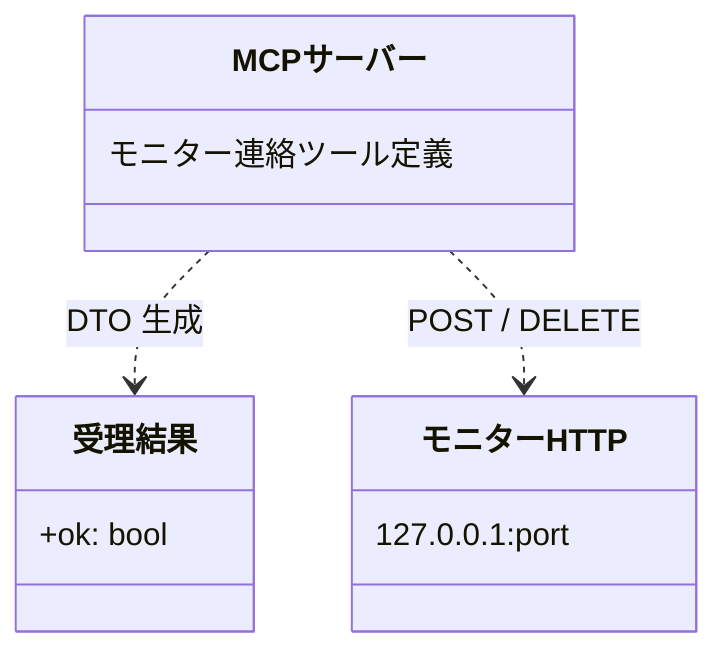

# モジュール構成: MCP / モニター連絡

`モニター連絡` ドメイン（MCP 側）に属する構成要素詳細。
エージェント → モニターの連絡（作業完了報告・監視対象の追加 / 除去。モニター HTTP API のラッパー）を扱う。

## 一覧

| ユースケース | 役割 | コンテナ | 種別 | 名前 | 概要 | 補足 |
| --- | --- | --- | --- | --- | --- | --- |
| 共通 | 受理結果 DTO | `mcp/models.py` | データモデル | [`MonitorAck`](#受理結果) | モニター HTTP の受理結果 | - |
| 共通 | プロジェクト解決 | `mcp/server.py` | 関数 | [`_resolve_project`](#プロジェクト解決) | CWD のリポジトリからプロジェクトを解決 | - |
| 共通 | ポート解決 | `mcp/server.py` | 関数 | [`_load_port`](#ポート解決) | 設定ファイルからモニターの待受ポートを読む | 未設定は `8765` |
| 作業完了報告 | MCP ツール | `mcp/server.py` | 関数 | [`report_completion`](#作業完了報告) | 自ターン終了をモニターへ通知 | best-effort |
| 監視対象追加 | MCP ツール | `mcp/server.py` | 関数 | [`add_watch_targets`](#監視対象追加) | 作成した派生 PR を自セッションの監視面として登録 | - |
| 監視対象除去 | MCP ツール | `mcp/server.py` | 関数 | [`remove_watch_targets`](#監視対象除去) | 監視面から番号を除去 | - |

## ディレクトリ構成

```
plugins/ai-monitor/mcp/
├── server.py    # report_completion / add_watch_targets / remove_watch_targets + プロジェクト解決
└── models.py    # MonitorAck
```

## 構成図



## 受理結果
> 物理名: `MonitorAck`<br>
> 種別: データモデル<br>
> コンテナ: `mcp/models.py`

モニター HTTP API の受理結果（Pydantic `BaseModel`）。

### プロパティ

| 論理名 | プロパティ名 | 型 | 可視性 | デフォルト | 説明 | 例 | 補足 |
| --- | --- | --- | --- | --- | --- | --- | --- |
| 受理 | `ok` | `bool` | 公開 | - | モニターが受理したか | `true` | 失敗は HTTP ステータスで表現 |

### メソッド

なし

### 単体テスト

なし

## `mcp/server.py`
> 種別: ファイル

モニターの localhost HTTP API を呼ぶツール定義。
ポートは設定（`~/.config/ai-monitor/settings.yaml`）の `port` から読む。

---

### 作業完了報告
> 物理名: `report_completion`<br>
> 種別: 関数

自ターン終了をモニターの HTTP API へ通知する。

#### 引数

| 論理名 | 引数名 | 型 | 必須 | デフォルト | 説明 | 補足 |
| --- | --- | --- | --- | --- | --- | --- |
| エージェント名 | `agent_name` | `str` | ✅ | - | 報告するエージェント名 | セッションキーの片割れ |
| 主番号 | `number` | `int` | ✅ | - | セッションの主番号 | conductor は常に Issue 番号 |

引数例:

```python
report_completion("architect", 52)
```

#### 戻り値

| 型 | 説明 | 補足 |
| --- | --- | --- |
| [`MonitorAck`](#受理結果) | 受理結果 | - |

戻り値例:

```python
MonitorAck(ok=True)
```

#### 処理

1. CWD から `project` を求める（[プロジェクト解決](#プロジェクト解決)）
2. `agent_name` / `number` / `project` を JSON にして `POST http://127.0.0.1:{port}/completions` へ送信する（ポートは設定の `port`）
3. 200 応答を `MonitorAck` に変換して返す（4xx / 5xx は `HTTPError`・接続不可は `URLError`）

#### 例外

| 例外名 | 発生条件 | メッセージ | 補足 |
| --- | --- | --- | --- |
| `HTTPError` | モニターが 4xx / 5xx を返す（セッション不明 等） | HTTP ステータスと本文 | MCP がツールエラーとして返す。エージェントは無視して続行できる |
| `URLError` | モニター未起動（接続拒否 / タイムアウト） | 接続エラーの内容 | MCP がツールエラーとして返す。エージェントは無視して続行できる |

#### 単体テスト

| テスト名 | 正常/異常 | 概要 | 条件 | Mock | 期待値 | 補足 |
| --- | --- | --- | --- | --- | --- | --- |
| `test_report_completion` | 正常 | 送信ペイロードの組み立て | HTTP をモックして 200 | モニター HTTP | `agent_name` / `number` / `project` を含む POST + `ok: true` | - |
| `test_report_completion_when_unknown_session` | 異常 | セッション不明 | HTTP をモックして 404 | モニター HTTP | MCP ツールエラー | 異常系（セッション不明・404）に対応 |
| `test_report_completion_when_monitor_down` | 異常 | モニター未起動 | 未使用ポートへ接続（接続拒否） | なし | MCP ツールエラー | 異常系（モニター未起動）に対応 |

---

### 監視対象追加
> 物理名: `add_watch_targets`<br>
> 種別: 関数

作成した派生 PR の番号を自セッションの監視面としてモニターの台帳に登録する。

#### 引数

| 論理名 | 引数名 | 型 | 必須 | デフォルト | 説明 | 補足 |
| --- | --- | --- | --- | --- | --- | --- |
| エージェント名 | `agent_name` | `str` | ✅ | - | 報告するエージェント名 | セッションキーの片割れ |
| 主番号 | `number` | `int` | ✅ | - | 自セッションの主番号 | - |
| 追加番号一覧 | `watch_numbers` | `list[int]` | ✅ | - | 監視面に追加する Issue / PR 番号 | 1 件以上 |

引数例:

```python
add_watch_targets("architect", 52, [60, 61])
```

#### 戻り値

| 型 | 説明 | 補足 |
| --- | --- | --- |
| [`MonitorAck`](#受理結果) | 受理結果 | - |

戻り値例:

```python
MonitorAck(ok=True)
```

#### 処理

1. CWD から `project` を求める（[プロジェクト解決](#プロジェクト解決)）
2. `agent_name` / `number` / `watch_numbers` / `project` を JSON にして `POST http://127.0.0.1:{port}/watch-targets` へ送信する（ポートは設定の `port`）
3. 200 応答を `MonitorAck` に変換して返す（4xx / 5xx は `HTTPError`・接続不可は `URLError`）

#### 例外

| 例外名 | 発生条件 | メッセージ | 補足 |
| --- | --- | --- | --- |
| `HTTPError` | モニターが 4xx / 5xx を返す（セッション不明 等） | HTTP ステータスと本文 | MCP がツールエラーとして返す |
| `URLError` | モニター未起動（接続拒否 / タイムアウト） | 接続エラーの内容 | MCP がツールエラーとして返す |

#### 単体テスト

| テスト名 | 正常/異常 | 概要 | 条件 | Mock | 期待値 | 補足 |
| --- | --- | --- | --- | --- | --- | --- |
| `test_add_watch_targets` | 正常 | 送信ペイロードの組み立て | HTTP をモックして 200 | モニター HTTP | `agent_name` / `number` / `watch_numbers` / `project` を含む POST + `ok: true` | - |
| `test_add_watch_targets_when_unknown_session` | 異常 | セッション不明 | HTTP をモックして 404 | モニター HTTP | MCP ツールエラー | 異常系（セッション不明・404）に対応 |

---

### 監視対象除去
> 物理名: `remove_watch_targets`<br>
> 種別: 関数

自セッションの監視面から番号を取り除く。

#### 引数

| 論理名 | 引数名 | 型 | 必須 | デフォルト | 説明 | 補足 |
| --- | --- | --- | --- | --- | --- | --- |
| エージェント名 | `agent_name` | `str` | ✅ | - | 報告するエージェント名 | セッションキーの片割れ |
| 主番号 | `number` | `int` | ✅ | - | 自セッションの主番号 | - |
| 除去番号一覧 | `watch_numbers` | `list[int]` | ✅ | - | 監視面から取り除く Issue / PR 番号 | 1 件以上 |

引数例:

```python
remove_watch_targets("architect", 52, [60, 61])
```

#### 戻り値

| 型 | 説明 | 補足 |
| --- | --- | --- |
| [`MonitorAck`](#受理結果) | 受理結果 | - |

戻り値例:

```python
MonitorAck(ok=True)
```

#### 処理

1. CWD から `project` を求める（[プロジェクト解決](#プロジェクト解決)）
2. `agent_name` / `number` / `watch_numbers` / `project` を JSON にして `DELETE http://127.0.0.1:{port}/watch-targets` へ送信する（ポートは設定の `port`）
3. 200 応答を `MonitorAck` に変換して返す（4xx / 5xx は `HTTPError`・接続不可は `URLError`）

#### 例外

| 例外名 | 発生条件 | メッセージ | 補足 |
| --- | --- | --- | --- |
| `HTTPError` | モニターが 4xx / 5xx を返す（セッション不明 等） | HTTP ステータスと本文 | MCP がツールエラーとして返す |
| `URLError` | モニター未起動（接続拒否 / タイムアウト） | 接続エラーの内容 | MCP がツールエラーとして返す |

#### 単体テスト

| テスト名 | 正常/異常 | 概要 | 条件 | Mock | 期待値 | 補足 |
| --- | --- | --- | --- | --- | --- | --- |
| `test_remove_watch_targets` | 正常 | 送信ペイロードの組み立て | HTTP をモックして 200 | モニター HTTP | `watch_numbers` を含む DELETE + `ok: true` | - |
| `test_remove_watch_targets_when_unknown_session` | 異常 | セッション不明 | HTTP をモックして 404 | モニター HTTP | MCP ツールエラー | 異常系（セッション不明・404）に対応 |

---

### プロジェクト解決
> 物理名: `_resolve_project`<br>
> 種別: 関数

git の remote URL から監視対象プロジェクト（`owner/name`）を解決する。

#### 引数

なし

引数例:

```python
_resolve_project()
```

#### 戻り値

| 型 | 説明 | 補足 |
| --- | --- | --- |
| `str` | プロジェクトの GitHub リポジトリ（`owner/name`） | モニターが `MonitoredProject.repo` と照合 |

戻り値例:

```python
"shuhei1101/aituber"
```

#### 処理

1. `git remote get-url origin` で remote URL を取得する
2. URL をパースして `owner/name` を返す

#### 例外

| 例外名 | 発生条件 | メッセージ | 補足 |
| --- | --- | --- | --- |
| `CalledProcessError` | git が非 0 で終了 | git の stderr | - |

#### 単体テスト

| テスト名 | 正常/異常 | 概要 | 条件 | Mock | 期待値 | 補足 |
| --- | --- | --- | --- | --- | --- | --- |
| `test_resolve_project` | 正常 | CWD からのリポジトリ解決 | git の remote URL をモック | git CLI | `owner/name` を返す | - |

---

### ポート解決
> 物理名: `_load_port`<br>
> 種別: 関数

設定ファイル（`~/.config/ai-monitor/settings.yaml`）からモニターの待受ポートを読む。

#### 引数

なし

引数例:

```python
_load_port()
```

#### 戻り値

| 型 | 説明 | 補足 |
| --- | --- | --- |
| `int` | モニターの待受ポート | 未設定は `8765` |

戻り値例:

```python
8765
```

#### 処理

1. 設定ファイルを読み込み、`port` の値を返す（未設定は `8765` を返す）

#### 例外

| 例外名 | 発生条件 | メッセージ | 補足 |
| --- | --- | --- | --- |
| `FileNotFoundError` | 設定ファイルが無い | `~/.config/ai-monitor/settings.yaml` のパス | - |

#### 単体テスト

| テスト名 | 正常/異常 | 概要 | 条件 | Mock | 期待値 | 補足 |
| --- | --- | --- | --- | --- | --- | --- |
| `test_load_port` | 正常 | 設定値の読み込み | `port: 18999` の settings.yaml | なし | `18999` | - |
| `test_load_port_when_port_missing` | 正常 | 未設定時の既定値 | `port` キーの無い settings.yaml | なし | `8765` | - |
